# Active Directory Basics

> [TryHackMe | Active Directory Basics](https://tryhackme.com/room/winadbasics)
>
> Updated in 2023-12-09
>
> 本房间将介绍 Active Directory 的基本概念和功能。
>
> This room will introduce the basic concepts and functionality provided by Active Directory.

## Introduction

Microsoft 的 Active Directory 是企业界的支柱。 它简化了企业环境中设备和用户的管理。 在这个房间中，我们将深入探讨 Active Directory 的基本组件。

在这个房间中，我们将了解 Active Directory 并熟悉以下主题

- 什么是活动目录
- 什么是 Active Directory 域
- 哪些组件进入 Active Directory 域
- Forest 和域信任
- 以及更多！

## Windows Domains

想象一下你在管理一个只有五台电脑和五名员工的小型企业网络。在这样一个狭小的网络中，你可能可以顺利地对每台电脑进行单独配置。你将手动登录每台计算机，为使用它们的人创建用户，并为每位员工的账户进行特定配置。如果用户的电脑停止工作，你可能会去他们那里现场修理电脑。

虽然这听起来是一种非常轻松的生活方式，但假设你的企业突然发展壮大，现在有 157 台电脑和 320 个不同的用户，分布在四个不同的办公室。你还能把每台电脑作为一个单独的实体来管理，为网络上的每个用户手动配置策略，并为每个人提供现场支持吗？答案很可能是否定的。

为了克服这些限制，我们可以使用 Windows 域。简单地说，Windows 域是由某个企业管理的一组用户和计算机。域背后的主要理念是将 Windows 计算机网络常用组件的管理集中到一个名为 Active Directory（AD）的单一存储库中。运行活动目录服务的服务器称为域控制器（DC）。

<div style={{textAlign:'center'}}>

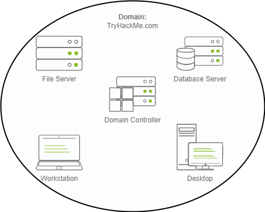

</div>

配置 Windows 域的主要优点是：

- 集中身份管理： 网络上的所有用户都可以轻松地从 Active Directory 进行配置。
- 管理安全策略： 您可以直接从 Active Directory 配置安全策略，并根据需要将它们应用到网络上的用户和计算机。

### 一个现实世界的例子

如果这听起来有点令人困惑，那么您很可能已经在学校、大学或工作中的某个时刻与 Windows 域进行过交互。

在学校 / 大学网络中，您通常会获得一个用户名和密码，您可以在校园内的任何计算机上使用它们。 您的凭据对所有计算机都有效，因为每当您在计算机上输入它们时，它都会将身份验证过程转发回 Active Directory，并在其中检查您的凭据。 借助 Active Directory，您的凭据无需存在于每台计算机中，并且可以在整个网络中使用。

Active Directory 也是允许您的学校 / 大学限制您访问学校 / 大学计算机上的控制面板的组件。 策略通常会部署在整个网络中，以便您对这些计算机没有管理权限。

:::info Answer the questions below

在 Windows 域中，凭据存储在一个名为... 的集中存储库中。

```plaintext
Active Directory
```

负责运行 Active Directory 服务的服务器称为...

```plaintext
Domain Controller
```

:::

## Active Directory

任何 Windows 域的核心都是 Active Directory 域服务 (AD DS) 。该服务充当目录，保存网络上存在的所有 “对象” 的信息。 在 Active Directory 中支持众多对象，有用户、组、机器、打印机、共享等等。 让我们看看其中的一些：

### 用户

用户是 Active Directory 中最常见的对象类型之一。用户是被称为安全负责人的对象之一，这意味着他们可以通过域进行身份验证，并可被分配文件或打印机等资源的权限。可以说，安全负责人是可以对网络资源采取行动的对象。

用户可以用来表示两种类型的实体：

- 人员： 用户通常代表组织中需要访问网络的人员，例如员工。
- 服务： 您还可以定义供 IIS 或 MSSQL 等服务使用的用户。 每个服务都需要用户来运行，但服务用户与普通用户不同，因为他们只拥有运行特定服务所需的权限。

### 机器

机器是 Active Directory 中的另一种对象类型；每台加入 Active Directory 域的计算机都会创建一个机器对象。机器也被视为 "安全负责人"，与普通用户一样被分配一个账户。该账户在域内的权限有限。

机器账户本身是指定计算机上的本地管理员，除了计算机本身外，一般不允许任何人访问，但与其他账户一样，如果你有密码，就可以用它登录。

:::tip

机器帐户密码会自动轮换，通常由 120 个随机字符组成。

:::

识别机器帐户相对容易。 它们遵循特定的命名方案。 计算机帐户名称是计算机名称后跟美元符号。 例如，一台名为 `DC01` 将有一个名为的机器帐户 `DC01$` 。

### 安全组

如果你熟悉 Windows，你可能知道可以定义用户组，将文件或其他资源的访问权限分配给整个组，而不是单个用户。这样可以更好地进行管理，因为你可以将用户添加到现有组中，他们将自动继承该组的所有权限。安全组也被视为安全负责人，因此可以拥有对网络资源的权限。

组的成员既可以是用户，也可以是机器。如果需要，组还可以包括其他组。

域中默认创建了几个组，可用于向用户授予特定权限。下面举例说明域中一些最重要的组：
| 安全组       | 描述                                                                                 |
| :----------- | :----------------------------------------------------------------------------------- |
| 域管理员     | 该组的用户拥有整个域的管理权限。 默认情况下，他们可以管理域中的任何计算机，包括 DC。 |
| 服务器运营商 | 该组中的用户可以管理域控制器。 他们无法更改任何管理组成员身份。                      |
| 备份操作员   | 该组中的用户可以访问任何文件，但忽略其权限。 它们用于在计算机上执行数据备份。        |
| 账户运营商   | 该组中的用户可以创建或修改域中的其他帐户。                                           |
| 域用户       | 包括域中所有现有的用户帐户。                                                         |
| 域计算机     | 包括域中的所有现有计算机。                                                           |
| 域控制器     | 包括域中所有现有的 DC。                                                              |

可以从 [Active Directory security groups - Microsoft Learn](https://learn.microsoft.com/en-us/windows-server/identity/ad-ds/manage/understand-security-groups) 中获取默认安全组的完整列表。

### Active Directory 用户和计算机

要在 Active Directory 中配置用户、组或计算机，我们需要登录域控制器并从开始菜单运行 “Active Directory 用户和计算机”：

<div style={{textAlign:'center'}}>


</div>

这将打开一个窗口，在这里可以看到域中存在的用户、计算机和组的层次结构。这些对象按组织单位 (OU) 组织，组织单位是一种容器对象，可以对用户和计算机进行分类。OUs 主要用于定义具有类似监控要求的用户集合。例如，贵组织销售部门的人员与 IT 部门的人员可能会应用不同的策略集。请记住，一个用户在同一时间只能属于一个 OU。

检查我们的计算机，可以看到已经有一个名为 `THM` 的 OU，它有四个子 OU，分别用于 IT、管理、市场和销售部门。OU 模仿业务结构是非常典型的做法，因为这样可以高效地部署适用于整个部门的基线策略。请记住，虽然这是大多数情况下的预期模式，但您也可以任意定义 OU。您可以右键单击 `THM` OU，在其下创建一个名为 `Students` 的新 OU，这样做只是为了好玩。

:::info Answer the questions below

哪个组通常管理域中的所有计算机和资源？

```plaintext
Domain Admins
```

与名为 TOM-PC 的计算机关联的计算机帐户名称是什么？

```plaintext
TOM-PC$
```

假设我们公司创建了一个新的质量保证部门。 我们应该使用什么类型的容器对所有质量保证用户进行分组，以便可以一致地将策略应用于他们？

```plaintext
Organizational Unit
```

:::

## Managing Users in AD

作为新任域管理员，你的首要任务是检查现有的 AD OU 和用户，因为企业最近发生了一些变化。您收到了以下组织结构图，并需要对 AD 进行相应的更改：

<div style={{textAlign:'center'}}>


</div>

### 删除额外的 OU 和用户

您应该注意到的第一件事是，您当前的 AD 配置中有一个额外的部门 OU ，该部门未出现在图表中。 我们被告知它由于预算削减而关闭，应该从域中删除。 如果您尝试右键单击并删除 OU，您将收到以下错误：

<div style={{textAlign:'center'}}>

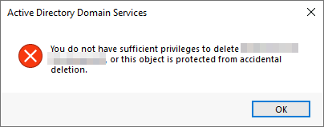

</div>

默认情况下， OU 受到保护以防止意外删除。 要删除 OU，我们需要启用 “高级功能” ： “视图” 菜单中的

<div style={{textAlign:'center'}}>


</div>

这将向您显示一些其他容器，并使您能够禁用意外删除保护。 为此，请右键单击 OU 并转到 “属性”。 您将在 “对象” 选项卡中找到一个用于禁用保护的复选框：

<div style={{textAlign:'center'}}>

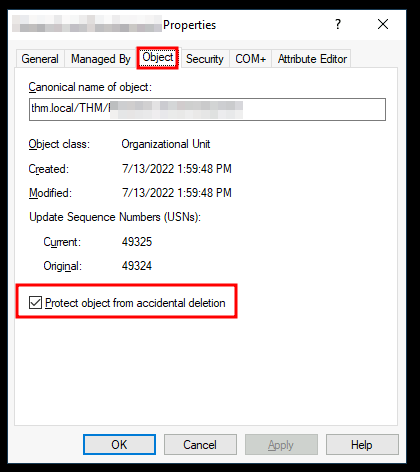

</div>

请务必取消选中该框并再次尝试删除 OU 。系统将提示您确认是否要删除该 OU，因此，该 OU 下的任何用户、组或 OU 也将被删除。

删除多余的 OU 后，您应该注意到对于某些部门，AD 中的用户与我们组织结构图中的用户不匹配。 根据需要创建和删除用户以匹配他们。

### Delegation - 委派

在 AD 中可以做的一件好事就是让特定用户对某些 OU 享有一定的控制权。这个过程被称为授权，允许你授予用户在 OU 上执行高级任务的特定权限，而不需要域管理员介入。

最常见的使用案例之一就是授予 `IT support` 重置其他低权限用户密码的权限。根据我们的组织结构图，Phillip 负责 IT 支持，因此我们可能希望将重置销售、营销和管理 OU 密码的控制权委托给他。

在本例中，我们将把销售 OU 的控制权下放给 Phillip。要委派对某个 OU 的控制权，可以右键单击该 OU 并选择 "委派控制"：

<div style={{textAlign:'center'}}>

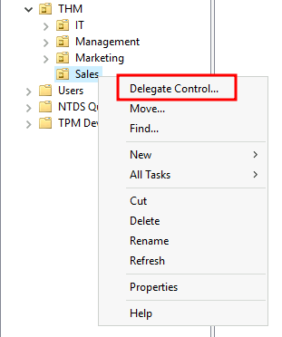

</div>

这应该会打开一个新窗口，其中首先会询问您要向其委派控制权的用户：

:::tip

为避免输入错误用户名，请输入 “phillip”，然后单击 “检查姓名” 按钮。 Windows 将自动为您补全用户。

:::

<div style={{textAlign:'center'}}>


</div>

单击 “确定”，然后在下一步中选择以下选项：

<div style={{textAlign:'center'}}>

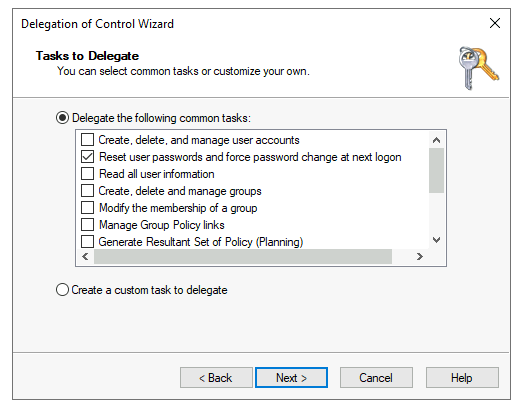

</div>

单击 “下一步” 几次，现在 Phillip 应该能够为销售部门中的任何用户重置密码。 虽然您可能希望重复这些步骤来委派营销和管理部门的密码重置，但我们将把它留在这里来完成此任务。 如果您愿意，您可以继续配置其余的 OU。

<details>

<summary>具体操作步骤</summary>

通过结构图，确定多出来的 OU(Organizational Unit) 是 `Research and Development`

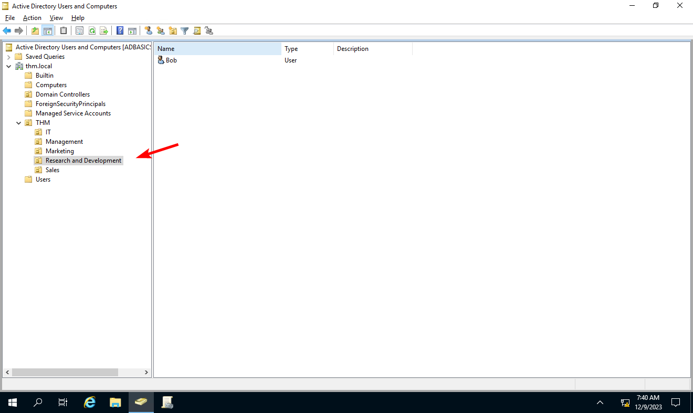

然后确定删除保护已经关闭


然后执行删除 OU

<div style={{textAlign:'center'}}>

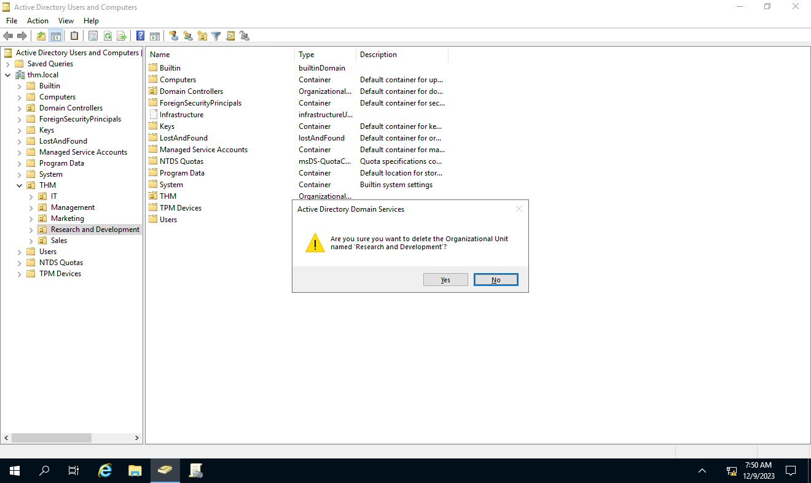

</div>

然后为 `Sales` OU 配置委派控制

<div style={{textAlign:'center'}}>


</div>

将其配置为可以重置用户密码

<div style={{textAlign:'center'}}>

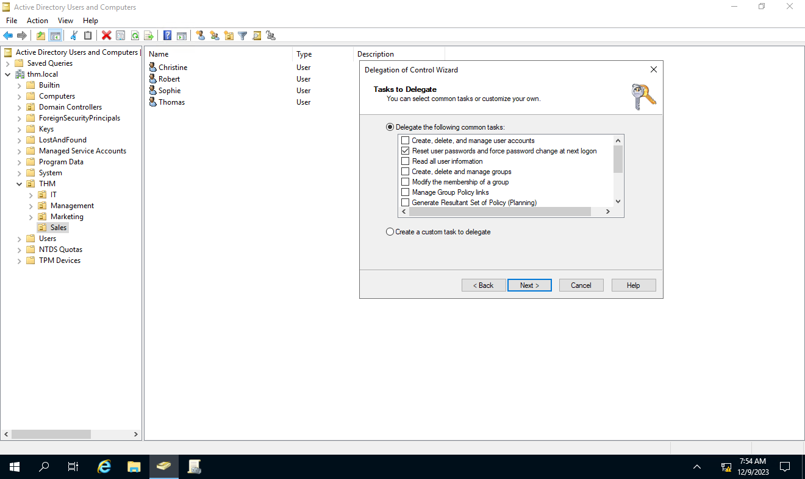

</div>

但是当切换到 `THM\phillip` 账户时，由于 `THM\phillip` 并不拥有系统管理权限，所以其无法运行管理工具（包括 Active Directory 管理组件）

<div style={{textAlign:'center'}}>


</div>

所以绕开 Active Directory 管理组件，直接使用 Powershell 进行 Active Directory 用户密码重置

```powershell
PS C:\Users\phillip> Set-ADAccountPassword sophie -Reset -NewPassword (Read-Host -AsSecureString -Prompt 'New Password') -Verbose

New Password: *********

VERBOSE: Performing the operation "Set-ADAccountPassword" on target "CN=Sophie,OU=Sales,OU=THM,DC=thm,DC=local".
```

如果不希望 Sophie 继续使用我们知道的密码，因此我们还可以使用以下命令在下次登录时强制重置密码：

```powershell
PS C:\Users\phillip> Set-ADUser -ChangePasswordAtLogon $true -Identity sophie -Verbose

VERBOSE: Performing the operation "Set" on target "CN=Sophie,OU=Sales,OU=THM,DC=thm,DC=local".
```

<div style={{textAlign:'center'}}>

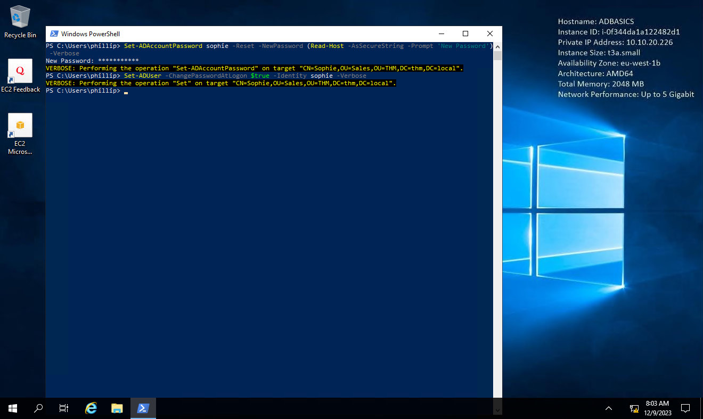

</div>

:::note

需要注意的是，在 Active Directory 中，默认启用了密码复杂度要求，所以简单的 `12345` 或者 `admin123` 都是没办法设置为新密码的

:::

然后即可通过重置后的密码登录到 `THM\sophie`

<div style={{textAlign:'center'}}>


</div>

同时需要注意的是，受限于安全规则，在发起多个远程会话的时候，会要求关闭已有的会话

<div style={{textAlign:'center'}}>

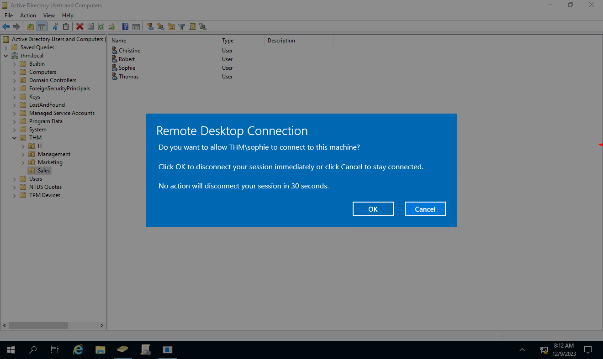

</div>

一切操作没有问题的话，就可以在 `THM\sophie` 用户的桌面上发现 flag

<div style={{textAlign:'center'}}>


</div>

```plaintext
THM{thanks_for_contacting_support}
```

</details>

:::info Answer the questions below

在 Sophie 的桌面上发现的标志是什么？

```plaintext
THM{thanks_for_contacting_support}
```

向用户授予对某个 OU 或其他 AD 对象的权限的过程称为...

```plaintext
Delegation
```

:::

## Managing Computers in AD

默认情况下，加入域的所有计算机（ DC 除外）都将放入名为 “Computers” 的容器中。 如果我们检查我们的 DC，我们会看到一些设备已经存在：

<div style={{textAlign:'center'}}>

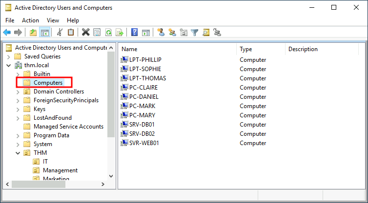

</div>

我们可以看到与我们网络中的用户相对应的一些服务器、一些笔记本电脑和一些 PC。 将我们所有的设备放在那里并不是最好的主意，因为您很可能希望为您的服务器和普通用户日常使用的计算机制定不同的策略。

虽然如何组织机器没有黄金法则，但一个很好的起点是根据设备的用途对其进行隔离。 一般来说，您期望看到的设备至少分为以下三个类别：

### Workstations - 工作站

工作站是 Active Directory 域中最常见的设备之一。 域中的每个用户都可能登录到工作站。 这是他们用来完成工作或正常浏览活动的设备。 这些设备不应该让特权用户登录。

### Servers - 服务器

服务器是 Active Directory 域中第二常见的设备。 服务器一般用来为用户或其他服务器提供服务。

### Domain Controllers - 域控制器

域控制器是 Active Directory 域中第三种最常见的设备。 域控制器允许您管理 Active Directory 域。 这些设备通常被认为是网络中最敏感的设备，因为它们包含环境中所有用户帐户的哈希密码。

由于我们正在整理我们的 AD ，所以让我们创建两个单独的 OU 给 `Workstations` 和 `Servers`（域控制器已位于 OU Windows 创建的 中）。 我们将直接在 thm.local 域中创建容器。 最后，您应该具有以下 OU 结构：

<div style={{textAlign:'center'}}>


</div>

:::info Answer the questions below

组织可用计算机后，有多少计算机最终进入工作站 OU？

```plaintext
7
```

是否建议为服务器和工作站创建单独的 OU？ （是 / 否）

```plaintext
Yay
```

:::

## Group Policies

到目前为止，我们只是为了它而将用户和计算机组织在 OU 中，但这背后的主要思想是能够为每个 OU 单独部署不同的策略。 这样，我们就可以根据用户的部门向他们推送不同的配置和安全基线。

管理此类策略 Windows 通过组策略对象 (GPO) 。GPO 只是可应用于 OU 的设置的集合。 GPO 可以包含针对用户或计算机的策略，允许您在特定计算机和身份上设置基线。

要配置 GPO，您可以使用 组策略管理 工具（可从开始菜单访问）：

<div style={{textAlign:'center'}}>

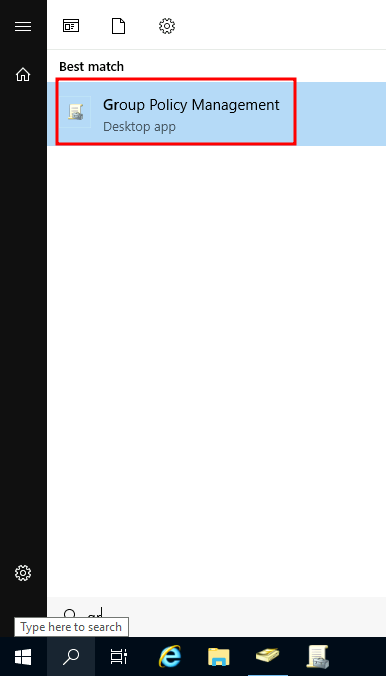

</div>

打开它时，您首先看到的是完整的 OU 层次结构，如之前所定义。 下创建一个 GPO 要配置组策略，首先在组策略对象 ，然后将其链接到 OU 您希望应用策略的。例如，您可以看到您的计算机中已经存在一些 GPO：

<div style={{textAlign:'center'}}>


</div>

我们可以在上图中看到已经创建了 3 个 GPO。 从这些中， `Default Domain Policy` 和 `RDP Policy` 链接到 `thm.local` 域作为一个整体，并且 `Default Domain Controllers Policy` 只链接到 `Domain Controllers` OU 。需要记住的重要一点是，任何 GPO 都将应用于链接的 OU 及其下的任何子 OU。 例如，Sales OU 仍将受到影响 `Default Domain Policy`.

让我们检查一下 `Default Domain Policy` 查看 GPO 内部的内容。 选择 GPO 时您将看到的第一个选项卡显示其 `Scope` ，即 GPO 在 AD 中链接的位置。 对于当前的政策，我们可以看到它仅与 `thm.local` 域：

<div style={{textAlign:'center'}}>


</div>

正如您所看到的，您还可以将 ` 安全过滤 ` 应用于 GPO，以便它们仅应用于 OU 下的特定用户 / 计算机。 默认情况下，它们将应用于  `Authenticated Users` 用户组，其中包括所有用户 / PC。

选项 “设置” 的实际内容 卡包含 GPO ，并让我们知道它应用的具体配置。 如前所述，每个 GPO 都有仅适用于计算机的配置和仅适用于用户的配置。 在这种情况下， `Default Domain Policy` 仅包含计算机配置：

<div style={{textAlign:'center'}}>


</div>

请随意探索 GPO 并使用每个配置右侧的 “显示” 链接扩展可用项目。 在这种情况下， `Default Domain Policy` 表示应该适用于大多数域的真正基本配置，包括密码和帐户锁定策略：

<div style={{textAlign:'center'}}>

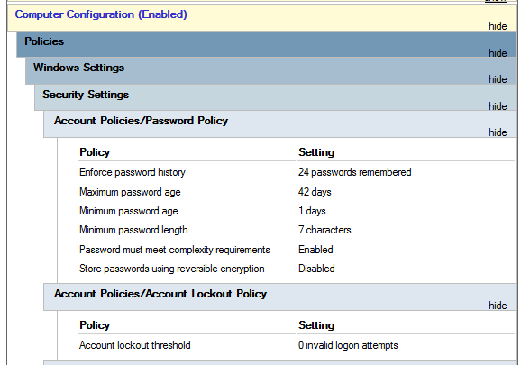

</div>

由于此 GPO 适用于整个域，因此对其进行的任何更改都会影响所有计算机。 让我们更改最小密码长度策略，要求用户的密码至少包含 10 个字符。 为此，请右键单击 GPO 并选择 “编辑” ：

<div style={{textAlign:'center'}}>

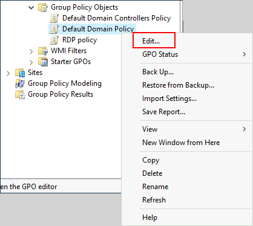

</div>

这将打开一个新窗口，我们可以在其中导航和编辑所有可用配置。 要更改最小密码长度，请转至

```plaintext
Computer Configurations -> Policies -> Windows Setting -> Security Settings -> Account Policies -> Password Policy
```

并更改所需的策略值：

<div style={{textAlign:'center'}}>

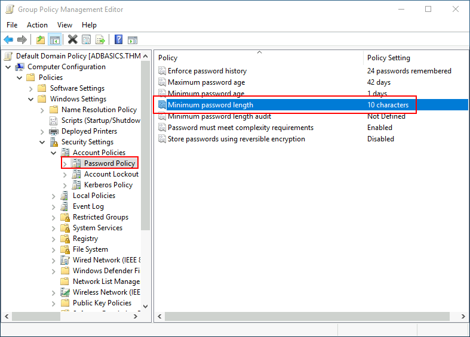

</div>

正如你所看到的，GPO 中可以建立大量的策略。虽然在一个房间里不可能对每项策略都进行解释，但还是可以随意探索一下，因为有些策略是简单明了的。如果需要有关任何策略的更多信息，可以双击它们并阅读每个策略的 "解释" 选项卡：

<div style={{textAlign:'center'}}>


</div>

### GPO distribution

GPO 通过名为 `SYSVOL` 的网络共享分发到网络，该共享存储在 DC 中。域中的所有用户通常都可以通过网络访问该共享，以定期同步他们的 GPO。SYSVOL 共享默认指向我们网络中每个 DC 上的 `C:\Windows\SYSVOL\sysvol\` 目录。

一旦对任何 GPO 进行了更改，计算机可能需要长达 2 个小时的时间才能跟上。如果要强制任何特定计算机立即同步其 GPO，可以在所需计算机上运行以下命令：

```powershell
PS C:\> gpupdate /force
```

### 创建一些 GPO 为 THM Inc

作为新工作的一部分，我们的任务是实施一些 GPO，以便我们能够

- 阻止非 IT 用户访问控制面板。
- 让工作站和服务器在用户闲置 5 分钟后自动锁定屏幕，避免用户暴露会话。

让我们重点关注其中的每一项，并定义我们应该在每个 GPO 中启用哪些策略，以及它们应该链接到哪里。

#### 限制对控制面板的访问

我们希望将所有计算机上的控制面板的访问权限限制为仅属于 IT 部门的用户。 其他部门的用户不应该能够更改系统的首选项。

让我们创建一个新 GPO ，取名为 `Restrict Control Panel Access`，并打开它进行编辑。 由于我们希望此 GPO 应用于特定用户，因此我们将查看 `User Configuration` ：

<div style={{textAlign:'center'}}>

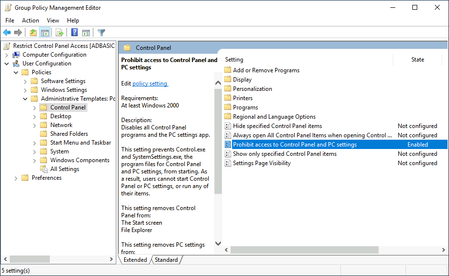

</div>

请注意，我们已经启用了 "禁止访问控制面板和 PC 设置" 策略。

配置好 GPO 后，我们需要将其链接到与用户对应的所有 OU，这些用户不应该访问其 PC 的控制面板。在这种情况下，我们将把 GPO 拖动到 `Marketing`, `Management` and `Sales` OU：

<div style={{textAlign:'center'}}>


</div>

#### 自动锁屏 GPO

对于第一个 GPO（关于工作站和服务器的屏幕锁定），我们可以直接将其应用到之前创建的工作站、服务器和域控制器 OU 上。

虽然这个解决方案应该可行，但另一个选择是将 GPO 简单地应用到根域，因为我们希望 GPO 影响我们所有的计算机。由于工作站、服务器和域控制器 OU 都是根域的子 OU，它们将继承根域的策略。

:::tip

你可能会注意到，如果我们的 GPO 被应用到根域，它也会被其他 OU（如销售或营销）继承。由于这些 OU 只包含用户，因此它们将忽略我们 GPO 中的任何 "计算机配置"。

:::

让我们创建一个新的 GPO，将其命名为 "自动锁定屏幕"，然后对其进行编辑。实现我们所需的策略位于以下路径：

<div style={{textAlign:'center'}}>


</div>

我们将把非活动限制设置为 5 分钟，这样，如果任何用户的会话处于打开状态，电脑就会被自动锁定。关闭 GPO 编辑器后，我们将通过拖动 GPO 将其链接到根域：

<div style={{textAlign:'center'}}>

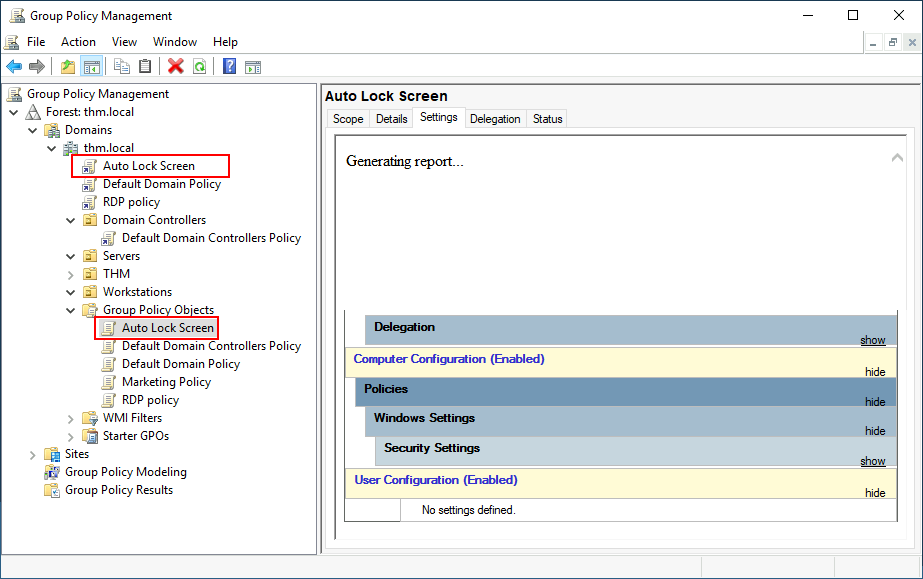

</div>

将 GPO 应用到正确的 OU 后，我们就可以以市场部、销售部或管理部中任何用户的身份登录，进行验证。

:::info Answer the questions below

用于将 GPO 分发到域计算机的网络共享的名称是什么？

```plaintext
SYSVOL
```

可以 GPO 用于将设置应用到用户和计算机吗？ （是 / 否）

```plaintext
Yay
```

:::

## Authentication Methods

使用 Windows 域时，所有凭据都存储在域控制器中。 每当用户尝试使用域凭据对服务进行身份验证时，该服务都需要要求域控制器验证它们是否正确。 Windows 域中可以使用两种协议进行网络身份验证：

- Kerberos ： 由任何最新版本的 Windows 使用。 这是任何最近域中的默认协议。
- NetNTLM： 出于兼容性目的而保留的旧身份验证协议。

虽然 NetNTLM 应被视为已过时，但大多数网络都会启用这两种协议。 让我们更深入地了解一下这些协议的工作原理。

### Kerberos

> Kerberos 是一种基于票据的计算机网络身份验证协议，允许节点通过非安全网络安全地相互证明身份。它主要采用客户机 - 服务器模式，提供相互认证，即用户和服务器相互验证身份。Kerberos 协议信息可防止窃听和重放攻击，它以对称密钥加密技术为基础，需要一个受信任的第三方。

Kerberos 身份验证是任何最新版本的 Windows 的默认身份验证协议。 使用 Kerberos 登录服务的用户将被分配票证。 将票据视为先前身份验证的证明。 拥有票证的用户可以将其呈现给服务，以证明他们之前已经通过网络身份验证，因此能够使用它。

当 使用 Kerberos 进行身份验证时，会发生以下过​​程：

:::info CLient - KDC-AS

用户向密钥分发中心（KDC）发送用户名和使用密码密钥加密的时间戳，密钥分发中心通常安装在域控制器上，负责在网络上创建 Kerberos 票据。

KDC 将创建并发回一张票证授予票证 (TGT)，允许用户申请更多的票证来访问特定服务。需要票证才能获得更多票证听起来有点奇怪，但它允许用户请求服务票证，而无需每次连接服务时都传递凭据。除了 TGT，用户还会得到一个会话密钥，用户需要用它来生成以下请求。

请注意，TGT 是使用 krbtgt 账户的密码哈希值加密的，因此用户无法访问其内容。必须知道的是，加密的 TGT 包含会话密钥副本作为其内容的一部分，KDC 无需存储会话密钥，因为它可以在需要时通过解密 TGT 恢复副本。

<div style={{textAlign:'center'}}>


</div>

:::

:::info Client - KDC-TGS

当用户要连接网络上的服务（如共享、网站或数据库）时，会使用 TGT 向 KDC 申请票证授予服务（TGS）。TGS 是只允许连接到为其创建的特定服务的票据。要请求 TGS，用户将发送用户名、使用会话密钥加密的时间戳、TGT 和服务主名称 (SPN)，SPN 表示我们打算访问的服务和服务器名称。

因此，KDC 会向我们发送一个 TGS 和一个服务会话密钥，我们需要用它来验证我们要访问的服务。TGS 使用从服务所有者哈希值导出的密钥进行加密。服务所有者是服务运行的用户或机器账户。TGS 的加密内容中包含服务会话密钥的副本，因此服务所有者可以通过解密 TGS 来访问它。

<div style={{textAlign:'center'}}>

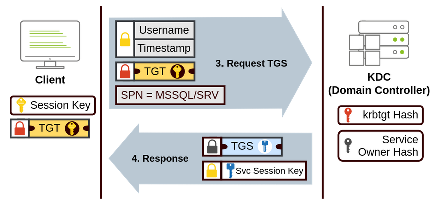

</div>

:::

:::info Client - Server

然后，可将 TGS 发送给所需的服务，以进行身份验证并建立连接。服务将使用其配置的账户密码哈希值来解密 TGS 并验证服务会话密钥。

<div style={{textAlign:'center'}}>


</div>

:::

### NetNTLM Authentication

NetNTLM 采用挑战 - 响应机制工作。整个过程如下：

<div style={{textAlign:'center'}}>


</div>

1. 客户端向想要访问的服务器发送验证请求。
2. 服务器会生成一个随机数，并将其作为挑战发送给客户端。
3. 客户端将其 NTLM 密码哈希值与挑战（及其他已知数据）相结合，生成对挑战的响应，并将其发送回服务器进行验证。
4. 服务器将挑战和响应转发给域控制器进行验证。
5. 域控制器使用挑战重新计算响应，并将其与客户端发送的原始响应进行比较。如果两者匹配，则客户端通过验证；否则，拒绝访问。身份验证结果将发回服务器。
6. 服务器将验证结果转发给客户端。

请注意，为了安全起见，用户密码（或哈希值）绝不会通过网络传输。

:::tip

所述过程适用于使用域帐户的情况。如果使用的是本地账户，服务器可自行验证对挑战的响应，而无需与域控制器交互，因为服务器的 SAM 上本地存储有密码哈希值。

:::

:::info Answer the questions below

当前版本的 Windows 是否默认使用 NetNTLM 作为首选身份验证协议？ （是 / 否）

```plaintext
nay
```

当提到 Kerberos 时，什么类型的票证允许我们请求进一步的票证（称为 TGS）？

```plaintext
Ticket Granting Ticket
```

使用 NetNTLM 时，用户的密码是否会随时通过网络传输？ （是 / 否）

```plaintext
nay
```

:::

## Trees, Forests and Trusts

到目前为止，我们已经讨论了如何管理单个域、域控制器的角色以及它如何连接计算机、服务器和用户。

<div style={{textAlign:'center'}}>


</div>

随着公司的发展，他们的网络也在不断发展。 对于一家公司来说，拥有一个域名就足够了，但随着时间的推移，一些额外的需求可能会促使您拥有多个域名。

### Trees

例如，设想一下，您的公司突然扩展到一个新的国家。新的国家有不同的法律法规，要求您更新 GPO 以符合规定。此外，您现在在两个国家都有 IT 人员，每个 IT 团队都需要在不干扰其他团队的情况下管理与每个国家相对应的资源。虽然您可以创建一个复杂的 OU 结构并使用授权来实现这一目标，但拥有一个庞大的 AD 域结构可能很难管理，而且容易出现人为错误。

幸运的是，Active Directory 支持整合多个域，这样您就可以将网络划分为可以独立管理的单元。如果您有两个共享相同名称空间的域（在我们的例子中为 thm.local），那么这两个域可以连接成一棵树。

如果我们的 thm.local 域被拆分成英国和美国分支的两个子域，你就可以建立一个树状结构，其中包括一个根域 thm.local，以及名为 uk.thm.local 和 us.thm.local 的两个子域，每个子域都有自己的 AD、计算机和用户：

<div style={{textAlign:'center'}}>


</div>

这种分区结构可以让我们更好地控制谁可以访问域中的哪些内容。英国的 IT 人员将有自己的 DC，只管理英国的资源。例如，英国用户将无法管理美国用户。这样，每个分支机构的域管理员就可以完全控制各自的 DC，但不能控制其他分支机构的 DC。还可以为树状结构中的每个域独立配置策略。

在谈及树和林时，需要引入一个新的安全组。企业管理员组将授予用户对企业所有域的管理权限。每个域仍有域管理员，他们对自己的单个域拥有管理员权限，而企业管理员则可以控制企业中的一切。

### Forests

您管理的域也可以配置在不同的命名空间中。假设贵公司不断发展壮大，最终收购了另一家名为 `MHT Inc.` 两家公司合并后，每家公司可能会有不同的域树，分别由各自的 IT 部门管理。将多个具有不同命名空间的域树合并到同一网络中称为森林。

<div style={{textAlign:'center'}}>


</div>

### Trust Relationships - 信任关系

将多个域以树和森林的形式组织起来，可以在管理和资源方面形成一个良好的分隔网络。但在某些情况下，`THM UK` 的用户可能需要访问 `MHT ASIA` 服务器中的某个共享文件。为此，以树和森林形式排列的域通过信任关系连接在一起。

简单地说，域之间的信任关系允许您授权域 `THM UK` 的用户访问域 `MHT EU` 的资源。

可以建立的最简单的信任关系是单向信任关系。在单向信任关系中，如果 `Domain AAA` 信任 `Domain BBB`，这就意味着可以授权 BBB 上的用户访问 AAA 上的资源：

<div style={{textAlign:'center'}}>


</div>

单向信任关系的方向与访问方向相反。

也可以建立双向信任关系，允许两个域相互授权对方的用户。默认情况下，在树或森林下连接多个域将形成双向信任关系。

需要注意的是，域之间建立信任关系并不会自动授予访问其他域上所有资源的权限。一旦建立了信任关系，你就有机会授权不同域的用户，但实际授权与否取决于你。

:::info Answer the questions below

共享同一命名空间的一组 Windows 域称为什么？

```plaintext
tree
```

两个域之间应该如何配置，以便域 A 中的用户访问域 B 中的资源？

```plaintext
a trust relationships
```

:::

## Conclusion

在这个房间里，我们展示了与活动目录和 Windows 域相关的基本组件和概念。请记住，这个房间只能作为基本概念的介绍，因为要实施一个生产就绪的 Active Directory 环境，还有很多东西需要探索。
