# Enumerating Active Directory

> [TryHackMe | Enumerating Active Directory](https://tryhackme.com/room/adenumeration)
>
> Updated in 2023-12-
>
> 该房间涵盖各种 Active Directory 枚举技术、使用案例和缺点。
>
> This room covers various Active Directory enumeration techniques, their use cases as well as drawbacks.

## Why AD Enumeration - 为什么要进行 AD 域枚举

现在我们已经有了第一套有效的 Active Directory（AD 域）凭证，我们将探索用于枚举 AD 的不同方法。

### AD 域枚举

一旦我们拥有了第一组 AD 域凭据以及在网络上使用它们进行身份验证的方法，一个全新的世界就会展现在我们面前！我们可以通过认证访问，甚至是超级低权限访问，开始列举有关 AD 域设置和结构的各种细节。

在红队参与期间，这通常会导致我们能够执行某种形式的权限升级或横向移动，以获得更多访问权限，直到我们拥有足够的权限来执行并实现我们的目标。在大多数情况下，枚举和利用是紧密联系在一起的。一旦利用了枚举阶段显示的攻击路径，就会从新的特权位置再次执行枚举，如下图所示。

<div style={{textAlign:'center'}}>


</div>

### 学习目标

在本网络中，我们将介绍几种可用于枚举 AD 的方法。这绝不是一份完整的清单，因为可用的方法通常具有很强的情景性，并取决于所获取的漏洞。不过，我们将介绍以下用于枚举 AD 的技术：

- Microsoft 管理控制台的 AD 快速插件。
- 命令提示符的 net 命令。
- PowerShell 的 AD-RSAT cmdlets。
- Bloodhound

### 获得初始凭据

访问：`http://distributor.za.tryhackme.com/creds`，即可得到初始的凭据：

```plaintext
Your credentials have been generated: Username: andrea.mitchell Password: Password1
```

通过 SSH 测试凭据有效性：

```shell
ssh za.tryhackme.com\\andrea.mitchell@thmjmp1.za.tryhackme.com
```

## Credential Injection - 凭证注入

在跳转到 AD 对象和枚举之前，我们先来谈谈凭证注入方法。从 "入侵 AD 网络" 中，你会发现，通常在不入侵域连接机器的情况下就能找到凭据。特定的枚举技术可能需要特定的设置才能发挥作用。

### Windows vs Linux

"知己知彼，百战不殆。知己不知彼，百战不殆"。- 孙子兵法。

在 Kali 上进行 AD 域枚举，你可以走得非常远。但是，如果你真的想进行深入的查证甚至是利用，你就需要了解并模仿你的敌人。因此，你需要一台 Windows 机器。这将允许我们使用几种内置方法来进行枚举和利用。在本网络中，我们将探索这些内置工具之一，即 `runas.exe` 二进制程序。

### 何为 Runas

您是否曾经找到了 AD 域凭据却无处登录？Runas 可能就是您一直在寻找的答案！

在安全评估中，您经常会有网络访问权限，并且刚刚发现了 AD 凭据，但却没有创建新的域连接机器的方法或权限。因此，我们需要在我们控制的 Windows 机器上使用这些凭据的能力。

如果我们拥有 用户名: 密码 格式的 AD 凭据，就可以使用 Runas（一种合法的 Windows 二进制程序）将凭据注入内存。通常的 Runas 命令是这样的

```shell
runas.exe /netonly /user:<domain>\<username> cmd.exe
```

让我们来看看参数：

- /netonly - 由于我们没有加入域，因此我们希望加载网络身份验证凭据，但不对域控制器进行身份验证。因此，在计算机本地执行的命令将在标准 Windows 账户的上下文中运行，但任何网络连接都将使用此处指定的账户。
- /user - 在这里，我们提供域和用户名的详细信息。使用完全合格域名（FQDN）而不只是域的 NetBIOS 名称总是比较安全的，因为这将有助于解析。
- cmd.exe - 这是注入凭证后要执行的程序。可以将其更改为任何程序，但最安全的选择是 cmd.exe，因为你可以用它来启动任何你想启动的程序，并注入凭据。

运行该命令后，系统将提示您输入密码。请注意，由于我们添加了 /netonly 参数，凭据将不会直接由域控制器验证，因此它将接受任何密码。我们仍需确认网络凭据已成功正确加载。

:::tip

如果使用自己的 Windows 机器，应确保以管理员身份运行第一个命令提示符。这将向 CMD 注入管理员令牌。如果您从 Runas 生成的 CMD 中运行需要本地管理员权限的工具，则令牌已经可用。这并不会赋予你在网络上的管理权限，但会确保你执行的任何本地命令都将以管理权限执行。

:::

### It's Always DNS

:::tip

只有在使用自己的 Windows 机器进行演习时，才需要执行接下来的这些步骤。不过，学习如何执行这些步骤也是一项很好的知识，因为它可能会对红队演习有所帮助。

:::

提供密码后，将打开一个新的命令提示符窗口。现在，我们仍然需要验证我们的凭据是否有效。最可靠的方法是列出 SYSVOL。任何 AD 域账户，无论权限多低，都可以读取 SYSVOL 目录的内容。

SYSVOL 是一个存在于所有域控制器上的文件夹。它是一个共享文件夹，用于存储组策略对象（GPO）和信息以及任何其他域相关脚本。它是 Active Directory 的重要组成部分，因为它将这些 GPO 传递给域中的所有计算机。然后，连接域的计算机就可以读取这些 GPO 并应用适用的 GPO，从而从一个中心位置对整个域的配置进行更改。

在列出 SYSVOL 之前，我们需要配置 DNS。有时你很幸运，内部 DNS 会通过 DHCP 或 VPN 连接自动为你配置，但并不总是如此（比如 TryHackMe 网络）。了解如何手动配置是有好处的。最安全的 DNS 服务器通常是域控制器。使用域控制器的 IP，我们可以在 PowerShell 窗口中执行以下命令：

```powershell
$dnsip = "<DC IP>"
$index = Get-NetAdapter -Name 'Ethernet' | Select-Object -ExpandProperty 'ifIndex'
Set-DnsClientServerAddress -InterfaceIndex $index -ServerAddresses $dnsip
```

当然，"Ethernet" 指的是与 TryHackMe 网络连接的任何接口。我们可以运行以下程序来验证 DNS 是否正常工作：

```powershell
C:\> nslookup za.tryhackme.com
```

现在应该解析到 DC IP，因为这是 FQDN 的托管地址。现在 DNS 已经正常工作，我们终于可以测试我们的凭据了。我们可以使用以下命令强制基于网络的 SYSVOL 目录列表：

```powershell
C:\Tools>dir \\za.tryhackme.com\SYSVOL\
 Volume in drive \\za.tryhackme.com\SYSVOL is Windows
 Volume Serial Number is 1634-22A9

 Directory of \\za.tryhackme.com\SYSVOL

02/24/2022  09:57 PM    <DIR>          .
02/24/2022  09:57 PM    <DIR>          ..
02/24/2022  09:57 PM    <JUNCTION>     za.tryhackme.com [C:\Windows\SYSVOL\domain]
               0 File(s)              0 bytes
               3 Dir(s)  51,835,408,384 bytes free
```

我们现在不会对 SYSVOL 的内容进行过多的深入探讨，但要注意的是，枚举其内容也是很有好处的，因为那里可能还潜藏着一些额外的 AD 域凭据。

### IP vs Hostnames

:::tip Question

`dir \\za.tryhackme.com\SYSVOL` 和 `dir \\<DC IP>\SYSVOL` 之间有区别吗？

:::

这两者之间有很大区别，归根结底是所使用的身份验证方法不同。当我们提供主机名时，网络身份验证会首先尝试执行 Kerberos 身份验证。由于 Kerberos 身份验证使用的是嵌入在票据中的主机名，如果我们提供 IP，就可以强制将身份验证类型改为 NTLM。虽然从表面上看，这对我们现在来说并不重要，但了解这些细微差别还是有好处的，因为它们可以让你在红队评估期间保持更隐蔽的身份。在某些情况下，组织会监控 OverPass- 和 Pass-The-Hash 攻击。在这种情况下，强制 NTLM 身份验证是避免被发现的好办法。

### 使用注入的凭据

现在，我们已将 AD 域凭据注入内存，好戏才刚刚开始。使用 /netonly 选项后，所有网络通信都将使用注入的凭据进行身份验证。这包括从命令提示符窗口执行的应用程序的所有网络通信。

这就是它的威力所在。你是否遇到过 MS SQL 数据库使用 Windows 身份验证，而你没有域连接的情况？从该命令提示符启动 MS SQL Studio；即使它显示的是您的本地用户名，单击 "登录"，它也会在后台使用 AD 凭据进行身份验证！我们甚至可以用它来 [对使用 NTLM 身份验证的网络应用程序进行身份验证](https://labs.f-secure.com/blog/pth-attacks-against-ntlm-authenticated-web-applications/)。

我们将在下一个任务中使用它来实现第一个 AD 枚举技术。

:::info Answer the questions below

有哪些本地 Windows 二进制程序允许我们将凭据合法注入内存？

```plaintext
runas.exe
```

runas 二进制文件的哪个参数选项将确保注入的凭据用于所有网络连接？

```plaintext
/netonly
```

任何经过身份验证的 AD 帐户都可以访问域控制器上的哪个网络文件夹并存储 GPO 信息？

```plaintext
SYSVOL
```

执行 `dir \\za.tryhackme.com\SYSVOL` 时，默认执行什么类型的身份验证？

```plaintext
Kerberos authentication
```

:::

## Enumeration through Microsoft Management Console - 通过 Microsoft 管理控制台进行枚举

在本任务中，将假定您了解这些对象是什么。使用 RDP 和任务 1 中提供的凭据连接到 THMJMP1 以执行此任务。

### Microsoft Management Console

在这个任务中，我们将探索我们的第一种枚举方法，这是直到最后一个任务才会使用 GUI 的唯一方法。我们将使用 Microsoft Management Console（MMC）与远程服务器管理工具（RSAT）的 AD Snap-Ins。如果你使用提供的 Windows 虚拟机（THMJMP1），它已经为你安装好了。但是，如果你使用自己的 Windows 机器，你可以按照以下步骤安装 Snap-Ins：

1. 按下 “开始”
2. 搜索 “应用和功能” 并按回车
3. 点击 “管理可选功能”
4. 点击 “添加功能”
5. 搜索 “RSAT”
6. 选择 “RSAT：Active Directory 域服务和轻量级目录工具”，然后点击 “安装”

你可以通过使用 Windows 开始按钮，搜索运行，并输入 MMC 来启动 MMC。如果我们只是正常运行 MMC，它不会起作用，因为我们的计算机没有加入域，我们的本地账户无法用于域身份验证。

<div style={{textAlign:'center'}}>

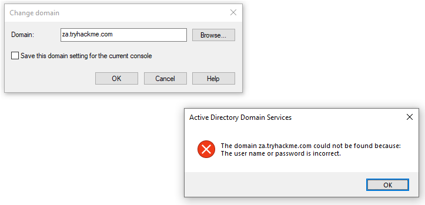

</div>

这就是之前任务中的 Runas 窗口发挥作用的地方。在那个窗口中，我们可以启动 MMC，这将确保所有 MMC 网络连接都使用我们注入的 AD 凭据。

在 MMC 中，现在我们可以附加 AD RSAT Snap-In：

1. 点击 “文件” -> “添加 / 移除控件”
2. 选择并添加所有三个 Active Directory 控件
3. 点击通过任何错误和警告
4. 在 “Active Directory Domains and Trusts” 上右键，并选择 “更改域”
5. 输入 za.tryhackme.com 作为根域，然后点击 “确定”
6. 在 “Active Directory Sites and Services” 上右键，并选择 “更改域”
7. 输入 za.tryhackme.com 作为根域，然后点击 “确定”
8. 在 “Active Directory Users and Computers” 上右键，并选择 “更改域”
9. 输入 za.tryhackme.com 作为域，然后点击 “确定”
10. 在左侧窗格中对 “Active Directory Users and Computers” 右键
11. 点击 “查看” -> “高级功能”

<details>

<summary> 具体操作步骤 </summary>

打开 MMC，在 `File`  -> `Add/Remove Snap-in` 中，添加 Active Directory 控件

<div style={{textAlign:'center'}}>

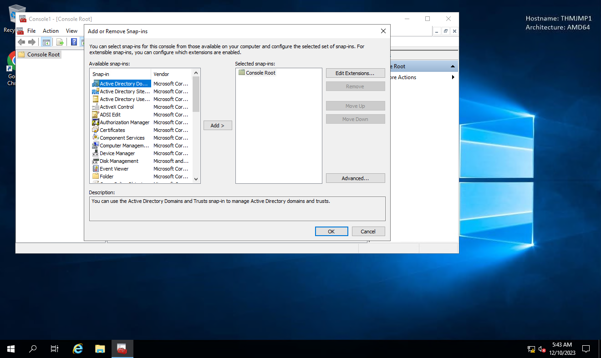

</div>

右键 `Active Directory Domains and Trusts` ，更改域

<div style={{textAlign:'center'}}>


</div>

接下来，对 `Active Directory Sites and Services` 和 `Active Directory Users and Computers` 也进行相同的操作，更改域的配置

</details>

如果到目前为止一切都正常工作，你的 MMC 现在应该指向并已经通过验证连接到目标域：

<div style={{textAlign:'center'}}>


</div>

现在我们可以开始枚举这里关于 AD 结构的信息。

### Users and Computers

让我们来看看 Active Directory 结构。在这个任务中，我们将专注于 AD 用户和计算机。展开该控件并展开 za 域，以查看初始的组织单位（OU，Organisational Unit）结构：

<div style={{textAlign:'center'}}>


</div>

让我们来看看 “People” 目录。在这里，我们可以看到用户根据部门组织单位进行了划分。点击每个部门的 OU 将会显示属于该部门的用户。

<div style={{textAlign:'center'}}>

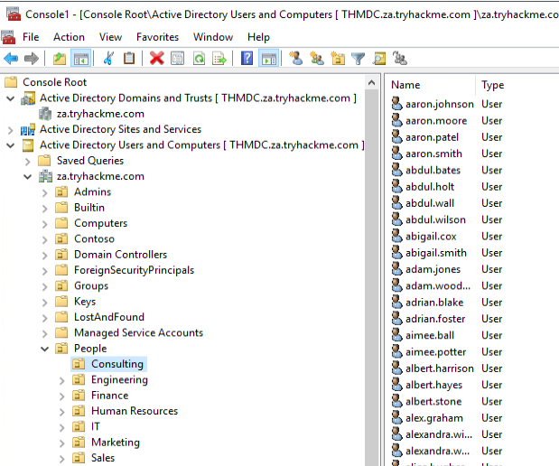

</div>

点击任何一个用户都可以让我们查看他们所有的属性和特性。我们还可以看到他们所属的组：

<div style={{textAlign:'center'}}>

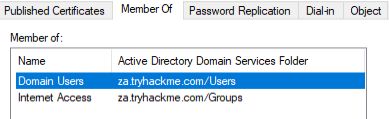

</div>

我们也可以使用 MMC 来查找环境中的主机。如果我们点击 “服务器” 或 “工作站”，将显示域加入的机器列表。

<div style={{textAlign:'center'}}>

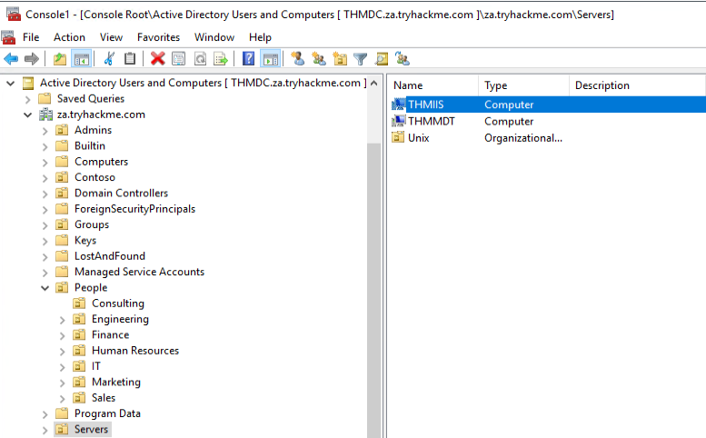

</div>

如果我们有相关权限，还可以使用 MMC 直接对 AD 进行更改，比如更改用户密码或将账户添加到特定组中。尝试使用 MMC 进行操作，更好地了解 AD 域结构。利用搜索功能查找对象。

优点：

- GUI 提供了全面了解 AD 环境的优秀方法。
- 可以快速搜索不同的 AD 对象。
- 它提供了直接查看 AD 对象特定更新的方法。
- 如果我们有足够的权限，可以直接更新现有的 AD 对象或添加新的对象。

缺点：

- GUI 需要对执行它的机器进行远程桌面访问（RDP）。
- 尽管搜索对象很快，但无法收集 AD 全局属性或特性。

:::info Answer the questions below

有多少个计算机对象属于 Servers OU？

<details>

<summary> 具体操作步骤 </summary>

<div style={{textAlign:'center'}}>

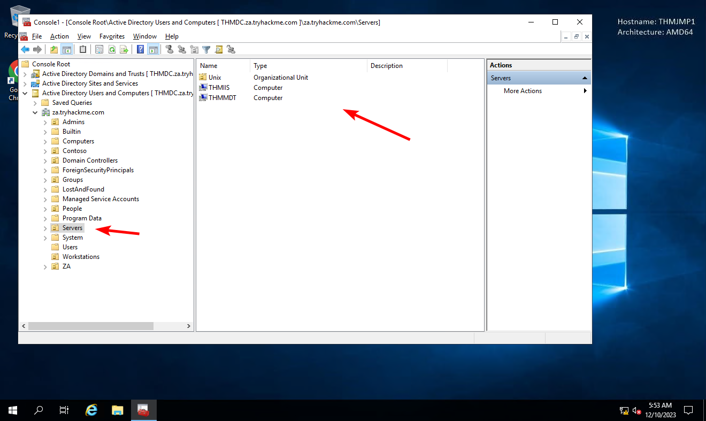

</div>

</details>

```plaintext
2
```

有多少计算机对象属于 Workstations OU？

<details>

<summary> 具体操作步骤 </summary>

<div style={{textAlign:'center'}}>

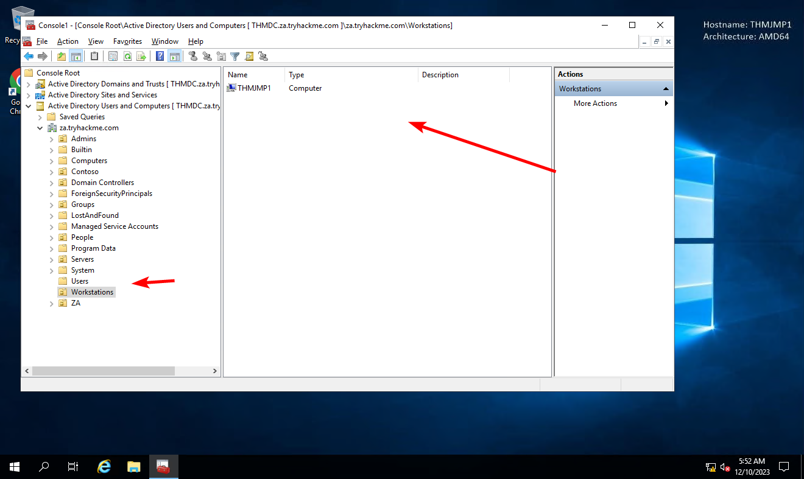

</div>

</details>

```plaintext
1
```

该组织由多少个部门（组织单位）组成？

<details>

<summary> 具体操作步骤 </summary>

<div style={{textAlign:'center'}}>


</div>

</details>

```plaintext
7
```

该组织有多少个管理级别？

<details>

<summary> 具体操作步骤 </summary>

<div style={{textAlign:'center'}}>


</div>

</details>

```plaintext
3
```

`t0_tinus.green` 帐户的描述属性中存储的标志值是多少？

<details>

<summary> 具体操作步骤 </summary>

<div style={{textAlign:'center'}}>


</div>

</details>

```plaintext
THM{Enumerating.Via.MMC}
```

:::

## Enumeration through Command Prompt - 通过命令提示符进行枚举

### 命令提示符

有时候你只需要快速、简单地进行 AD 查找，命令提示符就能帮上忙。老实可靠的 CMD 在某些情况下非常方便，比如你可能没有对系统的远程桌面访问权限，防御者正在监控 PowerShell 的使用，而你需要通过远程访问木马（RAT）执行 AD 枚举。甚至在你的钓鱼载荷中嵌入几个简单的 AD 枚举命令也能帮助你获取关键信息，帮助你策划最终攻击。

CMD 有一个内置命令可以用来枚举关于 AD 的信息，就是 `net` 命令。`net` 命令是一个方便的工具，用来枚举关于本地系统和 AD 的信息。我们将看一些我们可以从这个位置枚举到的有趣信息，但这并不是一个详尽的清单。

:::tip

在这个任务中，你将需要使用 THMJMP1，无法使用你自己的 Windows 虚拟机。这将在缺点部分进行解释。

:::

### Users

我们可以使用 `net` 命令并通过 `user` 子选项列出 AD 域中的所有用户：

```shell
C:\>net user /domain
The request will be processed at a domain controller for domain za.tryhackme.com

User accounts for \\THMDC

-------------------------------------------------------------------------------
aaron.conway             aaron.hancock            aaron.harris
aaron.johnson            aaron.lewis              aaron.moore
aaron.patel              aaron.smith              abbie.joyce
abbie.robertson          abbie.taylor             abbie.walker
abdul.akhtar             abdul.bates              abdul.holt
abdul.jones              abdul.wall               abdul.west
abdul.wilson             abigail.cox              abigail.cox1
abigail.smith            abigail.ward             abigail.wheeler
[....]
The command completed successfully.
```

这将为我们返回所有 AD 用户，并有助于确定域的规模以策划进一步的攻击。我们还可以使用这个子选项来枚举关于单个用户账户的更详细信息：

```shell
C:\>net user zoe.marshall /domain
The request will be processed at a domain controller for domain za.tryhackme.com

User name                    zoe.marshall
Full Name                    Zoe Marshall
Comment
User's comment
Country/region code          000 (System Default)
Account active               Yes
Account expires              Never

Password last set            2/24/2022 10:06:06 PM
Password expires             Never
Password changeable          2/24/2022 10:06:06 PM
Password required            Yes
User may change password     Yes

Workstations allowed         All
Logon script
User profile
Home directory
Last logon                   Never

Logon hours allowed          All

Local Group Memberships
Global Group memberships     *Domain Users         *Internet Access
The command completed successfully.
```

:::tip

如果用户只属于少量的 AD 组，这个命令可以显示组成员资格。然而，通常情况下，如果超过十个组成员资格，该命令将无法列出所有的成员资格。

:::

### Groups

我们可以使用 `net` 命令并通过 `group` 子选项枚举域中的组：

```shell
C:\>net group /domain
The request will be processed at a domain controller for domain za.tryhackme.com

Group Accounts for \\THMDC

-------------------------------------------------------------------------------
*Cloneable Domain Controllers
*DnsUpdateProxy
*Domain Admins
*Domain Computers
*Domain Controllers
*Domain Guests
*Domain Users
[...]
*Schema Admins
*Server Admins
*Tier 0 Admins
*Tier 1 Admins
*Tier 2 Admins
The command completed successfully.
```

这些信息可以帮助我们找到特定的组，以便执行目标。我们还可以通过在同一命令中指定组来枚举更多细节，比如成员身份：

```shell
C:\>net group "Tier 1 Admins" /domain
The request will be processed at a domain controller for domain za.tryhackme.com

Group name     Tier 1 Admins
Comment

Members

-------------------------------------------------------------------------------
t1_arthur.tyler          t1_gary.moss             t1_henry.miller
t1_jill.wallis           t1_joel.stephenson       t1_marian.yates
t1_rosie.bryant
The command completed successfully.
```

### Password Policy

我们可以使用 `net` 命令并通过 `accounts` 子选项枚举域的密码策略：

```shell
C:\>net accounts /domain
The request will be processed at a domain controller for domain za.tryhackme.com

Force user logoff how long after time expires?:       Never
Minimum password age (days):                          0
Maximum password age (days):                          Unlimited
Minimum password length:                              0
Length of password history maintained:                None
Lockout threshold:                                    Never
Lockout duration (minutes):                           30
Lockout observation window (minutes):                 30
Computer role:                                        PRIMARY
The command completed successfully.
```

这将为我们提供有用的信息，例如：

- 保存密码历史的长度。即用户在可以重新使用旧密码之前必须提供多少个唯一的密码。
- 错误密码尝试的锁定阈值以及账户被锁定的时长。
- 密码的最小长度。
- 密码允许的最大年龄，指示密码是否需要定期更换。

如果我们想对我们已枚举的其他用户账户进行额外的密码喷洒攻击，这些信息对我们有利。它可以帮助我们更好地猜测我们在攻击中应该使用哪些单一密码，以及在我们冒着风险锁定账户之前可以运行多少次攻击。然而，需要注意的是，如果我们执行盲目的密码喷洒攻击，可能会仍然锁定账户，因为我们没有检查确定该特定账户在被锁定之前还剩多少次尝试机会。

你可以在 [Net Commands On Operating Systems - Microsoft Learn](https://learn.microsoft.com/en-us/troubleshoot/windows-server/networking/net-commands-on-operating-systems) 找到与 `net` 命令相关的全部选项范围。尝试使用这些 `net` 命令来收集关于特定用户和组的信息。

### 优点

- 无需额外或外部工具，这些简单命令通常不会受到蓝队的监控。
- 我们不需要 GUI 来进行这种枚举。
- VBScript 和其他经常用于钓鱼载荷的宏语言原生支持这些命令，因此它们可以用于枚举关于 AD 域的初始信息，然后再制作更具体的载荷。

### 缺点

- `net` 命令必须从加入域的机器上执行。如果机器没有加入域，它将默认为 WORKGROUP 域。
- `net` 命令可能不会显示所有信息。例如，如果用户是超过十个组的成员，则不会在输出中显示所有这些组。

:::info Answer the questions below

除了 `Domain Users` 组外，`aaron.harris` 账户还是哪个组的成员？

<details>

<summary> 具体操作步骤 </summary>

<div style={{textAlign:'center'}}>


</div>

</details>

```plaintext
Internet Access
```

`Guest` 账户是否处于激活状态？

<details>

<summary> 具体操作步骤 </summary>

<div style={{textAlign:'center'}}>


</div>

</details>

```plaintext
Nay
```

有多少账户是 `Admins Tier 1` 组的成员？

<details>

<summary> 具体操作步骤 </summary>

<div style={{textAlign:'center'}}>


</div>

</details>

```plaintext
7
```

当前密码策略的账户锁定时长是多少分钟？

<details>

<summary> 具体操作步骤 </summary>

<div style={{textAlign:'center'}}>

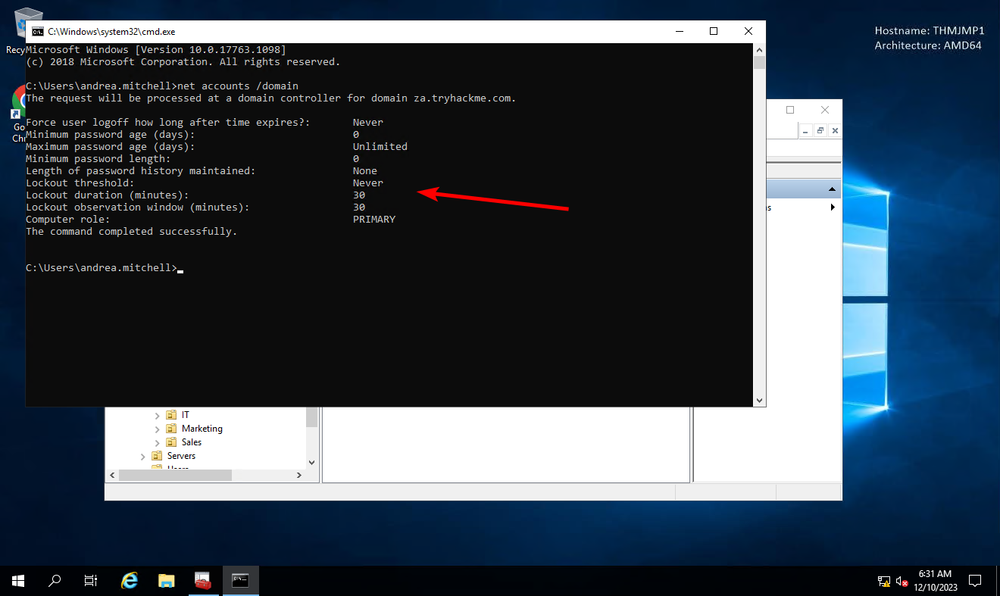

</div>

</details>

```plaintext
30
```

:::

## Enumeration through PowerShell - 通过 PowerShell 进行枚举

### Powershell

PowerShell 是命令提示符的升级版。微软于 2006 年首次发布了它。虽然 PowerShell 具备命令提示符的所有标准功能，但它还提供了访问 cmdlets（读作 command-lets）的能力，这些是用于执行特定功能的 .NET 类。虽然我们可以编写自己的 cmdlets，就像 [PowerView](https://github.com/PowerShellEmpire/PowerTools/tree/master/PowerView) 的创建者所做的那样，但我们已经可以通过使用内置的 cmdlet 取得非常大的进展。

由于我们在任务 3 中安装了 AD-RSAT 工具，它自动为我们安装了相关的 cmdlets。安装了 50 多个 cmdlets。我们将研究其中一些，但完整的 cmdlets 列表请参考这个 [ActiveDirectory - Microsoft Learns](https://learn.microsoft.com/en-us/powershell/module/activedirectory/?view=windowsserver2022-ps) 。

通过我们的 SSH 终端，我们可以使用以下命令将其升级为 PowerShell 终端：`powershell`

### Users

我们可以使用 Get-ADUser cmdlet 枚举 AD 用户：

```powershell
PS C:\> Get-ADUser -Identity gordon.stevens -Server za.tryhackme.com -Properties *

AccountExpirationDate                :
accountExpires                       : 9223372036854775807
AccountLockoutTime                   :
[...]
Deleted                              :
Department                           : Consulting
Description                          :
DisplayName                          : Gordon Stevens
DistinguishedName                    : CN=gordon.stevens,OU=Consulting,OU=People,DC=za,DC=tryhackme,DC=com
[...]
```

参数用于以下目的：

- -Identity：我们正在枚举的账户名称
- -Properties：将显示与账户相关的哪些属性，* 将显示所有属性
- -Server：由于我们没有加入域，我们必须使用此参数将其指向我们的域控制器

对于大多数这些 cmdlet，我们还可以使用 `-Filter` 参数来更精确地控制枚举，并使用 `Format-Table` cmdlet 来整齐地显示结果，如下所示：

```powershell
PS C:\> Get-ADUser -Filter 'Name -like"*stevens"' -Server za.tryhackme.com | Format-Table Name,SamAccountName -A

Name             SamAccountName
----             --------------
chloe.stevens    chloe.stevens
samantha.stevens samantha.stevens
[...]
janice.stevens   janice.stevens
gordon.stevens   gordon.stevens
```

### Groups

我们可以使用 Get-ADGroup cmdlet 枚举 AD 组：

```powershell
PS C:\> Get-ADGroup -Identity Administrators -Server za.tryhackme.com


DistinguishedName : CN=Administrators,CN=Builtin,DC=za,DC=tryhackme,DC=com
GroupCategory     : Security
GroupScope        : DomainLocal
Name              : Administrators
ObjectClass       : group
ObjectGUID        : f4d1cbcd-4a6f-4531-8550-0394c3273c4f
SamAccountName    : Administrators
SID               : S-1-5-32-544
```

我们还可以使用 Get-ADGroupMember cmdlet 枚举组成员资格：

```powershell
PS C:\> Get-ADGroupMember -Identity Administrators -Server za.tryhackme.com


distinguishedName : CN=Domain Admins,CN=Users,DC=za,DC=tryhackme,DC=com

name              : Domain Admins
objectClass       : group
objectGUID        : 8a6186e5-e20f-4f13-b1b0-067f3326f67c
SamAccountName    : Domain Admins
SID               : S-1-5-21-3330634377-1326264276-632209373-512

[...]

distinguishedName : CN=Administrator,CN=Users,DC=za,DC=tryhackme,DC=com name              : Administrator
objectClass       : user
objectGUID        : b10fe384-bcce-450b-85c8-218e3c79b30fSamAccountName    : Administrator
SID               : S-1-5-21-3330634377-1326264276-632209373-500
```

### AD Objects

使用 `Get-ADObject` cmdlet 可以执行更通用的搜索来查找任何 AD 对象。例如，如果我们要查找在特定日期之后更改的所有 AD 对象：

```powershell
PS C:\> $ChangeDate = New-Object DateTime(2022, 02, 28, 12, 00, 00)
PS C:\> Get-ADObject -Filter 'whenChanged -gt $ChangeDate' -includeDeletedObjects -Server za.tryhackme.com

Deleted           :
DistinguishedName : DC=za,DC=tryhackme,DC=com
Name              : za
ObjectClass       : domainDNS
ObjectGUID        : 518ee1e7-f427-4e91-a081-bb75e655ce7a

Deleted           :
DistinguishedName : CN=Administrator,CN=Users,DC=za,DC=tryhackme,DC=com
Name              : Administrator
ObjectClass       : user
ObjectGUID        : b10fe384-bcce-450b-85c8-218e3c79b30f
```

如果我们想要执行密码喷洒攻击但又不想锁定账户，我们可以使用这个命令来枚举 badPwdCount 大于 0 的账户，避免在我们的攻击中使用这些账户：

```powershell
PS C:\> Get-ADObject -Filter 'badPwdCount -gt 0' -Server za.tryhackme.com
PS C:\>
```

这仅会显示如果网络中的某个用户多次错误地输入了密码的结果。

### Domains

我们可以使用 `Get-ADDomain` 来检索关于特定域的特定信息：

```powershell
PS C:\> Get-ADDomain -Server za.tryhackme.com

AllowedDNSSuffixes                 : {}
ChildDomains                       : {}
ComputersContainer                 : CN=Computers,DC=za,DC=tryhackme,DC=com
DeletedObjectsContainer            : CN=Deleted Objects,DC=za,DC=tryhackme,DC=com
DistinguishedName                  : DC=za,DC=tryhackme,DC=com
DNSRoot                            : za.tryhackme.com
DomainControllersContainer         : OU=Domain Controllers,DC=za,DC=tryhackme,DC=com
[...]
UsersContainer                     : CN=Users,DC=za,DC=tryhackme,DC=com
```

### 更改 AD 对象

AD-RSAT cmdlet 的好处之一是，一些甚至允许你创建新的或修改现有的 AD 对象。然而，我们在这个网络中的重点是枚举。创建新对象或修改现有对象将被视为 AD 的利用，这部分将在 AD 模块后面讨论。

不过，我们将通过使用 `Set-ADAccountPassword` cmdlet 强制更改我们的 AD 用户密码来展示一个例子：

```powershell
PS C:\> Set-ADAccountPassword -Identity gordon.stevens -Server za.tryhackme.com -OldPassword (ConvertTo-SecureString -AsPlaintext "old" -force) -NewPassword (ConvertTo-SecureString -AsPlainText "new" -Force)
```

记得更改身份值和密码，以及在任务 1 中从分发页面获得的用于枚举的账户。

### 好处

- PowerShell cmdlets 可以枚举比命令提示符中的 net 命令更多的信息。
- 我们可以使用非域加入的机器上的 runas 指定服务器和域来执行这些命令。
- 我们可以创建自己的 cmdlets 来枚举特定信息。
- 我们可以使用 AD-RSAT cmdlets 直接更改 AD 对象，比如重置密码或将用户添加到特定组。

### 缺点

- PowerShell 常常比命令提示符更受到蓝队的监控。
- 我们必须安装 AD-RSAT 工具或使用其他可能可检测到的 PowerShell 枚举脚本。

:::info Answer the questions below

Beth Nolan (beth.nolan) 的 Title 属性的值是多少？

<details>

<summary> 具体操作步骤 </summary>

```powershell
PS C:\Users\andrea.mitchell> Get-ADUser -Identity beth.nolan -Server za.tryhackme.com -Properties *


AccountExpirationDate                :
accountExpires                       : 9223372036854775807
AccountLockoutTime                   :
AccountNotDelegated                  : False
AllowReversiblePasswordEncryption    : False
AuthenticationPolicy                 : {}
AuthenticationPolicySilo             : {}
BadLogonCount                        : 0
badPasswordTime                      : 0
badPwdCount                          : 0
CannotChangePassword                 : False
CanonicalName                        : za.tryhackme.com/People/Sales/beth.nolan
Certificates                         : {}
City                                 :
CN                                   : beth.nolan
codePage                             : 0
Company                              :
CompoundIdentitySupported            : {}
Country                              :
countryCode                          : 0
Created                              : 2/24/2022 10:06:25 PM
createTimeStamp                      : 2/24/2022 10:06:25 PM
Deleted                              :
Department                           : Sales
Description                          :
DisplayName                          : Beth Nolan
DistinguishedName                    : CN=beth.nolan,OU=Sales,OU=People,DC=za,DC=tryhackme,DC=com
Division                             :
DoesNotRequirePreAuth                : False
dSCorePropagationData                : {1/1/1601 12:00:00 AM}
EmailAddress                         :
EmployeeID                           :
EmployeeNumber                       :
Enabled                              : True
Fax                                  :
GivenName                            : Beth
HomeDirectory                        :
HomedirRequired                      : False
HomeDrive                            :
HomePage                             :
HomePhone                            :
Initials                             :
instanceType                         : 4
isDeleted                            :
KerberosEncryptionType               : {}
LastBadPasswordAttempt               :
LastKnownParent                      :
lastLogoff                           : 0
lastLogon                            : 0
LastLogonDate                        :
LockedOut                            : False
logonCount                           : 0
LogonWorkstations                    :
Manager                              :
MemberOf                             : {CN=Internet Access,OU=Groups,DC=za,DC=tryhackme,DC=com}
MNSLogonAccount                      : False
MobilePhone                          :
Modified                             : 2/24/2022 10:06:25 PM
modifyTimeStamp                      : 2/24/2022 10:06:25 PM
msDS-User-Account-Control-Computed   : 0
Name                                 : beth.nolan
nTSecurityDescriptor                 : System.DirectoryServices.ActiveDirectorySecurity
ObjectCategory                       : CN=Person,CN=Schema,CN=Configuration,DC=za,DC=tryhackme,DC=com
ObjectClass                          : user
ObjectGUID                           : c4ae7c4c-4f98-4366-b3a1-c57debe3256f
objectSid                            : S-1-5-21-3330634377-1326264276-632209373-2760
Office                               :
OfficePhone                          :
Organization                         :
OtherName                            :
PasswordExpired                      : False
PasswordLastSet                      : 2/24/2022 10:06:25 PM
PasswordNeverExpires                 : False
PasswordNotRequired                  : False
POBox                                :
PostalCode                           :
PrimaryGroup                         : CN=Domain Users,CN=Users,DC=za,DC=tryhackme,DC=com
primaryGroupID                       : 513
PrincipalsAllowedToDelegateToAccount : {}
ProfilePath                          :
ProtectedFromAccidentalDeletion      : False
pwdLastSet                           : 132902139856391082
SamAccountName                       : beth.nolan
sAMAccountType                       : 805306368
ScriptPath                           :
sDRightsEffective                    : 0
ServicePrincipalNames                : {}
SID                                  : S-1-5-21-3330634377-1326264276-632209373-2760
SIDHistory                           : {}
SmartcardLogonRequired               : False
sn                                   : Nolan
State                                :
StreetAddress                        :
Surname                              : Nolan
Title                                : Senior
TrustedForDelegation                 : False
TrustedToAuthForDelegation           : False
UseDESKeyOnly                        : False
userAccountControl                   : 512
userCertificate                      : {}
UserPrincipalName                    :
uSNChanged                           : 28070
uSNCreated                           : 28066
whenChanged                          : 2/24/2022 10:06:25 PM
whenCreated                          : 2/24/2022 10:06:25 PM
```

</details>

```plaintext
Senior
```

Annette Manning (annette.manning) 的 DistinguishedName 属性的值是多少？

<details>

<summary> 具体操作步骤 </summary>

```powershell
PS C:\Users\andrea.mitchell> Get-ADUser -Identity annette.manning -Server za.tryhackme.com -Properties * | findstr DistinguishedName
DistinguishedName                    : CN=annette.manning,OU=Marketing,OU=People,DC=za,DC=tryhackme,DC=com
```

</details>

```plaintext
CN=annette.manning,OU=Marketing,OU=People,DC=za,DC=tryhackme,DC=com
```

第 2 层管理员组何时创建？

<details>

<summary> 具体操作步骤 </summary>

```powershell
PS C:\Users\andrea.mitchell> Get-ADGroup -Identity "Tier 2 Admins" -Server za.tryhackme.com -Properties *


CanonicalName                   : za.tryhackme.com/Groups/Tier 2 Admins
CN                              : Tier 2 Admins
Created                         : 2/24/2022 10:04:41 PM
createTimeStamp                 : 2/24/2022 10:04:41 PM
Deleted                         :
Description                     :
DisplayName                     : Tier 2 Admins
DistinguishedName               : CN=Tier 2 Admins,OU=Groups,DC=za,DC=tryhackme,DC=com
dSCorePropagationData           : {1/1/1601 12:00:00 AM}
GroupCategory                   : Security
GroupScope                      : Global
groupType                       : -2147483646
HomePage                        :
instanceType                    : 4
isDeleted                       :
LastKnownParent                 :
ManagedBy                       :
member                          : {CN=t2_jeremy.leonard,OU=T2,OU=Admins,DC=za,DC=tryhackme,DC=com, CN=t2_marian.yates,OU=T2,OU=Admins,DC=za,DC=tryhackme,DC=com, CN=t2_tom.bray,OU=T2,OU=Admins,DC=za,DC=tryhackme,DC=com,
                                  CN=t2_zoe.watson,OU=T2,OU=Admins,DC=za,DC=tryhackme,DC=com...}
MemberOf                        : {}
Members                         : {CN=t2_jeremy.leonard,OU=T2,OU=Admins,DC=za,DC=tryhackme,DC=com, CN=t2_marian.yates,OU=T2,OU=Admins,DC=za,DC=tryhackme,DC=com, CN=t2_tom.bray,OU=T2,OU=Admins,DC=za,DC=tryhackme,DC=com,
                                  CN=t2_zoe.watson,OU=T2,OU=Admins,DC=za,DC=tryhackme,DC=com...}
Modified                        : 2/24/2022 10:06:21 PM
modifyTimeStamp                 : 2/24/2022 10:06:21 PM
Name                            : Tier 2 Admins
nTSecurityDescriptor            : System.DirectoryServices.ActiveDirectorySecurity
ObjectCategory                  : CN=Group,CN=Schema,CN=Configuration,DC=za,DC=tryhackme,DC=com
ObjectClass                     : group
ObjectGUID                      : 6edab731-c305-4959-bd34-4ca1eefe2b3f
objectSid                       : S-1-5-21-3330634377-1326264276-632209373-1104
ProtectedFromAccidentalDeletion : False
SamAccountName                  : Tier 2 Admins
sAMAccountType                  : 268435456
sDRightsEffective               : 0
SID                             : S-1-5-21-3330634377-1326264276-632209373-1104
SIDHistory                      : {}
uSNChanged                      : 27391
uSNCreated                      : 12781
whenChanged                     : 2/24/2022 10:06:21 PM
whenCreated                     : 2/24/2022 10:04:41 PM
```

</details>

```plaintext
2/24/2022 10:04:41 PM
```

Enterprise Admins 组的 SID 属性值是多少？

<details>

<summary> 具体操作步骤 </summary>

```powershell
PS C:\Users\andrea.mitchell> Get-ADGroup -Identity "Enterprise Admins" -Server za.tryhackme.com -Properties * | findstr SID
SID                             : S-1-5-21-3330634377-1326264276-632209373-519
SIDHistory                      : {}
```

</details>

```plaintext
S-1-5-21-3330634377-1326264276-632209373-519
```

哪个容器用于存储删除的 AD 对象？

<details>

<summary> 具体操作步骤 </summary>

```powershell
PS C:\Users\andrea.mitchell> Get-ADDomain | findstr Deleted
DeletedObjectsContainer            : CN=Deleted Objects,DC=za,DC=tryhackme,DC=com
```

</details>

```plaintext
CN=Deleted Objects,DC=za,DC=tryhackme,DC=com
```

:::

## Enumeration through Bloodhound - 通过 Bloodhound 进行查点

最后，我们将看看如何使用 [Bloodhound](https://github.com/BloodHoundAD/BloodHound) 进行 AD 枚举。Bloodhound 是迄今为止最强大的 AD 枚举工具，自 2016 年发布以来，它彻底改变了 AD 枚举的格局。

### Bloodhound History

有很长一段时间，红队（和不幸的是，攻击者）占据了上风。以至于微软在其高级威胁防护解决方案中整合了他们自己的 Bloodhound 版本。这一切都归结为以下短语：

“防御者思考的是列表，攻击者思考的是图表。” - 未知

Bloodhound 允许攻击者（现在也包括防御者）以图表格式可视化 AD 环境，节点之间相互连接。每个连接都是一个可能被利用的路径，可以用来达到目标。相比之下，防御者使用列表，比如域管理员的列表或环境中所有主机的列表。

这种基于图表的思维为攻击者打开了一个全新的世界。它允许了一个两阶段的攻击。在第一阶段，攻击者会执行钓鱼攻击以获得枚举 AD 信息的初始入口。这个初始载荷通常非常吵闹，会在攻击者除了窃取枚举数据外无法执行任何操作之前被蓝队发现并隔离。然而，攻击者现在可以离线使用这些数据，以图表形式创建攻击路径，准确展示所需的步骤和跳跃。在第二次钓鱼活动中使用这些信息，一旦取得入侵，攻击者通常可以在几分钟内达到目标。这甚至比蓝队收到第一个警报的时间更快。这就是图表思维的力量，这也是为什么这么多蓝队也开始使用这些类型的工具更好地了解其安全形势。

### Sharphound

通常你会听到用户将 Sharphound 和 Bloodhound 互相等同地提及。但它们并不相同。Sharphound 是 Bloodhound 的枚举工具。它用于枚举的 AD 信息，然后可以在 Bloodhound 中以可视化方式显示。Bloodhound 则是用于显示 AD 攻击图表的实际 GUI。因此，我们首先需要学习如何使用 Sharphound 来枚举 AD，然后才能使用 Bloodhound 可视化地查看结果。

有三种不同的 Sharphound 收集器：

- Sharphound.ps1 - 用于运行 Sharphound 的 PowerShell 脚本。然而，最新版本的 Sharphound 已停止发布 PowerShell 脚本版本。这个版本适用于远程访问木马（RATs），因为脚本可以直接加载到内存中，避开磁盘上的杀毒软件扫描。
- Sharphound.exe - 用于运行 Sharphound 的 Windows 可执行文件版本。
- AzureHound.ps1 - 用于运行针对 Azure（微软云计算服务）实例的 Sharphound 的 PowerShell 脚本。Bloodhound 可以接受从 Azure 枚举的数据，以找到与 Azure 身份和访问管理配置相关的攻击路径。

注意：你的 Bloodhound 和 Sharphound 版本必须匹配，以获得最佳结果。通常 Bloodhound 会有更新，这意味着无法导入旧的 Sharphound 结果。这个网络是使用 Bloodhound v4.1.0 创建的。请确保使用这个版本与 Sharphound 结果配套使用。

在评估中使用这些收集器脚本时，很可能会被检测为恶意软件，并引发蓝队的警报。这就是非域加入的 Windows 机器可以帮助的地方。我们可以使用 runas 命令注入 AD 凭据，并指向一个域控制器。由于我们控制这台 Windows 机器，我们可以禁用杀毒软件或为特定文件或文件夹创建例外，这已经在 THMJMP1 机器上为您执行了。你可以在该主机的 C:\Tools\ 目录中找到 Sharphound 二进制文件。我们将使用 SharpHound.exe 版本进行枚举，但你可以随意尝试其他两个。我们将如下执行 Sharphound：

```powershell
Sharphound.exe --CollectionMethods <Methods> --Domain za.tryhackme.com --ExcludeDCs
```

参数解释：

- CollectionMethods - 确定 Sharphound 将收集什么类型的数据。最常见的选项是 Default 或 All。此外，由于 Sharphound 缓存信息，一旦第一次运行完成，您只能使用 Session 收集方法来检索新的用户会话，以加快进程速度。
- Domain - 在这里，我们指定要枚举的域。在某些情况下，您可能希望枚举与您现有域有信任关系的父域或其他域。您可以通过更改此参数告诉 Sharphound 应该枚举哪个域。
- ExcludeDCs - 这将指示 Sharphound 不要触及域控制器，从而减少 Sharphound 运行引发警报的可能性。

你可以在这里找到所有各种 Sharphound 参数。最好查看其他参数，因为根据你的红队评估情况，可能会需要它们。

使用前一个任务中的 SSH PowerShell 会话，将 Sharphound 二进制文件复制到你的 AD 用户的文档目录中：

```powershell
PS C:\> copy C:\Tools\Sharphound.exe ~\Documents\
PS C:\> cd ~\Documents\
PS C:\Users\gordon.stevens\Documents>
```

我们将使用 All 和 Session 收集方法来运行 Sharphound：

```powershell
PS C:\Users\gordon.stevens\Documents\>SharpHound.exe --CollectionMethods All --Domain za.tryhackme.com --ExcludeDCs
2022-03-16T19:11:41.2898508+00:00|INFORMATION|Resolved Collection Methods: Group, LocalAdmin, GPOLocalGroup, Session, LoggedOn, Trusts, ACL, Container, RDP, ObjectProps, DCOM, SPNTargets, PSRemote
2022-03-16T19:11:41.3056683+00:00|INFORMATION|Initializing SharpHound at 7:11 PM on 3/16/2022
2022-03-16T19:11:41.6648113+00:00|INFORMATION|Flags: Group, LocalAdmin, GPOLocalGroup, Session, LoggedOn, Trusts, ACL, Container, RDP, ObjectProps, DCOM, SPNTargets, PSRemote
2022-03-16T19:11:41.8211318+00:00|INFORMATION|Beginning LDAP search for za.tryhackme.com
[....]
2022-03-16T19:12:31.6981568+00:00|INFORMATION|Output channel closed, waiting for output task to complete
Closing writers
2022-03-16T19:12:32.2605943+00:00|INFORMATION|Status: 2163 objects finished (+2163 43.26)/s -- Using 85 MB RAM
2022-03-16T19:12:32.2605943+00:00|INFORMATION|Enumeration finished in 00:00:50.4369344
2022-03-16T19:12:32.5418517+00:00|INFORMATION|SharpHound Enumeration Completed at 7:12 PM on 3/16/2022! Happy Graphing!
```

Sharphound 的枚举大约需要 1 分钟时间。在较大的组织中，这可能需要更长的时间，甚至第一次执行可能需要几个小时。完成后，你会在执行 Sharphound 的相同文件夹中看到一个带有时间戳的 ZIP 文件。

```powershell
PS C:\Users\gordon.stevens\Documents> dir

    Directory: C:\Users\gordon.stevens\Documents

Mode                LastWriteTime         Length Name
----                -------------         ------ ----
-a----        3/16/2022   7:12 PM         121027 20220316191229_BloodHound.zip
-a----        3/16/2022   5:19 PM         906752 SharpHound.exe
-a----        3/16/2022   7:12 PM         360355 YzE4MDdkYjAtYjc2MC00OTYyLTk1YTEtYjI0NjhiZmRiOWY1.bin
```

现在我们可以使用 Bloodhound 来摄取这个 ZIP 文件，以图形化方式展示攻击路径。

### Bloodhound

正如之前提到的，Bloodhound 是一个 GUI 工具，允许我们导入 Sharphound 捕获的数据，并将其可视化为攻击路径。Bloodhound 使用 Neo4j 作为其后端数据库和图形系统。Neo4j 是一个图数据库管理系统。如果你正在使用 AttackBox，你可以使用 Dock 中的红色 Bloodhound 图标来启动它。在其他情况下，请确保 Bloodhound 和 Neo4j 已经安装并配置在你的攻击机器上。无论哪种情况，了解背后发生的事情都是很好的。在我们开始使用 Bloodhound 之前，我们需要加载 Neo4j：

```shell

thm@thm:~# neo4j console start
Active database: graph.db
Directories in use:
  home:         /var/lib/neo4j
  config:       /etc/neo4j
  logs:         /var/log/neo4j
  plugins:      /var/lib/neo4j/plugins
  import:       /var/lib/neo4j/import
  data:         /var/lib/neo4j/data
  certificates: /var/lib/neo4j/certificates
  run:          /var/run/neo4j
Starting Neo4j.
[....]
2022-03-13 19:59:18.014+0000 INFO  Bolt enabled on 127.0.0.1:7687.
```

在另一个终端选项卡中运行 `bloodhound --no-sandbox` 。这将显示给你认证的 GUI 界面：

<div style={{textAlign:'center'}}>

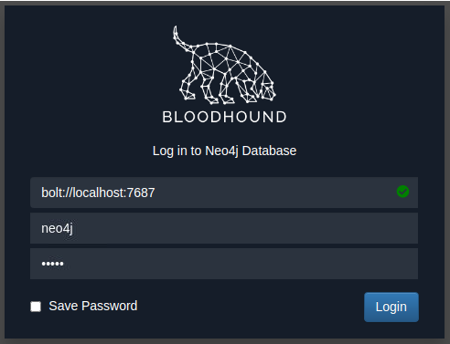

</div>

neo4j 数据库的默认凭据是 `neo4j:neo4j` 。使用这些凭据在 Bloodhound 中进行身份验证。要导入我们的结果，你需要从 Windows 主机上恢复 ZIP 文件。最简单的方法是使用你的 AttackBox 上的 SCP 命令：

```shell
scp <AD Username>@THMJMP1.za.tryhackme.com:C:/Users/<AD Username>/Documents/<Sharphound ZIP> .
```

提供密码后，这将把结果复制到你当前的工作目录。将 ZIP 文件拖放到 Bloodhound 的 GUI 中以导入 Bloodhound。它会显示正在提取文件并启动导入。

<div style={{textAlign:'center'}}>

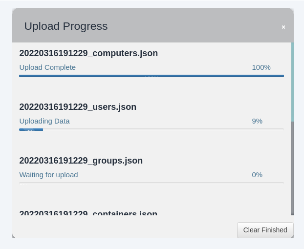

</div>

一旦所有的 JSON 文件都被导入，我们就可以开始使用 Bloodhound 来枚举这个特定域的攻击路径。

### Attack Paths - 攻击路劲

Bloodhound 可以展示多种攻击路径。点击 “Search for a node” 旁边的三条杠将显示选项。第一个选项卡显示了有关我们当前导入的信息。

<div style={{textAlign:'center'}}>


</div>

请注意，如果导入新的 Sharphound 运行结果，这些计数会累计增加。首先，让我们查看 “节点信息”。让我们在 Bloodhound 中搜索我们的 AD 账户。你必须点击节点来刷新视图。还请注意，你可以通过按下左 Ctrl 键来更改标签方案。

<div style={{textAlign:'center'}}>

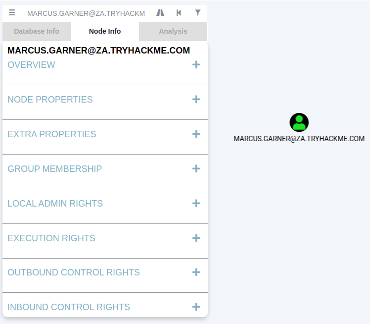

</div>

我们可以看到有大量关于我们使用情况的信息。每个类别都提供以下信息：

- 概览 - 提供摘要信息，比如账户的活动会话数量以及其是否能够接触到高价值目标。
- 节点属性 - 显示关于 AD 账户的信息，比如显示名称和职位。
- 额外属性 - 提供更详细的 AD 信息，比如区分名称和账户创建时间。
- 组成员资格 - 显示账户所属的群组信息。
- 本地管理员权限 - 提供有关域加入主机的信息，其中账户具有管理员权限。
- 执行权限 - 提供特殊权限的信息，比如远程桌面连接到一台机器的能力。
- 出站控制权限 - 显示此账户有权限修改其属性的 AD 对象信息。
- 入站控制权限 - 提供能够修改此账户属性的 AD 对象信息。

如果你想获得每个类别中更多的信息，你可以点击信息查询旁边的数字。例如，让我们查看与我们账户关联的组成员资格。通过点击 “一级组成员资格” 旁边的数字，我们可以看到我们的账户是两个群组的成员。

<div style={{textAlign:'center'}}>


</div>

接下来，我们将查看分析查询。这些查询是 Bloodhound 的创建者编写的，用于枚举有用信息。

<div style={{textAlign:'center'}}>


</div>

在 “域信息” 部分下，我们可以运行 “查找所有域管理员” 查询。请注意，你可以按下左 Ctrl 键来更改标签显示设置。

<div style={{textAlign:'center'}}>

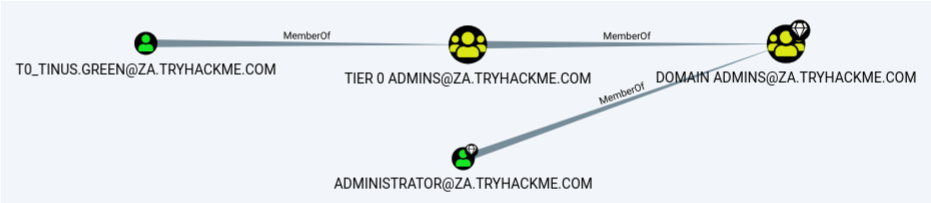

</div>

图标称为节点，而线条称为边缘。让我们深入了解一下 Bloodhound 向我们展示的内容。有一个用户名为 T0_TINUS.GREEN 的 AD 用户账户，它是 Tier 0 ADMINS 群组的成员。但是，这个群组是嵌套在 DOMAIN ADMINS 群组中的，这意味着所有属于 Tier 0 ADMINS 群组的用户实际上都是域管理员。

此外，还有一个用户名为 ADMINISTRATOR 的额外 AD 账户，它是 DOMAIN ADMINS 群组的一部分。因此，在我们的攻击表面中有两个账户，我们可能可以尝试牵涉它们以获取 DA 权限。由于 ADMINISTRATOR 账户是一个内置账户，我们可能更专注于用户账户。

在 Bloodhound 中，之前任务中讨论过的每个 AD 对象都可以是一个节点，每个节点都有一个不同的图标来表示它的对象类型。如果我们想要制定攻击路径，我们需要查看当前位置和我们拥有的权限以及我们想要到达的位置之间的可用边缘。Bloodhound 有各种可用的边缘，可以通过过滤图标来访问：

<div style={{textAlign:'center'}}>

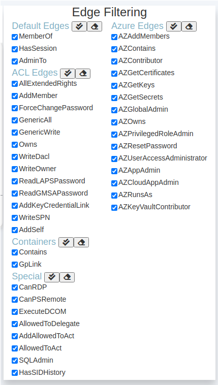

</div>

这些也在不断更新，因为发现新的攻击向量。在未来的网络中，我们将研究利用这些不同的边缘。但是，让我们只使用默认和一些特殊边缘来看一个最基本的攻击路径。我们将在 Bloodhound 中运行搜索来枚举攻击路径。点击路径图标以进行路径搜索。

<div style={{textAlign:'center'}}>


</div>

我们的起始节点将是我们的 AD 用户名，而结束节点将是 Tier 1 ADMINS 群组，因为该群组对服务器具有管理员权限。

<div style={{textAlign:'center'}}>


</div>

如果使用所选的边缘过滤器没有可用的攻击路径，Bloodhound 将显示 “未找到结果”。请注意，这也可能是由于 Bloodhound/Sharphound 不匹配，这意味着结果没有被正确地导入。请确保使用 Bloodhound v4.1.0。但在我们的情况下，Bloodhound 显示了一个攻击路径。它显示 T1 ADMINS 中的一个帐户 ACCOUNT 使用他们的凭据认证到 THMJMP1，这是一个工作站，从而打破了层次模型。它还显示了任何属于 DOMAIN USERS 组的用户，包括我们的 AD 账户，都有能力远程桌面连接到这个主机。

我们可以像下面这样利用这个路径：

- 使用我们的 AD 凭据远程桌面连接到 THMJMP1。
- 在主机上寻找一个提供管理员权限的权限提升向量。
- 使用管理员权限，我们可以使用凭据窃取技术和工具，比如 Mimikatz。
- 由于 T1 Admin 在 THMJMP1 上有一个活动会话，我们的凭据窃取将为我们提供关联账户的 NTLM 哈希值。

这只是一个简单的例子。在正常情况下，攻击路径可能相对复杂，并需要多个步骤才能达到最终目标。如果你对每个边缘关联的利用感兴趣，下面的 Bloodhound 文档提供了一个很好的指南。Bloodhound 是一个非常强大的 AD 枚举工具，可以深入了解攻击面的 AD 结构。值得花时间来玩耍和学习它的各种功能。

### 仅会话数据

AD 结构在大型组织中并不经常改变。可能会有一些新员工加入，但 OU、组、用户和权限的整体结构通常保持不变。

然而，经常变化的是活动会话和登录事件。由于 Sharphound 创建了一个某一时间点的 AD 结构快照，活动会话数据并不总是准确的，因为有些用户可能已经注销了他们的会话，或者新用户可能已经建立了新的会话。这是需要注意的重要事项，这也是为什么我们希望定期执行 Sharphound 的原因。

一个好的方法是，在评估开始时使用 “全部” 收集方法执行 Sharphound，然后每天至少执行两次 Sharphound，使用 “会话” 收集方法。这将为您提供新的会话数据，并确保这些运行更快，因为它们不会再次枚举整个 AD 结构。执行这些会话运行的最佳时间是大约在上午 10:00，当用户喝第一杯咖啡开始工作时，以及下午约在 14:00，当用户结束午餐休息但还没有下班时。

您可以在 Bloodhound 的 “数据库信息” 选项卡上清除停滞的会话数据，方法是在导入这些新的 Sharphound 运行数据之前，点击 “清除会话信息”。

### 优点

- 提供了用于 AD 枚举的图形用户界面。
- 能够显示枚举的 AD 信息的攻击路径。
- 提供了对通常需要多次手动查询才能恢复的 AD 对象的更深入见解。

### 缺点

- 需要执行 Sharphound，这会产生噪音，并经常被杀毒软件或 EDR（终端检测和响应）解决方案检测到。

:::info Answer the questions below

可以使用什么命令来执行 Sharphound.exe 并请求它仅从 za.tryhackme.com 域恢复会话信息而不接触域控制器？

<details>

<summary> 具体操作步骤 </summary>

```powershell
PS C:\Users\andrea.mitchell\Documents> .\Sharphound.exe --CollectionMethods All --Domain za.tryhackme.com --ExcludeDCs
2023-12-10T07:08:27.5395191+00:00|INFORMATION|Resolved Collection Methods: Group, LocalAdmin, GPOLocalGroup, Session, LoggedOn, Trusts, ACL, Container, RDP, ObjectProps, DCOM, SPNTargets, PSRemote
2023-12-10T07:08:27.5551950+00:00|INFORMATION|Initializing SharpHound at 7:08 AM on 12/10/2023
2023-12-10T07:08:27.9779965+00:00|INFORMATION|Flags: Group, LocalAdmin, GPOLocalGroup, Session, LoggedOn, Trusts, ACL, Container, RDP, ObjectProps, DCOM, SPNTargets, PSRemote
2023-12-10T07:08:28.1829092+00:00|INFORMATION|Beginning LDAP search for za.tryhackme.com
2023-12-10T07:08:58.2211369+00:00|INFORMATION|Status: 0 objects finished (+0 0)/s -- Using 49 MB RAM
2023-12-10T07:09:16.4630809+00:00|INFORMATION|Producer has finished, closing LDAP channel
2023-12-10T07:09:16.4787107+00:00|INFORMATION|LDAP channel closed, waiting for consumers
2023-12-10T07:09:16.9162321+00:00|INFORMATION|Consumers finished, closing output channel
2023-12-10T07:09:16.9787346+00:00|INFORMATION|Output channel closed, waiting for output task to complete
Closing writers
2023-12-10T07:09:17.5121428+00:00|INFORMATION|Status: 2159 objects finished (+2159 44.06123)/s -- Using 92 MB RAM
2023-12-10T07:09:17.5121428+00:00|INFORMATION|Enumeration finished in 00:00:49.3294133
2023-12-10T07:09:17.8247007+00:00|INFORMATION|SharpHound Enumeration Completed at 7:09 AM on 12/10/2023! Happy Graphing!
```

</details>

```plaintext
Sharphound.exe --CollectionMethods All --Domain za.tryhackme.com --ExcludeDCs
```

除了 krbtgt 帐户之外，还有多少其他帐户可能是 kerberoastable 的？

<details>

<summary> 具体操作步骤 </summary>

首先，先将 Sharphound 的执行结果传回本地

```shell
┌─[randark@randark-Parrot]─[~]
└──╼ $scp za.tryhackme.com\\andrea.mitchell@thmjmp1.za.tryhackme.com:C:/Users/andrea.mitchell/Documents/20231210070914_BloodHound.zip .
za.tryhackme.com\andrea.mitchell@thmjmp1.za.tryhackme.com's password:
20231210070914_BloodHound.zip                                                                                                                                                                            100%  119KB 124.3KB/s   00:00
┌─[randark@randark-Parrot]─[~]
└──╼ $ls -lh
总用量 136K
-rw-r--r-- 1 randark randark 119K 12 月 10 15:27 20231210070914_BloodHound.zip
```

然后使用 Neo4j + Bloodhound GUI 进行分析

```shell
┌─[✗]─[randark@randark-Parrot]─[~]
└──╼ $sudo neo4j start
Directories in use:
home:         /var/lib/neo4j
config:       /etc/neo4j
logs:         /var/log/neo4j
plugins:      /var/lib/neo4j/plugins
import:       /var/lib/neo4j/import
data:         /var/lib/neo4j/data
certificates: /var/lib/neo4j/certificates
licenses:     /var/lib/neo4j/licenses
run:          /var/lib/neo4j/run
Starting Neo4j.
Started neo4j (pid:4968). It is available at http://localhost:7474
There may be a short delay until the server is ready.
```

<div style={{textAlign:'center'}}>

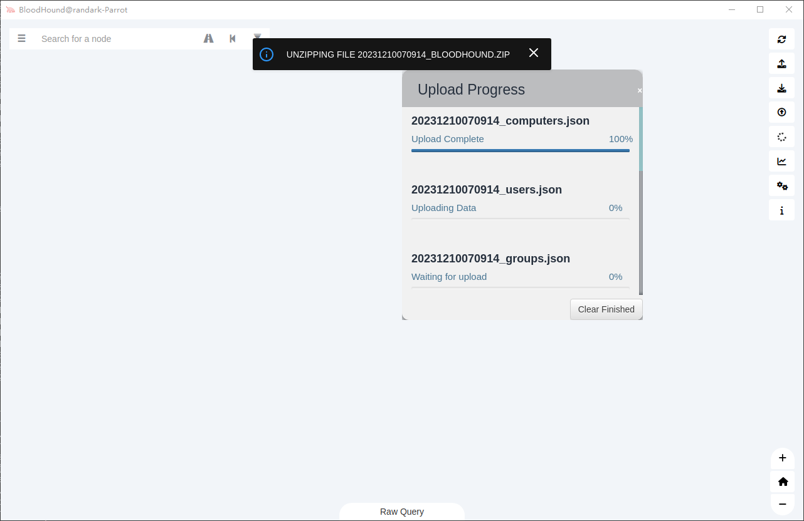

</div>

使用预构建的分析条件，即可得到：

<div style={{textAlign:'center'}}>


</div>

</details>

```plaintext
4
```

`Tier 1 Admins` 组的成员有多少台计算机具有管理访问权限？

<details>

<summary> 具体操作步骤 </summary>

<div style={{textAlign:'center'}}>


</div>

</details>

```plaintext
2
```

有多少用户是第 2 层管理员组的成员？

<details>

<summary> 具体操作步骤 </summary>

<div style={{textAlign:'center'}}>

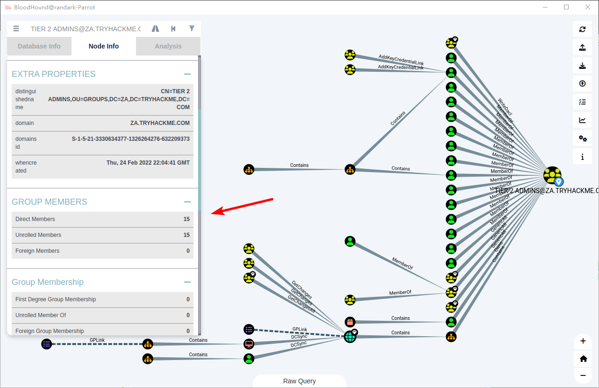

</div>

</details>

```plaintext
15
```

:::

## Conclusion

AD 枚举是一个庞大的任务。正确的 AD 枚举对于更好地理解域的结构，并确定可以利用进行权限提升或横向移动的攻击路径至关重要。

### 额外的枚举技术

在这个网络中，我们介绍了几种用于枚举 AD 的技术。这绝不是一个详尽的列表。以下是一些也值得一提的枚举技术：

- LDAP 枚举 - 任何有效的 AD 凭据对都应该能够绑定到域控制器的 LDAP 接口。这将允许您编写 LDAP 搜索查询，以枚举域中的 AD 对象的信息。
- PowerView - PowerView 是 PowerSploit 项目的一个重建脚本。尽管该项目不再得到支持，但像 PowerView 这样的脚本在紧要关头执行半手动枚举 AD 对象时非常有用。
- Windows Management Instrumentation (WMI) - WMI 可用于从 Windows 主机枚举信息。它有一个称为 “root\directory\ldap” 的提供程序，可用于与 AD 交互。我们可以利用 PowerShell 中的此提供程序和 WMI 来执行 AD 枚举。

我们还应该注意，这个课程侧重于完整地枚举 AD 域的结构，而不仅仅集中于识别配置错误和弱点。侧重于识别弱点，比如不安全的共享或层次模型中的破坏，将在未来的课程中讨论。

### 缓解措施

AD 枚举极具挑战性，防范起来相当困难。其中许多技术都模拟了正常的网络流量和行为，使得难以区分恶意流量和正常流量。但是，我们可以采取一些措施来检测潜在的恶意行为：

- 强大的 AD 枚举技术（如 Sharphound）在枚举会话信息时会生成大量的登录事件。由于它是从单个 AD 帐户执行的，这些登录事件将与这个单个帐户关联。如果来自用户帐户的行为是这种类型，我们可以编写检测规则来检测此类行为。
- 我们可以为特定的 AD 枚举技术所需的工具编写签名检测规则，比如 SharpHound 二进制文件和 AD-RSAT 工具。
    除非被我们组织的员工使用，否则我们可以监控组织内 Command Prompt 和 Powershell 的使用情况，以检测未经授权的源可能进行的枚举尝试。

值得一提的是，蓝队自己也可以定期使用这些枚举技术来识别 AD 域结构中的缺口和配置错误。如果我们能解决这些配置错误，即使攻击者枚举了我们的 AD，他们也无法找到可用于提权或横向移动的可以利用的配置错误。
