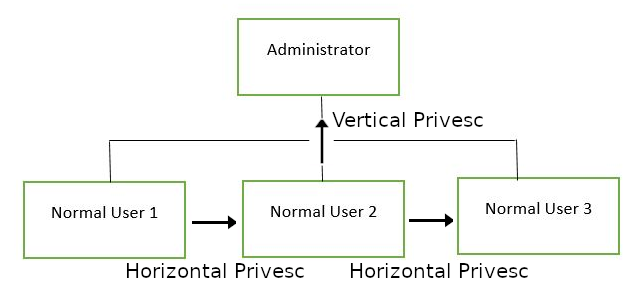
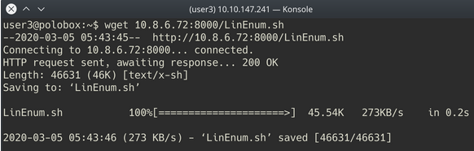
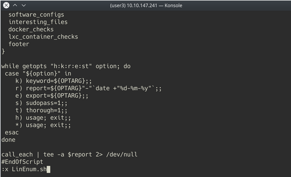

# Common Linux Privesc - 常见的 Linux 特权提升方式

> [TryHackMe | Common Linux Privesc](https://tryhackme.com/room/commonlinuxprivesc)
>
> Updated in 2023-12
>
> 一个解释常见的 Linux 特权提升方式的教程。
>
> A room explaining common Linux privilege escalation

## Get Connected - 建立连接

这个房间将探索常见的 Linux 特权提升漏洞和技术，但为了开始，我们需要先做几件事情：

- 部署虚拟机
- 连接到 TryHackMe 的 OpenVPN 服务器（参见 `https://tryhackme.com/access` 获取帮助！）或者部署 AttackBox

## Understanding Privesc - 理解特权提升

### “权限提升” 是什么意思

在核心层面上，特权提升通常涉及从较低权限到较高权限的转变。更技术性地说，它是利用操作系统或应用程序中的漏洞、设计缺陷或配置疏忽，以获取未经授权访问通常对用户受限的资源。

### “权限提升” 为什么重要

在进行 CTF 或真实的渗透测试时，很少能够获得直接给予你管理员权限的立足点（初始访问）。特权提升至关重要，因为它能让你获得系统管理员级别的访问权限。这样做可以让你完成许多事情，包括：

- 重置密码
- 绕过访问控制以破坏受保护的数据
- 编辑软件配置
- 启用持久性，以便稍后再次访问该机器
- 更改用户的特权
- 获得那个调皮的 root 标志 ;)

以及任何其他你想要执行的管理员或超级用户命令。

## Direction of Privilege Escalation - 特权提升的方向

### Privilege Tree - 特权树

<div style={{textAlign:'center'}}>



</div>

### 有两种主要的特权提升变种

Horizontal privilege escalation - 水平特权提升：这是通过接管与你相同特权级别的不同用户来扩展你在被入侵系统上的影响力。例如，一个普通用户劫持另一个普通用户（而不是提升到超级用户）。这样可以继承该用户拥有的所有文件和访问权限。例如，利用这个方式可以访问另一个普通特权用户，假设该用户的家目录附加了 SUID 文件（稍后会详细介绍），然后利用该文件获取超级用户访问权限。【在树中水平移动】

Vertical privilege escalation - 垂直特权提升（特权提升）：这是试图通过已经被你入侵的现有账户获得更高特权或访问权限。对于本地特权提升攻击来说，这可能意味着劫持一个具有管理员权限或 root 权限的账户。【在树中向上移动】

## Enumeration - 枚举

### 什么是 LinEnum

LinEnum 是一个简单的 bash 脚本，执行与特权提升相关的常见命令，节省时间并允许更多精力用于获取 root 权限。重要的是要理解 LinEnum 执行的命令，这样在无法使用 LinEnum 或类似脚本的情况下，你就能够手动枚举特权提升漏洞。在这个房间里，我们将解释 LinEnum 显示的内容，以及可以用来复制它的命令。

### 哪里可以获取 LinEnum

你可以从以下链接下载 LinEnum 的本地副本：

[https://github.com/rebootuser/LinEnum/blob/master/LinEnum.sh](https://github.com/rebootuser/LinEnum/blob/master/LinEnum.sh)

LinEnum 值得将其保存在你记得的地方，因为 LinEnum 是一种非常宝贵的工具。

### 如何在目标机器上获取 LinEnum

有两种方法将 LinEnum 传输到目标机器上。

第一种方法是进入你保存 LinEnum 本地副本的目录，并使用 `python3 -m http.server 8000` 命令启动一个 Python web 服务器。

<div style={{textAlign:'center'}}>


</div>

然后在目标机器上使用 "wget" 命令，指向你的本地 IP，从本地机器上获取该文件。

<div style={{textAlign:'center'}}>



</div>

接下来使用命令 `chmod +x LinEnum.sh` 赋予该文件可执行权限。

### 其他方法

如果你无法传输文件，也可以（如果有足够的权限）从本地机器复制 LinEnum 的原始代码

<div style={{textAlign:'center'}}>


</div>

然后将其粘贴到目标机器上一个新建的文件中，可以使用 Vi 或 Nano 编辑器

<div style={{textAlign:'center'}}>



</div>

完成后，你可以将文件保存并添加 ".sh" 扩展名。然后使用命令 `chmod +x LinEnum.sh` 赋予该文件可执行权限。这样你就在目标机器上创建了自己的可执行 LinEnum 脚本副本！

### 运行 LinEnum

LinEnum 可以像运行任何 bash 脚本一样执行，进入 LinEnum 所在的目录，并运行命令 `./LinEnum.sh`

### 理解 LinEnum 的运行结果

LinEnum 的输出被分成不同的部分，我们将重点关注以下主要部分：

- Kernel（内核）：此处显示了内核信息。这台机器很可能存在一个内核漏洞可供利用。
- 我们能读 / 写敏感文件吗：下面列出了世界可写（world-writable）的文件。这些是任何经过身份验证的用户都可以读取和写入的文件。通过查看这些敏感文件的权限，我们可以看到是否存在配置错误，允许通常不能进行读写操作的用户进行写入。
- SUID 文件：这里显示了 SUID 文件的输出。有一些有趣的项，我们肯定会作为提升权限的方式来仔细查看。SUID（Set owner User ID up on execution）是赋予文件的一种特殊类型的权限。它允许文件以所有者的身份运行。如果是 root 所有者，它就以 root 权限运行。它可以让我们提升权限。
- Crontab 内容：下面显示了计划任务（cron jobs）。Cron 用于在特定时间安排命令。这些计划任务或任务称为 “cron jobs”。与此相关的是 crontab 命令，它创建一个包含命令和 cron 守护进程执行指令的 crontab 文件。这里有足够的信息来尝试利用 Cronjobs。

此扫描还包含了许多其他有用的信息。让我们来仔细阅读一下！

:::info Answer the questions below

```plaintext
Username: user3
Password: password
```

目标主机的主机名是什么？

<details>

<summary> 具体操作步骤 </summary>

通过架设 HTTP 服务的方式，将 LinEnum 部署到靶机上，然后运行 LinEnum

```plaintext
[-] Hostname:
polobox
```

</details>

```plaintext
polobox
```

查看 /etc/passwd 的输出，系统上有多少个 "user[x]" 用户？

<details>

<summary> 具体操作步骤 </summary>

```plaintext
[-] Contents of /etc/passwd:
root:x:0:0:root:/root:/bin/bash
daemon:x:1:1:daemon:/usr/sbin:/usr/sbin/nologin
bin:x:2:2:bin:/bin:/usr/sbin/nologin
sys:x:3:3:sys:/dev:/usr/sbin/nologin
sync:x:4:65534:sync:/bin:/bin/sync
games:x:5:60:games:/usr/games:/usr/sbin/nologin
man:x:6:12:man:/var/cache/man:/usr/sbin/nologin
lp:x:7:7:lp:/var/spool/lpd:/usr/sbin/nologin
mail:x:8:8:mail:/var/mail:/usr/sbin/nologin
news:x:9:9:news:/var/spool/news:/usr/sbin/nologin
uucp:x:10:10:uucp:/var/spool/uucp:/usr/sbin/nologin
proxy:x:13:13:proxy:/bin:/usr/sbin/nologin
www-data:x:33:33:www-data:/var/www:/usr/sbin/nologin
backup:x:34:34:backup:/var/backups:/usr/sbin/nologin
list:x:38:38:Mailing List Manager:/var/list:/usr/sbin/nologin
irc:x:39:39:ircd:/var/run/ircd:/usr/sbin/nologin
gnats:x:41:41:Gnats Bug-Reporting System (admin):/var/lib/gnats:/usr/sbin/nologin
systemd-timesync:x:100:102:systemd Time Synchronization,,,:/run/systemd:/bin/false
systemd-network:x:101:103:systemd Network Management,,,:/run/systemd/netif:/bin/false
systemd-resolve:x:102:104:systemd Resolver,,,:/run/systemd/resolve:/bin/false
syslog:x:104:108::/home/syslog:/bin/false
_apt:x:105:65534::/nonexistent:/bin/false
messagebus:x:106:110::/var/run/dbus:/bin/false
uuidd:x:107:111::/run/uuidd:/bin/false
lightdm:x:108:117:Light Display Manager:/var/lib/lightdm:/bin/false
ntp:x:109:119::/home/ntp:/bin/false
avahi:x:110:120:Avahi mDNS daemon,,,:/var/run/avahi-daemon:/bin/false
colord:x:111:123:colord colour management daemon,,,:/var/lib/colord:/bin/false
dnsmasq:x:112:65534:dnsmasq,,,:/var/lib/misc:/bin/false
hplip:x:113:7:HPLIP system user,,,:/var/run/hplip:/bin/false
nm-openconnect:x:114:124:NetworkManager OpenConnect plugin,,,:/var/lib/NetworkManager:/bin/false
nm-openvpn:x:115:125:NetworkManager OpenVPN,,,:/var/lib/openvpn/chroot:/bin/false
pulse:x:116:126:PulseAudio daemon,,,:/var/run/pulse:/bin/false
rtkit:x:117:128:RealtimeKit,,,:/proc:/bin/false
saned:x:118:129::/var/lib/saned:/bin/false
usbmux:x:119:46:usbmux daemon,,,:/var/lib/usbmux:/bin/false
geoclue:x:103:105::/var/lib/geoclue:/usr/sbin/nologin
nobody:x:65534:65534:nobody:/nonexistent:/usr/sbin/nologin
vboxadd:x:999:1::/var/run/vboxadd:/bin/false
user1:x:1000:1000:user1,,,:/home/user1:/bin/bash
user2:x:1001:1001:user2,,,:/home/user2:/bin/bash
user3:x:1002:1002:user3,,,:/home/user3:/bin/bash
user4:x:1003:1003:user4,,,:/home/user4:/bin/bash
statd:x:120:65534::/var/lib/nfs:/usr/sbin/nologin
user5:x:1004:1004:user5,,,:/home/user5:/bin/bash
user6:x:1005:1005:user6,,,:/home/user6:/bin/bash
mysql:x:121:131:MySQL Server,,,:/var/mysql:/bin/bash
user7:x:1006:0:user7,,,:/home/user7:/bin/bash
user8:x:1007:1007:user8,,,:/home/user8:/bin/bash
sshd:x:122:65534::/run/sshd:/usr/sbin/nologin
```

</details>

```plaintext
8
```

系统上有多少个可用的 shell？

<details>

<summary> 具体操作步骤 </summary>

```plaintext
[-] Available shells:
# /etc/shells: valid login shells
/bin/sh
/bin/dash
/bin/bash
/bin/rbash
```

</details>

```plaintext
4
```

每隔 5 分钟由 cron 设置运行的 bash 脚本名称是什么？

<details>

<summary> 具体操作步骤 </summary>

```plaintext
[-] Crontab contents:
# /etc/crontab: system-wide crontab
# Unlike any other crontab you don't have to run the `crontab'
# command to install the new version when you edit this file
# and files in /etc/cron.d. These files also have username fields,
# that none of the other crontabs do.

SHELL=/bin/sh
PATH=/usr/local/sbin:/usr/local/bin:/sbin:/bin:/usr/sbin:/usr/bin

# m h dom mon dow user  command
*/5  *    * * * root    /home/user4/Desktop/autoscript.sh
17 *    * * *   root    cd / && run-parts --report /etc/cron.hourly
25 6    * * *   root    test -x /usr/sbin/anacron || (cd / && run-parts --report /etc/cron.daily)
47 6    * * 7   root    test -x /usr/sbin/anacron || (cd / && run-parts --report /etc/cron.weekly)
52 6    1 * *   root    test -x /usr/sbin/anacron || (cd / && run-parts --report /etc/cron.monthly)
#
```

</details>

```plaintext
autoscript.sh
```

哪个关键文件的权限已更改，允许某些用户对其进行写入？

<details>

<summary> 具体操作步骤 </summary>

```plaintext
[-] Can we read/write sensitive files:
-rw-rw-r-- 1 root root 2694 Mar  6  2020 /etc/passwd
-rw-r--r-- 1 root root 1087 Jun  5  2019 /etc/group
-rw-r--r-- 1 root root 581 Apr 22  2016 /etc/profile
-rw-r----- 1 root shadow 2359 Mar  6  2020 /etc/shadow
```

</details>

```plaintext
/etc/passwd
```

:::

## Abusing SUID/GUID Files - 滥用 SUID/GUID 文件

### 寻找和利用 SUID 文件

在 Linux 特权提升利用中的第一步是检查具有 SUID/GUID 位设置的文件。这意味着这些文件可以以文件所有者 / 组的权限运行。在这种情况下，就是超级用户的权限。我们可以利用这一点获取具备这些特权的 shell！

### 什么是 SUID 二进制文件

众所周知，在 Linux 中一切皆文件，包括具有允许或限制三种操作权限（读 / 写 / 执行）的目录和设备。因此，当你设置文件的权限时，应该了解你允许或限制所有三种权限的 Linux 用户。看一下以下演示，展示最大权限（rwx-rwx-rwx）是如何呈现的：

```plaintext
r = read

w = write

x = execute

    user     group     others

    rwx       rwx       rwx

    421       421       421
```

每个用户设置权限的最大数字是 7，它是读取（4）、写入（2）和执行（1）操作的组合。例如，如果使用 "chmod" 设置权限为 755，那么它将是：`rwxr-xr-x`

但是当特殊权限分配给每个用户时，它变成了 SUID 或 SGID。当额外的位 “4” 分配给用户（所有者）时，它变成了 SUID（设置用户 ID），当位 “2” 分配给组时，它变成了 SGID（设置组 ID）。

因此，在寻找 SUID 时要查找的权限是：

```plaintext
SUID:

rws-rwx-rwx

GUID:

rwx-rws-rwx
```

### 寻找 SUID 二进制文件

我们已经知道系统上存在具有 SUID 能力的文件，这得益于我们的 LinEnum 扫描。然而，如果我们想要手动进行查找，可以使用命令：`find / -perm -u=s -type f 2>/dev/null` 来搜索具有 SUID/GUID 权限的文件系统。让我们分解一下这个命令。

- `find`：查找命令。
- `/`：指定查找的根目录为根目录。
- `-perm`：用于指定文件权限。
- `-u=s`：代表查找设置了 SUID 位的文件。
- `-type f`：指定查找类型为文件。
- `2>/dev/null`：将错误输出重定向到 /dev/null，这样可以隐藏权限不足的错误信息，只显示结果。

:::info Answer the questions below

在 user3 目录中，哪个路径的文件引起了你的注意

```plaintext
/home/user3/shell
```

:::

## Exploiting Writeable /etc/passwd - 利用可写的 /etc/passwd 文件

### 利用可写的 /etc/passwd

继续枚举用户，我们发现 user7 是 root 组的成员，组 ID 为 0。而且我们已经从 LinEnum 扫描中得知，/etc/passwd 文件对该用户是可写的。因此根据这个观察，我们得出结论：user7 可以编辑 /etc/passwd 文件。

### 了解 /etc/passwd

/etc/passwd 文件存储着在登录时所需的关键信息。换句话说，它存储着用户账户信息。/etc/passwd 是一个纯文本文件，它包含了系统账户的列表，为每个账户提供了一些有用的信息，比如用户 ID、组 ID、家目录、shell 等等。

/etc/passwd 文件应该具有一般的读取权限，因为许多命令工具用它来将用户 ID 映射为用户名。然而，对于 /etc/passwd 的写入权限必须仅限于超级用户 /root 账户。当这种限制没有生效，或者某个用户错误地被添加到了允许写入的组中，我们就存在一个漏洞，可以允许创建一个我们能够访问的 root 用户。

### 了解 /etc/passwd 的格式

/etc/passwd 文件每行包含一个系统用户（用户账户）的条目。所有字段都由冒号 : 符号分隔，共有七个字段，通常的 /etc/passwd 文件条目如下所示：

```plaintext
test:x:0:0:root:/root:/bin/bash
```

[按冒号（:）分隔的字段]

用户名（Username）：用户登录时使用的名称。长度应在 1 到 32 个字符之间。

密码（Password）：x 字符表示加密密码存储在 /etc/shadow 文件中。请注意，你需要使用 passwd 命令在命令行界面计算密码的哈希值，或者在 /etc/shadow 文件中存储 / 更新密码的哈希值。在这种情况下，密码哈希值被存储为 “x”。

用户 ID（UID）：每个用户必须分配一个用户 ID（UID）。UID 0（零）保留给 root，UID 1-99 预留给其他预定义账户。UID 100-999 被系统保留用于管理和系统账户 / 组。

组 ID（GID）：主组 ID（存储在 /etc/group 文件中）。

用户 ID 信息（User ID Info）：注释字段。它允许你添加有关用户的额外信息，比如用户的全名、电话号码等。这个字段被 finger 命令使用。

家目录（Home directory）：用户登录时所在的绝对路径目录。如果这个目录不存在，用户目录将变为 / 。

命令 / Shell：一个命令或 shell 的绝对路径（/bin/bash）。通常，这是一个 shell。请注意，它不一定是一个 shell。

### 如何利用可写的 /etc/passwd

确实很简单，如果我们有一个可写的 /etc/passwd 文件，我们可以根据上述公式写入一个新的条目，并创建一个新的用户！我们添加我们选择的密码哈希，并将 UID、GID 和 shell 设置为 root。这样就允许我们以我们自己的 root 用户身份登录！

:::info Answer the questions below

读完上面的信息，这次攻击的特权升级方向是什么？

```plaintext
Vertical
```

在添加新用户之前，我们首先需要创建一个符合规范的密码哈希值！我们可以使用以下命令来实现：`openssl passwd -1 -salt [盐值] [密码]`

使用盐值 `new` 和密码 `123` 执行这个命令生成的哈希值是什么？

```plaintext
$1$new$p7ptkEKU1HnaHpRtzNizS1
```

太好了！现在我们需要用这个值来创建一个新的 root 用户账户。一个拥有用户名 “new” 和之前创建的密码哈希值的 root 用户在 /etc/passwd 文件中的条目应该是什么样的？

```plaintext
new:$1$new$p7ptkEKU1HnaHpRtzNizS1:0:0:root:/root:/bin/bash
```

:::

## Escaping Vi Editor -  Vi 编辑器逃逸

### sudo -l

这个漏洞利用与我们的用户账户枚举有多有效有关。在 CTF 场景中，每当你能够访问一个账户时，你应该使用 `sudo -l` 列出你作为超级用户能够运行的命令。有时候，就像这个情况一样，你会发现可以在不需要 root 密码的情况下以 root 用户身份运行特定的命令。这可能会帮助你升级权限。

### vi 逃逸

在 "user8" 账户上运行这个命令会显示出这个用户可以以 root 权限运行 vi 编辑器。这将允许我们逃离 vim 以升级权限并获取一个 root 用户的 shell！

### 配置错误的可执行文件和 GTFOBins

如果在你的枚举过程中或者当你检查一个你可以访问的用户账户能够访问哪些二进制文件时发现了一个配置错误的二进制文件，一个很好的查找如何利用它们的地方是 GTFOBins。GTFOBins 是一个经过精心筛选的 Unix 二进制文件列表，攻击者可以利用它们来绕过本地安全限制。它提供了如何利用配置错误的二进制文件的非常有用的详细信息，如果在 CTF 或渗透测试中发现了这样的文件，这是你应该首先查看的地方。

[https://gtfobins.github.io/](https://gtfobins.github.io/)

:::info Answer the questions below

让我们使用 “sudo -l” 命令，这个用户运行 vi 作为 root 需要（或者不需要）什么？

```plaintext
NOPASSWD
```

:::

## Exploiting Crontab - 利用 Crontab

### 什么是 cron

Cron 守护进程是一个长时间运行的进程，它在特定日期和时间执行命令。你可以利用它来安排活动，无论是作为一次性事件还是周期性任务。你可以创建一个包含命令和指令的 crontab 文件，让 Cron 守护进程执行其中的内容。

### 如何查看哪些 Cronjobs 处于活动状态

我们可以使用命令 `cat /etc/crontab` 来查看已计划的 cron 任务。这是你每次有机会都应该手动检查的内容，特别是如果 LinEnum 或类似的脚本没有发现任何内容时。

### Cronjob 的格式

Cronjob 存在特定的格式，如果想要利用 cron 任务，能够读懂这个格式非常重要。

\# = ID

m = 分钟

h = 小时

dom = 月份中的某一天

mon = 月份

dow = 星期中的某一天

user = 命令将以哪个用户身份运行

command = 应该运行的命令

例如:

```plaintext
#  m   h dom mon dow user  command

17 *   1  *   *   *  root  cd / && run-parts --report /etc/cron.hourly
```

我们从 LinEnum 扫描中得知，user4 的桌面上的文件 autoscript.sh 被安排每五分钟运行一次。它属于 root 用户，这意味着它将以 root 权限运行，尽管我们可以向该文件写入内容。任务是创建一个命令，能够返回一个 shell，并将其粘贴到这个文件中。当文件在五分钟后再次运行时，shell 将以 root 身份运行。

:::info Answer the questions below

指定 msfvenom 中的 payload 的标志是什么？

```plaintext
-p
```

“autoscript.sh” 所在的目录是哪个？

```plaintext
/home/user4/Desktop
```

:::

## Exploiting PATH Variable - 利用 PATH 变量

### 什么是 PATH

PATH 是 Linux 和类 Unix 操作系统中的一个环境变量，它指定了存放可执行程序的目录。当用户在终端中运行任何命令时，系统会根据 PATH 变量搜索可执行文件以响应用户执行的命令。

使用命令 `echo $PATH` 非常简单地可以查看相关用户的路径。

### 这如何让我们提升特权

如果我们有一个 SUID 二进制文件。运行它，我们可以看到它调用系统 shell 执行像 `ps` 这样的基本进程。与我们之前的 SUID 示例不同，在这种情况下，我们无法通过提供命令注入的参数来利用它，那么我们可以做什么来尝试利用这个漏洞呢？

我们可以重写 PATH 变量为我们选择的位置！这样，当 SUID 二进制文件调用系统 shell 运行可执行文件时，它会运行我们编写的可执行文件！

和任何 SUID 文件一样，它将以拥有 SUID 文件所有者相同的特权级别运行此命令！如果这是 root 权限，使用这种方法，我们可以以 root 权限运行任何我们想要的命令！

:::info Answer the questions below

让我们进入 user5 的家目录，并运行文件 `script` 。我们认为它正在执行什么命令？

```plaintext
ls
```

现在我们在 tmp 目录内，让我们创建一个模拟可执行文件。我们想要做的格式是：

`echo "[我们想要运行的任何命令]" > [我们要模拟的可执行文件的名称]`

要打开一个 bash shell，并将其写入到以我们要模拟的可执行文件名称命名的文件中，命令会是这样的：

```plaintext
echo "/bin/bash" > ls
```

太好了！现在我们已经创建了模拟文件，需要将其设为可执行文件。要执行这个命令，可以使用以下指令：

```plaintext
chmod +x ls
```

:::

## Expanding Your Knowledge - 扩展你的知识

### 进一步学习

在 Linux 特权升级这个广阔的领域中，从来都没有所谓的 “魔法” 答案。这只是一些在尝试升级权限时需要注意的基本事项。变得更加熟练的唯一方法是不断实践和积累经验。清单是确保在枚举阶段没有遗漏任何内容的好方法，同时也为你提供了一个资源，在忘记具体使用哪些命令时进行查阅。

以下是一些适用于 CTF 或渗透测试用例的良好清单。尽管我鼓励你使用 CherryTree 或者你喜欢的任何笔记应用来制作自己的清单。

- [https://github.com/netbiosX/Checklists/blob/master/Linux-Privilege-Escalation.md](https://github.com/netbiosX/Checklists/blob/master/Linux-Privilege-Escalation.md)
- [https://github.com/swisskyrepo/PayloadsAllTheThings/blob/master/Methodology and Resources/Linux - Privilege Escalation.md](https://github.com/swisskyrepo/PayloadsAllTheThings/blob/master/Methodology%20and%20Resources/Linux%20-%20Privilege%20Escalation.md)
- [https://sushant747.gitbooks.io/total-oscp-guide/privilege_escalation_-_linux.html](https://sushant747.gitbooks.io/total-oscp-guide/privilege_escalation_-_linux.html)
- [https://payatu.com/guide-linux-privilege-escalation](https://payatu.com/guide-linux-privilege-escalation)
